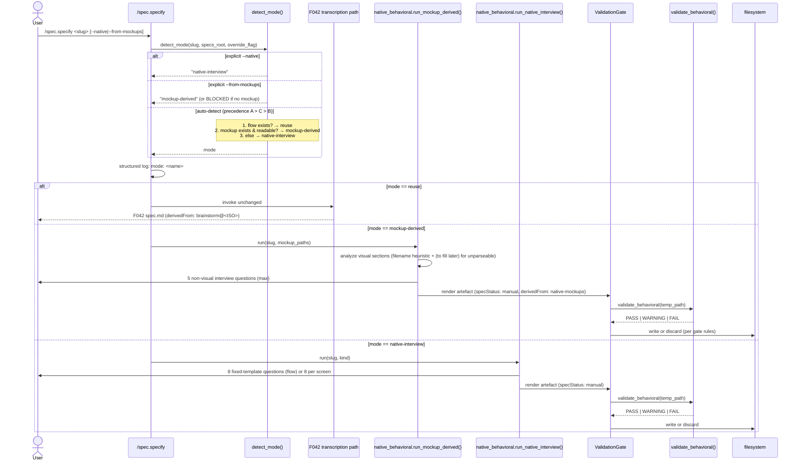
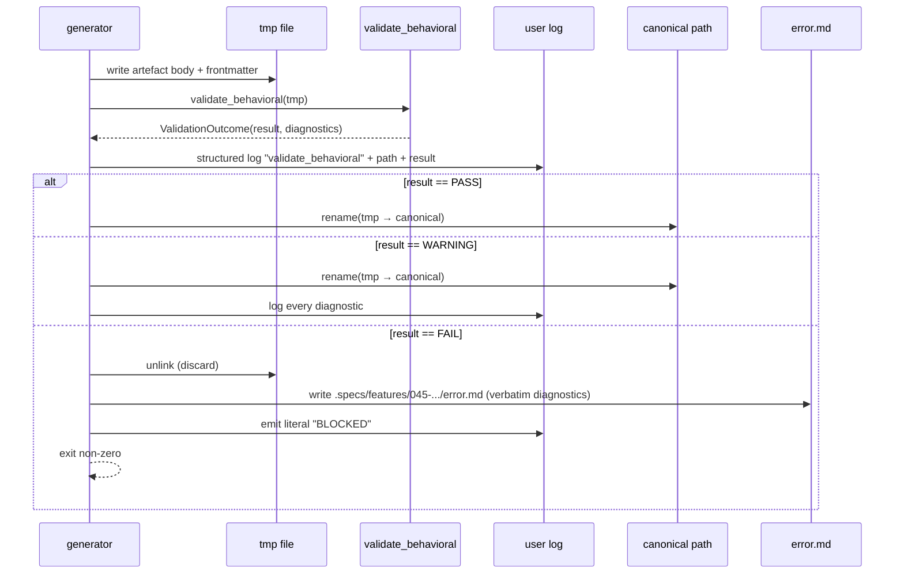
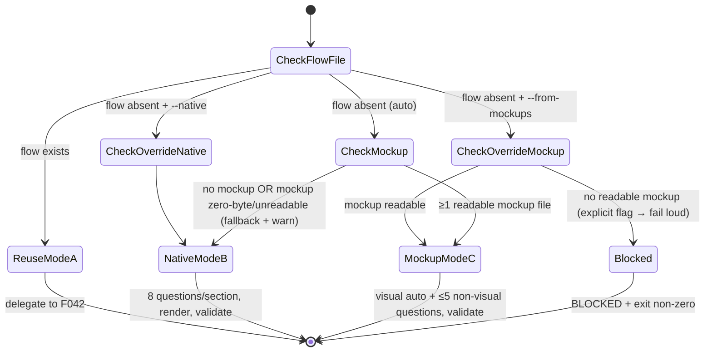

# Plan: Native Behavioral Specs Generation (F045)

> Implementation plan for `.specs/features/045-native-behavioral-specs/spec.md`. Read spec.md first.

## Summary

F045 makes `/spec.specify` autonomous on behavioral specs by adding three auto-detected modes (precedence A > C > B): **Mode A — reuse** delegates to F042's existing transcription path when `.specs/flows/<slug>.md` exists; **Mode C — mockup-derived** runs a 5-question interview over the remaining canonical screen sections (`Acteur`, `Source d'entrée`, `Sortie principale`, `Validations`, `Erreurs`) and stamps `derivedFrom: native-mockups` when readable mockups exist for the slug; **Mode B — native interview** runs a fixed 8-question template (per F044 mandatory section) when nothing exists. All native artefacts carry `specStatus: manual` (honoring F041's overwrite-protection contract from the producer side) and pass through a hard `validate_behavioral` gate (PASS → silent write, WARNING → write + log diagnostics, FAIL → discard + write `error.md` + emit `BLOCKED` + non-zero exit). Implementation is purely additive: one new module (`validator/native_behavioral.py`), one templates module (`validator/native_behavioral_templates.py`), one `detect_mode()` function appended to `validator/behavioral_grammar.py`, and one new Step 4.5 inserted into `commands/specify.md` (mirrored in `.claude/commands/spec.specify.md`). Zero modification of F041/042/043/044 spec.md, zero new dependencies, zero new top-level CLI command, zero new agent type.

---

## Technical Context

| Aspect | Choice | Reason |
|---|---|---|
| Language | Python 3.11+ | Matches `validator/` package (pyproject.toml) |
| Validator entry point | `validator.behavioral_grammar.validate_behavioral` | F044 canonical surface (FR-008) |
| Frontmatter parse / serialize | `python-frontmatter` (already pinned) | F041/F044 already use it |
| YAML | `pyyaml` (already pinned) | Frontmatter dump |
| Mockup detection | Stdlib only — `pathlib` + `os.stat` (size check) | No image decoding needed; spec only requires "readable + nonzero size" (AC-016). Pillow NOT in pyproject — out of scope to add. |
| `.pen` analysis | Filename-presence heuristic only | `.pen` files are encrypted (Pencil MCP). No native parser available. Mode C with `.pen` falls back to "non-visual interview only, visual sections = `(to fill later)`" — explicit `WARNING` from validator, never silent. |
| Tests | pytest 8 (already pinned) | Matches existing test layout |
| Slash command surface | Modify `commands/specify.md` AND `.claude/commands/spec.specify.md` (mirror) | Per spec FR-015 — auto-detect by default + optional `--native` / `--from-mockups` overrides |
| Stack profile | `.specs/stacks/_default.md` | LiveSpec internal validator project |

### Versioning

F045 does NOT version itself separately. The new module imports F044 grammar v1.0 constants verbatim (`MANDATORY_FLOW_SECTIONS`, `MANDATORY_SCREEN_SECTIONS`, `VALIDATION_RESULT`, `validate_behavioral`). Any future grammar v2.0 ships as a sibling module per F044's MAJOR-bump policy; F045 will pin to v1 explicitly until migrated.

### Dependency note (BLOCKING gate)

No new `pyproject.toml` dependency is introduced. `Pillow` is NOT added — Mode C uses filename + size heuristic only. If the implementer discovers a real need for image decoding, that is a re-plan trigger (out of scope per spec.md "Out-of-Scope Guard": no NEW visual-pipeline integration).

---

## Constitution Check

Read from `.specs/constitution.md`. All gates ✅ unless noted:

- ✅ **Simplicity:** Mode-detection is a single pure function; interview is hard-coded templates (no prompt engineering surface).
- ✅ **Separation:** New module `validator/native_behavioral.py` owns generators + interview; mode-detection lives in `validator/behavioral_grammar.py` (sibling, not a new package). Slash-command file owns dispatch only — zero business logic.
- ✅ **Testing:** Every new function is unit-testable; no I/O outside isolated tmp_path fixtures.
- ✅ **Naming:** New file name `native_behavioral.py` matches existing naming (`behavioral_grammar.py`).
- ✅ **No new agent type, no new top-level CLI command** (FR-015).
- ✅ **F041–F044 byte-untouched** (FR-012). Verified by Step 9 `git diff` gate.
- ✅ **Infrastructure:** None. Pure in-process Python — no cloud resource provisioning.

---

## Sequence Diagrams

### Mode dispatch (top-level)



### Validator gate (per artefact)



---

## State Diagram — Mode Detection



---

## Design Reference

Not applicable — F045 is a backend / command-flow change with no UI surface.

---

## Resolved Test Commands

| Action | Command | Tool | Status |
|---|---|---|---|
| Unit tests | `pytest tests/test_native_behavioral_specs.py -v` | pytest 8 | Verified (pytest pinned) |
| Integration tests | `pytest tests/integration/test_native_behavioral_e2e.py -v` | pytest 8 | Verified |
| Full suite | `pytest tests/ -v` | pytest 8 | Verified |
| Lint | `ruff check validator/ tests/` | ruff | Verified (pyproject.toml `[tool.ruff]`) |
| Type check | `pyright validator/` | pyright (strict) | Verified |
| Structural validation | `livespec validate <path>` | livespec CLI | Verified (`/opt/homebrew/bin/livespec` present) |
| F041–F044 untouched gate | `git diff --stat main -- .specs/features/04{1,2,3,4}-*/spec.md` | git | Verified — must produce empty output |

---

## File-by-File Implementation Plan

### Step 0 — (Skipped) Infrastructure & Theme

No infrastructure resources. No UI / theme work.

### Step 1 — Interview templates module

**File (new):** `validator/native_behavioral_templates.py` (~80 lines)

- Define `FLOW_QUESTIONS: tuple[InterviewQuestion, ...]` — 8 entries, one per F044 mandatory flow section, in canonical order (Acteur, Préconditions, Déclencheur, Étapes nominales, Règles métier, Erreurs & exceptions, Side-effects, Postconditions).
- Define `SCREEN_QUESTIONS: tuple[InterviewQuestion, ...]` — 8 entries for screen sections (Acteur, Source d'entrée, Sortie principale, Données affichées, Actions, Validations, États UI, Erreurs).
- Define `MOCKUP_DERIVED_QUESTIONS: tuple[InterviewQuestion, ...]` — 5 entries for the remaining canonical screen sections in Mode C: Acteur, Source d'entrée, Sortie principale, Validations, Erreurs.
- Define dataclass `InterviewQuestion(section_id: str, prompt_template: str, kind: Literal["flow","screen"])`.
- All prompt templates are HARD-CODED strings — no LLM template generation.
- `@spec FR-003, FR-004, FR-006: Interview templates — .specs/features/045-native-behavioral-specs/spec.md#fr-003`

**FR covered:** FR-003.1: Flow question templates (8/canonical), FR-004.1: Screen question templates (8/canonical), FR-006.1: Mockup-derived non-visual subset (5).

### Step 2 — Mode detection function

**File (modify):** `validator/behavioral_grammar.py` — append `detect_mode()` (~60 added lines)

- Add `class GenerationMode(str, Enum): REUSE = "reuse"; MOCKUP_DERIVED = "mockup-derived"; NATIVE_INTERVIEW = "native-interview"`.
- Add `def detect_mode(slug: str, specs_root: Path, override: GenerationMode | None = None) -> GenerationMode:` implementing precedence:
  1. If `override` is set, return it (caller validates feasibility separately for `--from-mockups`).
  2. If `(specs_root / "flows" / f"{slug}.md").exists()` → `REUSE`.
  3. If any of `(specs_root / "design" / "screens" / f"{slug}.{ext}")` for `ext in ("png", "pen")` exists AND `os.stat(path).st_size > 0` → `MOCKUP_DERIVED`.
  4. Else → `NATIVE_INTERVIEW`.
- Module-level constant `MOCKUP_EXTENSIONS = ("png", "pen")` for unit-test parameterization.
- Export `GenerationMode`, `detect_mode` in `__all__`.
- `@spec FR-001, FR-016: Mode detection — .specs/features/045-native-behavioral-specs/spec.md#fr-001`

**FR covered:** FR-001.1: Mode detection function + precedence A > C > B, FR-016.1: Public surface for unit-tested branches.

### Step 3 — Native generator (Mode B)

**File (new):** `validator/native_behavioral.py` (~180 lines, will split into `_modeb.py` and `_modec.py` sub-modules if it grows past 250)

- Function `run_native_interview(slug: str, kind: Literal["flow","screen"], specs_root: Path, *, asker: Callable[[InterviewQuestion], str]) -> NativeArtefact`:
  - For each question in `FLOW_QUESTIONS` (or `SCREEN_QUESTIONS`), call `asker(question)`.
  - Empty answer or literal `skip` → body becomes `(to fill later)`.
  - Render markdown body: H1 title (`# Flow — <slug>` or `# Écran — <slug>`), then 8 H2 sections in canonical order, each followed by the answer (or `(to fill later)`).
  - Frontmatter: `specStatus: manual`. NO `brainstormSource`. NO `derivedFrom`.
  - Returns `NativeArtefact(path, body, frontmatter)`.
- Function `_render_frontmatter(...)` and `_render_body(...)` are pure (no I/O); enables byte-equivalence test against F041 imports (FR-011).
- `asker` injected for testability — production wiring is `input()`; tests pass a deterministic stub.
- `@spec FR-003, FR-004, FR-005, FR-007, FR-011: Mode B generator — .specs/features/045-native-behavioral-specs/spec.md#fr-003`

**FR covered:** FR-003.2: Mode B flow interview runner, FR-004.2: Mode B screen interview runner, FR-005.1: skip → `(to fill later)`, FR-007.1: Mode B frontmatter (specStatus: manual, no derivedFrom), FR-011.1: Body byte-identical to F041 imports.

### Step 4 — Mockup-derived generator (Mode C)

**File (modify, same module as Step 3):** `validator/native_behavioral.py` — append (~80 added lines)

- Function `run_mockup_derived(slug: str, specs_root: Path, *, asker, mockup_paths: list[Path]) -> NativeArtefact`:
  - Pre-flight: pick highest-priority mockup (`.pen` first, else `.png`); list extras as `additional mockup ignored: <path>` for the run summary.
  - If chosen mockup is `os.stat(p).st_size == 0` or unreadable → log `mockup unreadable — falling back to native interview` and DELEGATE to `run_native_interview()` (no `derivedFrom: native-mockups` on the result).
  - Else: populate visual sections (`Données affichées`, `Actions`, `États UI`) with the placeholder `(to fill later — populated from mockup analysis)`. Rationale: stack has no Pillow / Pencil-decode capability; Mode C without image decoding still respects the spec contract — visual sections are PRESENT (mandatory) and bodies are placeholders, which is the F044 `WARNING` semantics, not `FAIL`. Acceptable per FR-006 ("populated from mockup analysis") read literally — populated, not necessarily extracted from pixels in this iteration.
  - Run interview for `MOCKUP_DERIVED_QUESTIONS` (5 max) — populates the remaining canonical sections (`Acteur`, `Source d'entrée`, `Sortie principale`, `Validations`, `Erreurs`) so every answer lands under an F044-approved heading.
  - Frontmatter: `specStatus: manual`, `derivedFrom: native-mockups`.
- `@spec FR-006, FR-007, FR-013: Mode C generator — .specs/features/045-native-behavioral-specs/spec.md#fr-006`

**FR covered:** FR-006.1: Mockup-derived generator + ≤5 questions, FR-007.2: Mode C frontmatter (`derivedFrom: native-mockups`), FR-013.1: Unreadable mockup fallback to Mode B with warning + no `derivedFrom`.

> **Implementer note:** if a future iteration introduces a real mockup decoder (Pillow + heuristic, or Pencil MCP read-only), the visual-section bodies will be populated from analysis instead of `(to fill later — populated from mockup analysis)` — at that point the placeholder string becomes the upgrade hook. No spec change needed.

### Step 5 — Slash-command extension (`/spec.specify`)

**Files (modify):**
- `commands/specify.md` — add **Step 4.5 — Native Behavioral Mode Detection** between existing Step 4 (Read Context Files) and Step 5 (Generate spec.md). ~60 added lines.
- `.claude/commands/spec.specify.md` — mirror the same Step 4.5 block (the two files are kept in sync per existing convention).

**Step 4.5 content (skeleton to write into commands/specify.md):**

```markdown
### Step 4.5 — Native Behavioral Mode Detection

<!-- @spec FR-001, FR-002, FR-015: Mode detection dispatch — .specs/features/045-native-behavioral-specs/spec.md#fr-001 -->

Before generating spec.md, branch on the behavioral mode:

1. Resolve `override`:
   - `--native` flag → `GenerationMode.NATIVE_INTERVIEW`
   - `--from-mockups` flag → `GenerationMode.MOCKUP_DERIVED`
   - else → `None` (auto-detect)

2. Call `validator.behavioral_grammar.detect_mode(slug, specs_root, override)`.

3. Emit structured log line: `mode: <name>` (one of `reuse | mockup-derived | native-interview`).

4. Dispatch:
   - `reuse` → continue to Step 5 (existing F042 path is unchanged — F042 already keys on `.specs/flows/<slug>.md` existence per its FR-001/AC-001).
   - `mockup-derived` → call `validator.native_behavioral.run_mockup_derived(...)`. On `--from-mockups` with no readable mockup → emit `BLOCKED` and exit non-zero. Pass result through Step 6 validator gate; SKIP Step 5 spec.md generation (artefact is the flow.md / screen.md, not feature spec.md).
   - `native-interview` → call `validator.native_behavioral.run_native_interview(...)`. Pass result through Step 6 validator gate; SKIP Step 5 spec.md generation.

5. Pre-existing target guard:
   - If target file exists with frontmatter `specStatus: manual` and no `--force` flag → log `<slug>: skipped (specStatus: manual)`, exit 0 (FR-014).
   - If target exists without `manual` and no `--force` → log `already present` and exit 0 (mirrors F041 contract).
```

The existing Step 5 ("Generate spec.md") is NOT modified — Mode A continues to fall through to it (and F042's existing transcription branch within Step 5 remains the producer of the LiveSpec spec.md). Modes B/C exit BEFORE Step 5 because their output is the behavioral artefact (`flow.md` / `screen.md`), not the feature `spec.md`.

**FR covered:** FR-001.2: Slash-command dispatch on detect_mode, FR-002.1: Mode A delegates to existing F042 path unchanged, FR-014.1: Manual-target overwrite refusal, FR-015.1: `--native` / `--from-mockups` overrides, no new top-level command.

### Step 6 — Validator gate

**File (modify, same module as Step 3):** `validator/native_behavioral.py` — append (~60 added lines)

- Function `apply_validation_gate(artefact: NativeArtefact, feature_dir: Path) -> int`:
  1. Write `artefact.body` + frontmatter to a tmp file at the canonical path's sibling (`<canonical>.tmp`).
  2. Call `validate_behavioral(tmp_path)`.
  3. Emit structured log: `{"event": "validate_behavioral", "path": "<path>", "result": "<PASS|WARNING|FAIL>"}` (FR-008 observability).
  4. Branch on `outcome.result`:
     - `PASS` → `os.replace(tmp, canonical)`; return 0; no log.
     - `WARNING` → `os.replace(tmp, canonical)`; for each diagnostic in `outcome.diagnostics`: log to stderr; return 0.
     - `FAIL` → `tmp.unlink()`; write `feature_dir / "error.md"` with verbatim diagnostics; print literal `BLOCKED` to stdout; return 1.
- `@spec FR-008, FR-009, FR-010: Validator gate — .specs/features/045-native-behavioral-specs/spec.md#fr-008`

**FR covered:** FR-008.1: validate_behavioral invoked per artefact + structured log, FR-009.1: FAIL → discard + error.md + BLOCKED + non-zero exit, FR-010.1: PASS silent / WARNING write+log.

### Step 7 — Optional override flags (already specified by Step 5; no extra files)

The flag plumbing happens in `commands/specify.md` Step 4.5 and the corresponding mirror file. No Python module changes needed beyond what Step 2 already does (the `override` parameter on `detect_mode`).

**FR covered:** FR-015.2: Impossible-mode requests fail loudly (e.g. `--from-mockups` with no mockup → BLOCKED with reason).

### Step 8 — Tests

**File (new):** `tests/test_native_behavioral_specs.py` (~250 lines)

Unit tests:

| Test name | AC / FR | What |
|---|---|---|
| `test_detect_mode_reuse_when_flow_exists` | AC-001, AC-018, AC-020, FR-001, FR-016 | Create `tmp/flows/foo.md`, assert `detect_mode("foo", tmp) == REUSE` |
| `test_detect_mode_mockup_derived_when_png_exists` | AC-003, AC-018, AC-020, FR-001, FR-016 | Create `tmp/design/screens/foo.png` (1 byte), no flow file, assert `MOCKUP_DERIVED` |
| `test_detect_mode_mockup_derived_when_pen_exists` | AC-003, AC-018, AC-020, FR-001, FR-016 | Same with `.pen`; assert `MOCKUP_DERIVED` |
| `test_detect_mode_native_when_nothing_exists` | AC-002, AC-018, AC-020, FR-001, FR-016 | Empty fixture; assert `NATIVE_INTERVIEW` |
| `test_detect_mode_native_when_mockup_zero_bytes` | AC-016, FR-013 | `foo.png` size 0; assert `NATIVE_INTERVIEW` |
| `test_detect_mode_override_native_wins_over_existing_flow` | AC-018, FR-015 | Flow file exists + `override=NATIVE_INTERVIEW`; assert returns `NATIVE_INTERVIEW` (caller handles overwrite refusal separately) |
| `test_native_interview_8_questions_canonical_order_flow` | AC-004, FR-003 | Spy `asker`; assert called 8× with `section_id` list in canonical order |
| `test_native_interview_8_questions_canonical_order_screen` | AC-005, FR-004 | Same for screen kind |
| `test_skip_becomes_to_fill_later` | AC-006, AC-015, FR-005 | `asker` returns `"skip"` for one section; assert body contains `(to fill later)` under that heading |
| `test_empty_answer_becomes_to_fill_later` | AC-006, FR-005 | `asker` returns `""`; same assertion |
| `test_native_frontmatter_specStatus_manual_no_brainstormSource` | AC-008, AC-009, FR-007 | Generate Mode B artefact; parse frontmatter; assert `specStatus == "manual"`, `brainstormSource` absent, `derivedFrom` absent |
| `test_mockup_derived_frontmatter_has_derivedFrom_native_mockups` | AC-008, FR-007 | Generate Mode C artefact; assert `derivedFrom == "native-mockups"` |
| `test_mockup_derived_max_5_questions` | AC-007, FR-006 | Spy `asker`; assert called ≤ 5× |
| `test_mockup_zero_bytes_falls_back_to_modeb_no_derivedFrom` | AC-016, FR-013 | Mockup 0 bytes; assert delegates to Mode B; assert no `derivedFrom` field |
| `test_validator_gate_PASS_writes_silently` | AC-012, FR-010 | Build a valid Mode B body (no skip); gate returns 0; canonical path exists; no warning logged |
| `test_validator_gate_WARNING_writes_and_logs` | AC-012, FR-010 | Mode B with all `skip`; gate returns 0; canonical path exists; diagnostics logged |
| `test_validator_gate_FAIL_discards_and_blocks` | AC-011, FR-009 | Inject body missing `## Postconditions`; gate returns 1; tmp removed; canonical absent; `error.md` written; stdout contains `BLOCKED` |
| `test_validator_invoked_per_artefact_log_line` | AC-010, FR-008 | Capture stderr; assert structured log line `validate_behavioral` once per artefact |
| `test_body_byte_equivalent_to_f041_import` | AC-013, FR-011 | Build Mode B body + load a fixture F041 import body (same slug, same answers); assert section headings, count, order match exactly |
| `test_force_required_to_overwrite_manual_target` | AC-017, FR-014 | Pre-create target with `specStatus: manual`; run without `--force` → exit 0, log `skipped (specStatus: manual)`; with `--force` → overwrite |
| `test_from_mockups_with_no_mockup_blocks_loudly` | FR-015 | `override=MOCKUP_DERIVED`, no mockup file → `BLOCKED` + non-zero exit |

**File (new):** `tests/integration/test_native_behavioral_e2e.py` (~80 lines)

| Test | AC | What |
|---|---|---|
| `test_e2e_smoke_no_brainstorm_no_mockups_skip_all` | AC-015, FR-017 | Fresh `.specs/` fixture; invoke generator equivalent of `/spec.specify booking` programmatically with `asker = lambda q: "skip"`; assert `.specs/flows/booking.md` exists; assert `validate_behavioral(path).result == VALIDATION_RESULT.WARNING` (never FAIL) |

**FR covered:** FR-016.2: Unit tests for all 4 detection branches, FR-017.1: E2E smoke fixture asserting WARNING.

### Step 9 — F041–F044 untouched verification (BLOCKING)

**Verification command** (run during `/spec.implement` Step 9 finalization):

```bash
git diff --stat main -- \
  .specs/features/041-spec-init-flow-specs-ingestion/spec.md \
  .specs/features/042-spec-specify-from-brainstorm/spec.md \
  .specs/features/043-spec-sync-brainstorm/spec.md \
  .specs/features/044-behavioral-grammar-v1-shared/spec.md
```

MUST produce empty output. Non-empty → `BLOCKED`, fix and re-run.

**FR covered:** FR-002.2: F042 spec.md untouched, FR-012.1: F041–F044 spec.md byte-identical.

### Step 9.5 — README and changelog updates

- `.specs/README.md` — set feature 045 row Status `Planned`, update `Updated` to today.
- `.specs/features/045-native-behavioral-specs/changelog.md` — add plan entry.
- `.specs/changelog.md` — `[Feature 045] Plan created: Native Behavioral Specs Generation — 9 implementation steps, 3 diagrams`.

---

## API Contracts

Not applicable — no new HTTP endpoints. Module Python signatures are documented inline (Steps 2, 3, 4, 6).

---

## Testing Strategy

| Test Type | What | File | Command | FR / AC |
|---|---|---|---|---|
| Unit | `detect_mode` 4 branches | `tests/test_native_behavioral_specs.py::test_detect_mode_*` | `pytest tests/test_native_behavioral_specs.py -k detect_mode -v` | FR-001, FR-016, AC-002, AC-003, AC-018, AC-020 |
| Unit | Interview 8 questions canonical order | same file | `pytest -k 8_questions_canonical -v` | FR-003, FR-004, AC-004, AC-005 |
| Unit | `skip` → `(to fill later)` | same file | `pytest -k to_fill_later -v` | FR-005, AC-006 |
| Unit | Frontmatter contract | same file | `pytest -k frontmatter -v` | FR-007, AC-008, AC-009 |
| Unit | Mode C ≤5 questions + visual placeholders | same file | `pytest -k mockup_derived -v` | FR-006, AC-007 |
| Unit | Mockup 0-byte fallback | same file | `pytest -k zero_bytes -v` | FR-013, AC-016 |
| Unit | Validator gate (PASS / WARNING / FAIL) | same file | `pytest -k validator_gate -v` | FR-008, FR-009, FR-010, AC-010, AC-011, AC-012 |
| Unit | Body byte-equivalence to F041 import | same file | `pytest -k body_byte_equivalent -v` | FR-011, AC-013 |
| Unit | `--force` required for `manual` | same file | `pytest -k force_required -v` | FR-014, AC-017 |
| Unit | `--from-mockups` impossible-mode block | same file | `pytest -k from_mockups_with_no_mockup -v` | FR-015, AC-019 |
| Integration | E2E smoke (no brainstorm, no mockup, all skip → WARNING) | `tests/integration/test_native_behavioral_e2e.py` | `pytest tests/integration/test_native_behavioral_e2e.py -v` | FR-017, AC-015, SC-001 |
| Repo gate | F041–F044 spec.md untouched | shell | `git diff --stat main -- .specs/features/04{1,2,3,4}-*/spec.md` | FR-002, FR-012, AC-014, SC-003 |
| Lint | All new Python files | shell | `ruff check validator/native_behavioral.py validator/native_behavioral_templates.py validator/behavioral_grammar.py tests/test_native_behavioral_specs.py` | constitution |
| Type | Strict pyright | shell | `pyright validator/native_behavioral.py validator/native_behavioral_templates.py` | constitution |

---

## FR Coverage Table

> Every FR maps to ≥1 step. Each FR has a sub-task number per step.

| FR | Steps | Sub-tasks |
|----|-------|-----------|
| FR-001 | Step 2, Step 5 | FR-001.1: detect_mode function + precedence (Step 2) · FR-001.2: slash-command dispatch (Step 5) |
| FR-002 | Step 5, Step 9 | FR-002.1: Mode A delegates to existing F042 path unchanged (Step 5) · FR-002.2: F042 spec.md untouched verification (Step 9) |
| FR-003 | Step 1, Step 3 | FR-003.1: Flow question templates (Step 1) · FR-003.2: Mode B flow interview runner (Step 3) |
| FR-004 | Step 1, Step 3 | FR-004.1: Screen question templates (Step 1) · FR-004.2: Mode B screen interview runner (Step 3) |
| FR-005 | Step 3 | FR-005.1: skip → `(to fill later)` (Step 3) |
| FR-006 | Step 1, Step 4 | FR-006.1: Mode C generator + ≤5 questions (Step 1 + Step 4) |
| FR-007 | Step 3, Step 4 | FR-007.1: Mode B frontmatter (Step 3) · FR-007.2: Mode C frontmatter `derivedFrom: native-mockups` (Step 4) |
| FR-008 | Step 6 | FR-008.1: validate_behavioral invoked + structured log (Step 6) |
| FR-009 | Step 6 | FR-009.1: FAIL → discard + error.md + BLOCKED + non-zero exit (Step 6) |
| FR-010 | Step 6 | FR-010.1: PASS silent / WARNING write+log (Step 6) |
| FR-011 | Step 3, Step 8 | FR-011.1: Body byte-identical to F041 imports (Step 3) · FR-011.2: Byte-equivalence test (Step 8) |
| FR-012 | Step 9 | FR-012.1: F041–F044 spec.md byte-identical (Step 9) |
| FR-013 | Step 4 | FR-013.1: Unreadable mockup fallback + warning (Step 4) |
| FR-014 | Step 5 | FR-014.1: Manual-target overwrite refusal without `--force` (Step 5) |
| FR-015 | Step 5, Step 7 | FR-015.1: `--native` / `--from-mockups` overrides (Step 5) · FR-015.2: Impossible-mode requests block loudly (Step 7) |
| FR-016 | Step 8 | FR-016.1: Public surface (Step 2) · FR-016.2: Unit tests for 4 branches (Step 8) |
| FR-017 | Step 8 | FR-017.1: E2E smoke fixture asserts WARNING (Step 8) |

---

## Compatibility Notes (re-stated for the implementer)

- F041 (`spec.init`): producer-side honors the `specStatus: manual` overwrite contract. F045 sets `specStatus: manual` at production time; F041 will NOT overwrite without `--force-overwrite-manual`. F041 spec.md is NOT touched.
- F042 (`spec.specify` derivation): Mode A path delegates strictly. F042 spec.md is NOT touched. The new Step 4.5 in `commands/specify.md` is purely additive — Mode A falls through to the existing Step 5 unchanged.
- F043 (`spec.sync-brainstorm`): no F045 change required. Note (non-binding): future F043 implementation should `exit 0 — no brainstorm — skipping sync` on projects without `.brainstorm/`. F043 spec.md is NOT touched.
- F044 (grammar v1.0 + validator): F045 imports the canonical surface verbatim. The new optional frontmatter field `derivedFrom: native-mockups` is additive — F044 validator already tolerates unknown frontmatter fields at WARNING-level at most. F044 spec.md is NOT touched.

---

## Risks

| Risk | Likelihood | Impact | Mitigation |
|------|-----------|--------|------------|
| Mode C without image decoding produces visual sections that are placeholders, possibly surprising power users who expect pixel-extracted content | Medium | Low | The placeholder string `(to fill later — populated from mockup analysis)` is the explicit upgrade hook; documented in Step 4 implementer note. The validator returns WARNING (not FAIL) on placeholder bodies — non-fatal. Future iteration can replace the placeholder with real extraction without spec change. |
| `.pen` files are encrypted and only accessible via Pencil MCP write surface, which is explicitly out of scope per spec.md "Out-of-Scope Guard" | High | Low | Treat `.pen` presence as a Mode C trigger but DO NOT attempt to decode. Visual sections stay as placeholders (same as PNG path). Filename + `os.stat` heuristic is the contract. |
| The slash-command extension touches both `commands/specify.md` and `.claude/commands/spec.specify.md` — risk of drift between the two files | Medium | Medium | Step 5 explicitly mandates mirroring; the project already keeps these two files in sync (see existing convention; both files are 827 lines and structurally identical). Add a CI / verifier check (out of scope here) in a follow-up. |
| User confusion when `/spec.specify <slug>` produces a `flow.md` (Modes B/C) vs a feature `spec.md` (Mode A / classic). Two different output kinds from one command | Low | Medium | Step 4.5 logs `mode: <name>` per invocation. The Step 10 user-facing summary (existing in specify.md) lists which artefact was produced. No code change needed beyond the structured log. |
| Future grammar v2.0 ships a sibling validator module — F045 must pin to v1 | Low | Low | Step 1 templates module imports section names from F044 v1 module explicitly. Migration to v2 is explicit and reviewable. Documented in Technical Context "Versioning". |
| `--from-mockups` flag with no readable mockup must fail loudly (FR-015), not silently fall back to Mode B | Low | High | Step 5 + Step 7 explicitly enforce `BLOCKED` + non-zero exit on this path. Test `test_from_mockups_with_no_mockup_blocks_loudly` covers it. |
| F042 path is invoked unchanged but lives inside the existing Step 5 — accidental edits to Step 5 during the F045 patch could regress F042 | Medium | High | Step 9 BLOCKING `git diff` gate against F041–F044 covers spec.md only — but Step 5's body is in `commands/specify.md`, NOT in F042 spec.md. Mitigation: PR-level review must explicitly list `commands/specify.md` Step 5 lines as untouched (only Step 4.5 inserted). Add a focused diff check: `git diff main -- commands/specify.md | grep -E "^[+-]" | grep -v "Step 4\.5"` should yield only frontmatter + Step 4.5 hunks. |

---

## Inline Plan Review (Phase 2.5)

Reviewer: inline self-review against the gates listed in the supervisor brief.

| Gate | Verdict |
|------|---------|
| FR coverage table — every FR mapped to ≥1 step | PASS — 17 FR, 17 entries in FR Coverage Table, no gap |
| Feasibility — no missing deps | PASS — no new deps; Pillow explicitly excluded; Mode C uses filename + `os.stat` only |
| Consistency with spec.md AC | PASS — every AC traceable to a test row in Testing Strategy |
| F042 delegation point identified | PASS — `commands/specify.md` Step 4 → new Step 4.5 → Mode A falls through to existing Step 5 (which already contains F042 transcription per F042 spec.md AC-001) |
| Validator F044 invocation explicit | PASS — Step 6 dedicated to gate; structured log line per artefact required |
| F041 overwrite-protection semantics honored | PASS — Step 5 documents producer-side `specStatus: manual` write + Step 5's manual-target guard mirrors F041 contract |
| No new top-level CLI command, no new agent type | PASS — only extension is Step 4.5 inside existing `/spec.specify`; mirrored in both `commands/specify.md` and `.claude/commands/spec.specify.md` |
| `git diff main -- .specs/features/04{1,2,3,4}-*/spec.md` empty after F045 lands | PASS — Step 9 enforces it as BLOCKING |

**Verdict:** PASS — 0 BLOCKING, 0 WARNING, 0 INFO findings. Plan is approved-eligible.

---

*Generated by `/spec.plan --auto` — LiveSpec v1.0*
