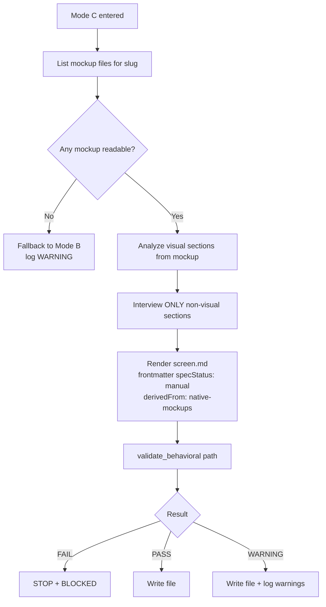
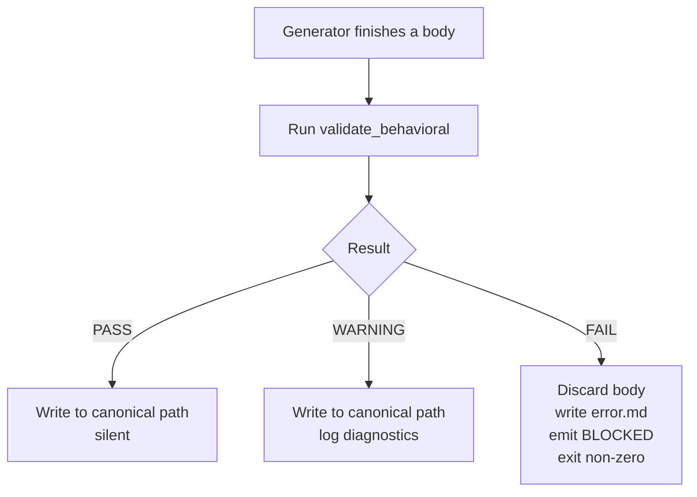
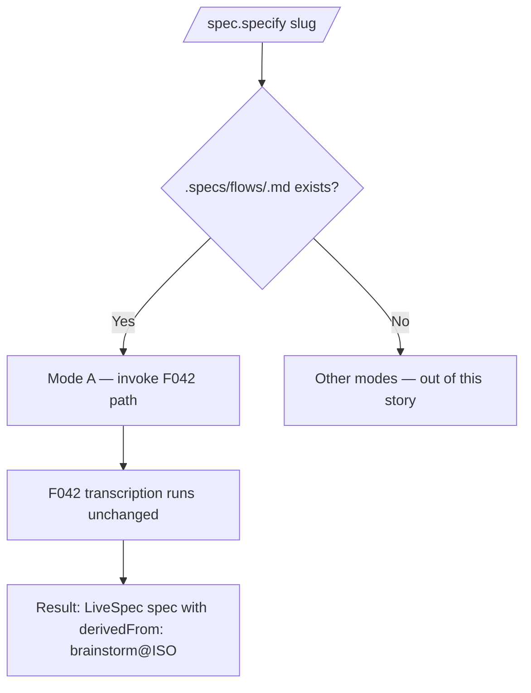

# Feature Spec: Native Behavioral Specs Generation (Interview + Mockup-Derived)

- **Feature:** Native Behavioral Specs Generation (Interview + Mockup-Derived)
- **Branch:** `feature/045-native-behavioral-specs`
- **Date:** 2026-05-14
- **Status:** Draft
- **Input:** Make `/spec.specify` autonomous on behavioral specs — produce `flow.md` + N `screen.md` files (per F044 grammar v1.0) WITHOUT depending on the brainstorm repo. Three modes auto-detected by environment, in priority order: (a) **reuse** — delegate to F042 path when `.specs/flows/<slug>.md` already exists; (b) **native interview** — when no flow file and no mockups, run a structured Q&A covering exactly the 8 mandatory flow sections + 8 mandatory screen sections from F044, no LLM-invented content, `skip`/empty → `(to fill later)` placeholder + WARNING from validator; (c) **mockup-derived** — when no flow but `.specs/design/screens/*.png` (or `ui.pen`) exist, analyze mockups + short interview for the remaining canonical screen sections (`Acteur`, `Source d'entrée`, `Sortie principale`, `Validations`, `Erreurs`), with the visual sections filled from mockup analysis, draft marked `derivedFrom: native-mockups`. All natively-generated artefacts: `specStatus: manual` (protected against re-import overwrite per F041 contract); MUST pass `validate_behavioral()` with PASS or WARNING (FAIL → STOP + BLOCKED). Format byte-identical to F041 imports (interchangeable). No modification of F041/042/043/044 spec.md.
- **Feature Number:** 045

---

## User Scenarios & Testing

> Prioritize stories as P1 (critical — must ship), P2 (important — should ship), P3 (nice-to-have — can defer).

### Story 1 — Native interview when no brainstorm and no mockups exist `P1`

**As a** LiveSpec developer running `/spec.specify <slug>` on a project that has no `.brainstorm/` and no design mockups,
**I want to** be guided through a structured interview producing a valid `flow.md` and one or more `screen.md` files (per F044 grammar v1.0),
**so that** behavioral matter is captured natively, without depending on the brainstorm repo, and without LLM "magic" inventing AC/FR/business rules I never validated.

**Priority reason:** Today `/spec.specify` only knows two paths: regenerate a high-level LiveSpec spec from scratch (no flow/screen artefacts) or transcribe an existing brainstorm flow (F042). On a project that simply has no brainstorm, the behavioral-grammar matter (F044) is never produced. F045 is the missing third path.

**Independent test:** in a fresh fixture project with `.specs/` initialized but no `.brainstorm/` and no `.specs/design/screens/*.png`, run `/spec.specify booking`; answer one section question per turn (or `skip` for some); verify that `.specs/flows/booking.md` exists with the 8 mandatory F044 flow sections (filled or `(to fill later)`), with frontmatter `specStatus: manual` and no `brainstormSource` field, and that `validate_behavioral(path)` returns `PASS` or `WARNING`.

#### Acceptance Scenarios (Gherkin — source of truth for tests)

```gherkin
Feature: Native interview mode for /spec.specify

  Scenario: Mode B auto-detected when no brainstorm flow and no mockups exist
    Given a project with ".specs/" initialized
    And ".specs/flows/booking.md" does NOT exist
    And ".specs/design/screens/" contains zero PNG files
    When the user runs "/spec.specify booking"
    Then the command enters "native interview" mode
    And it does not call the F042 brainstorm derivation path
    And it does not call the mockup-derivation path

  Scenario: Interview asks 8 questions for the flow, in canonical order
    Given the project enters native interview mode for slug "booking"
    When the interview runs
    Then the user is prompted for exactly 8 questions about the flow
    And each question maps 1-to-1 to one of the F044 mandatory flow sections
    And the questions appear in the order: Acteur, Préconditions, Déclencheur, Étapes nominales, Règles métier, Erreurs & exceptions, Side-effects, Postconditions
    And the prompt is a fixed template per section, not an open-ended LLM prompt

  Scenario: skip / empty answer becomes a placeholder + WARNING
    Given the user is prompted for the "Règles métier" section
    When the user answers "skip" or submits an empty input
    Then the corresponding section in the generated "flow.md" body is "(to fill later)"
    And after generation "validate_behavioral(.specs/flows/booking.md)" returns VALIDATION_RESULT.WARNING
    And the diagnostics list cites the empty-but-present section as a non-fatal deviation

  Scenario: Generated flow has specStatus manual and no brainstormSource
    Given the native interview produced ".specs/flows/booking.md"
    When the LiveSpec frontmatter is parsed
    Then "specStatus" equals "manual"
    And "brainstormSource" is absent or null
    And "derivedFrom" is absent

  Scenario: Generated flow is format-identical to a F041 import
    Given a flow file imported by F041 from brainstorm and saved at ".specs/flows/imported.md"
    And a flow file natively generated by F045 at ".specs/flows/native.md"
    When a downstream consumer (F042 transcription, future test command) parses both files
    Then the consumer cannot distinguish them by section structure, section count, or section order
    And the only distinguishable fields are LiveSpec frontmatter ("specStatus", "brainstormSource", "derivedFrom")
```

#### User Flow

> The Mermaid flowchart below visualizes the same flow defined in the Gherkin scenarios above.

```mermaid
flowchart TD
    A[/spec.specify slug invoked/] --> B{".specs/flows/<slug>.md" exists?}
    B -- Yes --> M[Mode A — delegate to F042 path<br/>UNCHANGED — out of scope here]
    B -- No --> C{".specs/design/screens/*.png<br/>or ui.pen exists?"}
    C -- Yes --> K[Mode C — mockup-derived branch]
    C -- No --> D[Mode B — native interview]
    D --> D1[Q1 of 8 — Acteur]
    D1 --> D2[Q2 — Préconditions]
    D2 --> D3[Q3 — Déclencheur]
    D3 --> D4[Q4 — Étapes nominales]
    D4 --> D5[Q5 — Règles métier]
    D5 --> D6[Q6 — Erreurs & exceptions]
    D6 --> D7[Q7 — Side-effects]
    D7 --> D8[Q8 — Postconditions]
    D8 --> E[Render flow.md<br/>frontmatter specStatus: manual<br/>empty answers → "to fill later"]
    E --> V[validate_behavioral path]
    V --> R{Result}
    R -- FAIL --> X[STOP + BLOCKED<br/>write error.md diagnostics]
    R -- PASS --> P[Write file]
    R -- WARNING --> W[Write file + log warnings]
```

---

### Story 2 — Mockup-derived mode when mockups exist but no flow `P1`

**As a** LiveSpec developer running `/spec.specify <slug>` on a project that has UI mockups (PNG or `ui.pen`) but no brainstorm flow,
**I want to** the command analyze the existing mockups for the visual sections (Données affichées, Actions, États UI) and only ask me about the remaining canonical screen sections (`Acteur`, `Source d'entrée`, `Sortie principale`, `Validations`, `Erreurs`),
**so that** I do not retype information already encoded in the mockups, while preserving the same F044 grammar contract.

**Priority reason:** Many LiveSpec projects bring their own mockups (Pencil `.pen`, Figma exports) without a brainstorm pipeline. Forcing the full 8-section interview when half the answers are visible in the mockup is friction and rework. Mode C bridges that gap.

**Independent test:** in a fixture project with `.specs/design/screens/web_dashboard.png` and no `.brainstorm/` and no `.specs/flows/web_dashboard.md`, run `/spec.specify web_dashboard`; verify the command auto-detects Mode C, asks ONLY about `Acteur`, `Source d'entrée`, `Sortie principale`, `Validations`, `Erreurs` (5 questions max for a screen), produces `.specs/design/screens/web_dashboard.md` whose frontmatter contains `derivedFrom: native-mockups` and `specStatus: manual`, and `validate_behavioral()` returns `PASS` or `WARNING`.

#### Acceptance Scenarios (Gherkin — source of truth for tests)

```gherkin
Feature: Mockup-derived mode for /spec.specify

  Scenario: Mode C auto-detected when mockups exist and no flow exists
    Given a project with ".specs/" initialized
    And ".specs/flows/web_dashboard.md" does NOT exist
    And ".specs/design/screens/web_dashboard.png" exists and is a readable PNG
    When the user runs "/spec.specify web_dashboard"
    Then the command enters "mockup-derived" mode
    And it does not enter native interview mode (Mode B)
    And it does not call the F042 brainstorm derivation path (Mode A)

  Scenario: Mockup analysis fills visual sections; interview covers non-visual only
    Given the project entered Mode C for "web_dashboard"
    When the command analyzes the mockup PNG
    Then sections "Données affichées", "Actions", "États UI" are populated from mockup analysis
    And the user is prompted only for the remaining canonical sections: Acteur, Source d'entrée, Sortie principale, Validations, Erreurs
    And the total number of interview questions does not exceed 5 for a single screen

  Scenario: Frontmatter records mockup-derived provenance
    Given Mode C generated ".specs/design/screens/web_dashboard.md"
    When the LiveSpec frontmatter is parsed
    Then "specStatus" equals "manual"
    And "derivedFrom" equals "native-mockups"
    And "brainstormSource" is absent or null

  Scenario: Empty / corrupted mockup falls back to Mode B
    Given ".specs/design/screens/web_dashboard.png" exists but is 0 bytes (corrupted)
    When the user runs "/spec.specify web_dashboard"
    Then the command logs a warning "mockup unreadable — falling back to native interview"
    And the command enters Mode B (native interview)
    And the generated artefact does NOT carry "derivedFrom: native-mockups"
```

#### User Flow



---

### Story 3 — Validator F044 is a hard guard-rail; FAIL is BLOCKING `P1`

**As a** maintainer of LiveSpec,
**I want to** every natively-generated flow/screen artefact to pass through `validate_behavioral()` BEFORE (or immediately after) being written, with FAIL forcing a STOP + BLOCKED state and diagnostics file, never a silent skip,
**so that** F045 cannot regress the F044 grammar contract and cannot ship malformed artefacts that would corrupt downstream consumers (F042, future test command).

**Priority reason:** F044 explicitly created `validate_behavioral()` as the canonical guard-rail. F045 is its first new producer. If the validator is not enforced as a gate, the entire grammar contract becomes advisory and the bridge degrades.

**Independent test:** force an internal bug that drops the `## Postconditions` section from a generated flow file; confirm that F045 detects the FAIL from `validate_behavioral()`, refuses to keep the file, writes `error.md` in the feature directory with the diagnostics, and emits BLOCKED in its output (no partial success).

#### Acceptance Scenarios (Gherkin — source of truth for tests)

```gherkin
Feature: Validator F044 enforced as hard guard-rail

  Scenario: PASS → write file silently
    Given the generator produced a flow body with all 8 mandatory sections present and parseable
    When validate_behavioral(path) is called on the artefact
    Then VALIDATION_RESULT.PASS is returned
    And the file is written to disk at the canonical path
    And no warning is logged

  Scenario: WARNING → write file + log warnings
    Given the generator produced a flow body with all 8 mandatory sections present
    And one section body is "(to fill later)" placeholder
    When validate_behavioral(path) is called
    Then VALIDATION_RESULT.WARNING is returned
    And the file is written to disk
    And every diagnostic from the validator is logged to the user

  Scenario: FAIL → STOP + BLOCKED + diagnostics
    Given the generator produced a flow body missing the "Postconditions" mandatory section
    When validate_behavioral(path) is called
    Then VALIDATION_RESULT.FAIL is returned
    And the artefact is NOT kept on disk at the canonical path
    And ".specs/features/045-native-behavioral-specs/error.md" is written with the verbatim diagnostics
    And the command output includes the literal token "BLOCKED"
    And the exit code is non-zero

  Scenario: Validator is invoked on every native artefact (no bypass)
    Given Mode B or Mode C is active and N artefacts will be produced
    When the command finishes
    Then validate_behavioral was invoked exactly N times
    And the count is observable via a structured log line per artefact
```

#### User Flow



---

### Story 4 — Mode A (reuse F042) auto-detected and unchanged `P1`

**As a** LiveSpec developer running `/spec.specify <slug>` on a project where `.specs/flows/<slug>.md` was already imported by F041 (or natively created earlier),
**I want to** the command auto-detect this and delegate to the existing F042 derivation path with zero behavior change,
**so that** F045 does not regress the F042 contract and existing imported flows keep producing the same `derivedFrom: brainstorm@<ISO>` LiveSpec specs they produce today.

**Priority reason:** F042 is a merged contract on `main`. Any silent change to its execution path would break feature work already shipped against it.

**Independent test:** copy an existing brainstorm-imported flow into `.specs/flows/foo.md`; run `/spec.specify foo`; verify the command takes Mode A; verify the F042 path is invoked (e.g. via a structured log line `mode: reuse-f042`); verify no question is asked of the user; verify zero byte of `.specs/features/042-spec-specify-from-brainstorm/spec.md` is modified by F045.

#### Acceptance Scenarios (Gherkin — source of truth for tests)

```gherkin
Feature: Mode A delegates to F042 with no regression

  Scenario: Mode A auto-detected when flow file exists
    Given ".specs/flows/foo.md" exists with valid grammar v1.0 body
    When the user runs "/spec.specify foo"
    Then the command enters "reuse" mode (Mode A)
    And no native interview is started
    And no mockup-derived branch is entered

  Scenario: F042 derivation path is invoked unchanged
    Given Mode A is selected for slug "foo"
    When the command runs
    Then the F042 transcription routine is called with the existing flow file
    And the F042 routine receives the same arguments it would receive without F045 installed
    And the resulting LiveSpec spec.md carries the F042 frontmatter ("derivedFrom: brainstorm@<ISO>")

  Scenario: F045 does not modify F042 spec.md
    Given the F045 branch is checked out
    When "git diff main -- .specs/features/042-spec-specify-from-brainstorm/spec.md" is executed
    Then the output is empty
```

#### User Flow



---

## Acceptance Criteria

> Each AC must be specific, testable, and verifiable. Reference them from FR below.

| ID | Criterion | Priority | Story |
|---|---|---|---|
| AC-001 | When `.specs/flows/<slug>.md` exists, `/spec.specify <slug>` enters Mode A and delegates to the existing F042 transcription path; no question is asked, no native or mockup-derived branch is entered | P1 | Story 4 |
| AC-002 | When `.specs/flows/<slug>.md` does NOT exist AND `.specs/design/screens/` contains zero readable PNG (or `ui.pen`) files matching the slug, `/spec.specify <slug>` enters Mode B (native interview) | P1 | Story 1 |
| AC-003 | When `.specs/flows/<slug>.md` does NOT exist AND at least one readable mockup file (`.specs/design/screens/<slug>.png` or `ui.pen`) exists, `/spec.specify <slug>` enters Mode C (mockup-derived) | P1 | Story 2 |
| AC-004 | In Mode B, the interview prompts the user for exactly 8 fixed-template questions for a flow (one per F044 mandatory section), in this canonical order: Acteur, Préconditions, Déclencheur, Étapes nominales, Règles métier, Erreurs & exceptions, Side-effects, Postconditions | P1 | Story 1 |
| AC-005 | In Mode B, the interview prompts the user for exactly 8 fixed-template questions per generated screen (one per F044 mandatory screen section), in canonical order: Acteur, Source d'entrée, Sortie principale, Données affichées, Actions, Validations, États UI, Erreurs | P1 | Story 1 |
| AC-006 | In Mode B, an empty answer or the literal answer `skip` produces the body `(to fill later)` for that section; after generation `validate_behavioral(path)` returns `WARNING` (not FAIL) and the diagnostics list cites the empty-but-present section | P1 | Story 1 |
| AC-007 | In Mode C, sections classified as visual (`Données affichées`, `Actions`, `États UI`) are populated from mockup analysis; the interview is restricted to the remaining canonical screen sections (`Acteur`, `Source d'entrée`, `Sortie principale`, `Validations`, `Erreurs`); the total interview questions per screen is at most 5 | P1 | Story 2 |
| AC-008 | In Mode C, the generated artefact's LiveSpec frontmatter contains `derivedFrom: native-mockups`; in Modes A and B, `derivedFrom` is absent (or for Mode A, takes the F042 value `brainstorm@<ISO>`) | P1 | Story 2 |
| AC-009 | Every artefact natively generated by F045 (Mode B and Mode C) carries LiveSpec frontmatter `specStatus: manual` and no `brainstormSource` field (per F041 overwrite contract: F041 refuses to overwrite `manual` files unless `--force-overwrite-manual` is passed) | P1 | Story 1, Story 2 |
| AC-010 | `validate_behavioral(path)` is invoked on every natively-generated artefact (Mode B and Mode C); the invocation count equals the number of artefacts produced; this is observable via a structured log line per artefact | P1 | Story 3 |
| AC-011 | When `validate_behavioral` returns `FAIL`, the artefact is NOT kept at the canonical path, `error.md` is written under `.specs/features/045-native-behavioral-specs/` with the verbatim diagnostics, the command output contains the literal token `BLOCKED`, and the exit code is non-zero | P1 | Story 3 |
| AC-012 | When `validate_behavioral` returns `PASS`, the artefact is written to its canonical path with no warning logged; when it returns `WARNING`, the artefact is written and every diagnostic is logged to the user | P1 | Story 3 |
| AC-013 | A natively-generated flow file and a F041-imported flow file at the same slug are byte-distinguishable ONLY by their LiveSpec frontmatter fields (`specStatus`, `brainstormSource`, `derivedFrom`); body section structure, section count, section order, and section names are identical | P1 | Story 1 |
| AC-014 | After F045 lands, `git diff main -- .specs/features/041-spec-init-flow-specs-ingestion/spec.md .specs/features/042-spec-specify-from-brainstorm/spec.md .specs/features/043-spec-sync-brainstorm/spec.md .specs/features/044-behavioral-grammar-v1-shared/spec.md` produces zero output (no modification of upstream contracts) | P1 | Story 4 |
| AC-015 | End-to-end smoke: in a fresh fixture project with `.specs/` initialized, no `.brainstorm/`, no mockups, invoking `/spec.specify booking` (with `skip` to all 8 questions) produces `.specs/flows/booking.md` whose `validate_behavioral()` returns `WARNING` (PASS impossible since all sections are placeholders) and never `FAIL` | P1 | Story 1 |
| AC-016 | An empty (`0 bytes`) or unreadable mockup file matching the slug causes Mode C to fall back to Mode B with a logged warning `mockup unreadable — falling back to native interview`; the resulting artefact does NOT carry `derivedFrom: native-mockups` | P2 | Story 2 |
| AC-017 | When the user runs `/spec.specify <slug>` on an existing target whose LiveSpec frontmatter declares `specStatus: manual`, the command refuses to overwrite without an explicit `--force` flag (consistent with F041's manual-protection semantics applied symmetrically by the producer); the summary lists `<slug>: skipped (specStatus: manual)` | P2 | Story 1 |
| AC-018 | Mode detection precedence is documented and enforced as: A (reuse) wins over C (mockup-derived) wins over B (native interview); this precedence is exposed in the spec and in the command's structured log line `mode: reuse|mockup-derived|native-interview` | P1 | Story 1, Story 2, Story 4 |
| AC-019 | F045 introduces NO new top-level CLI command and NO new agent type; the surface change is limited to the existing `/spec.specify` command (auto-detect by default; optional `--native` and `--from-mockups` flags only as overrides for the auto-detection) | P2 | Story 1 |
| AC-020 | The mode-detection rule is implemented as a single Python function (e.g. `validator.behavioral_grammar.detect_mode(slug, specs_root) -> Literal["reuse","mockup-derived","native-interview"]`) and is unit-tested for all four detection branches (flow exists / flow absent + mockup PNG present / flow absent + ui.pen present / flow absent + nothing) | P1 | Story 1, Story 2, Story 4 |

### AC-001
**Criterion:** When `.specs/flows/<slug>.md` exists, `/spec.specify <slug>` enters Mode A and delegates to the existing F042 transcription path; no question is asked, no native or mockup-derived branch is entered.
**Priority:** P1 | **Story:** Story 4

### AC-002
**Criterion:** When `.specs/flows/<slug>.md` does NOT exist AND `.specs/design/screens/` contains zero readable PNG (or `ui.pen`) files matching the slug, `/spec.specify <slug>` enters Mode B (native interview).
**Priority:** P1 | **Story:** Story 1

### AC-003
**Criterion:** When `.specs/flows/<slug>.md` does NOT exist AND at least one readable mockup file matching the slug exists, `/spec.specify <slug>` enters Mode C (mockup-derived).
**Priority:** P1 | **Story:** Story 2

### AC-004
**Criterion:** In Mode B, the interview prompts for exactly 8 fixed-template questions for a flow (one per F044 mandatory section), in canonical order.
**Priority:** P1 | **Story:** Story 1

### AC-005
**Criterion:** In Mode B, the interview prompts for exactly 8 fixed-template questions per generated screen (one per F044 mandatory screen section), in canonical order.
**Priority:** P1 | **Story:** Story 1

### AC-006
**Criterion:** Empty / `skip` answer → body `(to fill later)`; `validate_behavioral` returns `WARNING` (not FAIL); diagnostics cite the empty-but-present section.
**Priority:** P1 | **Story:** Story 1

### AC-007
**Criterion:** In Mode C, visual sections are populated from mockup analysis; interview restricted to the remaining canonical screen sections; max 5 questions per screen.
**Priority:** P1 | **Story:** Story 2

### AC-008
**Criterion:** Mode C frontmatter has `derivedFrom: native-mockups`; Mode B has no `derivedFrom`; Mode A retains F042's `brainstorm@<ISO>` value.
**Priority:** P1 | **Story:** Story 2

### AC-009
**Criterion:** Every Mode B / Mode C artefact carries `specStatus: manual` and no `brainstormSource` (consistent with F041 overwrite contract).
**Priority:** P1 | **Story:** Story 1, Story 2

### AC-010
**Criterion:** `validate_behavioral(path)` invoked on every native artefact; observable via a structured log line per artefact.
**Priority:** P1 | **Story:** Story 3

### AC-011
**Criterion:** FAIL → discard artefact, write `error.md`, emit `BLOCKED`, exit non-zero.
**Priority:** P1 | **Story:** Story 3

### AC-012
**Criterion:** PASS → write silently; WARNING → write + log diagnostics.
**Priority:** P1 | **Story:** Story 3

### AC-013
**Criterion:** Native and F041-imported flows distinguishable ONLY by LiveSpec frontmatter; body identical in structure / order / count / names.
**Priority:** P1 | **Story:** Story 1

### AC-014
**Criterion:** Zero-byte `git diff main` against F041/042/043/044 spec.md after F045 lands.
**Priority:** P1 | **Story:** Story 4

### AC-015
**Criterion:** End-to-end smoke fixture (no brainstorm, no mockups, `skip` all answers) produces a `WARNING`-validating flow file, never `FAIL`.
**Priority:** P1 | **Story:** Story 1

### AC-016
**Criterion:** Empty / unreadable mockup → fallback to Mode B + warning + no `derivedFrom: native-mockups`.
**Priority:** P2 | **Story:** Story 2

### AC-017
**Criterion:** Existing target with `specStatus: manual` is refused without explicit `--force`; summary lists `skipped (specStatus: manual)`.
**Priority:** P2 | **Story:** Story 1

### AC-018
**Criterion:** Mode detection precedence: A > C > B. Documented + emitted as structured log line `mode: <name>`.
**Priority:** P1 | **Story:** Story 1, Story 2, Story 4

### AC-019
**Criterion:** No new top-level CLI command and no new agent type; only auto-detect on `/spec.specify` (with optional `--native` / `--from-mockups` overrides).
**Priority:** P2 | **Story:** Story 1

### AC-020
**Criterion:** Mode detection implemented as a single, unit-tested Python function covering all four detection branches.
**Priority:** P1 | **Story:** Story 1, Story 2, Story 4

---

## Functional Requirements

> Each FR must map to at least one AC.

| ID | Requirement | AC References |
|---|---|---|
| FR-001 | `/spec.specify <slug>` MUST auto-detect the generation mode from the project state, using the precedence A (reuse) > C (mockup-derived) > B (native interview). The detection rule lives in a single Python function `detect_mode(slug, specs_root) -> Literal["reuse","mockup-derived","native-interview"]` exposed by `validator.behavioral_grammar` (or a sibling module). | AC-001, AC-002, AC-003, AC-018, AC-020 |
| FR-002 | When `detect_mode` returns `reuse`, `/spec.specify` MUST delegate to the existing F042 transcription path with no behavior change. F045 MUST NOT modify any code path inside the F042 routine and MUST NOT modify `.specs/features/042-spec-specify-from-brainstorm/spec.md`. | AC-001, AC-014 |
| FR-003 | When `detect_mode` returns `native-interview`, `/spec.specify` MUST run a structured interview with exactly 8 fixed-template questions for the flow, mapped 1-to-1 to the F044 mandatory flow sections in canonical order (Acteur, Préconditions, Déclencheur, Étapes nominales, Règles métier, Erreurs & exceptions, Side-effects, Postconditions). The questions MUST be hard-coded templates, NOT open-ended LLM prompts. | AC-002, AC-004 |
| FR-004 | When `detect_mode` returns `native-interview` AND the user requests one or more screen artefacts to accompany the flow, `/spec.specify` MUST run a structured interview with exactly 8 fixed-template questions per screen, mapped 1-to-1 to the F044 mandatory screen sections in canonical order (Acteur, Source d'entrée, Sortie principale, Données affichées, Actions, Validations, États UI, Erreurs). | AC-005 |
| FR-005 | An empty answer or the literal answer `skip` from the user MUST produce the body `(to fill later)` under the corresponding section heading. The mandatory section heading is always written; only the body becomes the placeholder. | AC-006, AC-015 |
| FR-006 | When `detect_mode` returns `mockup-derived`, `/spec.specify` MUST analyze the mockup file(s) for the slug and populate the visual sections (`Données affichées`, `Actions`, `États UI`). The interview MUST cover ONLY the remaining canonical screen sections (`Acteur`, `Source d'entrée`, `Sortie principale`, `Validations`, `Erreurs`), with at most 5 questions per screen. | AC-007 |
| FR-007 | The LiveSpec frontmatter on every artefact natively generated by F045 (Mode B and Mode C) MUST be: `specStatus: manual`; no `brainstormSource` field; `derivedFrom: native-mockups` only for Mode C. Mode A frontmatter is governed by F042 and is unchanged. | AC-008, AC-009 |
| FR-008 | F045 MUST invoke `validate_behavioral(path)` on every natively-generated artefact (Mode B and Mode C) before returning success. The invocation MUST be observable via a structured log line per artefact (`validator.behavioral_grammar.validate_behavioral` call site). | AC-010 |
| FR-009 | When `validate_behavioral` returns `VALIDATION_RESULT.FAIL`, F045 MUST: discard the offending artefact (do not keep it at the canonical path), write `error.md` under `.specs/features/045-native-behavioral-specs/` with the verbatim diagnostics, emit the literal token `BLOCKED` in stdout, and exit with a non-zero exit code. | AC-011 |
| FR-010 | When `validate_behavioral` returns `VALIDATION_RESULT.PASS`, F045 MUST write the artefact silently. When it returns `VALIDATION_RESULT.WARNING`, F045 MUST write the artefact AND log every diagnostic to the user (no silent warning loss). | AC-012 |
| FR-011 | The body of any natively-generated flow or screen file MUST be byte-identical in section structure (heading text, heading order, mandatory section count = 8) to the body of an F041-imported file. The only authorized distinguisher is the LiveSpec frontmatter (`specStatus`, `brainstormSource`, `derivedFrom`). | AC-013 |
| FR-012 | F045 MUST NOT modify any byte of `.specs/features/041-spec-init-flow-specs-ingestion/spec.md`, `.specs/features/042-spec-specify-from-brainstorm/spec.md`, `.specs/features/043-spec-sync-brainstorm/spec.md`, `.specs/features/044-behavioral-grammar-v1-shared/spec.md`. CI / verifier MUST be able to assert this with a `git diff main` check. | AC-014 |
| FR-013 | When the mockup file matching the slug is unreadable or zero bytes, F045 MUST log the warning `mockup unreadable — falling back to native interview` and run Mode B instead. The resulting artefact MUST NOT carry `derivedFrom: native-mockups`. | AC-016 |
| FR-014 | When the target file (`.specs/flows/<slug>.md` or `.specs/design/screens/<name>.md`) already exists with `specStatus: manual`, F045 MUST refuse to overwrite without an explicit `--force` flag and MUST list the entry `<slug>: skipped (specStatus: manual)` in the run summary. This mirrors the F041 protection contract on the producer side. | AC-017 |
| FR-015 | F045 MUST NOT introduce a new top-level CLI command and MUST NOT introduce a new agent type. The only surface change is on the existing `/spec.specify`: auto-detect by default, with two optional override flags (`--native` to force Mode B, `--from-mockups` to force Mode C). The flags fail loudly when the requested mode is impossible (e.g. `--from-mockups` with no mockups present → BLOCKED with a clear reason). | AC-019 |
| FR-016 | The mode-detection function MUST be unit-tested across all four detection branches: (a) flow file exists → `reuse`; (b) flow absent + mockup PNG present → `mockup-derived`; (c) flow absent + `ui.pen` present → `mockup-derived`; (d) flow absent + nothing present → `native-interview`. Tests live in `tests/test_native_behavioral_specs.py`. | AC-020 |
| FR-017 | The end-to-end smoke fixture (no brainstorm, no mockups, `skip` all answers) MUST be exercised by an integration test asserting that `validate_behavioral()` on the produced artefact returns `WARNING` (and never `FAIL`). | AC-015 |

### FR-001
**Requirement:** `/spec.specify <slug>` MUST auto-detect the generation mode using the precedence A > C > B; rule is a single function `detect_mode(slug, specs_root)`.
**AC References:** [AC-001](#ac-001), [AC-002](#ac-002), [AC-003](#ac-003), [AC-018](#ac-018), [AC-020](#ac-020)

### FR-002
**Requirement:** Mode A delegates to F042 unchanged; F045 must not modify F042 code or spec.md.
**AC References:** [AC-001](#ac-001), [AC-014](#ac-014)

### FR-003
**Requirement:** Mode B = 8 fixed-template flow questions in canonical F044 order; no LLM open-ended prompts.
**AC References:** [AC-002](#ac-002), [AC-004](#ac-004)

### FR-004
**Requirement:** Mode B = 8 fixed-template screen questions per screen in canonical F044 order.
**AC References:** [AC-005](#ac-005)

### FR-005
**Requirement:** Empty / `skip` → body `(to fill later)`; section heading is always written.
**AC References:** [AC-006](#ac-006), [AC-015](#ac-015)

### FR-006
**Requirement:** Mode C = mockup analysis fills visual sections; interview limited to the remaining canonical screen sections; max 5 questions per screen.
**AC References:** [AC-007](#ac-007)

### FR-007
**Requirement:** Frontmatter on Mode B / Mode C artefacts: `specStatus: manual`, no `brainstormSource`, `derivedFrom: native-mockups` only in Mode C.
**AC References:** [AC-008](#ac-008), [AC-009](#ac-009)

### FR-008
**Requirement:** Invoke `validate_behavioral(path)` on every native artefact; observable via structured log line.
**AC References:** [AC-010](#ac-010)

### FR-009
**Requirement:** FAIL → discard, write `error.md`, emit `BLOCKED`, exit non-zero.
**AC References:** [AC-011](#ac-011)

### FR-010
**Requirement:** PASS → silent write; WARNING → write + log every diagnostic.
**AC References:** [AC-012](#ac-012)

### FR-011
**Requirement:** Body byte-identical to F041 imports in section structure; only frontmatter distinguishes provenance.
**AC References:** [AC-013](#ac-013)

### FR-012
**Requirement:** Zero modification of F041/042/043/044 spec.md; assertable via `git diff main`.
**AC References:** [AC-014](#ac-014)

### FR-013
**Requirement:** Unreadable mockup → fallback to Mode B + warning + no `derivedFrom: native-mockups`.
**AC References:** [AC-016](#ac-016)

### FR-014
**Requirement:** Existing `specStatus: manual` target → refuse overwrite without `--force`; `skipped (specStatus: manual)` in summary.
**AC References:** [AC-017](#ac-017)

### FR-015
**Requirement:** No new CLI command, no new agent. Only `/spec.specify` surface change: auto-detect + optional `--native` / `--from-mockups` overrides; impossible-mode requests fail loudly.
**AC References:** [AC-019](#ac-019)

### FR-016
**Requirement:** Mode detection unit-tested on all 4 branches in `tests/test_native_behavioral_specs.py`.
**AC References:** [AC-020](#ac-020)

### FR-017
**Requirement:** End-to-end smoke fixture asserts `WARNING` (never `FAIL`) on full-`skip` flow generation.
**AC References:** [AC-015](#ac-015)

---

## Key Entities

| Entity | Description | Key Fields |
|---|---|---|
| GenerationMode (enum) | The runtime mode `/spec.specify` selects for a given slug. Exactly 3 values, mutually exclusive. | `reuse` (Mode A — flow file exists, delegate to F042) · `mockup-derived` (Mode C — mockups exist, no flow) · `native-interview` (Mode B — nothing exists) |
| ModeDetectionInput | Bundle consumed by `detect_mode(slug, specs_root)` | slug (str), specs_root (Path), flow_path (`.specs/flows/<slug>.md`), mockup_paths (list of `.specs/design/screens/<slug>.{png,pen}` matches) |
| InterviewQuestion | A single fixed-template question used in Mode B. Hard-coded per F044 mandatory section. | section_id (one of the 8 mandatory section names), prompt_template (str), kind (`flow` \| `screen`) |
| InterviewAnswer | The user's reply to one InterviewQuestion. | section_id, raw_text (str), is_skip (bool — true if empty or literal `skip`) |
| MockupAnalysisResult | The visual sections derived from mockup file(s) in Mode C. | screen_name, données_affichées (str), actions (str or table), états_ui (str), validations (str, optional) |
| NativeArtefact | The output of Mode B or Mode C, written to `.specs/flows/<slug>.md` or `.specs/design/screens/<name>.md`. | path, kind (`flow` \| `screen`), frontmatter (LiveSpecFrontmatter — `specStatus: manual`, no `brainstormSource`, `derivedFrom: "native-mockups"` for Mode C only), body (8 mandatory sections in F044 order) |
| LiveSpecFrontmatter (re-doc) | Same 3-field contract as F041, with the producer-side rules added by F045: `specStatus` set to `manual` for native artefacts; `brainstormSource` absent; new optional field `derivedFrom: "native-mockups"` for Mode C. The new `derivedFrom` field is additive and does not break F041's parsing (F041 ignores unknown fields). | `specStatus`, `brainstormSource` (absent on native), `brainstormGeneratedAt` (absent on native), `derivedFrom` (optional, `"native-mockups"` for Mode C) |
| ValidationGate | The hard guard-rail wrapping `validate_behavioral`. | input_path, outcome (`PASS` \| `WARNING` \| `FAIL`), diagnostics (list[str]), action (`write_silent` \| `write_and_log` \| `discard_and_block`) |

---

## Edge Cases

- **Partial brainstorm coverage (mode is per-slug, not per-project):** A project has `.specs/flows/booking.md` (imported by F041) but NOT `.specs/flows/checkout.md`. Running `/spec.specify booking` enters Mode A; running `/spec.specify checkout` enters Mode B (or Mode C if mockups exist for `checkout`). Mode is detected per-slug, never per-project.
- **User answers `skip` to all 8 questions in Mode B:** the resulting flow file has 8 mandatory headings each followed by `(to fill later)`. `validate_behavioral` returns `WARNING` (mandatory sections present and parseable, but bodies are placeholders — treated as non-fatal deviation). The file is kept; the user is informed they have homework.
- **Mockup file exists but is empty / corrupted (0 bytes or unreadable):** Mode C falls back to Mode B with a logged warning `mockup unreadable — falling back to native interview`. The resulting artefact does NOT carry `derivedFrom: native-mockups` (truth-in-frontmatter).
- **Conflicting state — flow file exists AND user passes `--native`:** the explicit flag wins. F045 enters Mode B but refuses to overwrite the existing flow without an additional `--force` flag (mirrors F041 contract). On `--force`, the existing flow is overwritten and the new artefact carries `specStatus: manual`. Without `--force`, the run is BLOCKED with a clear message.
- **Existing native artefact (`specStatus: manual`) is the target of a re-run:** F045 refuses to overwrite without `--force`; the summary lists `<slug>: skipped (specStatus: manual)`. This honors the F041 protection contract symmetrically on the producer side and prevents accidental loss of human edits.
- **Validator returns FAIL on a generated artefact:** STOP + BLOCKED. The artefact is discarded (never written at the canonical path; if a temp file was used, it is removed). `error.md` is written under `.specs/features/045-native-behavioral-specs/` containing the verbatim validator diagnostics. Exit code is non-zero. No partial-success path.
- **`--from-mockups` requested but no mockup matches the slug:** the run is BLOCKED with a clear message `--from-mockups requested but no readable mockup file matches slug <slug>`. F045 does NOT silently fall back to Mode B in this case (explicit flag → explicit failure if impossible).
- **Multiple mockup files match the slug (e.g. `web_dashboard.png` and `web_dashboard.pen`):** Mode C analyzes the highest-priority file (`.pen` first if present, else PNG); the others are listed in the run summary as `additional mockup ignored: <path>`. No silent multi-source merge.
- **`--native` requested when a flow file exists and no `--force`:** BLOCKED with `--native conflicts with existing flow file <path> — pass --force to overwrite`.

---

## Out-of-Scope Guard

> This section is BLOCKING for verification. Every item listed here is explicitly excluded from F045 and MUST NOT appear in plan.md, implementation, or tests.

- **Modification of the brainstorm repo or the brainstorm skill** — F045 reads neither and writes nothing back.
- **Building a new mockup generator from scratch** — Mode C consumes EXISTING mockups only (`.specs/design/screens/*.png` or `ui.pen`). No new generator, no Pencil MCP write surface.
- **Refonte of F041, F042, F043, or F044** — those features are merged contracts; F045 is purely additive (new mode-detection function, new interview surface, new mockup-analysis path, new producer-side `specStatus: manual` rule).
- **Visual baselines / Pencil MCP integration NEW work** — F045 reads existing PNG / `.pen` files only; it does NOT generate baselines, does NOT call Pencil MCP for write operations, does NOT extend the visual-testing pipeline.
- **`--redrive` mode** — already excluded from F042 scope; remains out of scope here.
- **LLM "magic" generation of AC, FR, business rules, side-effects without explicit user input** — every AC/FR/rule that ends up in a Mode B artefact MUST trace back to a user answer (or an explicit `(to fill later)` placeholder). NO LLM auto-completion of behavioral matter.
- **New top-level CLI command** — F045 ships as a behavior change inside the existing `/spec.specify` command surface (with optional `--native` / `--from-mockups` flags only).
- **New agent type or agent role** — F045 does NOT introduce a new agent; it ships as in-process logic invoked by the existing `/spec.specify` flow.
- **Wiring `validate_behavioral` into `livespec validate` core dispatch** — out of scope (same exclusion as F044). F045 calls `validate_behavioral` directly.
- **`specStatus` lifecycle transitions** (`fresh` ↔ `stale` ↔ `orphaned` ↔ `manual`) — owned by F041 / F043. F045 only SETS `specStatus: manual` at production time; it does NOT compute transitions.
- **Modifying F043 spec.md to make `/spec.sync-brainstorm` conditional on `.brainstorm/` presence** — that behavior change is a downstream note (see Compatibility Notes); the F043 spec.md itself is NOT touched by F045.

---

## Compatibility Notes

> Non-binding notes documenting how F045 interacts with the surrounding F041–F044 contracts. These do NOT modify upstream spec.md files.

- **F041 (`/spec.init` ingestion):** F041 owns the `specStatus: manual` overwrite-protection contract (an existing target with `specStatus: manual` is preserved unchanged by `/spec.init` and `/spec.init --force`; only `/spec.init --force-overwrite-manual` overwrites it). F045 honors this contract from the producer side: every native artefact is born with `specStatus: manual`, so any subsequent F041 re-import will refuse to overwrite the human's work without explicit confirmation. F041 spec.md is NOT modified.
- **F042 (`/spec.specify` derivation):** Mode A is a strict delegation to F042's existing transcription path. F042 spec.md is NOT modified. F045 introduces zero behavioral change inside the F042 routine. The only mechanical change in `/spec.specify` is an upstream branch-on-`detect_mode` that selects between Mode A (delegate) and Modes B/C (new code).
- **F043 (`/spec.sync-brainstorm`):** F043 reads the brainstorm manifest to detect drift. On a project with no `.brainstorm/` (the F045 native case), `/spec.sync-brainstorm` should `exit 0` silently with the message `no brainstorm — skipping sync` (this is a behavior NOTE for downstream implementation; F043 spec.md is NOT modified by F045). Native artefacts always have `specStatus: manual`, which F043 already declares "inviolable" (Mode B inviolable contract from F043 spec.md), so F043 will never overwrite F045 outputs in any scenario.
- **F044 (grammar v1.0 + validator):** F045 is the first new producer wired against `validate_behavioral`. F045 imports the validator strictly via the canonical surface `from validator.behavioral_grammar import validate_behavioral, VALIDATION_RESULT, ValidationOutcome` (per F044 FR-008). No alternate import path is introduced. F044 spec.md is NOT modified. The optional `derivedFrom` frontmatter field is additive; F044 already states (Out of Scope, v1.0) that `specStatus` lifecycle transitions are deferred to F041/F043, and `derivedFrom` is not enumerated in F044's frontmatter contract — it is treated as an unknown extra field, which the validator already tolerates as `WARNING`-level deviation at most. Acceptable per F044 semantics.
- **Slash command surface decision:** F045 chooses **auto-detect by environment** (no required new flag) as the default behavior. Rationale: simpler UX, fewer required flags, environment is the source of truth; explicit overrides remain available via `--native` and `--from-mockups` for power users (or for testing). Auto-detect precedence is documented as A > C > B (AC-018) and is enforced by the single `detect_mode` function (FR-001).

---

## Success Criteria

| ID | Criterion | How to Measure |
|---|---|---|
| SC-001 | A LiveSpec project with no brainstorm and no mockups can produce a valid `flow.md` natively | Run `/spec.specify booking` on a fresh fixture; assert `.specs/flows/booking.md` exists; `validate_behavioral` returns PASS or WARNING (never FAIL) |
| SC-002 | A LiveSpec project with mockups but no brainstorm can produce a valid `screen.md` natively | Run `/spec.specify web_dashboard` on a fixture with `web_dashboard.png` only; assert `.specs/design/screens/web_dashboard.md` exists with `derivedFrom: native-mockups`; validator returns PASS or WARNING |
| SC-003 | F041–F044 contracts remain bit-for-bit untouched | `git diff main -- .specs/features/041-spec-init-flow-specs-ingestion/spec.md .specs/features/042-spec-specify-from-brainstorm/spec.md .specs/features/043-spec-sync-brainstorm/spec.md .specs/features/044-behavioral-grammar-v1-shared/spec.md` produces zero output |
| SC-004 | Native and imported flows are interchangeable for downstream consumers | Run `/spec.specify` (Mode A) on a directory containing one F041 import and one F045 native flow at different slugs; both produce LiveSpec spec.md outputs with identical body structure |
| SC-005 | Validator gate is effective (no FAIL escapes) | Inject a deliberate generator bug dropping `## Postconditions`; assert F045 emits `BLOCKED`, exits non-zero, writes `error.md`, and does NOT keep the malformed artefact at the canonical path |
| SC-006 | Mode detection is deterministic and unit-tested | `pytest tests/test_native_behavioral_specs.py::test_detect_mode -v` reports 4/4 passed (one per detection branch) |

---

*Generated by `/spec.specify --auto` — LiveSpec v1.0*
