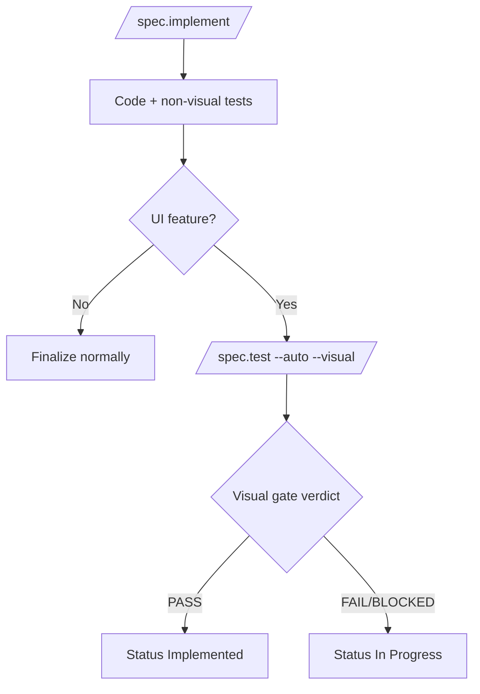
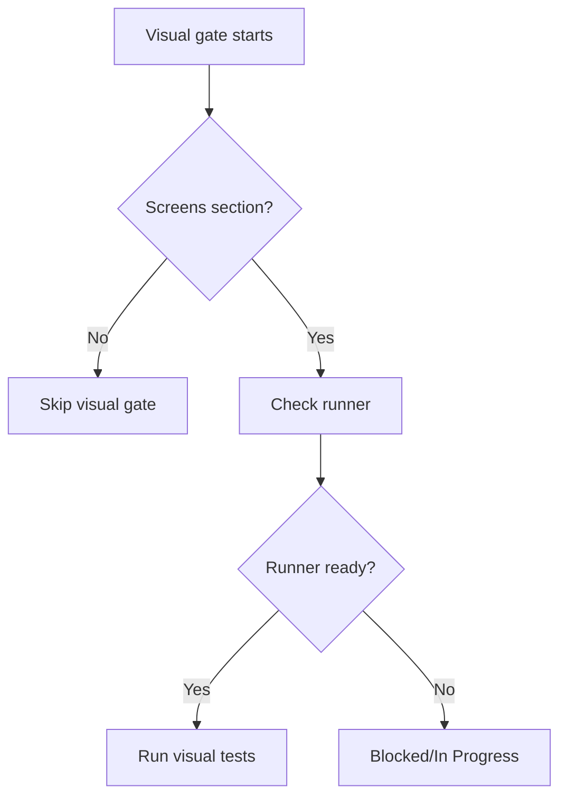
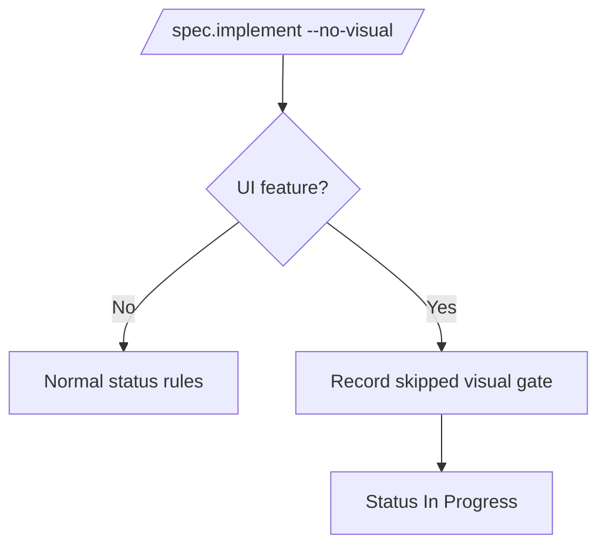

# Feature 046 - Visual Implementation Gate

- **Feature Name:** Visual Implementation Gate
- **Branch:** `feature/046-visual-implementation-gate`
- **Date:** 2026-05-17
- **Status:** Implemented

## Input

When `/spec.implement` builds a visual feature from a mockup or screen spec, the command must not stop at non-visual tests. It must run the visual validation path during implementation and must not mark the feature `Implemented` until visual tests, simulator/browser captures, baselines, and design-fidelity checks match the feature's declared screens.

## User Scenarios & Testing

### Story 1 (P1) - Visual implementation is gated before completion

**Description:** A developer implements a UI feature with a `## Screens` table. `/spec.implement` must run the visual gate before updating status to `Implemented`.

**Priority reason:** This is the core failure mode: code can currently be implemented without proving the rendered UI matches the requested visual change.

**Independent test:** Inspect `commands/spec-implement.md` and verify it declares Phase 6.5, calls `/spec.test <feature> --auto --visual`, and blocks `Implemented` status on visual failure.

```gherkin
Feature: Visual implementation gate
  Scenario: UI feature passes visual gate
    Given a feature spec has a `## Screens` section
    And   implementation code and non-visual tests pass
    When  `/spec.implement <feature>` reaches final validation
    Then  it runs `/spec.test <feature> --auto --visual`
    And   the feature can be marked `Implemented` only when the visual gate passes

  Scenario: UI feature fails visual gate
    Given a feature spec has a `## Screens` section
    And   the visual runner reports a missing baseline or visual diff
    When  `/spec.implement <feature>` reaches final validation
    Then  it records the blocker in `progress.md`
    And   the feature remains `In Progress`
```



### Story 2 (P1) - Visual tooling failures block visual features

**Description:** If Playwright, XCUITest, Maestro, simulator, browser, or runner tooling is unavailable for a UI feature, `/spec.implement` must report a resumable blocked state rather than continuing to success.

**Priority reason:** A missing runner is not equivalent to a passing UI implementation.

**Independent test:** Verify `commands/spec-implement.md` does not document "continue without blocking" for unavailable visual tooling and instead documents a blocking rule.

```gherkin
Feature: Visual tooling failure is blocking
  Scenario: Runner unavailable for UI feature
    Given a feature spec has a `## Screens` section
    And   `livespec ui-runner check --json` reports BLOCKED
    When  `/spec.implement <feature>` runs visual validation
    Then  it stops before finalization
    And   reports the missing tooling and recovery command

  Scenario: Non-UI feature has no visual runner
    Given a feature spec has no UI surface and no `## Screens` section
    When  `/spec.implement <feature>` runs final validation
    Then  visual validation is skipped
    And   normal non-visual completion rules apply
```



### Story 3 (P1) - `--no-visual` cannot produce a false implemented status

**Description:** A developer may intentionally skip visual capture during partial work, but that skip must cap the feature status at `In Progress`.

**Priority reason:** The flag is useful during iteration but must not bypass acceptance.

**Independent test:** Verify the `--no-visual` flag documentation in `commands/spec-implement.md` says visual features remain `In Progress`.

```gherkin
Feature: no-visual flag is partial-only
  Scenario: UI feature skips visual validation
    Given a feature spec has a `## Screens` section
    When  `/spec.implement <feature> --no-visual` completes non-visual work
    Then  the feature status is `In Progress`
    And   the output says visual validation was skipped by flag

  Scenario: Backend feature uses no-visual
    Given a feature spec has no visual surface
    When  `/spec.implement <feature> --no-visual` completes
    Then  the flag has no effect on finalization
```



## Acceptance Criteria

- **AC-001** - `/spec.implement` documents a mandatory Phase 6.5 visual gate for UI features before status finalization.
- **AC-002** - The mandatory gate invokes `/spec.test <feature> --auto --visual` or the same visual audit/generation/execution/capture/comparison phases.
- **AC-003** - Missing visual tooling for a UI feature is blocking and produces a resumable `In Progress` state.
- **AC-004** - `--no-visual` on a UI feature prevents final `Implemented` status.
- **AC-005** - `/spec.test` exposes a structured visual gate verdict usable by `/spec.implement`.
- **AC-006** - Command expectations mention visual-gate behavior so `/spec.verify-output` contracts stay aligned.

## Functional Requirements

- **FR-001** - Update `commands/spec-implement.md` to insert a Phase 6.5 visual gate between final validation and documentation/status updates.
- **FR-002** - Update `commands/spec-implement.md` so unavailable visual tooling blocks UI features instead of continuing.
- **FR-003** - Update `commands/spec-implement.md` so `--no-visual` on visual features results in `In Progress`, not `Implemented`.
- **FR-004** - Update `commands/spec-test.md` to define a structured visual gate verdict with `PASS`, `FAIL`, and `BLOCKED`.
- **FR-005** - Update command expectations for `/spec.implement` and `/spec.test` to reflect visual-gate observability.
- **FR-006** - Add regression tests that lock the command contract text.

## Key Entities

- **Visual Feature:** A feature with `## Screens`, visual AC/FR, mockup references, or declared UI surfaces.
- **Visual Gate Verdict:** The structured result consumed by `/spec.implement`: `PASS`, `FAIL`, or `BLOCKED`.
- **Baseline Candidate:** Screenshot captured from the implementation before approval.
- **Mockup Reference:** Expected design image from `.specs/design/screens/`.

## Edge Cases

- Visual feature without runner tooling: block and report recovery.
- Visual feature with `--no-visual`: partial success only.
- Backend-only feature: visual gate skipped.
- Visual test generation succeeds but comparison fails: status remains `In Progress`.

## Success Criteria

- **SC-001** - Regression tests fail against the old command text and pass after the gate is documented.
- **SC-002** - `/spec.implement` command documentation has no path where a visual feature can reach `Implemented` without a passing visual gate.
- **SC-003** - `/spec.test` command documentation has a machine-readable verdict contract suitable for implement gating.
