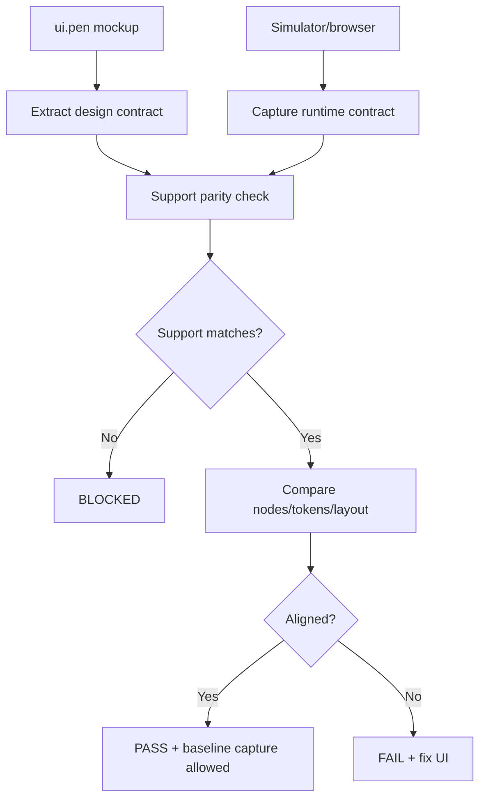
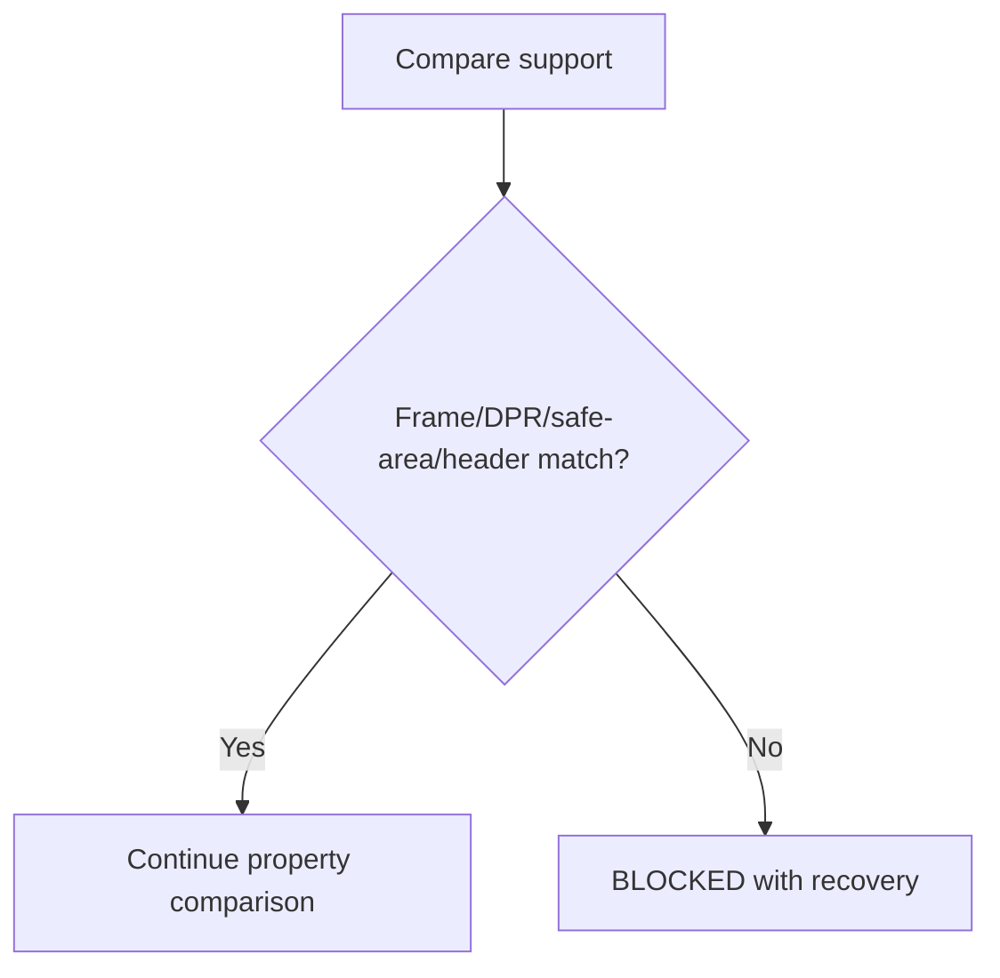
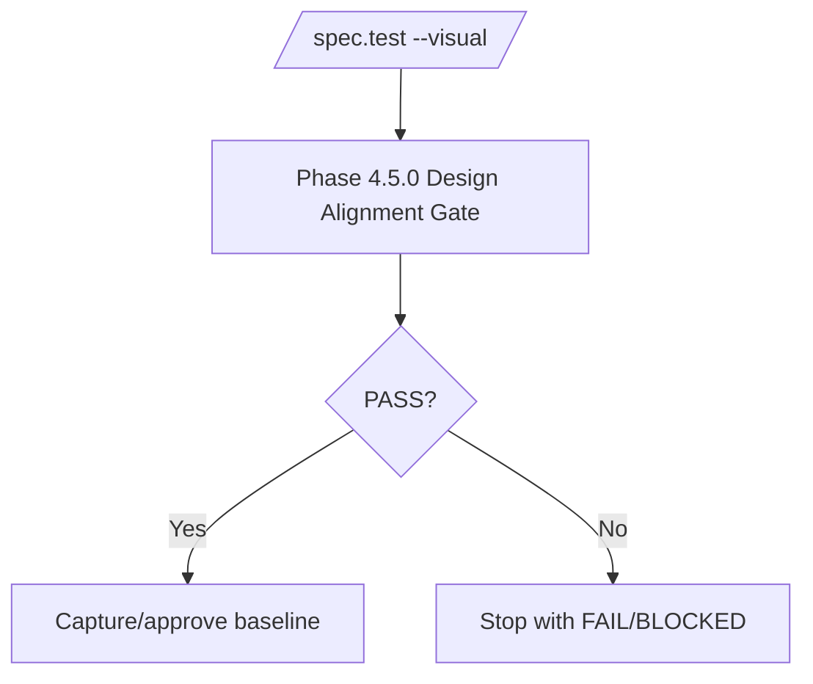

# Feature 047 - Design Alignment Gate

- **Feature Name:** Design Alignment Gate
- **Branch:** `feature/047-design-alignment-gate`
- **Date:** 2026-05-17
- **Status:** Implemented

## Input

Reuse the CloudSkill mockup-code alignment playbook as a global LiveSpec workflow. When a visual feature starts from a new or changed `ui.pen` mockup, `/spec.test --visual` must validate the implementation against the structured design source before approving a screenshot baseline. Divergences must surface as real `FAIL`/`BLOCKED` verdicts so orchestrators cannot report success when the UI is wrong.

## User Scenarios & Testing

### Story 1 (P1) - New mockup is aligned before baseline approval

**Description:** A developer adds a new screen in `.specs/design/ui.pen`. `/spec.test --visual` extracts a design contract, captures a runtime contract from the simulator/browser, checks support parity, compares component properties, and blocks baseline approval unless alignment passes.

**Priority reason:** A first screenshot baseline must not be bootstrapped from an implementation that diverges from the approved mockup.

**Independent test:** Run the design alignment comparator with matching design/runtime contracts and verify `Design Alignment Verdict: PASS`, manifest creation, and exit code 0.

```gherkin
Feature: Initial design alignment
  Scenario: Matching design and runtime pass
    Given `.specs/design/ui.pen` contains screen `dashboard`
    And   runtime capture contains the same support and node properties
    When  LiveSpec compares design to runtime
    Then  it emits `Design Alignment Verdict: PASS`
    And   writes a design-alignment manifest

  Scenario: Runtime diverges from design
    Given `.specs/design/ui.pen` expects button padding `12px 16px`
    And   runtime capture reports padding `8px 16px`
    When  LiveSpec compares design to runtime
    Then  it emits `Design Alignment Verdict: FAIL`
    And   reports the mismatched property
```



### Story 2 (P1) - Support mismatches are blocked, not accepted

**Description:** If Pencil uses a different frame, safe area, header, DPR, orientation, shape, or decorative device wrapper than the simulator export, LiveSpec must return `BLOCKED` before judging UI quality.

**Priority reason:** Comparing mismatched supports creates false failures or false approvals.

**Independent test:** Compare contracts with different frame size and verify `Design Alignment Verdict: BLOCKED` and exit code 2.

```gherkin
Feature: Support parity
  Scenario: Frame size mismatch blocks comparison
    Given the design support is `393x852`
    And   runtime support is `390x844`
    When  LiveSpec compares design to runtime
    Then  it emits `Design Alignment Verdict: BLOCKED`
    And   names the frame mismatch

  Scenario: Decorative shell blocks comparison
    Given the design support declares a rounded device shell
    When  LiveSpec compares design to a rectangular simulator export
    Then  it emits `Design Alignment Verdict: BLOCKED`
```



### Story 3 (P1) - `/spec.test --visual` exposes alignment verdicts

**Description:** `/spec.test --visual` must include a Design Alignment Gate before baseline capture for new or changed design sources, and `test.expectations.md` must require the verdict in visual runs.

**Priority reason:** CloudSkill and other orchestrators need a single canonical verdict source.

**Independent test:** Inspect `commands/test.md` and `commands/test.expectations.md` for `Phase 4.5.0`, `Design Alignment Verdict`, and artifact paths.

```gherkin
Feature: test command integration
  Scenario: Visual run includes design alignment
    Given `/spec.test --visual` is invoked for a feature with changed `ui.pen`
    When  Phase 4.5 begins
    Then  Phase 4.5.0 runs the Design Alignment Gate
    And   `FAIL` or `BLOCKED` prevents baseline approval
```



## Acceptance Criteria

- **AC-001** - LiveSpec has a reusable `system/testing/design-alignment.md` workflow derived from the CloudSkill playbook.
- **AC-002** - LiveSpec has a `system/testing/design-alignment-quality.md` quality contract for frame, DPR, safe-area, header, shape, orientation, fonts, and dynamic-data determinism.
- **AC-003** - LiveSpec has a `system/schemas/design-alignment-manifest.md` schema documenting provenance and verdict fields.
- **AC-004** - A Python module can compare a design contract extracted from `ui.pen` with a runtime contract and emit `PASS`, `FAIL`, or `BLOCKED`.
- **AC-005** - Support mismatches return `BLOCKED`, not `PASS` or warning-only.
- **AC-006** - Property/node mismatches return `FAIL` with actionable diff details.
- **AC-007** - Matching design/runtime contracts return `PASS` and write a manifest/report.
- **AC-008** - A CLI command exposes the comparator with exit codes 0/1/2 for PASS/FAIL/BLOCKED.
- **AC-009** - `/spec.test --visual` documents Phase 4.5.0 Design Alignment Gate before baseline capture.
- **AC-010** - `commands/test.expectations.md` requires `Design Alignment Verdict` for visual runs.

## Functional Requirements

- **FR-001** - Add global workflow docs under `system/testing/`.
- **FR-002** - Add manifest schema under `system/schemas/`.
- **FR-003** - Implement `validator.design_alignment` contract extraction, support checking, comparison, reporting, and manifest writing.
- **FR-004** - Add `livespec design-alignment compare` CLI.
- **FR-005** - Update `/spec.test` command docs to call the Design Alignment Gate.
- **FR-006** - Update `/spec.test` expectations for visual runs.
- **FR-007** - Add regression/unit tests for PASS, FAIL, BLOCKED, CLI exit codes, and command contract text.

## Key Entities

- **Design Contract:** Normalized representation of one screen from `ui.pen`.
- **Runtime Contract:** Normalized representation of the actual simulator/browser UI tree.
- **Support Contract:** Frame, DPR, safe-area, header/status bar, shape, orientation, fonts, and deterministic runtime conditions.
- **Design Alignment Verdict:** `PASS`, `FAIL`, or `BLOCKED`.
- **Design Alignment Manifest:** Provenance file tying `ui.pen` hash, runtime capture hash, support, screen, and verdict.

## Edge Cases

- `ui.pen` missing for a new visual screen: `BLOCKED`.
- Runtime contract missing: `BLOCKED`.
- Support mismatch: `BLOCKED`.
- Missing runtime node: `FAIL`.
- Mismatched color/spacing/font/radius: `FAIL`.
- Exact match or tolerated spacing variance: `PASS`.

## Success Criteria

- **SC-001** - Focused design alignment tests pass.
- **SC-002** - Expectations corpus still parses.
- **SC-003** - `/spec.test --visual` has no path that can approve a new/changing design baseline without `Design Alignment Verdict: PASS`.
