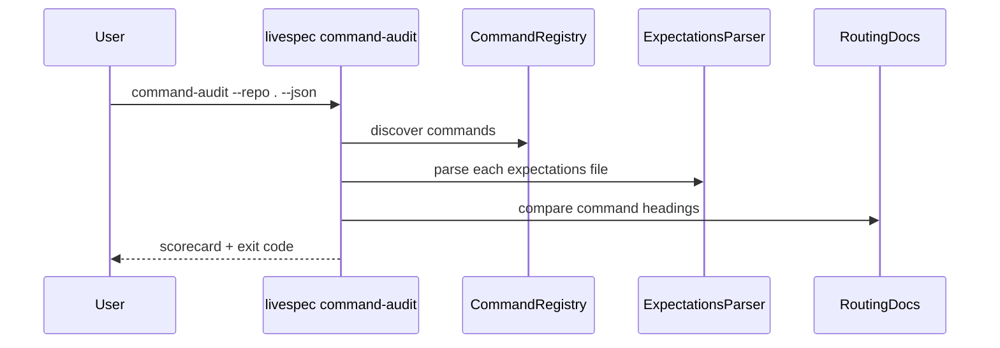
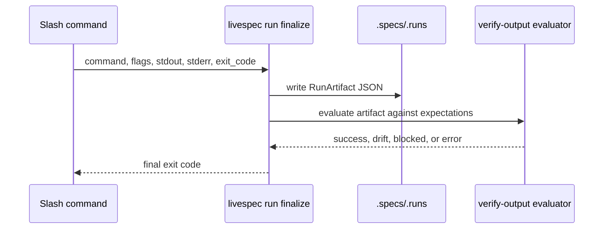
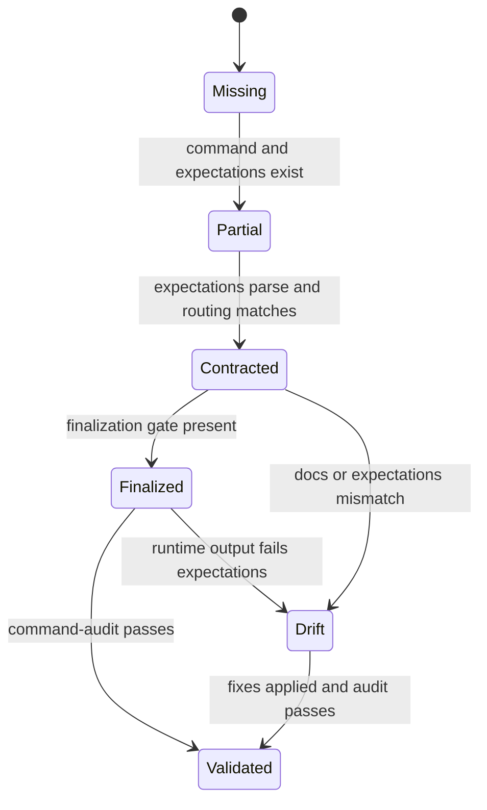
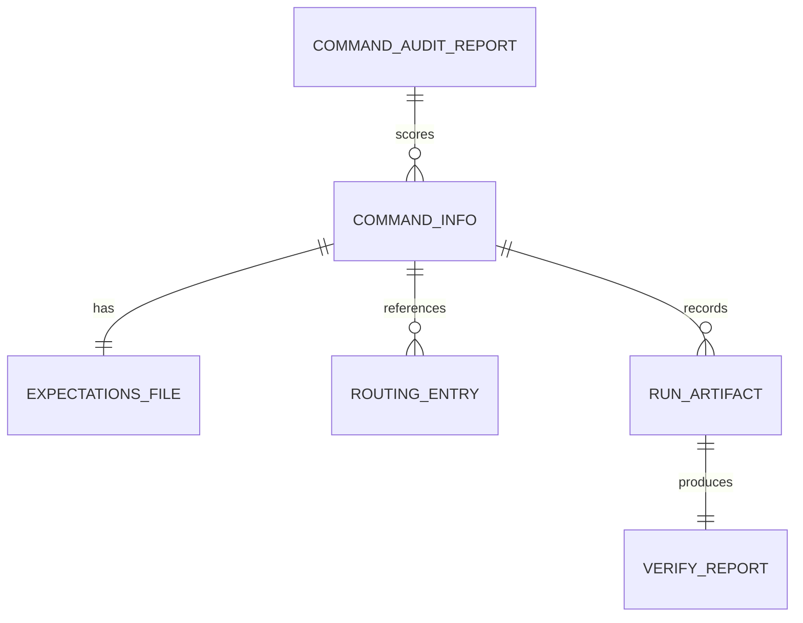

# Command Validation Hardening Plan

## Summary

Add a canonical command registry, deterministic command audit, mandatory RunArtifact finalization, stricter expectations contracts, deterministic utility command paths, and migration 14.

## Technical Context

- Language: Python 3.11+ for validator modules and Typer CLI.
- Shell: Bash compatibility scripts for install, link, coherence, and play-coverage.
- Testing: pytest, existing Typer `CliRunner`, integration fixtures.
- Storage: `.specs/`, `commands/`, `.claude/rules/`, `.specs/.runs/`.
- Existing primitives: `validator.expectations`, `validator.verify_output`, `validator.run_artifact`, `validator.integrations.valid_command_names`, `validator.coherence`, `validator.drivers.test_config`.

## Constitution Check

- Specs remain the source of truth: this plan is subordinate to `spec.md`.
- No command behavior changes without expectations updates.
- Every implementation file must include `@spec` anchors for FRs it implements.
- No broad rename is included here; Feature 049 owns command naming normalization.

## Gherkin Scenarios + Mermaid Sequence Diagrams

```gherkin
Feature: Command audit
  Scenario: All command contracts are aligned
    Given the command registry has discovered all slash commands
    When command-audit runs on the LiveSpec repo
    Then it validates command files, expectations, routing docs, hooks docs, and finalization gates
    And it exits 0 only when every command scores 5
```



```gherkin
Feature: Runtime finalization
  Scenario: Command run is recorded and verified
    Given a command has captured stdout, stderr, and exit code
    When livespec run finalize is called
    Then it writes a RunArtifact
    And evaluates that artifact against expectations
    And returns the verify-output outcome code
```



## Gherkin Scenarios + Mermaid State Diagrams

```gherkin
Feature: Command score state
  Scenario: Command moves from partial to validated
    Given a command has all required files but no finalization gate
    When the anti-drift block is updated and command-audit reruns
    Then the command state becomes Validated
```



## Mermaid ER Diagrams



## Implementation Plan

1. Create `validator/command_registry.py` and tests for exact 20-command discovery.
2. Create `validator/cli_commands/command_audit_cmd.py` and register it in `validator/cli.py`.
3. Replace `scripts/check-coherence.sh` command-count logic with `command-audit`.
4. Extend `validator/cli_commands/run_cmd.py` with `finalize`.
5. Update `system/anti-drift-block.md` and `system/expectations.md` to require finalization.
6. Strengthen all built-in expectations contracts and corpus tests.
7. Add deterministic `livespec status`.
8. Add deterministic `livespec play-coverage --once --json --no-open` and adapt the Bash wrapper.
9. Add deterministic `livespec conventions refresh`.
10. Fix stale docs in `system/spec-system.md`, `commands/spec-hooks.md`, `commands/spec-init.md`, `scripts/init.sh`, and routing checks.
11. Add Migration 14 and downstream integration tests.
12. Run the command audit and non-external regression suite.

Detailed task breakdown is captured in `docs/superpowers/plans/2026-05-17-command-validation-hardening.md`.

## Testing Strategy

| Layer | Command |
|---|---|
| Registry | `python3 -m pytest tests/test_command_registry.py -q` |
| Command audit | `python3 -m pytest tests/test_command_audit_cli.py -q` |
| Finalization | `python3 -m pytest tests/test_command_finalization_contract.py tests/test_run_artifact.py tests/test_verify_output.py -q` |
| Expectations | `python3 -m pytest tests/test_builtin_expectations_corpus.py tests/test_expectations.py -q` |
| Utility CLIs | `python3 -m pytest tests/test_status_cli.py tests/test_play_coverage_cli.py tests/test_conventions_cli.py -q` |
| Coherence | `bash scripts/check-coherence.sh` |
| Full local gate | `python3 -m pytest -m "not slow and not android and not macos"` |

## Risks & Considerations

- Some slash commands remain LLM-orchestrated; this feature validates their observable outputs instead of pretending to make generation deterministic.
- Enforcing finalization may expose existing weak expectations; strengthen contracts before turning the gate into a hard blocker.
- `verify-output` must avoid recursion when verifying itself.
- Migration 14 must be idempotent and must not overwrite project-local command overrides.
