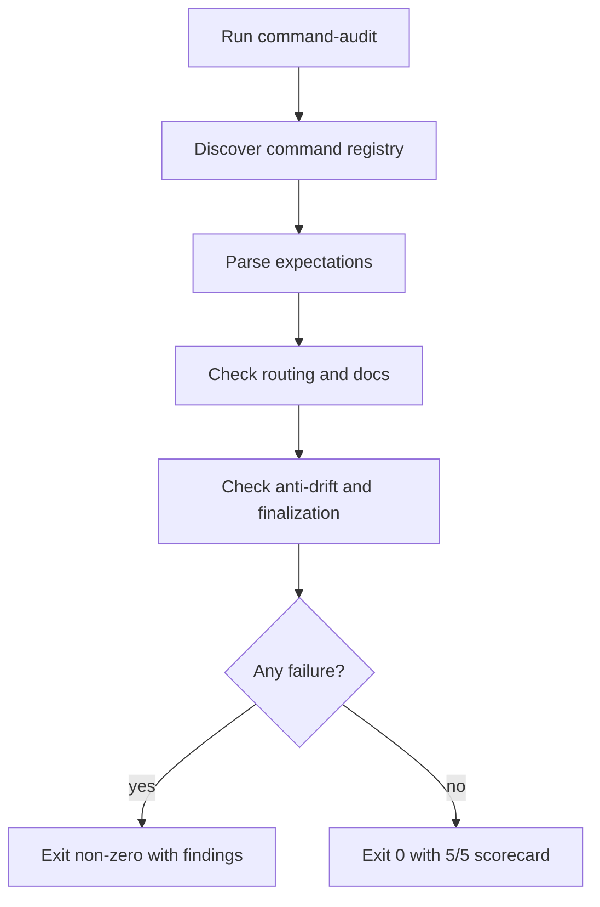
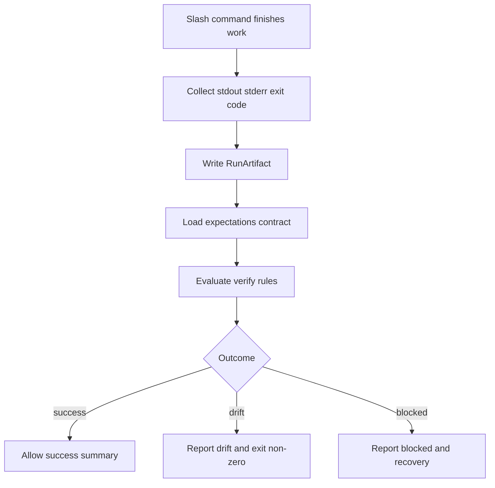
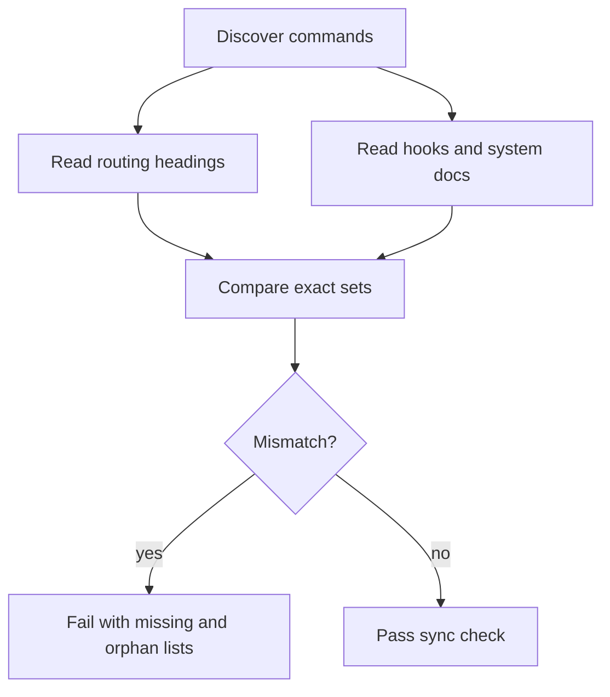
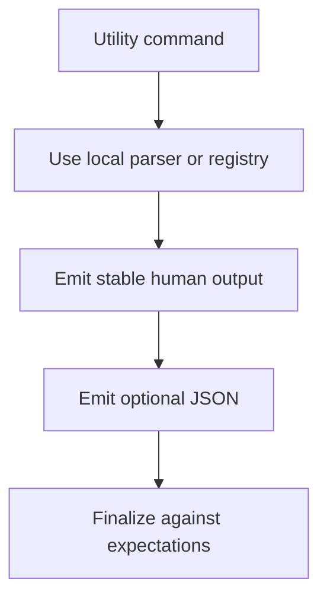

# Command Validation Hardening

## Branch

feature/048-command-validation-hardening

## Input

User requested an audit and correction plan so every LiveSpec slash command can be scored 5/5 for execution reliability and anti-drift. The command layer must stop relying only on LLM interpretation: each command needs deterministic contracts, run artifacts, verifiers, routing/docs sync checks, and a clear pass/fail audit.

This feature covers the validation hardening only. Command renaming from `/spec.*` to `/spec-*` is intentionally split into Feature 049 and must run after this feature.

## User Scenarios

### Story 1 - Maintainer audits all slash commands before release `P1`

A LiveSpec maintainer runs a single deterministic audit and gets a command-by-command scorecard. The audit fails if any command is missing its command file, expectations file, routing entry, anti-drift import, finalization gate, or stable verifier rule.

**Priority reason:** Without one authoritative audit, command quality depends on manual review and stale lists.

**Independent test:** Run `livespec command-audit --repo . --json` and verify all 20 commands score 5.

```gherkin
Feature: Deterministic command audit
  Scenario: Current repository passes command audit
    Given the LiveSpec repository has 20 command markdown files
    And each command has a matching expectations contract
    When the maintainer runs "livespec command-audit --repo . --json"
    Then the command exits with code 0
    And the JSON report contains 20 commands
    And every command has score 5
```



### Story 2 - Operator verifies real command output, not intent `P1`

After any `/spec.*` command runs, LiveSpec records a `RunArtifact` and verifies it against `commands/<name>.expectations.md` before reporting success. Drift or missing artifacts block success even if the LLM summary claims the command succeeded.

**Priority reason:** This is the core safeguard against LLM-only interpretation.

**Independent test:** Run a fake passing and failing command through `livespec run finalize` and verify success, drift, and blocked outcomes.

```gherkin
Feature: Runtime finalization
  Scenario: Command output matches expectations
    Given a command produced stdout, stderr, and exit code 0
    And its expectations require exit code 0 and a stable success marker
    When the command finalizes through "livespec run finalize"
    Then a RunArtifact is written under ".specs/.runs/"
    And verify-output returns success
    And the slash command may report success

  Scenario: Command output drifts from expectations
    Given a command exits 0 but omits a required success marker
    When the command finalizes through "livespec run finalize"
    Then verify-output returns drift
    And the slash command must not report success
```



### Story 3 - Maintainer catches stale command documentation automatically `P1`

Command names are discovered from one registry. Routing docs, hooks docs, install scripts, init snippets, expectations, and command files must stay synchronized. Stale hardcoded lists fail CI.

**Priority reason:** The repository already has stale command counts and stale coherence logic; this must not recur.

**Independent test:** Delete a routing entry or expectations file in a fixture and verify `command-audit` fails with a precise diagnostic.

```gherkin
Feature: Command registry synchronization
  Scenario: Routing docs miss a command
    Given the command registry includes "verify-output"
    And the routing docs omit "verify-output"
    When the maintainer runs command-audit
    Then the audit exits non-zero
    And the output lists "verify-output" as missing from routing docs
```



### Story 4 - Utility commands have deterministic backends `P2`

Low-score utility commands such as `/spec.status`, `/spec.play-coverage`, and `/spec.refresh-conventions` get local deterministic CLI paths or explicit deterministic gates. Their expectations match actual behavior.

**Priority reason:** These commands were the clearest gaps in the audit; they are small enough to make deterministic.

**Independent test:** Run their CLI tests without external services and verify stable summary lines and JSON where applicable.

```gherkin
Feature: Deterministic utility commands
  Scenario: Status command emits machine-readable output
    Given a project with a ".specs/" directory
    When the operator runs "livespec status --json"
    Then the command exits with code 0
    And the JSON contains roadmap, features, and gaps
    And stdout includes "LIVESPEC status"
```



## Acceptance Criteria

- **AC-001** - A canonical command registry reports exactly the same command set as `commands/*.md` excluding `*.expectations.md`.
- **AC-002** - Every command has `commands/<name>.md`, `commands/<name>.expectations.md`, Section 13, `must_not: Traceback`, and at least one `exit_code` verify rule.
- **AC-003** - Every command imports `system/anti-drift-block.md` and inherits a mandatory finalization gate.
- **AC-004** - `.claude/rules/livespec-commands.md`, `commands/spec-hooks.md`, `system/spec-system.md`, `commands/spec-init.md`, `scripts/init.sh`, `scripts/install.sh`, and `scripts/link-local.sh` are synchronized with the registry.
- **AC-005** - `livespec command-audit --repo .` exits 0 on the current repo and non-zero on fixtures with missing expectations, stale routing entries, or missing finalization gates.
- **AC-006** - `scripts/check-coherence.sh` delegates command consistency to the deterministic command audit and exits 0 on the current repo.
- **AC-007** - `livespec run finalize` writes a RunArtifact and immediately verifies it against expectations.
- **AC-008** - A slash command must not report success when finalization returns drift or blocked.
- **AC-009** - `/spec.status`, `/spec.play-coverage`, and `/spec.refresh-conventions` have deterministic CLI-backed paths or explicit deterministic gates.
- **AC-010** - `/spec.play-coverage` expectations match the actual implementation; no false artifact/server claims remain.
- **AC-011** - A JSON scorecard can show every command at score 5 with explicit evidence fields.
- **AC-012** - Migration 14 backfills downstream projects idempotently.
- **AC-013** - The broad non-external test suite passes after the hardening work.

## Functional Requirements

- **FR-001** - Implement `validator.command_registry` with dynamic command discovery, metadata, and routing-heading parsing.
- **FR-002** - Implement `livespec command-audit` with human and JSON output.
- **FR-003** - Extend `livespec run` with `finalize` to record and verify command runs in one operation.
- **FR-004** - Update `system/anti-drift-block.md` so all slash commands require finalization before success.
- **FR-005** - Strengthen the expectations corpus so every built-in command has an exit-code rule and stable command-specific signals.
- **FR-006** - Replace obsolete command-count logic in `scripts/check-coherence.sh`.
- **FR-007** - Add deterministic CLI support for status reporting.
- **FR-008** - Add deterministic CLI support for play-coverage including a no-browser JSON mode.
- **FR-009** - Add deterministic fallback support for refreshing conventions.
- **FR-010** - Update stale command-list documentation and routing checks to use or verify the registry.
- **FR-011** - Add tests for clean and broken command-audit cases.
- **FR-012** - Add Migration 14 for downstream projects.
- **FR-013** - Keep Feature 049 command renaming out of this feature except for compatibility hooks required by the future rename.

## Key Entities

| Entity | Description |
|---|---|
| CommandRegistry | Canonical discovered list of LiveSpec slash commands. |
| CommandInfo | Metadata for one command: files, bootstrap/local link mode, expectations, routing state, score. |
| CommandAuditReport | Human/JSON report with per-command evidence and score. |
| RunArtifact | Existing runtime record for stdout, stderr, exit code, cwd, git state, and filesystem changes. |
| FinalizationResult | Result of recording and verifying one command invocation. |

## Edge Cases

- A command file exists without expectations: audit fails.
- An expectations file exists without command file: audit reports an orphan sidecar.
- Routing docs include a command heading no longer present on disk: audit fails.
- `verify-output` validates itself: command must be wrapped or finalized without recursion.
- A command exits 0 but omits required output: finalization returns drift.
- A command fails before writing an artifact: finalization returns blocked with recovery.
- Downstream project has old `.claude/commands/spec.*.expectations.md` symlinks: migration removes them.
- Project-specific `.specs/expectations/<command>.md` overrides remain total replacements and must still parse.

## Success Criteria

- **SC-001** - `python3 -m validator.cli command-audit --repo . --json` exits 0 and reports 20 commands with score 5.
- **SC-002** - `bash scripts/check-coherence.sh` exits 0.
- **SC-003** - The expectations corpus tests pass with stricter exit-code and finalization assertions.
- **SC-004** - Runtime finalize tests cover success, drift, and blocked.
- **SC-005** - Utility CLI tests cover `status`, `play-coverage`, and `conventions refresh`.
- **SC-006** - Migration 14 integration tests prove idempotency.

*Generated by `/spec.feature --auto` equivalent workflow on 2026-05-18.*
