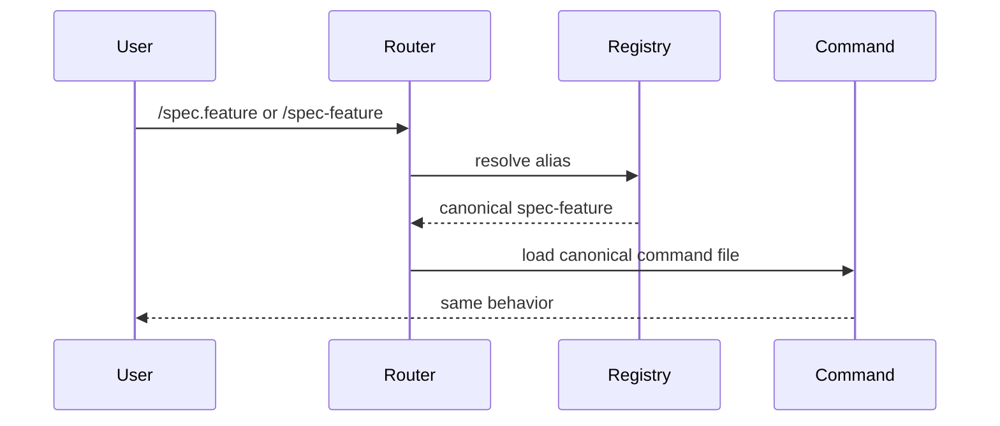
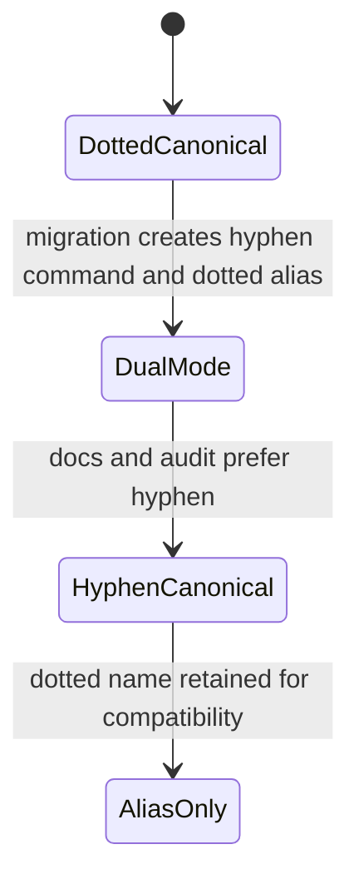
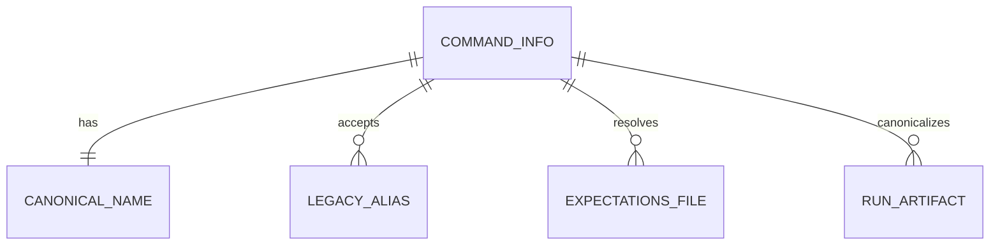

# Command Naming Normalization Plan

## Summary

After Feature 048 is complete, rename command entry points from dotted `/spec.*` names to hyphenated `/spec-*` names with backward-compatible aliases, alias-aware validators, and Migration 15.

## Technical Context

- Depends on Feature 048 command registry and command-audit.
- Affects command symlinks, routing docs, expectations lookup, run artifacts, hooks, integrations, docs, migrations, and tests.
- Must be non-breaking for installed projects.

## Constitution Check

- This feature is intentionally last because it is a naming migration with broad compatibility risk.
- Dotted names are not removed in this feature; they become legacy aliases.
- Deterministic command audit from Feature 048 remains the release gate.

## Gherkin Scenarios + Mermaid Sequence Diagrams

```gherkin
Feature: Alias resolution
  Scenario: Dotted and hyphenated command names resolve to one identity
    Given the registry has canonical command "spec-feature"
    And legacy alias "spec.feature"
    When a user invokes either spelling
    Then LiveSpec resolves the same command file and expectations file
```



## Gherkin Scenarios + Mermaid State Diagrams

```gherkin
Feature: Rename lifecycle
  Scenario: Command moves from dotted canonical to hyphenated canonical
    Given a command is currently canonical as dotted
    When Migration 15 runs
    Then the hyphenated name becomes canonical
    And the dotted name remains a legacy alias
```



## Mermaid ER Diagrams



## Implementation Plan

1. Extend `validator.command_registry` with canonical names and legacy aliases.
2. Add alias normalization tests for all 20 commands.
3. Update command linking to create `/spec-*` symlinks while preserving `/spec.*`.
4. Update routing docs and install/init docs to prefer `/spec-*`.
5. Update `verify-output`, `run finalize`, hooks, and integrations to resolve aliases.
6. Update command-audit with `--naming-policy hyphenated`.
7. Add Migration 15 for downstream projects.
8. Rename `commands/*.md` and `commands/*.expectations.md` to the canonical `commands/spec-*.md` shape and enforce that source filename rule in command-audit.
9. Run Feature 048 audit after the rename to prove no validation regression.

## Testing Strategy

| Gate | Command |
|---|---|
| Alias registry | `python3 -m pytest tests/test_command_aliases.py -q` |
| Linking migration | `python3 -m pytest tests/integration/test_migration_v15.py -q` |
| Verify compatibility | `python3 -m pytest tests/test_verify_output_cli.py tests/test_command_finalization_contract.py -q` |
| Naming audit | `python3 -m validator.cli command-audit --repo . --naming-policy hyphenated` |
| Regression | `python3 -m pytest -m "not slow and not android and not macos"` |

## Risks & Considerations

- Slash command naming may be constrained by the host client; verify symlink naming behavior before removing any dotted alias.
- Artifact compatibility is critical because historical `.specs/.runs/` files may use old names.
- User integrations with `commands: [check]` may not need changes; integrations with full slash names do.
- Do not start this feature until Feature 048 reports every command at score 5.
