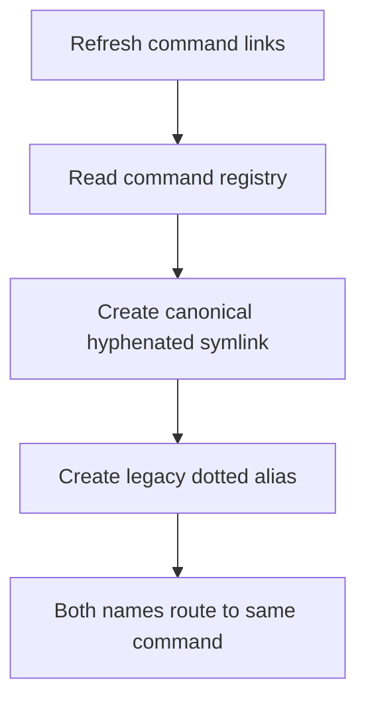
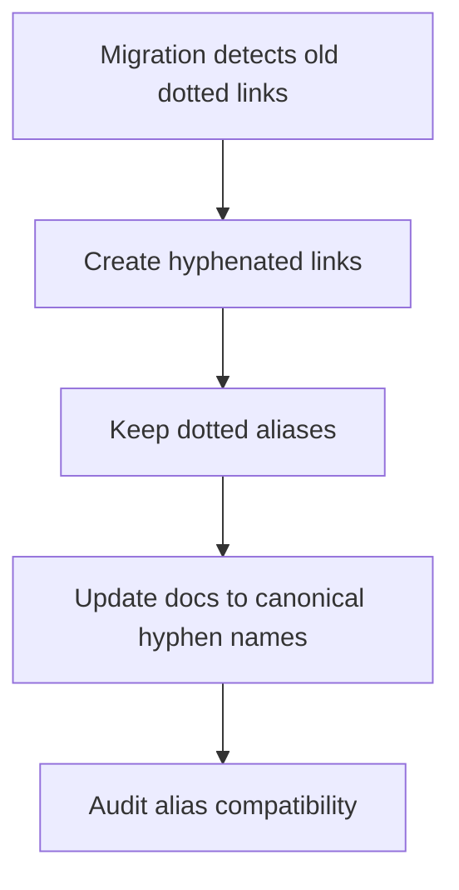
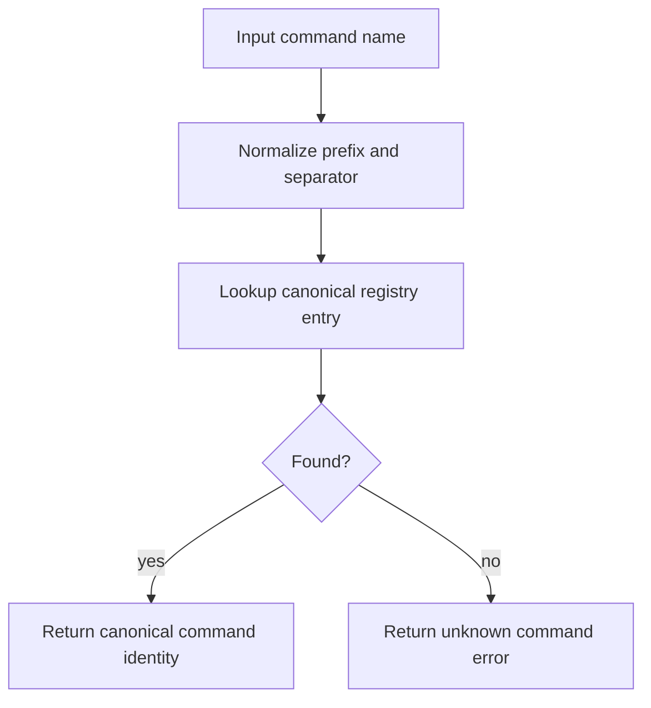
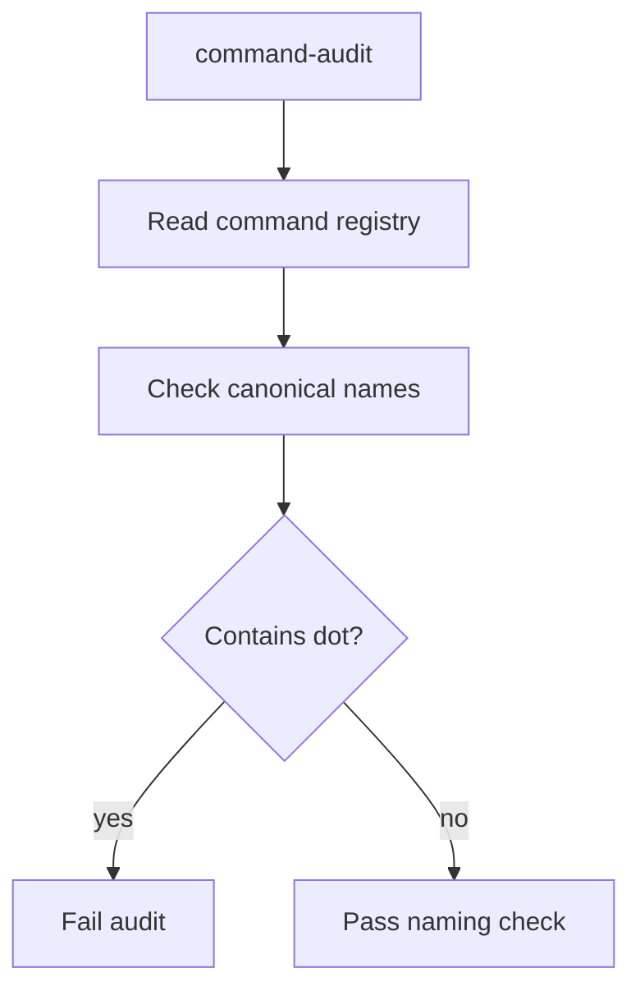

# Command Naming Normalization

## Branch

feature/049-command-naming-normalization

## Input

User confirmed that command renaming must be a separate feature and run last. The desired target is to rename slash commands from dotted names such as `/spec.check`, `/spec.explain`, and `/spec.feature` to hyphenated names such as `/spec-check`, `/spec-explain`, and `/spec-feature` to align with the preferred command naming norm.

Follow-up clarification: the canonical command name itself must carry the `spec-` prefix. For example, the `check` command is canonically named `spec-check`, and its source files must be `commands/spec-check.md` and `commands/spec-check.expectations.md`. The short name `check` is accepted only as compatibility input and is normalized to `spec-check`.

This feature depends on Feature 048. It must not start implementation until command validation hardening is complete and every existing command scores 5/5.

## User Scenarios

### Story 1 - User invokes the new hyphenated command names `P1`

A user runs `/spec-feature --auto "..."` instead of `/spec.feature --auto "..."`. LiveSpec routes the command to the same command definition and produces the same observable behavior.

**Priority reason:** The rename is only useful if the new names become first-class entry points.

**Independent test:** Link commands in a fixture project and verify `.claude/commands/spec-feature.md` exists and points to the feature command.

```gherkin
Feature: Hyphenated command entry points
  Scenario: Feature command is available under the new name
    Given a project initialized with LiveSpec
    When local command symlinks are refreshed
    Then ".claude/commands/spec-feature.md" exists
    And it points to the canonical feature command
    And the legacy ".claude/commands/spec.feature.md" remains available during migration
```



### Story 2 - Existing projects do not break during migration `P1`

Projects with old `/spec.*` command links keep working. LiveSpec emits guidance that dotted names are legacy aliases, while new docs prefer hyphenated names.

**Priority reason:** A pure rename would break installed projects, hooks, docs, overrides, and user habits.

**Independent test:** Run migration on a fixture with old dotted symlinks and verify both old and new command names work.

```gherkin
Feature: Backward compatible command aliases
  Scenario: Legacy dotted command remains available
    Given a project has ".claude/commands/spec.check.md"
    When Migration 15 runs
    Then ".claude/commands/spec-check.md" is created
    And ".claude/commands/spec.check.md" remains as a legacy alias
    And the migration reports no destructive rename
```



### Story 3 - Validators understand canonical names and aliases `P1`

The command registry stores a canonical hyphenated command name plus legacy dotted aliases. Expectations, run artifacts, verify-output, hooks, and integrations resolve aliases to the canonical command identity.

**Priority reason:** Without alias-aware validators, reports and artifacts would fragment across two command names.

**Independent test:** Verify `spec.check`, `spec-check`, `/spec.check`, and `/spec-check` all resolve to the same command identity.

```gherkin
Feature: Alias-aware command registry
  Scenario: Dotted and hyphenated names resolve together
    Given the command registry includes "spec-check"
    And "spec.check" is a legacy alias
    When a verifier resolves either name
    Then it returns the same command identity
    And run artifacts use the canonical command name
    And legacy artifact prefixes remain readable
```



### Story 4 - New command additions cannot use dotted canonical names `P2`

After the migration, new commands must be added with hyphenated canonical names. Dotted names are allowed only as declared legacy aliases.

**Priority reason:** The naming norm must be enforced or drift will return.

**Independent test:** Add a fixture command with a dotted canonical name and verify command-audit fails.

```gherkin
Feature: Command naming audit
  Scenario: New dotted canonical command is rejected
    Given a new command file declares a dotted canonical command name
    When command-audit runs
    Then the audit exits non-zero
    And the report says canonical command names must use hyphens
```



## Acceptance Criteria

- **AC-001** - Every current `/spec.<name>` command has a canonical `/spec-<name>` command entry.
- **AC-002** - Dotted `/spec.<name>` commands remain available as legacy aliases during the migration window.
- **AC-003** - The command registry exposes `canonical_name`, `legacy_aliases`, and alias resolution.
- **AC-004** - `livespec verify-output`, `livespec run finalize`, hooks, integrations, and command-audit resolve dotted and hyphenated names to the same identity.
- **AC-005** - Local linking creates hyphenated command symlinks and preserves dotted aliases.
- **AC-006** - Documentation prefers hyphenated names and marks dotted names as legacy aliases.
- **AC-007** - Migration 15 updates downstream projects idempotently.
- **AC-008** - New command canonical names with dots are rejected by command-audit.
- **AC-009** - Run artifacts normalize dotted and hyphenated slash aliases to the canonical `spec-<name>` command name while preserving read compatibility with existing short-name artifact filenames.
- **AC-010** - Feature 048 command validation must pass before this feature implementation starts.
- **AC-011** - Every command source file and expectation sidecar in `commands/` uses the exact canonical command name: `commands/spec-<name>.md` and `commands/spec-<name>.expectations.md`.

## Functional Requirements

- **FR-001** - Extend the command registry with canonical `spec-<name>` names and legacy aliases.
- **FR-002** - Add alias normalization for inputs like `spec.check`, `/spec.check`, `spec-check`, and `/spec-check`.
- **FR-003** - Update command linking to create canonical hyphenated symlinks and legacy dotted aliases.
- **FR-004** - Update routing docs and command references to prefer `/spec-*`.
- **FR-005** - Update `verify-output` and `run finalize` to resolve aliases before locating expectations and artifacts.
- **FR-006** - Update hook and integration resolution to accept aliases but store canonical names.
- **FR-007** - Add command-audit rules rejecting new dotted canonical names.
- **FR-008** - Add Migration 15 for downstream symlink/doc/gitignore compatibility.
- **FR-009** - Preserve project-specific expectations overrides through alias resolution.
- **FR-010** - Add tests for every current command alias pair.
- **FR-011** - Enforce canonical `commands/spec-*.md` and `commands/spec-*.expectations.md` source filenames in command-audit.

## Key Entities

| Entity | Description |
|---|---|
| CanonicalCommandName | Hyphenated slash command identity, e.g. `spec-feature`. |
| LegacyCommandAlias | Dotted compatibility alias, e.g. `spec.feature`. |
| CommandAliasMap | Registry mapping aliases to canonical command identities. |
| Migration15Report | Summary of downstream command links created, preserved, or skipped. |

## Edge Cases

- Command names that already contain hyphens, such as `refresh-conventions`, must normalize predictably to `/spec-refresh-conventions`.
- `verify-output` itself becomes `/spec-verify-output` with `/spec.verify-output` as alias.
- Existing `.specs/expectations/<name>.md` overrides may use the old undotted basename; alias resolution must find them.
- Old `.specs/.runs/<command>-*.json` artifacts must remain verifiable.
- User-level integrations listing old command names must continue to apply during migration.
- Hook files named `before-check.md` may not need renaming because hook command names are command basenames, not slash syntax; audit must define the rule explicitly.

## Success Criteria

- **SC-001** - `livespec command-audit --repo . --naming-policy hyphenated` exits 0 after migration.
- **SC-002** - Every current command has a tested dotted alias and hyphenated canonical name.
- **SC-003** - Migration 15 is idempotent and non-destructive.
- **SC-004** - Documentation no longer presents dotted names as canonical.
- **SC-005** - Feature 048 audit remains green after the rename.

*Generated by `/spec.feature --auto` equivalent workflow on 2026-05-18. Planned last by explicit user request.*
