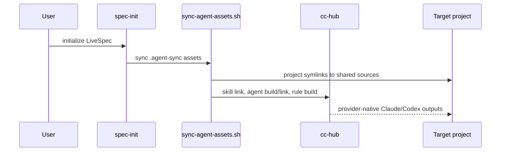

# Plan - Agent Sync Migration

## Summary

Move command, agent, and rule sources to `.agent-sync/`, then make every
installation and downstream migration call `cc-hub` instead of writing provider
symlinks by hand.

## Technical Context

| Area | Choice |
|---|---|
| Shell integration | Bash scripts wrapping `cc-hub` |
| Python validation | `validator.command_registry`, `validator.command_audit`, expectations lookup |
| Tests | pytest with fake `cc-hub` executable in `tmp_path/bin` |
| Source layout | `.agent-sync/skills`, `.agent-sync/agents`, `.agent-sync/rules` |

## Constitution Check

- Specs first: this feature owns the behavior change.
- Deterministic verification: fake `cc-hub` tests assert actual subprocess arguments.
- No provider-specific source of truth: Claude/Codex outputs are generated by `cc-hub`.

## Implementation Plan

1. Add failing tests for `.agent-sync` layout, command discovery, sync script, installer, migration 16, and hook enforcement.
2. Generate `.agent-sync/skills` from existing command files through `cc-hub migrate command`.
3. Move expectations into each skill as `expectations.md`.
4. Create `.agent-sync/agents` and `.agent-sync/rules`.
5. Add `scripts/sync-agent-assets.sh` and make `link-local.sh` delegate to it.
6. Update `install.sh`, `init.sh`, and migration 16 to call the sync script or `cc-hub` directly.
7. Update Python registry/audit/expectations/hook code to use agent-sync paths.
8. Update active docs and remove `commands/` and `agents/` source folders.
9. Run full verification and commit.

## Testing Strategy

| Gate | Command |
|---|---|
| Layout | `python3 -m pytest tests/test_agent_sync_layout.py -q` |
| Scripts | `python3 -m pytest tests/test_agent_sync_scripts.py tests/integration/test_migration_v16_agent_sync.py -q` |
| Registry/audit | `python3 -m pytest tests/test_command_registry.py tests/test_command_audit_cli.py -q` |
| Full | `ruff check . && python3 -m pytest -q` |
| Command audit | `python3 -m validator.cli command-audit --repo . --naming-policy hyphenated --json` |
| Coherence | `bash scripts/check-coherence.sh` |

## Risks & Considerations

- `cc-hub` default scopes differ per subcommand, so scripts must pass explicit
  `--scope` and `--targets`.
- Migration cleanup must only remove symlinks owned by LiveSpec, never regular
  files created by a user.
- `.agent-sync.local/` must be applied from the target project, not copied from
  the LiveSpec repo.
