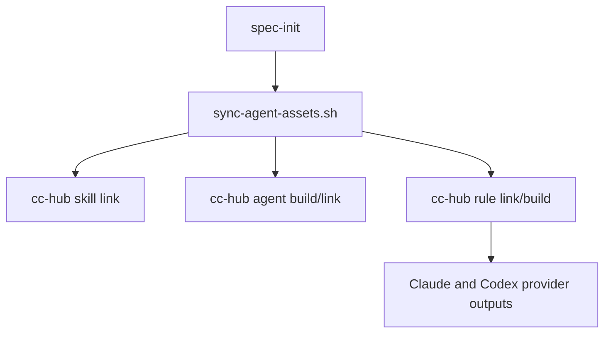
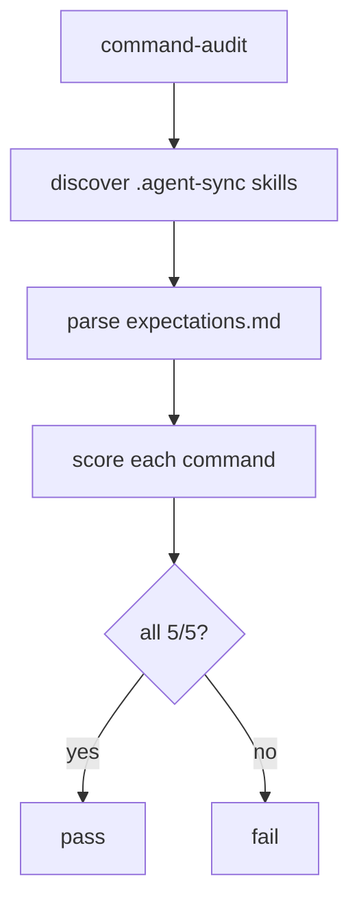
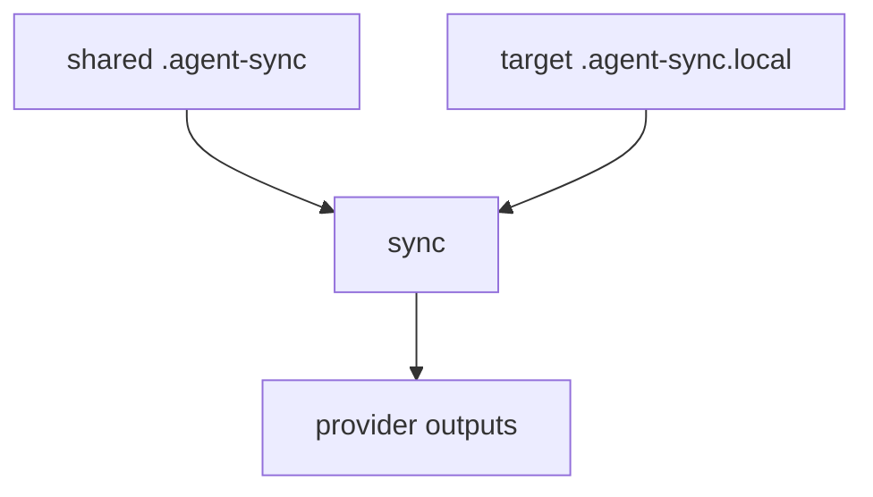

# Feature 050 - Agent Sync Migration

## Input

Migrate LiveSpec from Claude-only `commands/` and `agents/` source folders to a
portable `.agent-sync/` source model shared by Claude Code and Codex. All
installation, initialization, and migrations must use `cc-hub` to produce or
link provider-native outputs. Target-project LiveSpec links must live under
`.agent-sync.local/`.

## User Scenarios & Testing

### User Story 1 - Project initialization installs portable assets (P1)

As a LiveSpec user, I want `/spec-init` to install skills, agents, and rules for
Claude and Codex from `.agent-sync/`, so each project receives the same portable
LiveSpec runtime without manual symlink logic.

**Independent test:** Run `scripts/link-local.sh` or migration 16 against a fake
project with a fake `cc-hub` executable and verify the emitted `cc-hub` calls.

```gherkin
Feature: Agent sync project initialization
  Scenario: Sync project assets through cc-hub
    Given a LiveSpec checkout with .agent-sync assets
    And a project with .specs initialized
    When LiveSpec syncs agent assets for the project
    Then cc-hub links every spec skill for Claude and Codex
    And cc-hub builds and links every LiveSpec agent
    And cc-hub builds the LiveSpec rules
```



### User Story 2 - Command validation audits skills (P1)

As a maintainer, I want command validation to read `.agent-sync/skills/spec-*`,
so the 5/5 audit verifies the real production source instead of obsolete
`commands/` files.

**Independent test:** `livespec command-audit --repo . --naming-policy
hyphenated --json` reports 20 commands, failed 0, score 5.

```gherkin
Feature: Command audit from skills
  Scenario: Audit canonical skill sources
    Given LiveSpec commands are stored as agent-sync skills
    When I run command-audit
    Then every spec-* skill reaches score 5
    And missing SKILL.md or expectations.md files fail the audit
```



### User Story 3 - Local project-only assets stay local (P2)

As a LiveSpec maintainer, I want `.agent-sync.local/` for project-only skills,
rules, or agents, so local project assets stay out of shared/global
`.agent-sync/` roots.

**Independent test:** sync applies `.agent-sync.local/` only to the target
project and provider outputs point to that local root.

```gherkin
Feature: Local-only agent sync overlays
  Scenario: Local root receives project assets
    Given LiveSpec built-in assets are synced into a target project
    When LiveSpec syncs agent assets
    Then local assets are linked under .agent-sync.local
    And provider outputs point to .agent-sync.local
```



## Acceptance Criteria

- **AC-001** - The LiveSpec repo contains exactly 20 canonical command skills in `.agent-sync/skills/spec-*`.
- **AC-002** - Each command skill has `SKILL.md` and `expectations.md` with matching `command: spec-*` identity.
- **AC-003** - The four LiveSpec agents exist under `.agent-sync/agents/<name>/{agent.yaml,prompt.md}`.
- **AC-004** - LiveSpec rules exist under `.agent-sync/rules/livespec/` and can be built for Claude and Codex through `cc-hub`.
- **AC-005** - `scripts/link-local.sh` no longer creates manual `.claude/commands` or `.claude/agents` symlinks; it delegates to the cc-hub sync script.
- **AC-006** - `scripts/install.sh` bootstraps only `spec-init` and `spec-migrate` globally through `cc-hub`; all other skills, agents, and rules remain project-scoped via `/spec-init`.
- **AC-007** - Migration 16 syncs agent-sync assets through `cc-hub`, removes only LiveSpec-managed legacy symlinks, keeps project assets under `.agent-sync.local/`, and sets version 16.
- **AC-008** - Command registry, expectations lookup, integrations, previews, and command-audit use `.agent-sync/skills` as the production source.
- **AC-009** - `.agent-sync.local/` is applied only as a target-project local root.
- **AC-010** - Active docs and routing instructions describe `.agent-sync` as the source and do not present `commands/` or `agents/` as canonical.
- **AC-011** - `command-audit` returns 20 commands, failed 0, score 5.
- **AC-012** - Full deterministic verification passes: ruff, pytest, command-audit, coherence, and feature artifact validation.

## Functional Requirements

- **FR-001** - Convert every `commands/spec-*.md` file into `.agent-sync/skills/spec-*/SKILL.md`.
- **FR-002** - Move every `commands/spec-*.expectations.md` file into `.agent-sync/skills/spec-*/expectations.md`.
- **FR-003** - Convert every `agents/livespec-*.md` file into `.agent-sync/agents/<name>/prompt.md` plus `agent.yaml`.
- **FR-004** - Convert LiveSpec rules into `.agent-sync/rules/livespec/*.md`.
- **FR-005** - Add a cc-hub-based sync script used by init, install, link-local, and migrations.
- **FR-006** - Add Migration 16 for downstream projects.
- **FR-007** - Update Python registry and audit surfaces to read command skills.
- **FR-008** - Update last_reviewed enforcement to track skill source and expectations files.
- **FR-009** - Update active docs and system references.
- **FR-010** - Remove obsolete `commands/` and `agents/` source folders after all tests point at `.agent-sync`.

## Key Entities

| Entity | Description |
|---|---|
| AgentSyncSkill | Portable command source in `.agent-sync/skills/spec-*/SKILL.md`. |
| AgentSyncAgent | Portable agent source in `.agent-sync/agents/<name>/`. |
| AgentSyncRule | Portable rule source in `.agent-sync/rules/livespec/*.md`. |
| LocalOverlay | Target-project `.agent-sync.local/` assets generated from shared LiveSpec assets. |

## Edge Cases

- A downstream project may contain old LiveSpec symlinks and must not lose user-owned regular files.
- `cc-hub` may be absent; scripts must fail with a clear message.
- Dotted aliases remain accepted as legacy inputs even though skill names are hyphenated.
- Historical docs may mention `commands/`, but active system docs must not define it as source.

## Success Criteria

- **SC-001** - `python3 -m validator.cli command-audit --repo . --naming-policy hyphenated --json` reports score 5 and failed 0.
- **SC-002** - `python3 -m pytest -q` passes.
- **SC-003** - A fake-project migration 16 test proves real `cc-hub` command invocation contracts without touching global user config.
- **SC-004** - `rg` checks show no active manual symlink flow remains for `.claude/commands` or `.claude/agents`.
