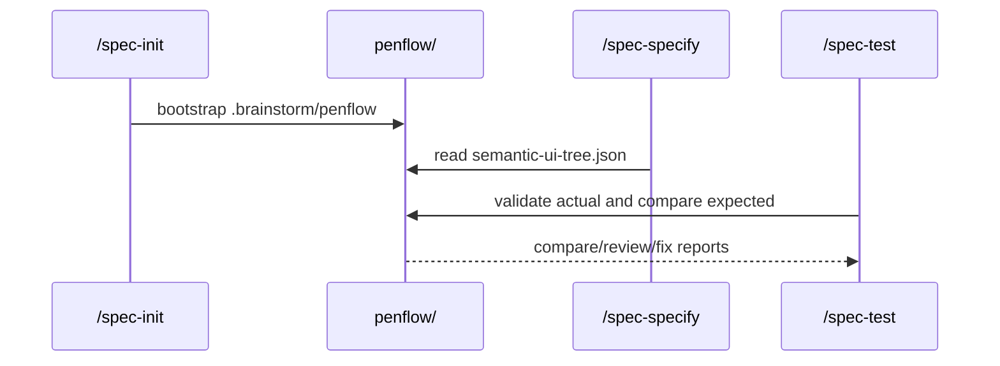

# Plan — Feature 051: Integrate Penflow as LiveSpec Primary UI Contract

**Status:** Approved
**Date:** 2026-05-21

## Summary

Add a deterministic root `penflow/` contract helper and wire LiveSpec command instructions so Penflow owns UI flow correctness while existing screenshot gates remain visual regression checks.

## Technical Context

- **Language:** CPython 3.12+
- **CLI:** Typer via `validator.cli`
- **Docs:** `.agent-sync/skills/spec-*`, README, feature audit
- **Tests:** pytest and command-contract tests
- **External tool:** `penflow` CLI invoked by instructions only; no runtime adapter implemented in LiveSpec core

## Constitution Check

- Local-first: all Penflow artifacts live in the target project root.
- Deterministic: helper reports file status without LLM or screenshots.
- Non-destructive: `.brainstorm/penflow/` never overwrites existing `penflow/`.
- Separation of concerns: Penflow checks structure/contract; Playwright/simulators keep screenshot regression.

## Implementation Plan

1. Add `validator/penflow_contract.py` with workspace status and brainstorm bootstrap helpers.
2. Add `livespec penflow-contract` CLI for `status` and `bootstrap` operations.
3. Register the CLI in `validator/cli_commands/__init__.py`.
4. Update `/spec-init`, `/spec-specify`, `/spec-plan`, `/spec-implement`, `/spec-test`, and `/spec-check` command docs.
5. Add `system/testing/penflow-contract.md` as the canonical workflow reference.
6. Update README project structure and visual/contract language.
7. Add tests for helper behavior, CLI output, and command docs.
8. Update implementation mapping, changelogs, and registry.

## Testing Strategy

| Area | Command |
|---|---|
| Helper and CLI | `python3 -m pytest tests/test_penflow_contract.py -q` |
| Command docs | `python3 -m pytest tests/test_penflow_contract_command_contract.py -q` |
| Existing command audit | `livespec command-audit --repo . --json` |
| Focused full regression | `python3 -m pytest tests/test_penflow_contract.py tests/test_penflow_contract_command_contract.py tests/test_command_audit_cli.py -q` |

## Risks & Considerations

- Penflow CLI may be absent in downstream projects; status must report missing artifacts without crashing.
- Actual runtime adapters remain external; LiveSpec must not generate `actual-ui-tree.json`.
- Legacy `.specs/flows` users need fallback behavior until migrated.
