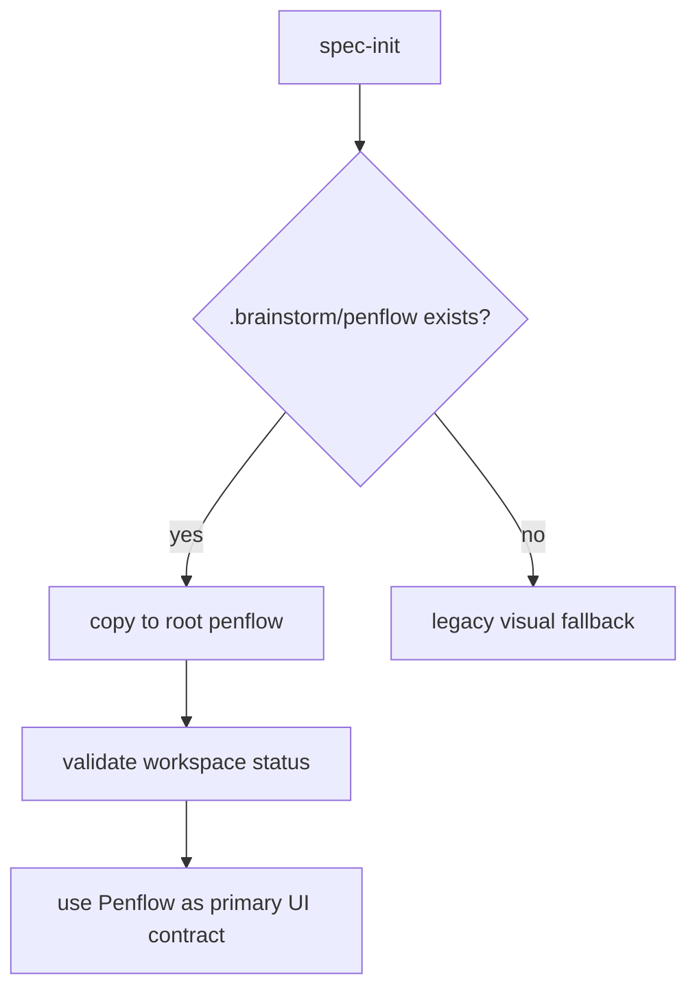
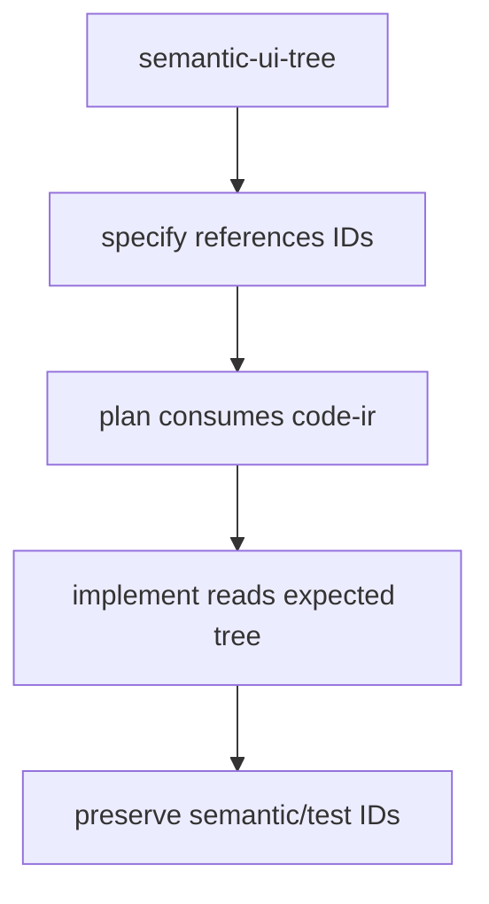
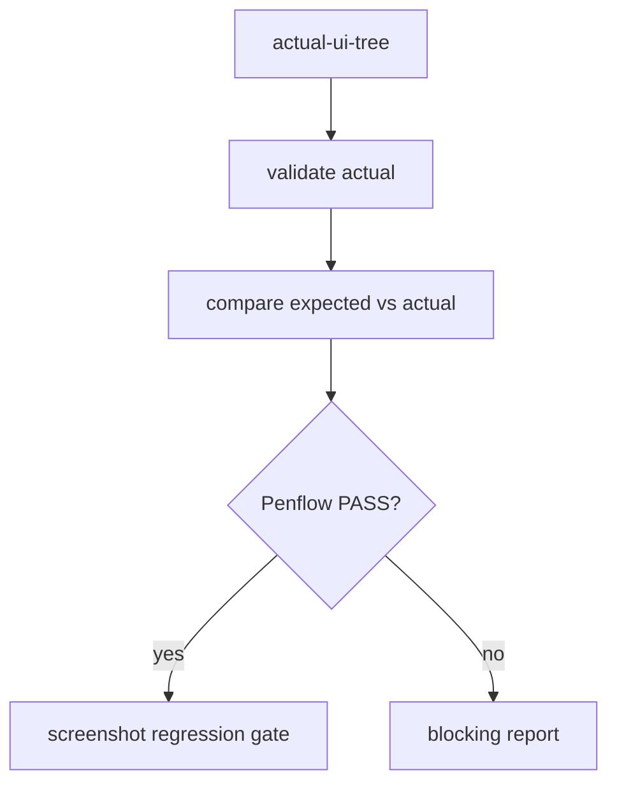

# Feature 051 — Integrate Penflow as LiveSpec Primary UI Contract

**Branch:** current
**Date:** 2026-05-21
**Status:** Implemented
**Input:** `/spec-feature "Integrate Penflow as LiveSpec primary UI contract while preserving screenshot regression gates" --auto`

## User Scenarios & Testing

### Story 1 — Initialize a Penflow workspace from brainstorm output

As a LiveSpec user with `.brainstorm/penflow/`, I want `/spec-init` to promote it to root `penflow/`, so UI behavior has a deterministic contract outside `.specs/features`.

```gherkin
Feature: Penflow workspace bootstrap
  Scenario: Brainstorm Penflow workspace is present
    Given a project has `.brainstorm/penflow/semantic-ui-tree.json`
    When `/spec-init` installs project artifacts
    Then LiveSpec copies `.brainstorm/penflow/` to root `penflow/`
    And validates the Penflow workspace status
    And keeps `.specs/design/screens/` as visual references only

  Scenario: No Penflow workspace exists
    Given a project has no `.brainstorm/penflow/`
    When `/spec-init` installs project artifacts
    Then LiveSpec continues with legacy design import behavior
    And reports no Penflow workspace as absent, not failed
```



### Story 2 — Derive UI feature context from Penflow

As an implementer, I want `/spec-specify`, `/spec-plan`, and `/spec-implement` to consume `semantic-ui-tree.json`, `code-ir.json`, and `expected-ui-tree.json`, so UI agents preserve stable semantic IDs and business bindings.

```gherkin
Feature: Penflow-driven UI implementation context
  Scenario: Semantic tree contains matching UI nodes
    Given `penflow/semantic-ui-tree.json` contains a screen for the feature
    When `/spec-specify` creates a UI feature
    Then the spec references available `flow_id`, `screen_id`, `semantic_id`, and `test_id`
    And `/spec-plan` includes `penflow/code-ir.json` when present
    And `/spec-implement` preserves semantic IDs, bindings, entities, validations, and side effects

  Scenario: Penflow files are incomplete
    Given root `penflow/` exists without `code-ir.json`
    When `/spec-plan` runs
    Then the missing file is reported as pending input
    And legacy mockups are not promoted to primary behavior source
```



### Story 3 — Gate UI correctness with Penflow while retaining screenshots

As a reviewer, I want `/spec-test` and `/spec-check` to block on Penflow structural correctness and still report screenshot regression, so behavior and pixels are verified by the right tools.

```gherkin
Feature: Penflow correctness gate
  Scenario: Actual UI tree matches expected tree
    Given `penflow/expected-ui-tree.json` and `penflow/actual-ui-tree.json` are valid
    When `/spec-test --visual` runs
    Then LiveSpec validates the actual tree
    And compares expected vs actual
    And writes compare, review, and fix reports
    And then runs screenshot regression gates

  Scenario: Penflow comparison fails
    Given `penflow/actual-ui-tree.json` is missing a semantic node
    When `/spec-check` runs
    Then Penflow contract status is blocking for UI flow correctness
    And screenshot baselines are reported separately as visual regression evidence
```



## Acceptance Criteria

- **AC-001:** Root `penflow/` is documented as the primary UI contract workspace for LiveSpec projects.
- **AC-002:** `.brainstorm/penflow/` bootstrap is documented for `/spec-init` and validated by deterministic helper coverage.
- **AC-003:** `/spec-specify` prefers `penflow/semantic-ui-tree.json` for UI IDs when available.
- **AC-004:** `/spec-plan` includes `penflow/code-ir.json` as a UI planning input when available.
- **AC-005:** `/spec-implement` directs UI agents to preserve Penflow semantic IDs, test IDs, bindings, entities, validations, and side effects.
- **AC-006:** `/spec-test` documents a blocking Penflow gate that validates actual trees, compares expected vs actual, and writes compare/review/fix reports.
- **AC-007:** `/spec-check` reports Penflow contract state as blocking for UI flow correctness and keeps visual regression reporting separate.
- **AC-008:** Existing screenshot baseline and pixel-diff gates remain documented and are not removed.
- **AC-009:** Legacy `.specs/flows`, `.specs/design/screens`, native behavioral, and design-alignment paths are classified as replaced, preserved, or fallback.
- **AC-010:** Missing `actual-ui-tree.json` is reported as `ABSENT` for non-UI/no-workspace runs and `BLOCKED` when UI runtime comparison is explicitly required.
- **AC-011:** LiveSpec imports a Brainstorm project only through an explicit Brainstorm `penflow/` directory and copies it to root `penflow/`.
- **AC-012:** `penflow/ui.pen` is the only valid `.pen` file in a LiveSpec project; duplicate `.pen` files under `.specs/design/`, `.specs/features/*/design/`, or any other path block the Penflow contract.
- **AC-013:** LiveSpec never requires or documents `penflow/ui.enriched.pen`, `.specs/design/ui.pen`, or `.specs/features/*/design/ui.pen`.

## Functional Requirements

- **FR-001:** Provide a deterministic Penflow contract helper that inspects root `penflow/` and reports missing/present contract artifacts.
- **FR-002:** Provide a CLI surface for Penflow contract status and optional brainstorm bootstrap.
- **FR-003:** Update `/spec-init` to copy `.brainstorm/penflow/` to root `penflow/` before legacy visual import is treated as behavioral input.
- **FR-004:** Update `/spec-specify` to resolve UI feature flow/screen/node/test IDs from `penflow/semantic-ui-tree.json`.
- **FR-005:** Update `/spec-plan` and `/spec-implement` instructions to consume `code-ir.json` and `expected-ui-tree.json`.
- **FR-006:** Update `/spec-test` and `/spec-check` instructions to use Penflow validation/compare reports as the blocking UI correctness gate.
- **FR-007:** Preserve screenshot regression and design-alignment gates as complementary visual validation.
- **FR-008:** Document legacy path classification in the feature audit.
- **FR-009:** Expose an explicit runtime comparison status so commands can distinguish from-scratch/non-UI absence from missing actual trees that block UI validation.
- **FR-010:** Accept an explicit Brainstorm `penflow/` source directory for `livespec penflow-contract bootstrap`.
- **FR-011:** Detect and block all `.pen` files except root `penflow/ui.pen`.
- **FR-012:** Remove `.pen` requirements from the LiveSpec design registry; screenshots and baselines remain visual evidence, but `ui.pen` is canonical only at `penflow/ui.pen`.

## Key Entities

- **PenflowWorkspace:** root `penflow/` directory containing contract artifacts.
- **SemanticTree:** `penflow/semantic-ui-tree.json`, the primary UI behavior contract.
- **ExpectedTree:** `penflow/expected-ui-tree.json`, design-derived baseline.
- **ActualTree:** `penflow/actual-ui-tree.json`, emitted by external runtime adapters.
- **CompareReport:** Penflow compare/review/fix output artifacts.

## Edge Cases

- Missing `penflow/` is `absent`, not a failed contract.
- Existing `penflow/` is never overwritten by `.brainstorm/penflow/`.
- Existing `penflow/` is never overwritten by an explicit Brainstorm `penflow/` source.
- A project with `.specs/design/ui.pen`, `.specs/features/*/design/ui.pen`, or `penflow/ui.enriched.pen` is incomplete until the duplicate `.pen` is removed.
- Missing `actual-ui-tree.json` blocks only when a UI flow requires runtime comparison.
- Visual baselines can pass while Penflow fails; UI correctness still fails.
- Penflow can pass while screenshots drift; visual regression still fails.

## Success Criteria

- **SC-001:** L1 — `penflow/` primary workspace is documented and tested.
- **SC-002:** L2 — `/spec-init` bootstrap path is specified and helper-covered.
- **SC-003:** L3 — specify/plan/implement docs prefer Penflow artifacts.
- **SC-004:** L4 — test/check docs include blocking Penflow validation and compare reports.
- **SC-005:** L5 — screenshot regression gates remain present.
- **SC-006:** L6 — validations/tests pass without visible regressions.
