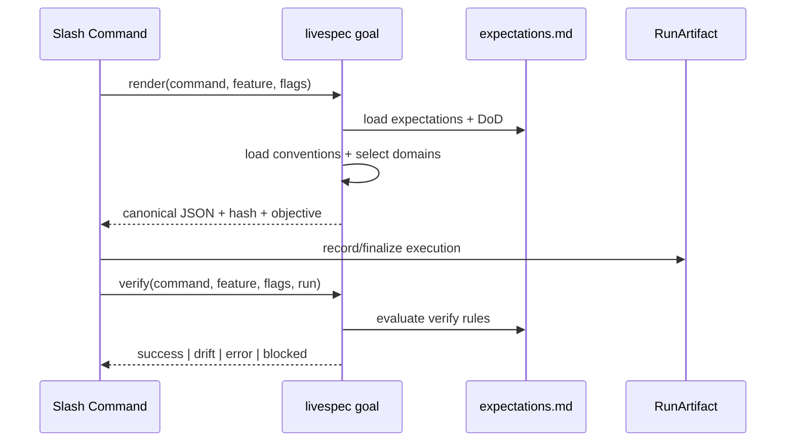

# Plan — Feature 052 — Deterministic Command Goal Contracts

- **Feature:** `052-deterministic-command-goal-contracts`
- **Spec:** [spec.md](spec.md)
- **Status:** Approved
- **Date:** 2026-05-21

## Summary

Add a deterministic goal-contract compiler and `livespec goal` CLI that reuse Feature 039 expectations, embed applicable convention domains, then wire the shared anti-drift command protocol to render the goal at startup and verify it before success.

## Technical Context

| Area | Choice |
|------|--------|
| Language | Python 3.11+ |
| CLI | Typer, registered from `validator/cli.py` |
| Existing contract source | `.agent-sync/skills/<command>/expectations.md` via `validator.expectations.load_expectations()` |
| Convention source | `.conventions/index.md` routing to `$AIRESOURCES` source files |
| Existing completion evaluator | `validator.verify_output.evaluate()` |
| Tests | pytest |
| No UI | Visual gates not applicable |

## Constitution Check

| Principle | Verdict |
|-----------|---------|
| Spec as source of truth | OK — this feature adds spec, plan, implementation map, and tests. |
| File-system source of truth | OK — goals compile from versioned files and run artifacts. |
| Deterministic validation | OK — canonical JSON and SHA-256 are deterministic. |
| Local-first execution | OK — no network or external service. |
| Backward compatibility | OK — existing RunArtifact fields remain optional-compatible. |

## Implementation Plan

### Step 1 — Goal compiler module

Create `validator/goal_contracts.py` with:

- `GoalContract`
- `GoalVerification`
- `compile_command_goal()`
- `normalize_goal_flags()`
- `render_goal_objective()`
- `verify_command_goal()`

The compiler loads expectations, extracts DoD lines from `SKILL.md`, canonicalizes verify rules, serializes with sorted JSON, and hashes with SHA-256.

### Step 1.5 — Convention payload compiler

Extend `validator/goal_contracts.py` to:

- Read `.conventions/index.md` when present
- Parse domain names, keywords, `→ $AIRESOURCES/...` source references, and the `$AIRESOURCES` root
- Build a deterministic signal from command, normalized flags, expectations prose, and feature `spec.md`/`plan.md`
- Select `code` by default when present
- Select `design-*` domains when UI/mockup/visual/CSS/screen/theme/baseline/Penflow signals are present
- Embed source path, content, and SHA-256 digest for every selected convention source file

### Step 2 — CLI surface

Create `validator/cli_commands/goal_cmd.py` and register it from `validator/cli.py` as:

- `livespec goal render <command> [--feature X] [--flags "..."] [--json]`
- `livespec goal verify <command> [--feature X] [--flags "..."] [--run PATH] [--json]`

### Step 3 — Shared command protocol

Update [system/anti-drift-block.md](../../../system/anti-drift-block.md) to require:

- startup goal render
- `create_goal` with rendered objective when the host exposes a goal tool
- final `livespec goal verify`
- `update_goal(complete)` only when verification succeeds

### Step 4 — Documentation and mappings

Update [system/expectations.md](../../../system/expectations.md), create `implementation.md`, `progress.md`, and changelog entries.

## Testing Strategy

- Unit tests in `tests/test_goal_contracts.py`
- CLI tests in `tests/test_goal_contracts_cli.py`
- Convention selection tests covering code-only and UI/mockup goals
- Run targeted tests:
  - `python3 -m pytest tests/test_goal_contracts.py tests/test_goal_contracts_cli.py`
  - `python3 -m pytest tests/test_expectations.py tests/test_verify_output.py tests/test_verify_output_cli.py`

## Risks & Considerations

- Goal tools (`create_goal`, `update_goal`) are host-agent APIs, not Python CLI APIs. The CLI therefore renders and verifies deterministic goal contracts; the shared command protocol instructs the executor when to call host goal tools.
- Definition of Done extraction is Markdown-based. It is intentionally conservative: if no DoD section exists, the compiler returns an empty list instead of inventing conditions.
- The first implementation gates command success through expectations verification. Richer DoD machine evaluation can be added later as a compatible extension.
