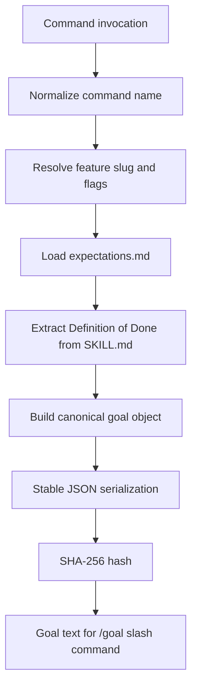
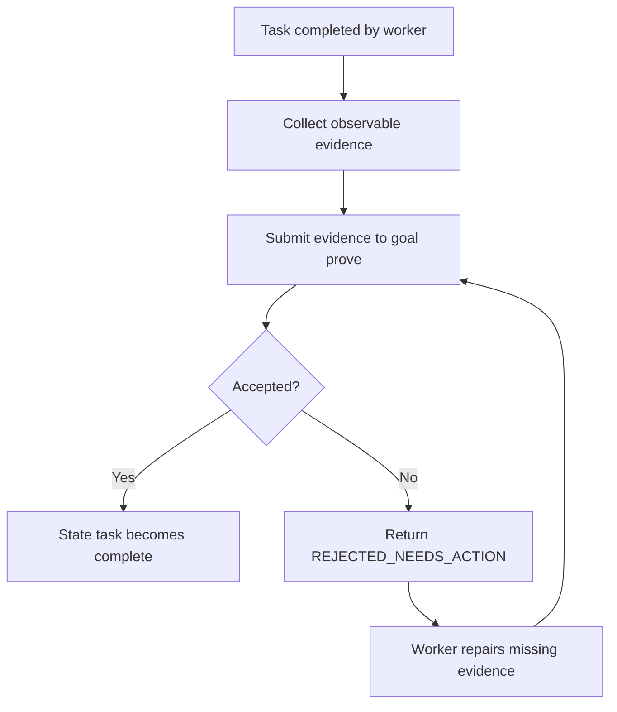
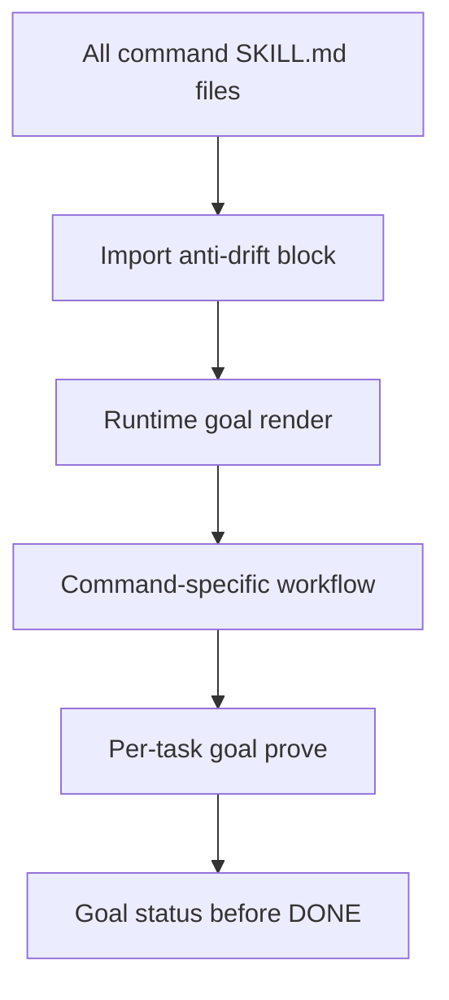
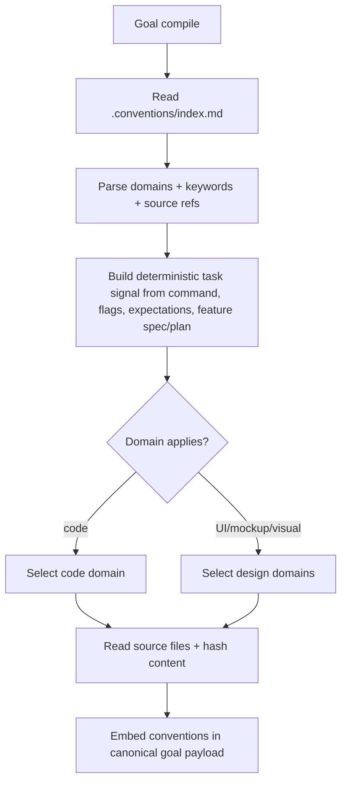

# Feature 052 — Deterministic Command Goal Contracts

- **Feature Name:** Deterministic Command Goal Contracts
- **Branch:** `main`
- **Date:** 2026-05-21
- **Status:** Implemented
- **Input:** Add deterministic command goal contracts: every LiveSpec command compiles a reproducible runtime goal from machine-readable expectations, Definition of Done, flags, and resolved feature state; the generated goal is canonicalized, hashable, snapshot-tested, and used as the completion gate. The goal must be reproducible: same command, args, flags, resolved feature state, expectations, and command version produce the same goal byte-for-byte, independent of LLM wording.

## User Scenarios & Testing

### Story 1 (P1) — Command executor gets a deterministic goal before work starts

**Description:** A LiveSpec command executor needs a stable goal contract before executing a slash-command so the command objective, expected files, tests, and completion conditions are explicit and reproducible.

**Priority reason:** This prevents command drift at the start of every `/spec-*` workflow.

**Independent test:** Render the goal for `spec-feature` ten times with the same feature and flags; every canonical JSON payload and hash must match.

```gherkin
Feature: Deterministic command goal rendering
  Scenario: Same inputs produce identical goal payload and hash
    Given the builtin expectations for `spec-feature`
    And the command skill file contains a Definition of Done
    And the resolved feature is `052-deterministic-command-goal-contracts`
    And the active flags are `--auto --mono`
    When `livespec goal render spec-feature --feature 052-deterministic-command-goal-contracts --flags "--mono --auto" --json` runs ten times
    Then every response has identical canonical JSON
    And every response has the same SHA-256 goal hash
    And the normalized flags are `["--auto", "--mono"]`

  Scenario: Volatile runtime fields are excluded from the goal hash
    Given two runs happen at different wall-clock times
    When each run renders the same command goal
    Then the canonical JSON contains no timestamp
    And both hashes are identical
```



### Story 2 (P1) — Completion gate proves each goal task instead of trusting prose

**Description:** A LiveSpec command executor needs a deterministic proof gate that validates task evidence against the generated goal contract before any task can be marked complete.

**Priority reason:** A goal that only renders a checklist does not prevent workers from marking work done without proof.

**Independent test:** Render a contract/state pair, submit valid and invalid task evidence through `livespec goal prove`, and verify only valid evidence mutates the task state to `complete`.

```gherkin
Feature: Goal task proof
  Scenario: Valid task evidence completes one state entry
    Given a rendered `contract.json` and `state.json` for `spec-demo`
    And task `task.001.demo` requires observable output or artifact evidence
    When `livespec goal prove --contract contract.json --state state.json --task task.001.demo --evidence '{"verdict":"PASS"}'` runs
    Then the proof status is `ACCEPTED`
    And `state.json` marks only `task.001.demo` as `complete`

  Scenario: Missing visual mockup evidence is rejected with repair actions
    Given a rendered `contract.json` for `spec-check --fix --all`
    And the contract contains `visual.design_fidelity`
    When the worker submits only normalized Penflow JSON paths as evidence
    Then the proof status is `REJECTED_NEEDS_ACTION`
    And `state.json` keeps `visual.design_fidelity` as `pending`
    And the response asks to export mockup PNGs and run the pixel comparison
```



### Story 3 (P1) — All slash-command skills share the same goal protocol

**Description:** A LiveSpec maintainer needs one common command-level protocol, not twenty manually divergent snippets, so all commands use deterministic goals consistently.

**Priority reason:** The requirement is for every LiveSpec command; copy-pasted prompt prose would become inconsistent.

**Independent test:** The shared anti-drift block references `livespec goal render` at command start, `livespec goal prove` after each task, and `livespec goal status` before success.

```gherkin
Feature: Shared command goal protocol
  Scenario: Anti-drift block defines the runtime goal lifecycle
    Given every builtin command imports `system/anti-drift-block.md`
    When a maintainer reads the anti-drift finalization rules
    Then the block requires goal rendering before command work starts
    And requires task proof before mutating state
    And explicitly forbids workers from marking task completion directly

  Scenario: Nested slash commands keep the LiveSpec project root
    Given a command has a `## Internal Command Invocations` subagent row
    When `livespec goal render` or `livespec command-audit` validates the command
    Then the row must mention the resolved `project_root`
    And the child cwd or working directory must be fixed to that `project_root`
    And the fallback prompt must Read `.specs/spec-system.md` before the child slash command
```



### Story 4 (P1) — Goal carries the applicable convention domains

**Description:** A command executor needs the runtime goal to state which project conventions must be read and applied for the task, including code conventions for code/test work and design conventions for UI, mockup, visual, CSS, or screen work.

**Priority reason:** Conventions are part of the workflow contract. If they stay outside the goal, the executor can satisfy the goal while silently ignoring code or design rules.

**Independent test:** Create a fixture `.conventions/index.md` with `code` and `design-tokens` domains. Rendering a code-only goal selects `code`; rendering a UI/mockup goal selects `code` plus `design-tokens`, embeds source paths and contents in canonical JSON, and prints the selected domains in the objective.

```gherkin
Feature: Convention-aware command goals
  Scenario: Code command includes code conventions
    Given `.conventions/index.md` defines a `code` domain
    And the `code` domain references `$AIRESOURCES/code-conventions/general.md`
    When `livespec goal render spec-demo --feature 001-demo --json` runs
    Then the canonical payload contains `conventions.selected_domains[0].name = "code"`
    And the payload contains the referenced convention source path
    And the payload contains the normalized convention content and SHA-256 digest

  Scenario: UI command includes design conventions
    Given `.conventions/index.md` defines `code` and `design-tokens`
    And `.specs/features/002-ui/spec.md` mentions mockup-driven visual UI work
    When `livespec goal render spec-demo --feature 002-ui --flags "--visual" --json` runs
    Then the canonical payload contains selected domains `["code", "design-tokens"]`
    And the objective lists both selected convention domains
```



## Acceptance Criteria

- **AC-001:** A `validator.goal_contracts` module compiles a deterministic command goal from command name, normalized flags, resolved feature, expectations metadata, verify rules, and command Definition of Done.
- **AC-002:** Canonical goal JSON serialization is stable: sorted keys, deterministic separators, normalized path strings, no timestamps, no wall-clock data, no LLM-generated wording.
- **AC-003:** Goal hashes use SHA-256 over the canonical JSON payload and are identical for identical inputs.
- **AC-004:** Flag normalization is order-independent for boolean flags and flag-value pairs.
- **AC-005:** `livespec goal render <command>` prints human-readable goal text, JSON containing `hash`, `canonical`, and `objective`, or with `--save` writes `contract.json` + `state.json` and prints `contract-file` + `state-file`.
- **AC-006:** `livespec goal prove` validates one task's evidence against `contract.json`, mutates only `state.json`, accepts complete proof, and returns `REJECTED_NEEDS_ACTION` without completion when proof is missing.
- **AC-007:** The shared anti-drift block requires every slash command to render a deterministic goal at startup, prove each task before state completion, and check goal status before reporting success.
- **AC-008:** Goal verification is compatible with project expectation overrides and keeps the existing total-override behavior.
- **AC-009:** Tests cover repeated rendering, flag-order independence, DoD extraction, CLI render JSON, CLI verify success, CLI verify drift, and CLI verify blocked.
- **AC-010:** Documentation maps the command goal contract to Feature 039 expectations instead of duplicating that subsystem.
- **AC-011:** If `.conventions/index.md` exists, the goal payload includes selected convention domains, source paths, source content, and SHA-256 digests.
- **AC-012:** Code convention domains are selected for command goals by default so code/test/style rules are explicit in the runtime contract.
- **AC-013:** Design convention domains are selected when command flags, expectations, or feature spec/plan mention UI, mockup, visual, CSS, screens, baselines, theme, or Penflow work.
- **AC-014:** Markdown task files are not generated or used; runtime execution state is represented only by `contract.json` and `state.json`.
- **AC-015:** Workers may submit evidence but cannot mark tasks complete directly; contract JSON exposes `worker_may_mark_tasks_complete=false` at top level and under `rules`, and only the goal proof path can update a task from `pending` to `complete`.
- **AC-016:** Visual design fidelity proof rejects normalized JSON-only substitutes, design-alignment reports, worker-declared diff/verdict fields, and any proof without a verified `visual_evidence_receipt_path` emitted by `livespec visual-gate certify`.
- **AC-017:** Executable `[subagent]` Internal Command Invocation rows are rejected unless they explicitly propagate the current LiveSpec `project_root`, set child `cwd`/working directory to that root, and require **Read** [`.specs/spec-system.md`](../../spec-system.md) before the child slash command when native cwd is unavailable.

## Functional Requirements

- **FR-001:** Provide `GoalContract` and `GoalProof` typed data structures.
- **FR-002:** Resolve command expectations through the existing `load_expectations()` lookup path.
- **FR-003:** Extract command Definition of Done from `.agent-sync/skills/<command>/SKILL.md`.
- **FR-004:** Normalize flags deterministically, including `--flag value` to `--flag=value`.
- **FR-005:** Build a canonical JSON-safe payload with stable field order under `json.dumps(sort_keys=True, separators=(",", ":"))`.
- **FR-006:** Hash the canonical JSON with SHA-256.
- **FR-007:** Render deterministic human objective text from the canonical payload, not from LLM prose.
- **FR-008:** Add `livespec goal render`.
- **FR-009:** Add `livespec goal prove`.
- **FR-010:** Add `livespec goal status`.
- **FR-011:** Update shared command runtime docs so command executors know to emit exactly `/goal hash:<hash> ... contract-file:... state-file:...`, check for an active goal at start (block with `/goal clear` guidance), prove every task, and when to report blocked.
- **FR-012:** Preserve backwards compatibility for existing RunArtifact JSON files.
- **FR-013:** Parse `.conventions/index.md` into deterministic convention domains with keywords and `$AIRESOURCES` source references.
- **FR-014:** Select convention domains from a deterministic task signal built from command, flags, expectations, and feature `spec.md`/`plan.md`.
- **FR-015:** Embed selected convention source paths, contents, and content hashes into canonical goal JSON and list selected domains in the rendered objective.
- **FR-016:** Render immutable `contract.json` and mutable `state.json` from `livespec goal render --save`; no Markdown task file is created.
- **FR-017:** Define per-task `required_evidence`, `invalid_substitutes`, and `repair_if_missing` fields in the contract; expose `worker_may_mark_tasks_complete=false` at top level and under `rules`.
- **FR-018:** Enforce visual design fidelity evidence through a deterministic visual receipt: `goal prove` must verify real PNG paths, hashes, dimensions, threshold, diff pixels, verdict, and required comparison kind from `visual_evidence_receipt_path`; missing/failed/stale receipts produce `REJECTED_NEEDS_ACTION`, not PASS.
- **FR-019:** Validate Internal Command Invocation `[subagent]` rows in the goal compiler and command audit so nested `/spec-*` calls cannot rely on caller text like `Context: cwd is ...`; they must carry `project_root`, child `cwd`/working directory, and **Read** [`.specs/spec-system.md`](../../spec-system.md).

## Key Entities

- **GoalContract:** Canonical command objective containing command, feature, normalized flags, expectations metadata, verify rules, Definition of Done, canonical JSON, and hash.
- **GoalProof:** Per-task proof result containing the goal hash, task id, accepted/rejected status, missing evidence, invalid substitutes, repair actions, and updated state.
- **Normalized flags:** Stable list of active flags, where ordering differences do not change the goal.
- **Convention domain:** A `.conventions/index.md` entry with a domain name, keywords, and `$AIRESOURCES` source files that must be applied for matching command goals.
- **Internal Command Invocation:** Machine-readable `SKILL.md` allowlist row declaring whether a nested `/spec-*` mention is executable in a child subagent or only an operator suggestion.

## Edge Cases

- **EC-001:** Same boolean flags in different orders produce the same hash.
- **EC-002:** `--priority P1` and `--priority=P1` normalize to the same flag token.
- **EC-003:** Missing expectations file blocks goal rendering.
- **EC-004:** Malformed project override blocks and does not fall back to builtin.
- **EC-005:** Missing run artifact returns blocked.
- **EC-006:** Command without a Definition of Done still renders a goal with an empty DoD list and a warning in the objective.
- **EC-007:** Existing run artifacts without goal fields remain readable.
- **EC-008:** Missing `.conventions/index.md` renders `conventions.available = false` without blocking.
- **EC-009:** Missing convention source file still records the declared path with an empty content hash input instead of inventing rules.
- **EC-010:** Missing visual receipt evidence cannot be replaced by normalized Penflow JSON alignment, design-alignment compare reports, or worker-declared visual verdicts.
- **EC-011:** `## Execution Tasks` parsing ignores ordinary Markdown checkboxes and documented examples/recovery hints; executable nested `/spec-*` calls still require `## Internal Command Invocations`.
- **EC-012:** A nested slash-command prompt that only says `Context: cwd is <path>` is insufficient; without an enforced child `cwd`/working directory or `cd <project_root>` fallback, command audit fails.

## Success Criteria

- **SC-001:** Repeated render snapshot test passes for at least ten iterations.
- **SC-002:** Targeted pytest suite for goal contracts passes.
- **SC-003:** Existing expectations and verify-output tests still pass.
- **SC-004:** Shared anti-drift docs clearly gate success on deterministic per-task goal proof.
- **SC-005:** Goal contract tests prove code and design convention domains are selected and embedded deterministically.
- **SC-006:** `python3 -m validator.cli command-audit --json` reports 20 commands, 0 failed, score 5 while enforcing the internal subagent workdir guard.
