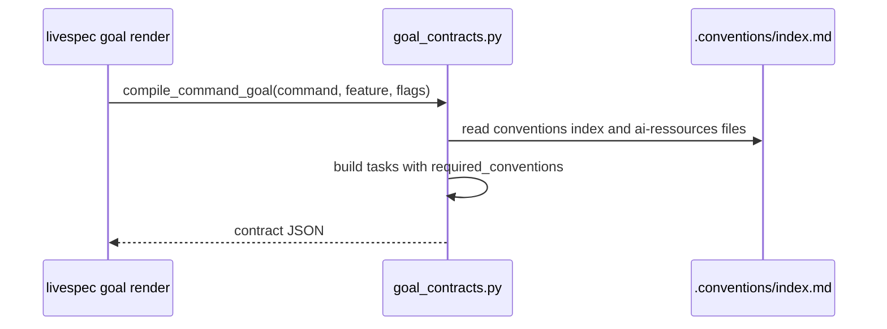
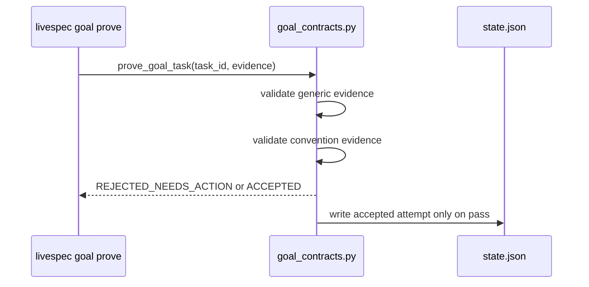

# Plan: Goal Tasks Replay Required Conventions Per Step

- **Feature:** 053-goal-tasks-replay-required-conventions-per-step
- **Status:** Approved
- **Date:** 2026-06-01

## Summary

Attach selected convention metadata to every rendered goal task and require matching convention evidence before `goal prove` can mark those tasks complete.

## Technical Context

- **Language:** Python 3.11+
- **Module:** `validator/goal_contracts.py`
- **Tests:** `tests/test_goal_contracts.py`
- **Command surface:** `livespec goal render`, `livespec goal prove`
- **Conventions:** `code` conventions from `.conventions/index.md`; no UI domains apply to this backend CLI feature.

## Constitution Check

- **Layered Validation:** The proof gate remains deterministic and local.
- **Provider-Agnostic LLM Integration:** No LLM dependency.
- **File-System as Source of Truth:** Contract/state files remain JSON on disk.
- **Fail Fast, Exit Clearly:** Missing convention proof returns `REJECTED_NEEDS_ACTION` with specific fields.
- **Minimal Surface:** Existing `goal render/prove` commands are extended, no new CLI command.

## Gherkin Scenarios + Mermaid Sequence Diagrams

```gherkin
Feature: Goal task convention replay
  Scenario: Render task convention requirements
    Given a project has selected convention domains
    When a goal contract is rendered
    Then each task contains required_conventions with mode, domains, and source paths
```



```gherkin
Feature: Convention evidence gate
  Scenario: Reject missing convention proof
    Given a task has required_conventions
    When goal prove receives evidence without convention fields
    Then the proof is rejected with missing convention evidence
```



## Implementation Plan

1. **RED tests: task convention payload**
   - Update `tests/test_goal_contracts.py`.
   - Assert rendered tasks include `required_conventions.mode`, `domains`, and `source_paths`.
   - Assert objective text includes task-level convention replay.

2. **RED tests: proof rejection/acceptance**
   - Add a test that proves a task with normal evidence but no convention fields is rejected.
   - Add a test that proves matching `convention_domains`, `convention_sources`, and `conventions_applied_to_output: true` is accepted.

3. **Implementation: build conventions before tasks**
   - In `_goal_payload`, compile conventions before `_build_goal_tasks`.
   - Pass the conventions payload into `_build_goal_tasks`.

4. **Implementation: attach per-task conventions**
   - Add helper to extract stable domain names and source paths from selected convention domains.
   - Add `required_conventions` to every task when selected conventions exist.
   - Add convention-specific repair instructions.

5. **Implementation: enforce convention proof**
   - Extend `_required_evidence_for_task` or task assembly to append convention proof fields only when conventions are attached.
   - Extend `_required_evidence_satisfied` for convention fields.
   - Validate evidence covers required domains/source paths from the task payload.

6. **Implementation: render task-level objective**
   - Extend `render_goal_objective()` so the objective text includes task-level convention replay.

7. **Validation**
   - Run targeted tests: `pytest tests/test_goal_contracts.py -q`.
   - Run command audit: `python3 -m validator.cli command-audit --repo . --json`.
   - Run broader non-integration tests if time allows.

## Testing Strategy

- Unit tests in `tests/test_goal_contracts.py`.
- No integration or LLM tests needed.
- Existing visual gate tests should remain unaffected because convention evidence is generic JSON proof validation.

## Risks & Considerations

- Adding convention evidence to every task changes proof requirements for projects with `.conventions/index.md`; this is intentional.
- Existing callers must include the new evidence keys when proving tasks in convention-enabled projects.
- Projects without conventions keep current behavior.
