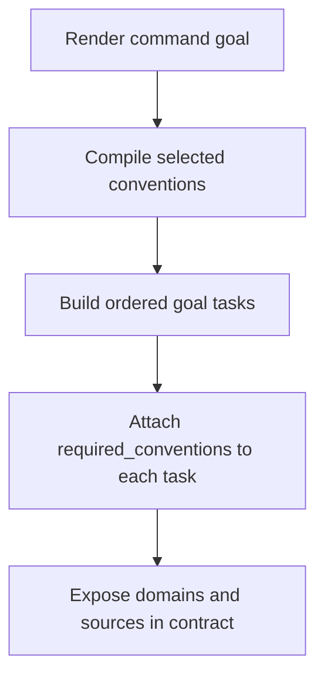
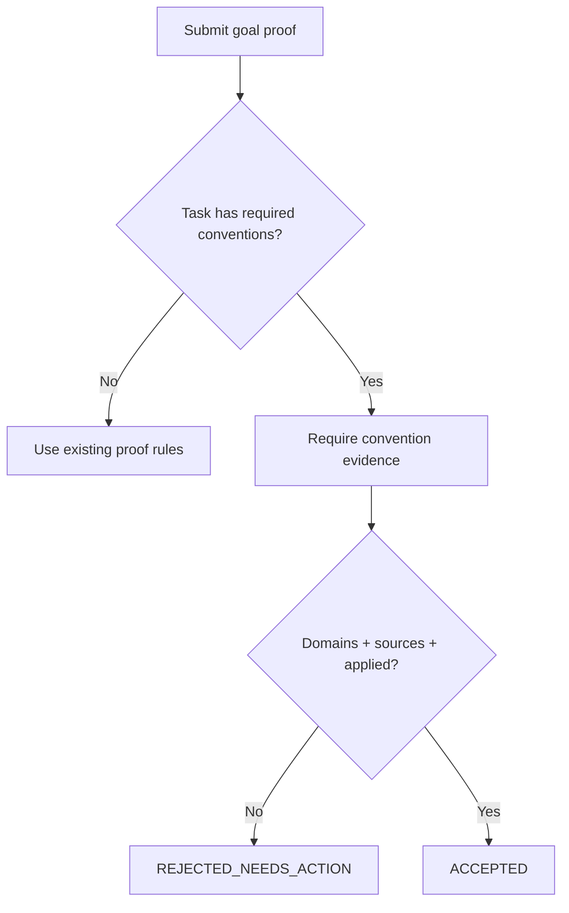
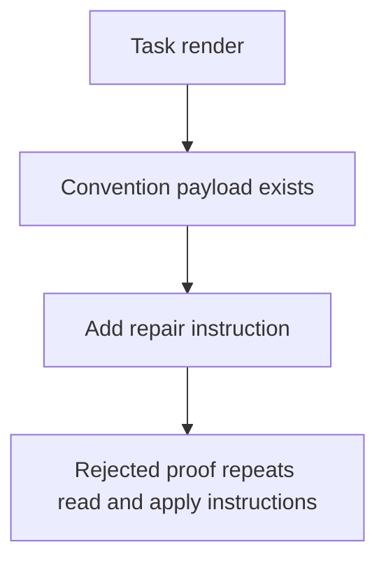

# Feature Spec: Goal Tasks Replay Required Conventions Per Step

- **Feature:** Goal Tasks Replay Required Conventions Per Step
- **Branch:** main
- **Date:** 2026-06-01
- **Status:** Implemented
- **Input:** Goal tasks replay required conventions per step and reject proofs missing convention evidence.

## User Scenarios & Testing

### Story 1 — See conventions on each goal task `P1`

As a developer running a LiveSpec command, I want each rendered goal task to show which convention domains and source files apply, so every iteration has the same rules in front of the agent.

**Priority reason:** The goal contract is the enforcement surface. If conventions are only listed globally, later task iterations can ignore them.

**Independent test:** Render a goal in a project with `.conventions/index.md`; inspect every generated task for a `required_conventions` payload containing domains, source paths, and `read_apply` mode.

```gherkin
Feature: Goal task convention replay
  Scenario: Task records selected convention domains and sources
    Given a project has a conventions index with code and design domains
    When a command goal is rendered for a UI feature
    Then every goal task records the selected convention domains
    And every goal task records the selected ai-ressources source paths
    And every goal task instructs the worker to read and apply those conventions
```



### Story 2 — Reject proof missing convention evidence `P1`

As a maintainer, I want `livespec goal prove` to reject task evidence that does not record convention usage, so a task cannot be marked complete without proving it reused the required conventions.

**Priority reason:** The proof gate is the only reliable way to prevent convention drift after retries.

**Independent test:** Submit evidence for a task without convention fields and verify rejection; resubmit with domains, source paths, and applied marker and verify acceptance.

```gherkin
Feature: Convention evidence gate
  Scenario: Proof without convention evidence is rejected
    Given a rendered goal task has required conventions
    When evidence omits convention domains or source paths
    Then goal prove rejects the evidence
    And the rejection lists the missing convention fields

  Scenario: Proof with convention evidence is accepted
    Given a rendered goal task has required conventions
    When evidence records matching domains, source paths, and applied status
    Then goal prove accepts the evidence
```



### Story 3 — Repair instructions restate conventions `P2`

As an agent recovering from rejected evidence, I want the repair actions to restate exactly which conventions to read and apply, so the next iteration has actionable recovery instructions.

**Priority reason:** Rejections should teach the next step what to do, not only say "missing evidence".

**Independent test:** Render a task with conventions and assert `repair_if_missing` includes a convention-specific instruction mentioning read, apply, domains, and source paths.

```gherkin
Feature: Convention repair instructions
  Scenario: Rejection actions restate required conventions
    Given a goal task has code conventions attached
    When the task is rendered
    Then its repair actions tell the worker to reread and apply the listed convention files
```



## Acceptance Criteria

- **AC-001** — Given a project with selected convention domains, when `livespec goal render` builds tasks, then each task includes `required_conventions.mode = "read_apply"`.
- **AC-002** — Given selected convention domains, each task includes the selected domain names and each referenced `ai-ressources` path.
- **AC-003** — Given a task with required conventions, when proof evidence omits convention domains, `goal prove` rejects with `convention_domains_recorded`.
- **AC-004** — Given a task with required conventions, when proof evidence omits convention source paths, `goal prove` rejects with `convention_sources_read`.
- **AC-005** — Given a task with required conventions, when proof evidence omits the applied marker, `goal prove` rejects with `conventions_applied_to_output`.
- **AC-006** — Given proof evidence records matching domains, matching source paths, and `conventions_applied_to_output: true`, `goal prove` accepts the task if its other required evidence is valid.
- **AC-007** — Given a task with required conventions, `repair_if_missing` includes a convention-specific instruction to reread and apply the listed convention domains and files.
- **AC-008** — Given a rendered objective, the human-readable output lists task-level convention replay, not only the global convention summary.

## Functional Requirements

- **FR-001** — Add a per-task `required_conventions` payload containing mode, domains, and source paths. Maps to AC-001, AC-002.
- **FR-002** — Extend required evidence for convention-scoped tasks with `convention_domains_recorded`, `convention_sources_read`, and `conventions_applied_to_output`. Maps to AC-003, AC-004, AC-005, AC-006.
- **FR-003** — Validate convention evidence against the task's required domains and source paths. Maps to AC-003, AC-004, AC-006.
- **FR-004** — Add convention-specific repair instructions to convention-scoped tasks. Maps to AC-007.
- **FR-005** — Render task-level convention replay in the human objective text. Maps to AC-008.

## Key Entities

- **Goal task** — A contract task that must be proven with evidence before it can become complete.
- **Required conventions** — Per-task payload listing convention domains and source files that must be read and applied.
- **Convention evidence** — Proof fields submitted to `goal prove` showing the worker used the required conventions.

## Edge Cases

- No `.conventions/index.md`: tasks keep existing evidence behavior and do not require convention proof.
- Missing selected domains: tasks keep existing behavior; absence is already visible in the global convention payload.
- Absolute source paths are never required in evidence; stable `$AIRESOURCES/...` display paths are enough.
- Extra convention domains in evidence are allowed, but all required domains must be present.
- Extra source paths in evidence are allowed, but all required paths must be present.

## Success Criteria

- **SC-001** — Contract tests prove tasks contain required conventions.
- **SC-002** — Contract tests prove missing convention evidence is rejected.
- **SC-003** — Contract tests prove complete convention evidence is accepted.
- **SC-004** — Existing goal contract tests continue to pass.
