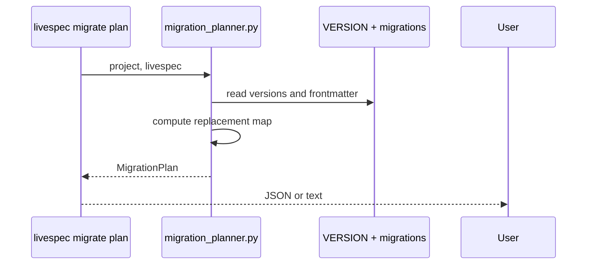
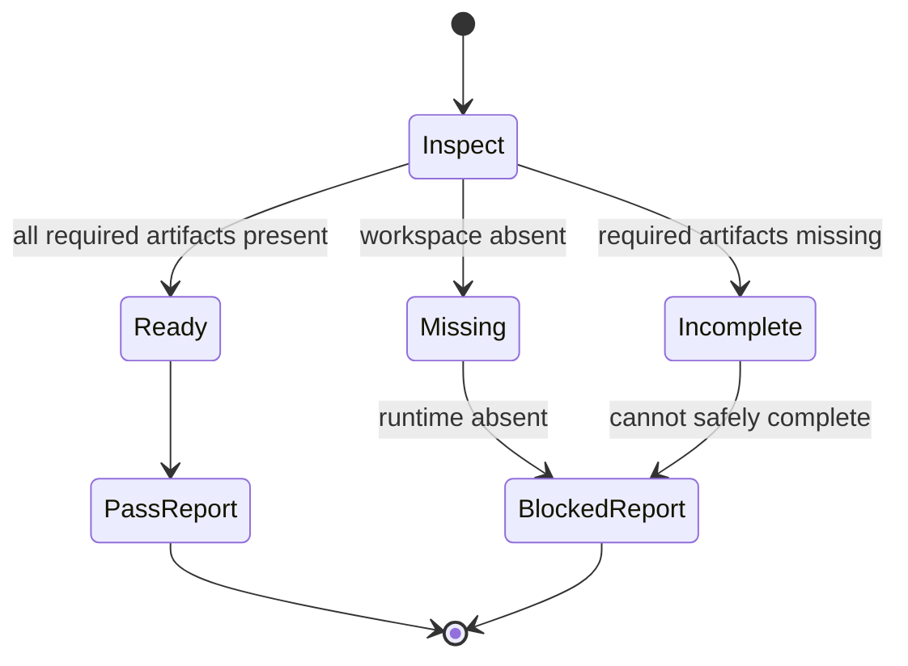

# Plan - Feature 053 - Migration Planner and Penflow Backfill

- **Feature:** `053-migration-planner-penflow-backfill`
- **Spec:** [spec.md](spec.md)
- **Status:** Approved
- **Date:** 2026-06-01

## Summary

Add a deterministic migration planner and Migration 17 Penflow backfill path, then update `/spec-migrate` to plan first and execute only the selected migrations.

## Technical Context

| Area | Choice |
|------|--------|
| Language | Python 3.11+ |
| CLI | Typer, registered from `validator/cli.py` through unified CLI commands |
| Migration executor | Existing `scripts/migrate.sh` DSL executor |
| Metadata format | YAML frontmatter in `migrations/N/migrate.md` |
| Penflow status | Existing `validator.penflow_contract.get_penflow_contract_status()` |
| Tests | pytest |
| UI | None for LiveSpec itself; Penflow migration handles downstream projects |

## Constitution Check

| Principle | Verdict |
|-----------|---------|
| File-system source of truth | OK - versions, migrations, and reports are files. |
| Fail fast | OK - invalid frontmatter raises clear planner errors. |
| Minimal surface | OK - one `livespec migrate plan` subcommand, executor remains `migrate.sh`. |
| Local-first | OK - no hosted infrastructure or network dependency. |

## Implementation Plan

### Step 1 - Planner tests

Create `tests/test_migration_planner.py` covering linear planning, `replaces_when_unapplied`, already-applied migrations, invalid restore points, invalid frontmatter, and CLI JSON output.

### Step 2 - Penflow backfill tests

Create `tests/test_penflow_backfill_migration.py` covering ready workspace no-op, absent workspace blocked without runtime, legacy `.specs/design/ui.pen` duplicate reporting, no secondary `.pen`, and report path.

### Step 3 - Command docs tests

Extend `tests/test_penflow_contract_command_contract.py` so docs require planner usage, Migration 17, and the three metadata fields.

### Step 4 - Planner module and CLI

Create `validator/migration_planner.py`:

- `MigrationManifest`
- `MigrationPlan`
- `load_migration_manifests()`
- `build_migration_plan()`

Create `validator/cli_commands/migrate_cmd.py` and register a `migrate` Typer group with `plan`.

### Step 5 - Migration 17 backfill

Create `migrations/17/migrate.md` and `scripts/migrate-penflow-backfill.py`.

Backfill behavior:

- Ready root `penflow/` -> no-op, report PASS.
- Missing/incomplete root `penflow/` without runtime source -> report BLOCKED.
- Legacy `.specs/design/ui.pen` -> report as non-canonical duplicate.
- Never create `.pen` outside `penflow/ui.pen`.

### Step 6 - `/spec-migrate` documentation

Update `.agent-sync/skills/spec-migrate/SKILL.md`:

- Overview diagram mentions planner.
- Step 3 calls `livespec migrate plan --project . --livespec <path> --json`.
- Executor still runs `scripts/migrate.sh` for each `apply` item.
- Report invalid restore points after execution.
- Error cases document invalid frontmatter.

### Step 7 - Implementation mapping and changelog

Write `implementation.md`, `progress.md`, feature `changelog.md`, update `.specs/README.md`, `.specs/roadmap.md`, and `.specs/changelog.md`.

## Testing Strategy

| Test | Purpose |
|------|---------|
| `pytest tests/test_migration_planner.py` | Planner unit and CLI contract |
| `pytest tests/test_penflow_backfill_migration.py` | Migration 17 backfill behavior |
| `pytest tests/test_penflow_contract_command_contract.py` | Command docs contract |
| `pytest` | Regression suite |

## Risks & Considerations

- Planner must not change `scripts/migrate.sh` execution semantics.
- The migration script must not fake UI truth from screenshots alone.
- Current repo `VERSION` is 16; Migration 17 changes target version and downstream behavior.
