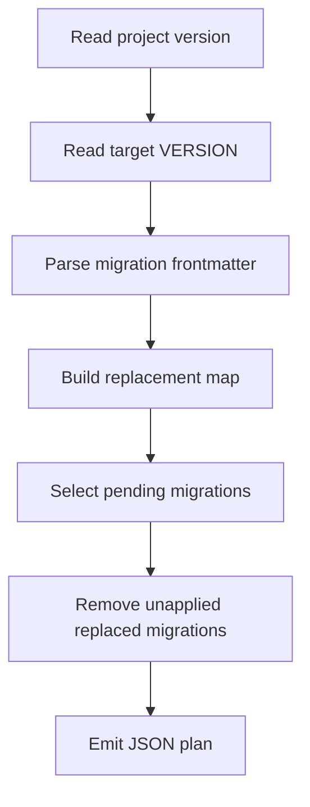
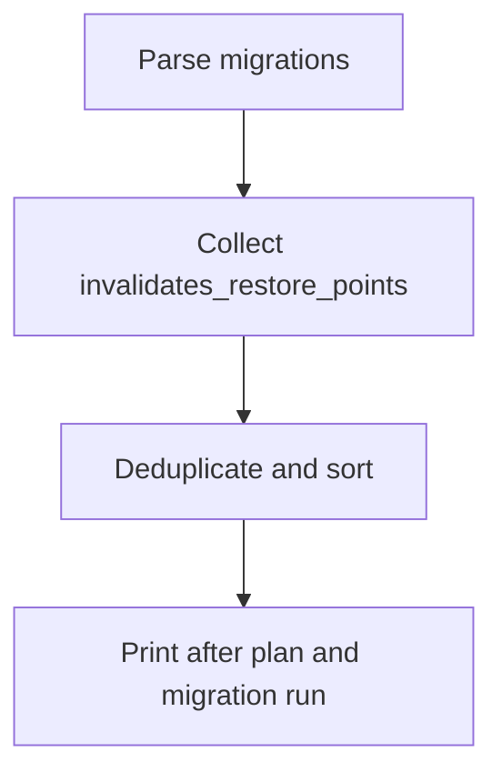
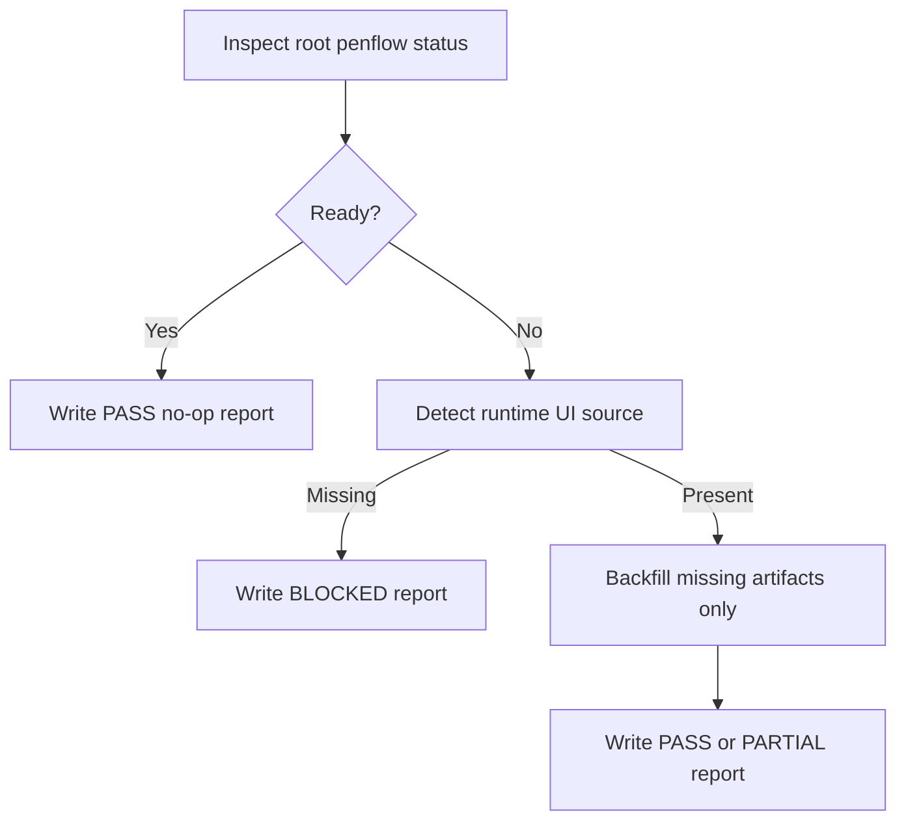

# Feature 053 - Migration Planner and Penflow Backfill

- **Feature Name:** Migration Planner and Penflow Backfill
- **Branch:** `HEAD`
- **Date:** 2026-06-01
- **Status:** Implemented
- **Input:** Implement the complete plan from the user attachment: extend `/spec-migrate` with a migration planner that can skip unapplied superseded migrations, report invalid restore points, and add Migration 17 for Penflow backfill without creating fake UI contracts from legacy mockups.

## User Scenarios & Testing

### Story 1 (P1) - Migration operator sees the exact applicable plan before execution

**Description:** A project maintainer running `/spec-migrate` needs a deterministic plan showing project version, target version, migrations to apply, migrations skipped because a later migration replaces them, and invalid restore points.

**Priority reason:** Migration selection must be explicit before any project files are changed.

**Independent test:** `livespec migrate plan --project <project> --livespec <repo> --json` returns stable JSON for linear migrations and for metadata-driven replacement.

```gherkin
Feature: Migration planning
  Scenario: Linear migrations remain unchanged without metadata
    Given a project at LiveSpec version 10
    And the LiveSpec repo target version is 12
    And migrations 11 and 12 have no replacement metadata
    When the migration plan is computed
    Then the apply list is [11, 12]
    And skipped is empty

  Scenario: Replaced unapplied migrations are skipped
    Given a project at LiveSpec version 2
    And migration 17 declares replaces_when_unapplied: [3]
    When the migration plan is computed
    Then migration 3 is not in the apply list
    And skipped records version 3 with reason superseded_by_17
```



### Story 2 (P1) - Recent migrations can invalidate historical restore points

**Description:** A migration author needs to mark an older migration state as no longer safe for restoration when a later migration supersedes its assumptions.

**Priority reason:** Operators must not restore to known-bad historical states silently.

**Independent test:** A migration frontmatter field `invalidates_restore_points: [3]` appears in the planner JSON as `invalid_restore_points: [3]`.

```gherkin
Feature: Restore point invalidation
  Scenario: Invalidated restore points are surfaced
    Given migration 17 declares invalidates_restore_points: [3]
    When the migration plan is computed
    Then the JSON contains invalid_restore_points [3]
```



### Story 3 (P1) - Penflow backfill does not invent UI truth

**Description:** A maintainer migrating an older LiveSpec project needs a Penflow backfill that preserves existing complete workspaces, blocks when the current runtime UI cannot be detected, and reports legacy `.pen` evidence without promoting it as canonical.

**Priority reason:** Root `penflow/ui.pen` is the only canonical Pencil source; old mockups can support reconstruction but cannot replace the live interface.

**Independent test:** The Migration 17 script writes `.specs/migrations/017-penflow-backfill-report.md`, no-ops for complete `penflow/`, blocks absent runtime-only projects, and never creates secondary `.pen` files.

```gherkin
Feature: Penflow backfill migration
  Scenario: Complete Penflow workspace is preserved
    Given a project already has penflow/flow-ui-contract, penflow/ui.pen, semantic-ui-tree.json, expected-ui-tree.json, and code-ir.json
    When migration 17 runs
    Then the report verdict is PASS
    And no artifact is overwritten

  Scenario: Runtime cannot be detected
    Given a project has legacy design screenshots but no root penflow workspace
    And no current runtime UI source is detectable
    When migration 17 runs
    Then the report verdict is BLOCKED
    And no fake penflow/ui.pen is generated
```



## Acceptance Criteria

- **AC-001:** Planner JSON contains `project_version`, `target_version`, `apply`, `skipped`, and `invalid_restore_points`.
- **AC-002:** Plain migrations without replacement metadata produce the same linear apply sequence as the existing `/spec-migrate` behavior.
- **AC-003:** `replaces_when_unapplied` skips a replaced migration only when that migration is still pending for the project.
- **AC-004:** Already-applied migrations are never undone or removed from history by the planner.
- **AC-005:** `invalidates_restore_points` is surfaced in planner JSON.
- **AC-006:** Invalid migration frontmatter fails with an actionable error.
- **AC-007:** `/spec-migrate` documentation uses `livespec migrate plan --project . --livespec <path> --json` before executing individual migrations.
- **AC-008:** Migration 17 exists, uses `RUN migrate-penflow-backfill.py`, and sets version 17.
- **AC-009:** The backfill report is written to `.specs/migrations/017-penflow-backfill-report.md`.
- **AC-010:** Complete root Penflow workspaces are no-op and preserve existing artifacts.
- **AC-011:** Absent/incomplete Penflow without detectable runtime UI writes a BLOCKED report instead of generating fake artifacts from mockups.
- **AC-012:** Legacy `.specs/design/ui.pen` is reported as duplicate legacy evidence and is not promoted as canonical.
- **AC-013:** No `.pen` file is created outside `penflow/ui.pen`.

## Functional Requirements

- **FR-001:** Add a migration planner module that reads project version, repo target version, and migration frontmatter.
- **FR-002:** Parse optional migration fields `kind`, `supersedes`, `invalidates_restore_points`, and `replaces_when_unapplied`.
- **FR-003:** Compute an ordered `apply` list and exclude pending migrations replaced by later pending migrations.
- **FR-004:** Preserve already-applied migrations as history; never auto-rollback or undo them.
- **FR-005:** Expose the planner through `livespec migrate plan --project <path> --livespec <path> --json`.
- **FR-006:** Update `/spec-migrate` docs to consume the planner before invoking `scripts/migrate.sh`.
- **FR-007:** Add Migration 17 with frontmatter documenting Penflow backfill and replacement metadata.
- **FR-008:** Add a Penflow backfill script that writes a deterministic migration report.
- **FR-009:** Preserve complete root `penflow/` workspaces without overwriting.
- **FR-010:** Refuse or block absent/incomplete backfill when no current runtime UI source is detectable.
- **FR-011:** Detect legacy `.specs/design/ui.pen` and report it as non-canonical evidence.
- **FR-012:** Prevent secondary `.pen` creation; only `penflow/ui.pen` may be canonical.

## Key Entities

- **MigrationManifest:** Parsed metadata from `migrations/N/migrate.md`.
- **MigrationPlan:** JSON-serializable plan consumed by `/spec-migrate`.
- **PenflowBackfillReport:** Markdown report listing sources, preserved artifacts, created artifacts, blockers, and verdict.

## Edge Cases

- A migration declares a replacement for a non-existent migration: keep planning and record no skipped row unless that version would have been pending.
- Frontmatter lists a non-integer migration reference: fail the planner.
- Existing `penflow/ui.pen` is incomplete: do not overwrite it without a backup; report the incomplete state.
- Legacy `.specs/design/ui.pen` exists: report it and leave it in place.

## Success Criteria

- **SC-001:** Targeted planner and backfill tests pass.
- **SC-002:** `livespec migrate plan --project . --livespec . --json` returns version 16 in the current repo before Migration 17 is applied to this repo.
- **SC-003:** Full pytest suite remains compatible with existing migration behavior.
