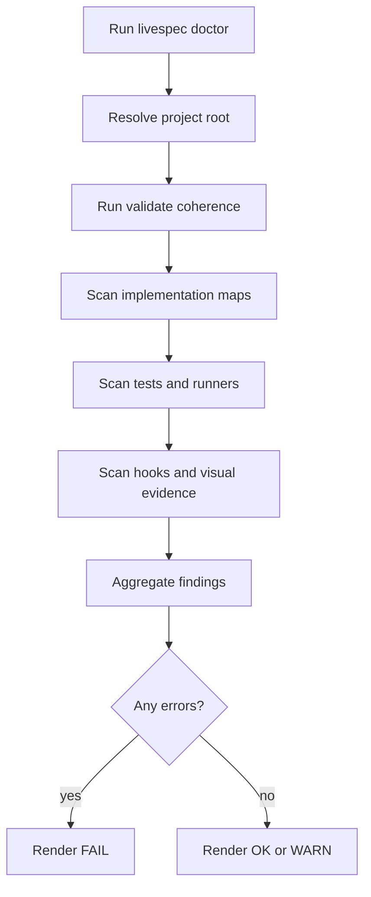
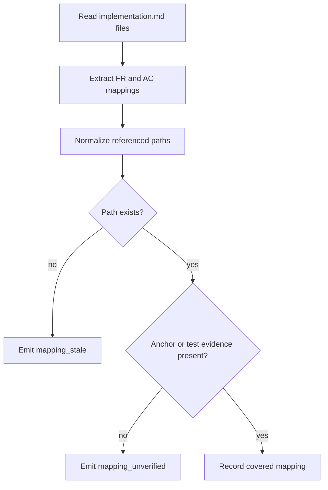
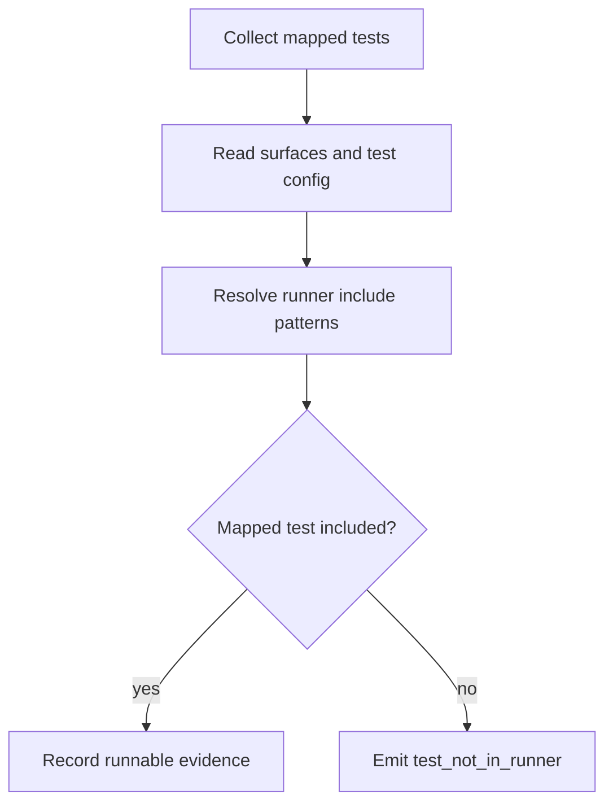
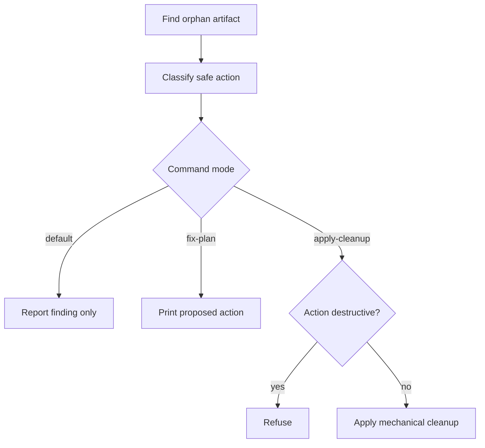

# Feature 054 - Spec Doctor Project Health

- **Feature Name:** Spec Doctor Project Health
- **Branch:** `main`
- **Date:** 2026-06-01
- **Status:** Draft
- **Input:** Add a project-level LiveSpec doctor command that validates real downstream project health. The command must not replace `livespec validate --coherence`; it should orchestrate that lower-level validator and add checks for stale mappings, missing tests, unused runners, unenforced hooks, superseded specs, orphaned artifacts, visual evidence, and future executable user journeys.

## User Scenarios & Testing

### Story 1 (P1) - Maintainer diagnoses project health with one command

**Description:** A LiveSpec maintainer needs a single command that reports whether a project is actually coherent, tested, and enforced, not merely whether Markdown files are structurally valid.

**Priority reason:** LiveSpec projects can accumulate valid-looking specs, mappings, and runners that are not applied in practice.

**Independent test:** A fixture project with stale mappings, missing tests, and a missing pre-push hook produces a `FAIL` doctor report with categorized findings.

```gherkin
Feature: Project doctor
  Scenario: Doctor reports a real project health failure
    Given a LiveSpec project with valid .specs files
    And an implementation mapping references a missing test file
    And the project has no enforcing pre-push hook
    When the maintainer runs "livespec doctor"
    Then the command reports FAIL
    And the report includes an ERROR "mapping_stale"
    And the report includes a hook enforcement finding
```



### Story 2 (P1) - Maintainer sees stale spec-code-test mappings

**Description:** A maintainer needs stale `implementation.md` references to be treated as project health failures when they point to files, anchors, or tests that no longer exist.

**Priority reason:** False requirement mappings are worse than missing mappings because they create fake confidence.

**Independent test:** A fixture `implementation.md` mapping `AC-001` to a deleted test file produces `ERROR mapping_stale`.

```gherkin
Feature: Mapping verification
  Scenario: Missing test file is detected
    Given an implementation mapping references "Tests/AppUITests/LoginTests.swift"
    And that file does not exist
    When "livespec doctor" scans implementation maps
    Then it reports ERROR "mapping_stale"
    And the finding names the feature and acceptance criterion
```



### Story 3 (P1) - Maintainer verifies tests are actually run

**Description:** A maintainer needs LiveSpec to distinguish tests that exist on disk from tests that are included in the active runner, scheme, target, hook, or CI path.

**Priority reason:** Regressions still happen when tests are present but never selected or enforced.

**Independent test:** A fixture with a UI test file outside the configured runner produces `ERROR test_not_in_runner`.

```gherkin
Feature: Runner inclusion
  Scenario: Existing test is not included in the configured runner
    Given a feature maps AC-002 to "AppUITests/Journeys/Login.swift"
    And the file exists
    And .specs/surfaces.yaml does not include that test target
    When the maintainer runs "livespec doctor --strict"
    Then the report includes ERROR "test_not_in_runner"
```



### Story 4 (P2) - Maintainer receives a safe cleanup plan

**Description:** A maintainer needs a non-destructive cleanup proposal for orphaned specs, tests, baselines, and receipts without LiveSpec deleting or rewriting project history automatically.

**Priority reason:** Cleanup must reduce ambiguity without destroying intentional historical evidence.

**Independent test:** `livespec doctor --fix-plan` prints proposed cleanup actions and leaves the working tree unchanged.

```gherkin
Feature: Safe cleanup planning
  Scenario: Fix plan is read-only
    Given a project contains an orphan visual baseline
    When the maintainer runs "livespec doctor --fix-plan"
    Then the command lists a proposed cleanup action
    And no project file is modified
```



## Acceptance Criteria

- **AC-001:** `livespec doctor` performs a project-level audit and does not modify files by default.
- **AC-002:** `livespec doctor` includes the results of the existing `livespec validate --coherence` layer.
- **AC-003:** A mapping from FR/AC to a missing file produces `ERROR mapping_stale`.
- **AC-004:** A mapping from AC to a missing test file produces `ERROR missing_test_file`.
- **AC-005:** An existing mapped test that is not included by the configured runner produces `ERROR test_not_in_runner`.
- **AC-006:** Missing or non-enforcing LiveSpec hooks are reported with actionable findings.
- **AC-007:** A correctly linked superseded spec does not produce an orphan error.
- **AC-008:** An obsolete spec without `superseded_by` or equivalent lifecycle metadata produces `supersession_missing`.
- **AC-009:** A visual baseline or receipt without an active feature or screen mapping produces `visual_orphan`.
- **AC-010:** `livespec doctor --format json` emits stable machine-readable output with status, summary, and findings.
- **AC-011:** `livespec doctor --fix-plan` prints proposed actions without modifying tracked files.
- **AC-012:** `livespec doctor --apply-cleanup` refuses destructive deletion of active specs, tests, or evidence.
- **AC-013:** `livespec doctor --strict` exits non-zero when configured warning classes are promoted to errors.
- **AC-014:** `$spec-doctor` and `/spec-doctor` explain that `doctor` is the project health command and `validate` is the lower-level spec validator.

## Functional Requirements

- **FR-001:** Add a public CLI command `livespec doctor`.
- **FR-002:** Add an agent skill at `.agent-sync/skills/spec-doctor/`.
- **FR-003:** Create a focused `validator/doctor/` package for models, scanning, and reporting.
- **FR-004:** Reuse the existing coherence engine instead of duplicating `livespec validate --coherence`.
- **FR-005:** Scan `implementation.md` files for paths, anchors, AC mappings, FR mappings, and stale statuses.
- **FR-006:** Scan project tests and verify that mapped tests are included by the configured driver, UI runner, scheme, surface, or test target.
- **FR-007:** Scan LiveSpec git hooks and report whether commit/push enforcement actually runs the configured checks.
- **FR-008:** Scan visual baselines and receipts for orphaned, stale, or unmapped evidence.
- **FR-009:** Support compact, full, and JSON report formats.
- **FR-010:** Provide an optional internal journey scan hook for Feature 055 without making doctor depend on journeys being installed.
- **FR-011:** Document `livespec doctor` in README and the command registry.
- **FR-012:** Add unit and CLI tests for doctor findings, report formats, strict mode, and read-only behavior.

## Key Entities

- **DoctorReport:** Full project health report with status, summary, and findings.
- **DoctorFinding:** A categorized issue with severity, feature, evidence, suggested action, and autofixability.
- **DoctorCategory:** `coherence`, `implementation_maps`, `tests`, `runners`, `hooks`, `visual`, `lifecycle`, `journeys`, or `project_strategy`.
- **CleanupAction:** A proposed or applied non-destructive cleanup operation.

## Edge Cases

- A project has no `.specs/surfaces.yaml`: report runner checks as blocked or warning, not as false success.
- A test is manual by design: accept it only when the spec records a reason and owner.
- A spec is deprecated: require explicit replacement or reason before suppressing orphan findings.
- A runner is configured but unavailable locally: report capability blocked separately from missing coverage.
- `--apply-cleanup` is requested with destructive findings: refuse those actions and keep the report non-zero.

## Success Criteria

- **SC-001:** Fixture projects reproduce stale mapping, missing test, hook, visual orphan, and supersession findings.
- **SC-002:** JSON output is stable enough for agents and CI.
- **SC-003:** Running `livespec doctor --fix-plan` leaves `git status` unchanged.
- **SC-004:** The command makes Strapt-like drift visible: mapped tests that no longer exist, runners that are ready but unenforced, and UI changes without fresh evidence.
