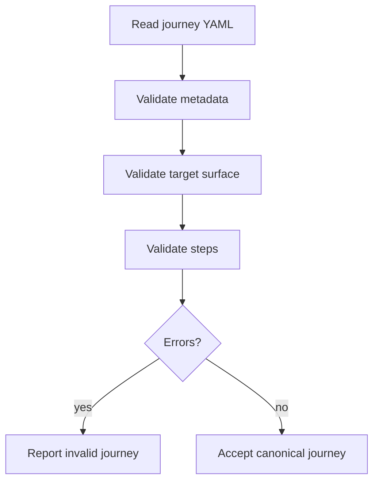
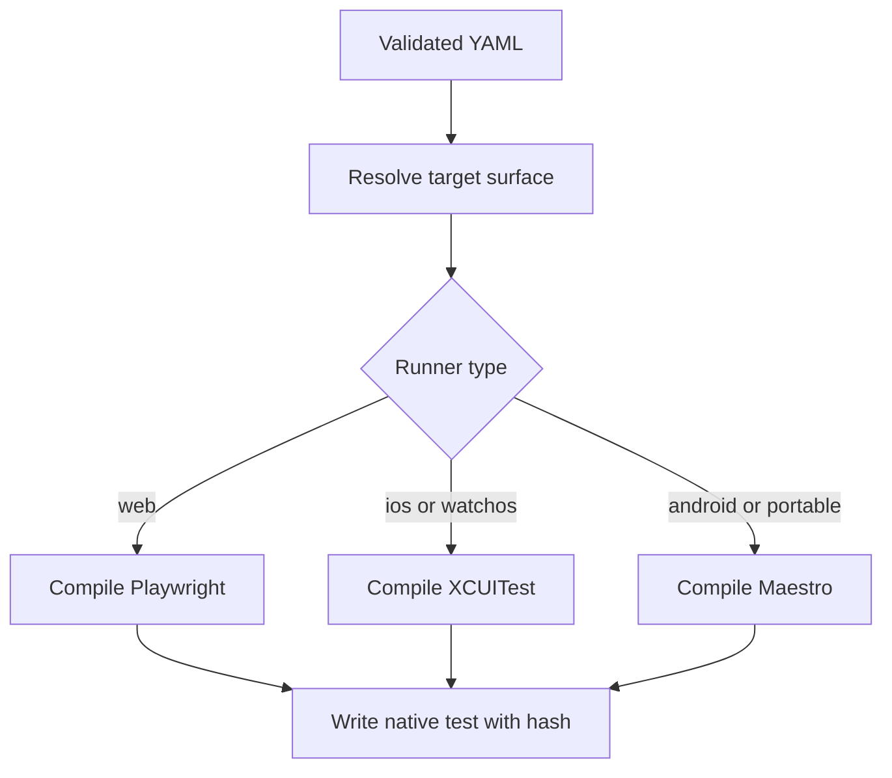
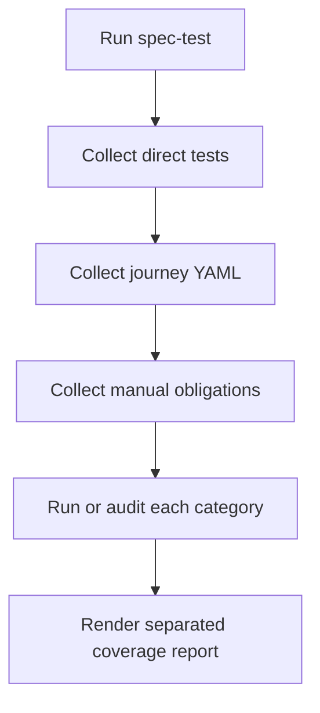
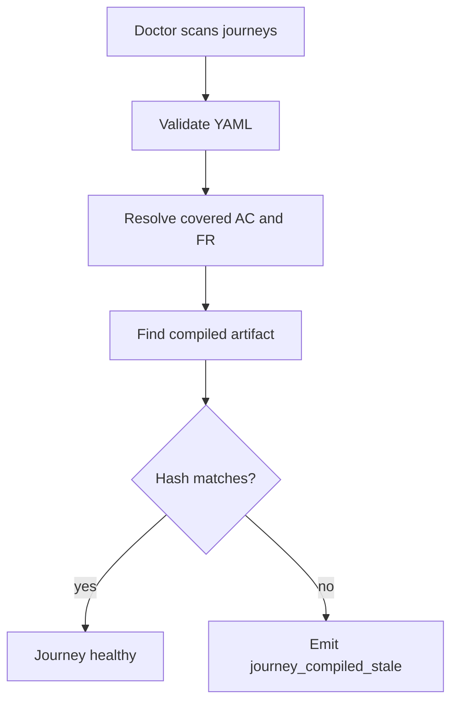

# Feature 055 - Executable User Journeys

- **Feature Name:** Executable User Journeys
- **Branch:** `main`
- **Date:** 2026-06-01
- **Status:** Draft
- **Input:** Add human-readable functional user journeys as YAML source files that LiveSpec can validate, compile ahead-of-time to native project test frameworks, run as regression tests, and audit through Spec Doctor. These journeys must be distinct from direct tests generated by `/spec-test`.

## User Scenarios & Testing

### Story 1 (P1) - Product owner defines a functional journey in YAML

**Description:** A user needs to describe a real user flow in a format that remains readable, reviewable, and independent of Playwright, XCUITest, Maestro, or any single project test framework.

**Priority reason:** User journeys are functional source-of-truth artifacts; generated tests are implementation artifacts.

**Independent test:** A valid YAML journey with `open`, `fill`, `click`, `wait`, and `assert` passes schema validation.

```gherkin
Feature: Journey YAML validation
  Scenario: Valid login journey is accepted
    Given a journey file ".specs/journeys/012-auth/login-happy-path.journey.yaml"
    And the journey contains open, fill, click, wait, and assert steps
    When the user runs "livespec journey validate"
    Then the journey validates successfully
```



### Story 2 (P1) - Developer compiles journeys ahead-of-time to native tests

**Description:** A developer needs LiveSpec to compile the canonical YAML into the project's native test framework before execution, so syntax or target errors are caught early and not generated dynamically at runtime.

**Priority reason:** Dynamic translation at test time would create a new source of flakiness and ambiguity.

**Independent test:** A web journey compiles to Playwright and an iOS journey compiles to XCUITest with a source hash embedded in each artifact.

```gherkin
Feature: Journey compilation
  Scenario: Web journey compiles to Playwright
    Given a valid journey targeting surface "web"
    When the user runs "livespec journey compile --feature 012-auth"
    Then a Playwright spec is generated under "tests/e2e/journeys"
    And the generated file contains the journey source hash

  Scenario: iOS journey compiles to XCUITest
    Given a valid journey targeting surface "ios"
    When the user runs "livespec journey compile --feature 012-auth"
    Then a Swift UI test is generated under "STRAPTUITests/Journeys"
    And the generated file contains the journey source hash
```



### Story 3 (P1) - Regression runs distinguish journeys from direct tests

**Description:** A developer needs `/spec-test` and feature pipelines to distinguish direct generated tests from executable user journeys and from manual test obligations.

**Priority reason:** Ambiguous test categories make coverage reports misleading.

**Independent test:** A test audit report shows separate counts for direct tests, journeys, and manual tests.

```gherkin
Feature: Test category reporting
  Scenario: Test report separates user journeys
    Given a feature has direct unit tests
    And the feature has two executable user journeys
    And the feature has one manual test obligation
    When "/spec-test" audits the feature
    Then the report lists direct tests separately from executable user journeys
    And manual tests remain separately labeled with their reason
```



### Story 4 (P1) - Spec Doctor detects stale or incoherent journeys

**Description:** A maintainer needs `spec-doctor` to detect invalid YAML, stale compiled artifacts, journeys covering removed ACs, and journeys targeting unsupported runners.

**Priority reason:** User journeys must not become another stale documentation layer.

**Independent test:** Modifying a journey YAML after compilation produces `journey_compiled_stale` in the doctor report.

```gherkin
Feature: Journey doctor integration
  Scenario: Compiled artifact is stale
    Given a journey YAML was compiled to a native test file
    And the YAML content changes after compilation
    When the maintainer runs "livespec doctor"
    Then the report includes "journey_compiled_stale"
```



## Acceptance Criteria

- **AC-001:** A valid `.journey.yaml` file is accepted by `livespec journey validate`.
- **AC-002:** A journey with an unknown action fails with a clear validation error.
- **AC-003:** `wait.seconds` with `until` compiles to a bounded conditional wait.
- **AC-004:** `wait.seconds` without `until` and without `reason` produces a warning.
- **AC-005:** `livespec journey compile` generates a Playwright artifact for a web surface.
- **AC-006:** `livespec journey compile` generates an XCUITest artifact for an iOS surface.
- **AC-007:** `livespec journey compile` generates an XCUITest artifact for a watchOS surface when the project exposes that runner.
- **AC-008:** Each compiled artifact includes a deterministic source hash for the YAML.
- **AC-009:** Changing the YAML after compilation makes Spec Doctor report `journey_compiled_stale`.
- **AC-010:** A journey covering a removed or superseded AC produces a doctor finding.
- **AC-011:** `/spec-test` reports direct tests, executable user journeys, and manual tests as distinct categories.
- **AC-012:** `/spec-feature` compiles journeys before running the feature's functional test suite.
- **AC-013:** A journey targeting a surface without a compatible runner fails with an actionable message.
- **AC-014:** `disabled` journeys are not executed but remain visible in doctor reports.
- **AC-015:** `manual` journeys require a reason before they can suppress executable coverage expectations.

## Functional Requirements

- **FR-001:** Add `system/testing/user-journeys.md` as the canonical format reference.
- **FR-002:** Add a `validator/journeys/` package with schema validation, compilation, hashing, and reporting.
- **FR-003:** Add CLI commands `livespec journey validate`, `livespec journey compile`, and `livespec journey test`.
- **FR-004:** Define canonical journey source files under `.specs/journeys/<feature-slug>/<journey-id>.journey.yaml`.
- **FR-005:** Support v1 actions: `open`, `click`, `fill`, `select`, `wait`, `assert`, `assert_not`, `screenshot`, `back`, and `press`.
- **FR-006:** Compile web journeys to Playwright tests under the project's native e2e test location.
- **FR-007:** Compile iOS and watchOS journeys to XCUITest Swift files under native UI test targets.
- **FR-008:** Compile Maestro journeys when a compatible Maestro runner is available.
- **FR-009:** Embed a source hash in compiled artifacts and expose stale detection to Spec Doctor.
- **FR-010:** Update `/spec-specify` to propose 1 to 3 journeys for interactive features.
- **FR-011:** Update `/spec-feature` to generate, compile, and execute journeys as part of the feature pipeline.
- **FR-012:** Update `/spec-test` to distinguish direct tests, executable journeys, and manual obligations.
- **FR-013:** Add `scan_journeys(project_root)` so Feature 054 integrates with Feature 053 without duplicating doctor logic.

## Key Entities

- **JourneyFile:** Canonical YAML source for one functional user path.
- **JourneyStep:** A typed action such as `click`, `fill`, `wait`, or `assert`.
- **JourneyTarget:** Surface and runner resolution data for web, iOS, watchOS, Android, or Maestro.
- **CompiledJourneyArtifact:** Native generated test file with source hash and back-reference to the YAML.
- **JourneyRunPolicy:** `always`, `smoke`, `manual`, `disabled`, or future policy extension.

## Canonical YAML Shape

```yaml
id: login-happy-path
feature: 012-auth
title: User can log in
tags: [regression, functional, auth]
run_policy: always
covers:
  ac: [AC-001, AC-002]
target:
  surface: web
steps:
  - open: "/login"
  - fill: { label: "Email", value: "user@example.com" }
  - fill: { label: "Password", value: "password123" }
  - click: { role: "button", name: "Login" }
  - wait: { seconds: 10, until: { text: "Dashboard" } }
  - assert: { text: "Dashboard" }
```

## Edge Cases

- A journey waits for a fixed delay only: warn unless it includes a reason.
- A journey references a deleted AC: doctor reports incoherence and the journey does not count as current coverage.
- A compiled artifact exists but the source YAML is missing: doctor reports an orphan compiled journey.
- A project has multiple compatible runners: use the target surface to choose the compiler and fail if ambiguous.
- A journey is marked manual: require a reason and keep it separate from executable regression coverage.

## Success Criteria

- **SC-001:** Journey validation rejects malformed YAML and unknown actions with actionable errors.
- **SC-002:** Playwright and XCUITest compilers produce deterministic artifacts from the same YAML.
- **SC-003:** Spec Doctor detects stale compiled journeys using source hashes.
- **SC-004:** `/spec-test` reports journey coverage separately from direct generated tests.
- **SC-005:** The format is portable enough that Swift-only projects do not need Playwright as a dependency.
