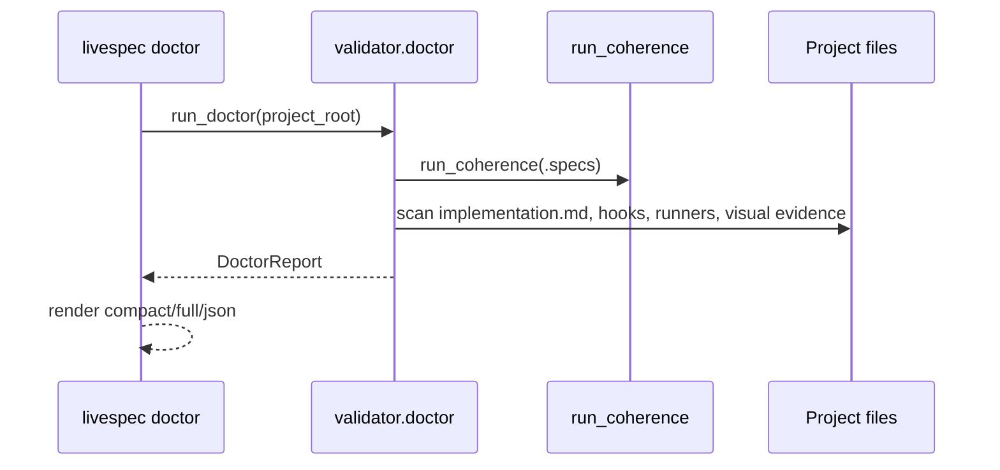
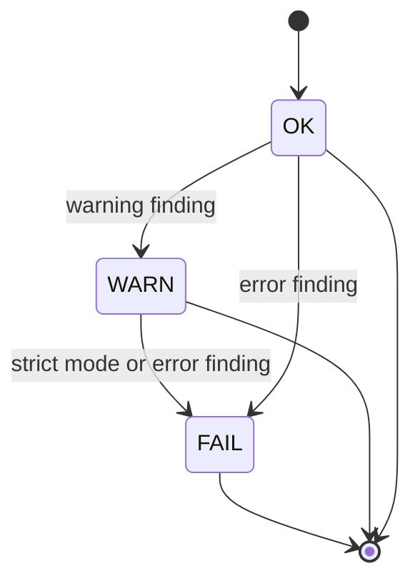
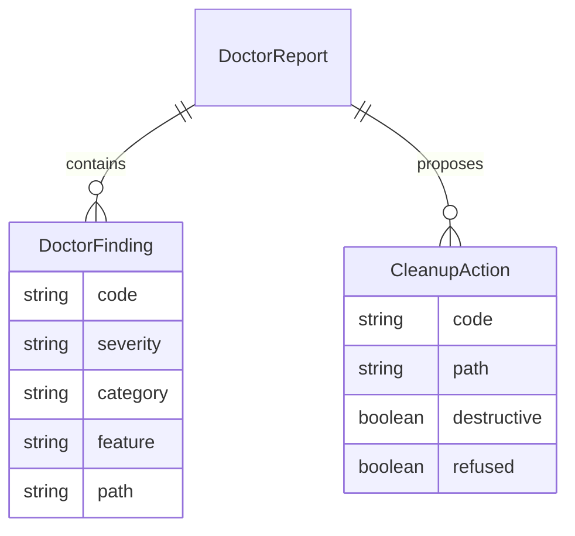

# Plan — Spec Doctor Project Health

## Summary

Add `livespec doctor` as a project-level health audit that reuses coherence validation and layers deterministic scans for stale mappings, runner drift, hook enforcement, lifecycle ambiguity, visual orphans, and cleanup planning.

## Technical Context

| Dimension | Decision |
|---|---|
| Language | Python 3.12+ |
| CLI | Typer top-level `livespec doctor` command |
| Package | New `validator/doctor/` domain package |
| Existing dependency reused | `validator.coherence.run_coherence`, `frontmatter` |
| Tests | Focused pytest CLI tests in `tests/test_doctor.py` |
| Mutability | Default and `--fix-plan` are read-only; `--apply-cleanup` refuses destructive evidence deletion |

## Constitution Check

- Spec source of truth: implementation maps FR/AC coverage through `implementation.md` and `@spec` anchors.
- Living specs: this plan and feature changelog are created with the code change.
- Testable behavior: doctor findings are covered by fixture-backed CLI tests.
- Minimal dependency: no new third-party dependency is introduced.
- Safety: cleanup planning is non-destructive and destructive cleanup is refused.

## Gherkin Scenarios + Mermaid Sequence Diagrams

```gherkin
Feature: Project doctor
  Scenario: JSON audit finds stale mappings and hook drift
    Given a LiveSpec project with an implementation map
    And mapped code and test files are missing
    When the maintainer runs "livespec doctor --format json"
    Then the report status is "FAIL"
    And findings include "mapping_stale", "missing_test_file", and "hook_unenforced"
```



## Mermaid State Diagrams



## Mermaid ER Diagrams



## Implementation Plan

1. Add RED CLI tests for stale mappings, missing tests, runner drift, hook enforcement, visual orphan cleanup planning, and cleanup refusal.
2. Add `validator/doctor/` with typed report models, scanner orchestration, and text/JSON renderers.
3. Register `livespec doctor` in the unified Typer command layer.
4. Add the `.agent-sync/skills/spec-doctor/` command skill and expectations contract.
5. Update README, command registry tests, and feature artifacts.
6. Run focused doctor tests, command registry/audit tests, validation, lint, and type checking.

## Testing Strategy

- `pytest tests/test_doctor.py -q`
- `pytest tests/test_command_registry.py tests/test_command_audit_cli.py -q`
- `livespec validate .specs/features/055-spec-doctor-project-health/spec.md --format compact`
- `livespec validate .specs/features/055-spec-doctor-project-health/plan.md --format compact`
- `ruff check validator/doctor validator/cli_commands/doctor_cmd.py tests/test_doctor.py`
- `pyright validator/doctor validator/cli_commands/doctor_cmd.py tests/test_doctor.py`

## Risks & Considerations

- Runner inclusion is best-effort until every stack exposes normalized driver metadata. Missing or non-matching runner config is reported as actionable drift instead of false success.
- Hook enforcement differs by project; doctor looks for LiveSpec validation in common git hook locations and reports missing enforcement as a warning unless `--strict` promotes it.
- `--apply-cleanup` intentionally refuses destructive visual evidence deletion until a future feature defines safe archive semantics.
