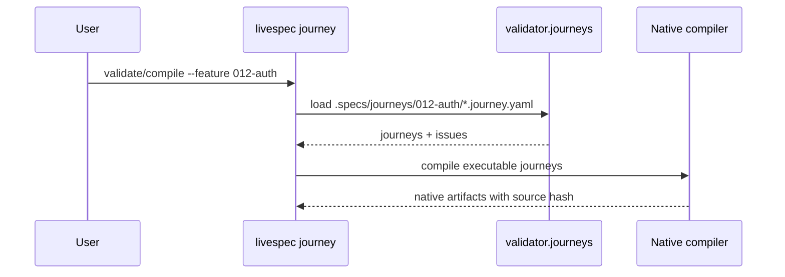
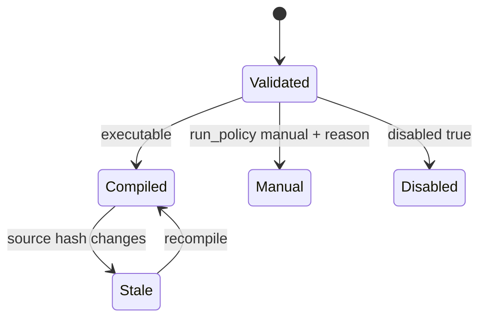

# Plan — 056 Executable User Journeys

## Summary

Add canonical YAML journey sources, validation, ahead-of-time native compilers, doctor drift checks, and separate journey category reporting.

## Technical Context

- Python package: `validator/journeys/`.
- CLI: Typer unified command registration.
- YAML: PyYAML at file boundary.
- Tests: pytest focused unit/CLI coverage.
- No HTTP API or persistent database.

## Constitution Check

- Spec-first: Feature 056 spec exists and remains source of truth.
- Local-first: compile outputs are deterministic local files.
- Portable: Playwright, XCUITest, and Maestro outputs avoid requiring one universal runner.
- Traceable: compiled artifacts embed source hashes and implementation maps FR/AC.

## Implementation Plan

| Step | Files | Work |
|---|---|---|
| 1 | `system/testing/user-journeys.md` | Document YAML shape, actions, commands, compilers, doctor behavior. |
| 2 | `validator/journeys/models.py` | Typed journey, validation, compile, and report models. |
| 3 | `validator/journeys/validator.py` | Validate required fields, allowed actions, manual reason, wait warning, supported target. |
| 4 | `validator/journeys/paths.py` | Resolve `.specs/journeys/<feature>/` and deterministic output paths. |
| 5 | `validator/journeys/compiler.py` | Generate Playwright, XCUITest, and Maestro artifacts with source hash markers. |
| 6 | `validator/journeys/scanner.py` | Scan stale artifacts, missing AC/FR references, manual and disabled journeys. |
| 7 | `validator/cli_commands/journey_cmd.py`, `validator/cli_commands/__init__.py` | Add `livespec journey validate/compile/test`. |
| 8 | `validator/doctor/scanner.py` | Include journey findings in Spec Doctor. |
| 9 | `validator/cli_commands/test_cmd.py` | Report direct tests, executable journeys, manual tests, disabled journeys separately. |
| 10 | `.agent-sync/skills/spec-specify/SKILL.md`, `spec-feature/SKILL.md`, `spec-test/SKILL.md` | Document command pipeline integration. |
| 11 | `tests/test_journeys.py` | Validate CLI, compilers, doctor drift, and category reporting. |

## Mermaid Sequence

## State Diagram

## Testing Strategy

- `pytest tests/test_journeys.py -q`.
- Focused Ruff/Pyright on touched Python surface.
- Broader regression: `pytest tests/test_journeys.py tests/test_doctor.py tests/test_cli_unified.py -q`.
- Final project checks: `ruff check .`, `pyright`, `pytest`.

## Risks

- Native generated tests are deterministic scaffolds, not full runner orchestration.
- XCUITest destination uses a stable default target until project-specific surface metadata is added.
