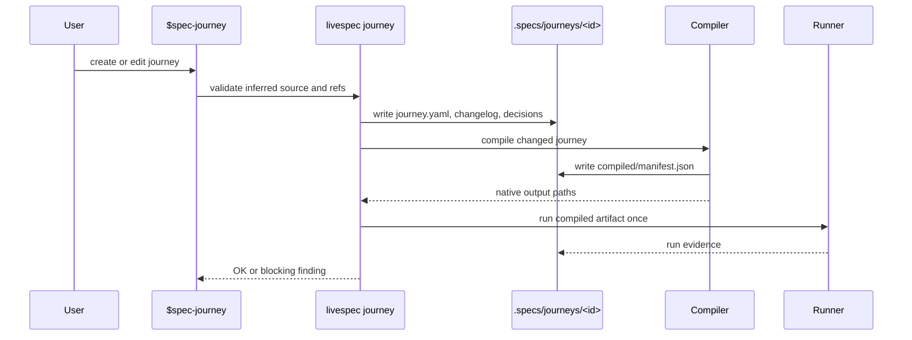
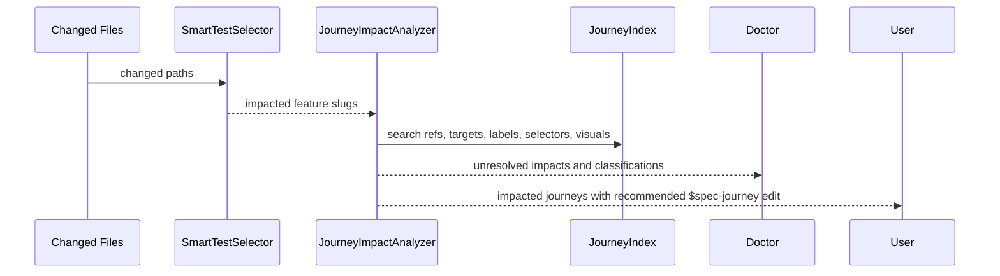
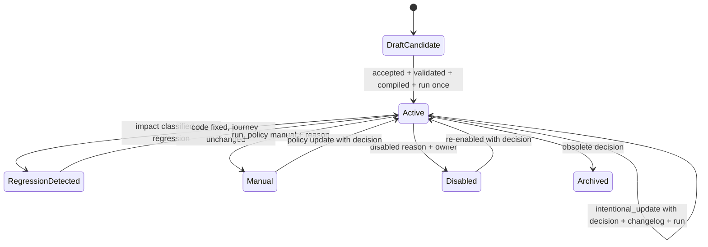
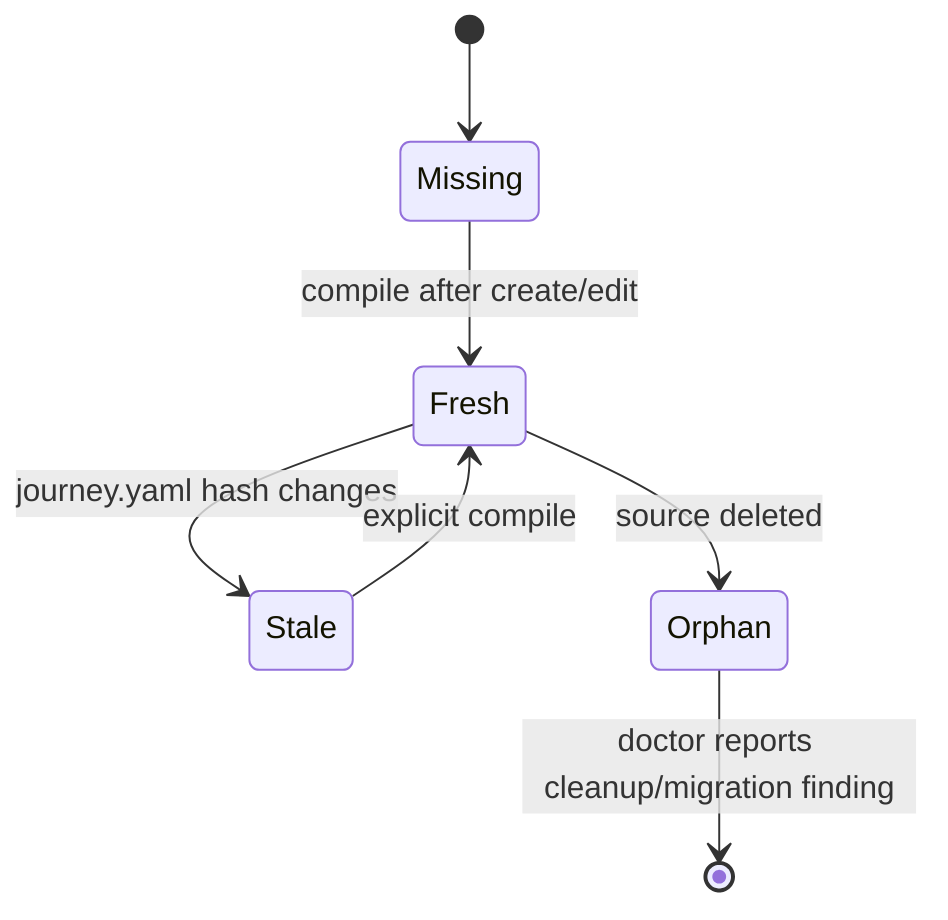
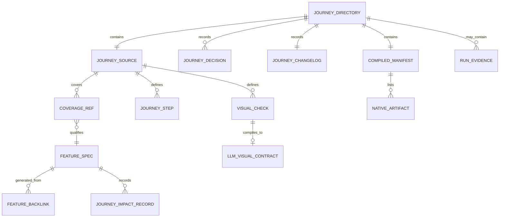

# Plan - Cross-Feature User Journeys v2

## Summary

Replace feature-scoped executable journeys with a global v2 journey system: portable YAML sources, mandatory history/decisions, automatic feature assignment, impact detection, ahead-of-time native compilation, compiled-only regression execution, native/LLM visual checks, v1 migration, doctor validation, CLI support, and `$spec-journey` workflow documentation.

## Technical Context

- **Project:** LiveSpec, local file-system spec framework and Python CLI validator.
- **Runtime:** Python 3.11+ per [stack](../../stacks/_default.md); keep implementation compatible with current `pyproject.toml`.
- **Primary dependencies:** Pydantic v2, Typer, PyYAML, Rich, python-frontmatter, pytest, ruff, pyright.
- **Current v1 baseline:** `validator/journeys/*` parses `.specs/journeys/<feature>/*.journey.yaml`, compiles inside `journey test`, and stores artifacts by feature.
- **Target v2:** `.specs/journeys/<journey-id>/journey.yaml` is canonical; `run` and `$spec-test` never compile.
- **LLM integration:** reuse the provider-agnostic LiveSpec LLM boundary; do not hardcode model/provider names.
- **No hosted infrastructure:** all state remains in `.specs/`, native test files, or local ignored run output.
- **Conventions loaded:** code conventions from `/Users/julienm/projects/ai-ressources/code-conventions/` apply; Python modules need explicit typing, focused files, Pydantic at YAML boundaries, domain errors, and pytest coverage.

## Constitution Check

- **Layered Validation:** v2 keeps structural YAML/schema validation separate from cross-file coherence, capability checks, semantic/LLM checks, and doctor reporting.
- **Provider-Agnostic LLM:** LLM visual checks use a provider abstraction and strict JSON contracts; missing provider/privacy blocks clearly.
- **File-System as Source of Truth:** journey source, history, decisions, manifests, backlinks, and impact records are files under `.specs/` or generated native test paths.
- **Fail Fast, Exit Clearly:** every invalid schema/ref/capability/privacy/stale artifact emits a stable rule code, path, and fix hint.
- **Minimal Surface, Maximum Composability:** keep `livespec journey` as one Typer sub-app with subcommands and JSON flags; `$spec-journey` wraps those primitives.
- **No Hosted Infrastructure:** no server, database, telemetry, or remote state.

## Gherkin Scenarios + Mermaid Sequence Diagrams

```gherkin
Feature: Create or edit a v2 journey
  Scenario: Create compiles and runs once
    Given the user describes a cross-feature journey
    When $spec-journey create accepts the inferred refs
    Then LiveSpec writes the v2 journey directory
    And validates the source
    And compiles native artifacts
    And runs the compiled artifacts once
    And records manifest, run evidence, backlinks, changelog, and decision

  Scenario: Run refuses stale compiled output
    Given journey.yaml changed after compilation
    When livespec journey run --journey onboarding-first-project is executed
    Then the command fails with journey_compiled_stale
    And no generated artifact is rewritten
```



```gherkin
Feature: Impact detection before regression failures
  Scenario: Label change touches an old journey
    Given a changed file modifies visible text used by a journey target
    When livespec journey impact --changed-files runs
    Then the old journey is reported with reason, confidence, required classification, and command
```



## Gherkin Scenarios + Mermaid State Diagrams

```gherkin
Feature: Journey lifecycle governance
  Scenario: Existing journey edit requires history
    Given a v2 journey already exists
    When journey.yaml changes
    Then validation requires a classification, changelog entry, decision file, and validation run evidence
```



```gherkin
Feature: Compiled artifact lifecycle
  Scenario: Source hash mismatch blocks execution
    Given manifest.source_hash differs from journey.yaml hash
    When the journey is selected for run
    Then execution stops before native runner invocation
```



## Mermaid ER Diagrams



## Implementation Plan

### Step 1 - Add v2 typed model layer

- Replace dataclass-only journey source modeling with Pydantic boundary models in `validator/journeys/schema.py`.
- Keep lightweight dataclasses for internal result/finding types in `validator/journeys/models.py` when useful, but make `JourneySourceV2`, `CoverageRef`, `JourneyTarget`, `RunPolicy`, `Preconditions`, `JourneyStep`, `VisualCheck`, `PrivacyPolicy`, `JourneyDecisionMetadata`, `CompiledManifest`, and `JourneyRunEvidence` explicit models.
- Add enums for status, edit classification, run policy value, stage, runner, action, target kind, assertion kind, visual mode, privacy retention, and severity.
- Preserve v1 action names and introduce v2 target/assertion payloads without accepting untyped arbitrary maps except where a runner-specific extension field is intentionally documented.
- Covered: FR-001 through FR-006, FR-017, FR-031 through FR-039; AC-001 through AC-005, AC-018, AC-035 through AC-043.

### Step 2 - Replace path helpers with v2 layout support

- Update `validator/journeys/paths.py` to expose v2 helpers:
  - journey root, journey directory, source path, changelog path, decisions directory, compiled directory, manifest path, runs directory, visual contract paths, feature backlink path, feature impact path.
- Add separate v1 discovery helpers for `.specs/journeys/<feature>/*.journey.yaml`; never mix v1 and v2 scans silently.
- Make `iter_journey_sources()` return v2 sources by default and offer explicit `iter_v1_journey_sources()` for migration/doctor only.
- Keep native output path resolution in a compiler registry module, not in generic paths.
- Covered: FR-002, FR-003, FR-004, FR-040; AC-001, AC-002, AC-003, AC-044.

### Step 3 - Build the v2 validator and index

- Rewrite `validator/journeys/validator.py` around Pydantic parsing plus project-aware validation.
- Validate directory contract, global ID uniqueness, source ID equals directory name, required files, changelog presence, decision presence for existing edits, stage policies, manual/disabled reasons, secrets, fixture names, qualified coverage refs, backlinks, capabilities, visual checks, LLM privacy, manifest freshness, and v1 leftovers.
- Add `validator/journeys/index.py` to build a reusable project index of journey IDs, covered features, coverage refs, targets, selectors, labels, visual checks, manifest state, decisions, and last run.
- Add `validator/journeys/history.py` to validate changelog/decision/run evidence coherence.
- Add `validator/journeys/backlinks.py` to render and verify generated `.specs/features/<feature>/journeys.md`.
- Covered: FR-004 through FR-012, FR-017, FR-018; AC-003 through AC-011, AC-018, AC-019.

### Step 4 - Implement journey history and decision governance

- Define a decision filename convention: `YYYY-MM-DD-<trigger-feature-or-system>-<slug>.md`.
- Validate that any source hash change after initial creation has exactly one matching decision entry and one changelog entry for the changed hash or run ID.
- Validate classifications: `regression`, `intentional_update`, `obsolete`, `selector_fix`, `coverage_expansion`.
- For `intentional_update`, require triggering feature, affected features, before/after refs, reason, author/tool, date, and validation run.
- For `obsolete` and `disabled`, require owner and reason.
- Covered: FR-008 through FR-012; AC-007 through AC-011.

### Step 5 - Add bootstrap and auto-assignment services

- Add `validator/journeys/assignment.py` to infer candidate coverage refs from specs, Gherkin, implementation maps, `@spec` anchors, tests, routes, components, mockups, screens, Penflow outputs, logs, labels, i18n keys, semantic IDs, test IDs, and accessibility labels.
- Add `validator/journeys/bootstrap.py` to cluster existing project evidence into candidate journeys without writing until accepted.
- Return candidate ID, title, description, covered features, AC/FR refs, evidence, confidence, ambiguity flags, and conflicts.
- Make ambiguous ownership a pending candidate, not a write.
- Covered: FR-013 through FR-016; AC-012 through AC-017.

### Step 6 - Add JourneyImpactAnalyzer

- Add `validator/journeys/impact.py` above `validator/selector.py`.
- Feed it `SmartTestSelector.from_changed_files()` output plus direct scans for labels, i18n keys, semantic IDs, `data-testid`, role/name, accessibility labels, routes/screens/components, fixtures/seeds/auth, mockups/Penflow files, runner config, existing journey targets, visual checks, and decisions.
- Output structured `JourneyImpact` records: journey ID, reason, source signal, confidence, affected features, required classification, recommended command, blocking status.
- Add low-confidence unresolved impacts as blocking when they touch product-contract targets or visual contracts.
- Covered: FR-019 through FR-021; AC-020 through AC-022.

### Step 7 - Split compiler into registry, capabilities, and runner compilers

- Replace monolithic `validator/journeys/compiler.py` with a small facade plus modules:
  - `compiler_registry.py`
  - `capabilities.py`
  - `manifest.py`
  - `compilers/playwright.py`
  - `compilers/xcuitest.py`
  - `compilers/maestro.py`
  - `compilers/pytest.py`
  - `compilers/cargo.py`
  - `visual_contracts.py`
- The registry validates action/assertion/visual/fixture/privacy capabilities before writing files.
- Keep unsupported capabilities as compile-time errors, never comments in generated artifacts.
- Compile Playwright/XCUITest/Maestro fully; pytest/cargo produce only capability-supported artifacts or a clear unsupported-capability error for UI-only journeys.
- Covered: FR-028 through FR-030, FR-031 through FR-039; AC-032 through AC-043.

### Step 8 - Define manifest semantics

- Write `.specs/journeys/<id>/compiled/manifest.json` after successful compilation.
- Manifest fields: schema version, journey ID, source path, source hash, compiler version, generated at, targets, runner, capabilities, native output paths, visual contract paths, privacy summary, source schema version, and artifact markers.
- Embed journey ID, source hash, schema version, and compiler version in every native artifact.
- Add manifest read/check helpers used by validator, doctor, and run commands.
- Covered: FR-023, FR-024, FR-029, FR-030; AC-027, AC-028, AC-033, AC-034.

### Step 9 - Implement compiled-only run semantics

- Add `validator/journeys/runner.py` to select journeys by journey ID, feature, impacted set, all, and stage.
- `run_journeys()` must read manifests, verify source hash, apply run policy, invoke native runner commands, and collect direct/manual/disabled/stale results.
- `run_journeys()` must never call compile code.
- Stale or missing manifests fail with actionable messages and exit code 1 for blocking selections.
- Manual and disabled journeys are reported separately and never executed.
- Covered: FR-023 through FR-027; AC-027 through AC-031.

### Step 10 - Extend `livespec journey` CLI

- Update `validator/cli_commands/journey_cmd.py` with:
  - `validate --journey --feature --json`
  - `compile --journey --changed --force`
  - `run --journey --feature --impacted --all --stage --json`
  - `impact --feature --changed-files --json`
  - `migrate --from-v1`
  - `list --json`
  - `inspect <journey-id> --json`
- Remove or deprecate `journey test`; if kept as alias, it must delegate to `run` and never compile.
- Keep stdout/stderr separation for JSON output and actionable human summaries.
- Covered: FR-022 through FR-027; AC-023 through AC-031.

### Step 11 - Integrate with `livespec test`, `$spec-test`, `$spec-feature`, and `$spec-implement`

- Update `validator/cli_commands/test_cmd.py` to run compiled covering/impacted journeys after direct tests, without compiling.
- Add a journey selection service shared by `livespec test`, `livespec journey run`, and future skill wrappers.
- Update `.agent-sync/skills/spec-test/SKILL.md` so coverage audit reads v2 global journeys and reports direct, covering, impacted, manual, disabled, and stale categories.
- Update `.agent-sync/skills/spec-feature/SKILL.md` and `.agent-sync/skills/spec-implement/SKILL.md` so post-implementation gates run impacted existing compiled journeys.
- Covered: FR-024 through FR-027, FR-041; AC-028 through AC-031, AC-045.

### Step 12 - Create `$spec-journey` skill surface

- Add `.agent-sync/skills/spec-journey/SKILL.md` and expectations if this repository uses expectation files for command verification.
- Document commands: `create`, `edit`, `bootstrap --from-existing`, `impact`, `run`, `list`, `inspect`.
- Make the skill explicitly support implemented/old features and state that `$spec-refine` is not required.
- Include interaction rules: infer refs, show evidence/confidence, allow correction before write, validate, compile, run once, record history, update backlinks.
- Add command routing docs so natural-language requests for journeys route to `$spec-journey`.
- Covered: FR-013 through FR-016, FR-041; AC-012 through AC-017, AC-045.

### Step 13 - Add native visual checks

- Add deterministic visual check models and compiler support for text fitting, overflow, centering, min margin, padding/gap, within-parent bounds, no overlap, screenshot region, responsive viewport matrix, and long-content fixtures.
- For Playwright, compile checks to locator bounding-box and screenshot assertions where possible.
- For XCUITest and Maestro, implement supported checks and reject unsupported checks through the capability registry.
- Add measured bounds to failure output when the runner supports it.
- Covered: FR-034, FR-035; AC-038, AC-039.

### Step 14 - Add LLM visual checks

- Add `validator/journeys/llm_visual.py` for strict JSON evaluation contracts and provider-boundary calls.
- Compile `llm` and `native_then_llm` into native screenshot capture artifacts plus JSON visual contracts; LLM never navigates or operates the UI.
- Enforce privacy policy before compile/run: LLM allowed, masking list, retention, local/offline requirement.
- Local default is advisory; blocking requires explicit config.
- Malformed LLM JSON is blocking for the LLM evaluation result.
- Covered: FR-035 through FR-039; AC-039 through AC-043.

### Step 15 - Implement v1 migration

- Add `validator/journeys/migration.py` with dry-run planning and apply mode for `.specs/journeys/<feature>/<id>.journey.yaml`.
- Convert `feature`, `covers.ac`, and `covers.fr` into qualified coverage refs.
- Create v2 directory, `journey.yaml`, `changelog.md`, migration decision file, initial manifest state, backlinks, and doctor-visible leftovers.
- Handle ID collisions with deterministic alternatives plus explicit conflict output.
- Do not fabricate refs when the feature spec is missing; emit blocked migration report.
- Covered: FR-040; AC-044.

### Step 16 - Extend doctor reporting

- Update `validator/journeys/scanner.py` and `validator/doctor/scanner.py` to report v2 findings:
  - invalid schema
  - missing decision
  - stale/missing/orphan artifacts
  - missing refs
  - unresolved impacts
  - unsupported checks
  - privacy violations
  - backlink drift
  - v1 leftovers
  - manual/disabled reason gaps
- Suggested actions must name the exact `livespec journey` or `$spec-journey` command.
- Covered: FR-018, FR-040; AC-019, AC-044.

### Step 17 - Update documentation

- Update `system/testing/user-journeys.md` from v1 source-path semantics to v2 global semantics.
- Update `.specs/README.md` command index if generated command docs require manual sync.
- Update `.agent-sync/skills/spec-check/SKILL.md`, `.agent-sync/skills/spec-migrate/SKILL.md`, and their expectations to include v2 checks/migration.
- Update LiveSpec command docs/routing so `$spec-journey` is discoverable.
- Covered: FR-041; AC-045.

### Step 18 - Preserve backward compatibility boundaries

- Keep explicit v1 reader/migration code isolated behind `migration.py` and doctor leftover scan.
- Do not let v1 files participate in normal v2 validation/run except as migration findings.
- Keep current Feature 056 behavior covered by tests until v2 replacements land, then update implementation maps.
- Covered: FR-001, FR-040, FR-041; AC-044, AC-045, AC-046.

## File-Level Implementation Map

| Area | Files |
|---|---|
| Existing journey package to refactor | `validator/journeys/models.py`, `validator/journeys/paths.py`, `validator/journeys/validator.py`, `validator/journeys/compiler.py`, `validator/journeys/scanner.py`, `validator/journeys/__init__.py` |
| New journey modules | `validator/journeys/schema.py`, `validator/journeys/index.py`, `validator/journeys/history.py`, `validator/journeys/backlinks.py`, `validator/journeys/assignment.py`, `validator/journeys/bootstrap.py`, `validator/journeys/impact.py`, `validator/journeys/runner.py`, `validator/journeys/manifest.py`, `validator/journeys/migration.py`, `validator/journeys/capabilities.py`, `validator/journeys/compiler_registry.py`, `validator/journeys/visual_contracts.py`, `validator/journeys/llm_visual.py` |
| Runner compilers | `validator/journeys/compilers/playwright.py`, `validator/journeys/compilers/xcuitest.py`, `validator/journeys/compilers/maestro.py`, `validator/journeys/compilers/pytest.py`, `validator/journeys/compilers/cargo.py` |
| CLI integration | `validator/cli_commands/journey_cmd.py`, `validator/cli_commands/test_cmd.py`, `validator/doctor/scanner.py`, `validator/selector.py` only if shared hooks are needed |
| Skills/docs | `.agent-sync/skills/spec-journey/SKILL.md`, `.agent-sync/skills/spec-feature/SKILL.md`, `.agent-sync/skills/spec-implement/SKILL.md`, `.agent-sync/skills/spec-test/SKILL.md`, `.agent-sync/skills/spec-check/SKILL.md`, `.agent-sync/skills/spec-migrate/SKILL.md`, `system/testing/user-journeys.md` |
| Tests | `tests/test_journeys.py`, `tests/test_selector.py`, `tests/test_doctor.py`, `tests/test_cli.py`, `tests/test_cli_unified.py`, plus new focused `tests/test_journey_*.py` files when `tests/test_journeys.py` would exceed project limits |
| Fixtures | `tests/fixtures/journeys/v2-valid`, `tests/fixtures/journeys/v2-invalid`, `tests/fixtures/journeys/v1-migration`, `tests/fixtures/journeys/impact`, `tests/fixtures/journeys/visual`, `tests/fixtures/journeys/llm` |

## Testing Strategy

### TDD Order

1. Write failing schema/path tests for v2 source layout, qualified refs, unique IDs, run policies, privacy, and history requirements.
2. Implement Pydantic schema/path/index validation until schema tests pass.
3. Write failing migration tests for v1 source conversion, ID collisions, missing feature specs, changelog/decision/backlinks, and leftovers.
4. Implement migration and doctor leftover findings.
5. Write failing impact tests for label, selector, mockup/Penflow, route/component, fixture/auth, and runner-config impacts.
6. Implement `JourneyImpactAnalyzer`.
7. Write failing compiler/capability tests for supported Playwright/XCUITest/Maestro output, pytest/cargo compatibility errors, manifest metadata, and artifact markers.
8. Implement compiler registry and manifest helpers.
9. Write failing run tests proving `run` and `livespec test` never call compile and stale artifacts fail.
10. Implement runner and CLI commands.
11. Write failing native visual tests for overflow, text fit, margins, centering, parent bounds, overlap, screenshot region, viewport matrix, and long-content fixtures.
12. Implement native visual checks by runner capability.
13. Write failing LLM tests with fake provider: strict JSON pass/fail, malformed JSON, privacy denied, advisory local, blocking configured.
14. Implement LLM visual contract/evaluator.
15. Write failing skill/docs command-surface tests or static audits for `$spec-journey`, `$spec-test`, `$spec-feature`, `$spec-implement`, `$spec-check`, and `$spec-migrate`.
16. Update docs/skills.
17. Run full validator, CLI, doctor, lint, format check, type check, and pytest suite.

### Required Test Scenarios

- **Schema:** valid v2, invalid root, missing required fields, duplicate ID, source ID mismatch, unqualified AC/FR, invalid status, invalid stage policy, missing manual/disabled reason, secret in YAML, invalid privacy, invalid visual mode.
- **History:** existing journey edit without decision, missing changelog, invalid classification, intentional update missing before/after refs, obsolete without reason, validation run missing.
- **Backlinks:** generated backlinks for multiple features, missing backlink, stale backlink, backlink to no-longer-covered feature.
- **Migration:** v1 happy path, ID collision, missing feature spec, unqualified refs conversion, changelog and decision creation, v1 leftover doctor finding.
- **Impact:** label change, selector change, i18n key change, semantic/test ID change, accessibility label change, route/component change, fixture/seed/auth change, mockup/Penflow change, low-confidence unresolved impact blocking.
- **Compile:** Playwright generation, XCUITest generation, Maestro generation, pytest/cargo unsupported capability, visual contract generation, manifest fields, artifact markers.
- **Run:** create/edit compile-run once, `journey run` no compile, `$spec-test` no compile, stale hash fails, missing manifest fails, manual/disabled reported not executed, stage policy selection.
- **Visual native:** text overflow, text fits, min margin, padding/gap, centered, within parent, no overlap, screenshot region, responsive viewport matrix, long-content fixture.
- **LLM:** privacy denied, masking required, fake provider pass/fail, malformed JSON blocks, advisory local result, blocking configured result, screenshot-only contract.
- **Doctor:** all AC-019 finding categories, suggested actions, JSON/human output consistency.
- **CLI/skill:** all AC-023 through AC-026 flags, JSON output, stdout/stderr behavior, `$spec-journey` create/edit/bootstrap/impact/run/list/inspect documented.

### Verification Commands

- `pytest tests/test_journey_*.py -v --tb=short`
- `pytest tests/test_journeys.py tests/test_doctor.py tests/test_selector.py -v --tb=short`
- `pytest tests/test_cli.py tests/test_cli_unified.py -v --tb=short`
- `pytest tests/ --ignore=tests/integration -v --tb=short`
- `ruff check validator/ tests/`
- `ruff format --check validator/ tests/`
- `pyright validator/`

## Risks & Considerations

- **Large blast radius:** split implementation into model/validation, migration, compile/run, impact, visual/LLM, docs/skills phases with tests at each boundary.
- **Generated artifact churn:** compile only on create/edit or explicit compile; tests must assert run paths do not rewrite artifacts.
- **Runner differences:** capability registry is mandatory before compiler output so unsupported visual/action semantics fail early.
- **LLM reliability:** strict JSON, fake-provider tests, advisory defaults, privacy blocks, and no UI navigation by LLM reduce nondeterminism.
- **Backward compatibility:** v1 remains migration-only; normal v2 commands should not silently consume v1 sources.
- **Skill creation workflow:** because this adds a new skill, run the repo’s skill optimization/review workflow before commit and update referencing docs in the same change.
- **File size constraints:** split modules before exceeding 300 lines and split test files when a test module becomes difficult to scan.
- **No UI in LiveSpec itself:** visual checks are compiler/runtime capabilities for downstream projects, not visual tests for the LiveSpec CLI UI.

## Requirement Coverage

| FR Range | Covered By |
|---|---|
| FR-001 to FR-006 | Steps 1-3, 18 |
| FR-007 to FR-012 | Steps 3-4 |
| FR-013 to FR-016 | Steps 5, 12 |
| FR-017 to FR-018 | Steps 3, 16 |
| FR-019 to FR-021 | Step 6 |
| FR-022 to FR-027 | Steps 9-11 |
| FR-028 to FR-030 | Steps 7-8 |
| FR-031 to FR-039 | Steps 1, 7, 13-14 |
| FR-040 | Step 15, 18 |
| FR-041 | Steps 11-17 |

| AC Range | Covered By |
|---|---|
| AC-001 to AC-011 | Steps 1-4 |
| AC-012 to AC-017 | Steps 5, 12 |
| AC-018 to AC-019 | Steps 3, 16 |
| AC-020 to AC-022 | Step 6 |
| AC-023 to AC-031 | Steps 9-11 |
| AC-032 to AC-043 | Steps 7-8, 13-14 |
| AC-044 | Steps 15, 18 |
| AC-045 to AC-046 | Steps 11-17 |
