# Feature 057 - Cross-Feature User Journeys v2

- **Feature Name:** Cross-Feature User Journeys v2
- **Branch:** `codex/cross-feature-user-journeys-v2`
- **Date:** 2026-06-04
- **Status:** Implemented
- **Scope:** L
- **Input:** Replace feature-scoped executable journeys with a cross-feature User Journeys v2 model: global journey artifacts, automatic feature/AC/FR assignment, mandatory history and decisions, impact detection before failures, compile-on-create/edit only, native and LLM visual checks, bootstrap for old projects/features, v1 migration, doctor validation, and integration across `$spec-journey`, `$spec-feature`, `$spec-implement`, `$spec-test`, `$spec-check`, and `$spec-migrate`.

## User Scenarios & Testing

### Story 1 (P1) - Architect stores a journey as a global cross-feature artifact

**Description:** A LiveSpec maintainer needs each user journey to represent a real product path across one or more features instead of being stored under a single feature directory.

**Priority reason:** Regression journeys often cover onboarding, checkout, settings, and validation screens together; feature-scoped v1 storage loses this relationship and creates duplicate or stale flows.

**Independent test:** A v2 journey under `.specs/journeys/<journey-id>/journey.yaml` validates with qualified feature/AC/FR coverage and generated backlinks for every covered feature.

```gherkin
Feature: Cross-feature journey source model
  Scenario: Journey covers multiple features
    Given a journey directory ".specs/journeys/onboarding-first-project/"
    And "journey.yaml" declares "schema_version: 2"
    And its covers section references "001-onboarding AC-001" and "012-projects FR-003"
    When the maintainer runs "livespec journey validate --journey onboarding-first-project"
    Then validation succeeds
    And ".specs/features/001-onboarding/journeys.md" references the journey
    And ".specs/features/012-projects/journeys.md" references the journey

  Scenario: Unqualified AC reference is rejected
    Given a journey covers "AC-001" without a feature qualifier
    When the maintainer runs "livespec journey validate"
    Then validation fails with "journey_cover_ref_unqualified"
```

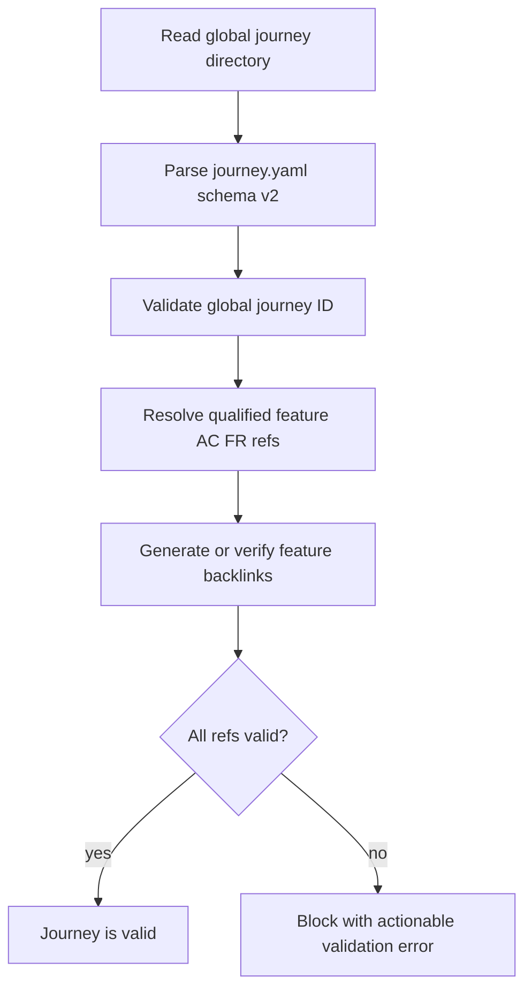

### Story 2 (P1) - Product lead creates a journey interactively for old or implemented features

**Description:** A product lead wants to describe a journey in natural language, even for old implemented features, and let LiveSpec infer the correct features, ACs, and FRs instead of manually choosing ownership.

**Priority reason:** The workflow must work on existing projects where specs, code, mockups, Penflow, and tests already exist; `$spec-refine` must not be required or blocked by implemented feature status.

**Independent test:** `$spec-journey create` accepts a free-form intent, shows inferred features and refs with reasoning, lets the user correct them, then creates the journey and feature backlinks.

```gherkin
Feature: Interactive journey creation
  Scenario: Free-form creation auto-assigns refs
    Given features "001-onboarding" and "012-projects" are already Implemented
    When the user runs "$spec-journey create"
    And enters "first user signs up, creates a first project, and sees the project success screen"
    Then LiveSpec proposes a global journey ID
    And LiveSpec proposes qualified covers for onboarding and projects
    And LiveSpec shows evidence for each proposed feature and AC/FR
    And the user can accept or correct the proposal before files are written

  Scenario: Implemented feature does not require spec-refine
    Given feature "001-onboarding" has status Implemented
    When the user creates a new journey that covers "001-onboarding"
    Then LiveSpec does not require "$spec-refine 001-onboarding"
    And the generated backlink is written through the journey workflow
```

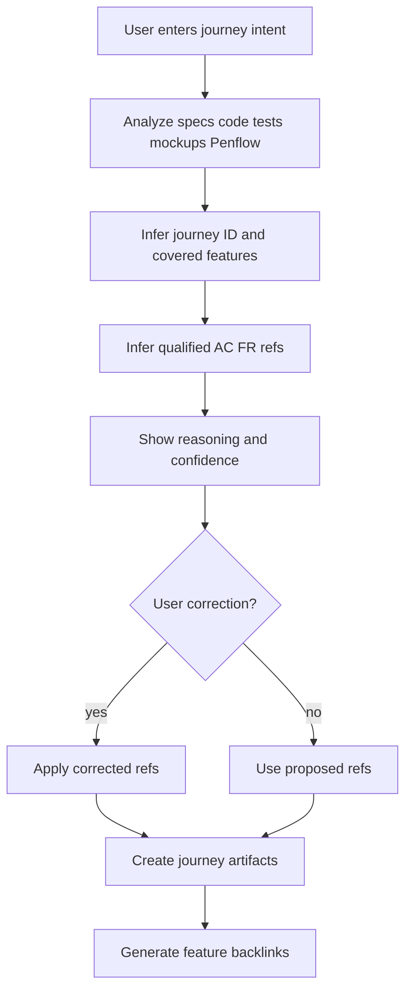

### Story 3 (P1) - Maintainer bootstraps journeys for an old LiveSpec project

**Description:** A maintainer needs a guided bootstrap command that scans existing specs, Gherkin, implementation maps, tests, routes, components, mockups, screens, Penflow, and logs to propose journeys for old features.

**Priority reason:** Existing projects should not need manual reconstruction of every flow. The bootstrap must adapt to the current project state while still requiring human validation before writing.

**Independent test:** `$spec-journey bootstrap --from-existing` reports candidate journeys with covered features, refs, confidence, source evidence, and writes only accepted candidates.

```gherkin
Feature: Journey bootstrap for existing projects
  Scenario: Bootstrap proposes candidates without writing immediately
    Given an old LiveSpec project has implemented specs, tests, routes, components, mockups, and Penflow artifacts
    When the user runs "$spec-journey bootstrap --from-existing"
    Then LiveSpec proposes candidate journeys
    And each candidate lists inferred features, ACs, FRs, and source evidence
    And no journey files are written before validation

  Scenario: Accepted candidate is compiled and smoke-run once
    Given the user accepts a bootstrap candidate
    When LiveSpec creates the journey
    Then it writes the v2 journey directory
    And it validates the YAML
    And it compiles the native artifact
    And it runs the compiled artifact once
    And it records the manifest and validation run
```

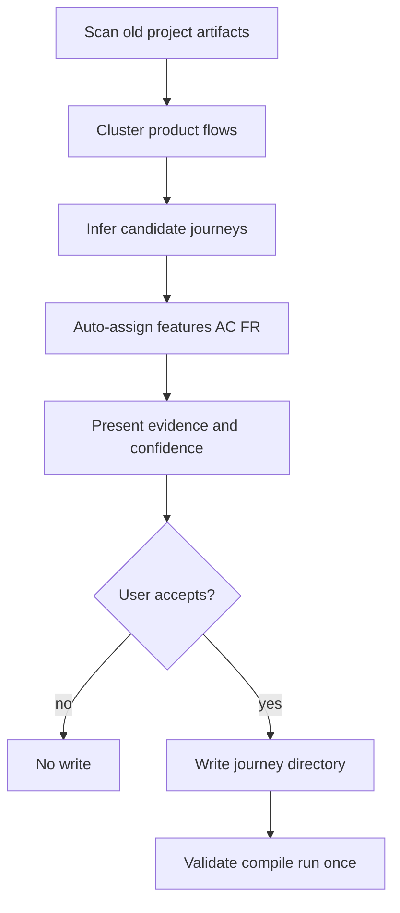

### Story 4 (P1) - Maintainer edits a journey with mandatory history and decision context

**Description:** A maintainer needs every journey update to explain whether the update reflects a regression, intentional product change, obsolete path, selector repair, or coverage expansion.

**Priority reason:** Journey tests are non-regression assets. If a label or visual expectation changes intentionally, the history must explain why the old expectation changed instead of silently weakening the test.

**Independent test:** Editing an existing journey without a decision, changelog entry, and validation run is blocked.

```gherkin
Feature: Journey edit governance
  Scenario: Intentional product update records decision
    Given journey "onboarding-first-project" asserts label "Create project"
    And feature "checkout-success" intentionally changes the label to "Start project"
    When the maintainer edits the journey
    Then LiveSpec requires classification "intentional_update"
    And requires a decision file under ".specs/journeys/onboarding-first-project/decisions/"
    And requires a changelog entry
    And requires a validation run reference

  Scenario: Journey edit without history is blocked
    Given "journey.yaml" changed
    And no matching decision or changelog entry exists
    When the maintainer runs "livespec journey validate"
    Then validation fails with "journey_history_missing"
```

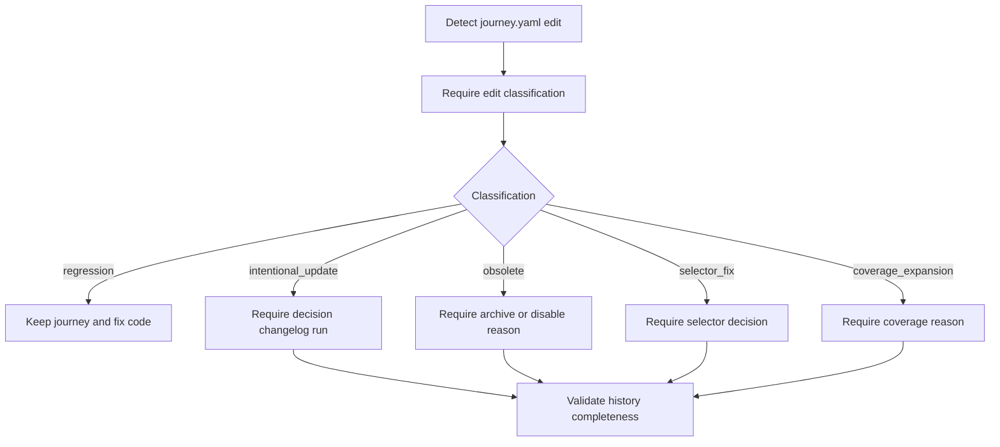

### Story 5 (P1) - Implementer gets impact detection before relying on failed tests

**Description:** An implementer changing labels, selectors, routes, mockups, fixtures, or UI structure needs LiveSpec to identify impacted old journeys before the journey fails in CI.

**Priority reason:** Impacted journeys must be classified and updated intentionally. A late test failure does not explain whether the change is a regression or expected evolution.

**Independent test:** `livespec journey impact --changed-files --json` identifies journeys impacted by label and selector changes with reasons, confidence, required classification, and recommended command.

```gherkin
Feature: Journey impact detection
  Scenario: Label change impacts old journey
    Given journey "onboarding-first-project" targets visible label "Create project"
    And a changed component replaces that label with "Start project"
    When LiveSpec analyzes changed files
    Then the impact output includes "onboarding-first-project"
    And the reason mentions the changed label
    And required_classification is not empty
    And recommended_command is "$spec-journey edit onboarding-first-project"

  Scenario: Mockup change impacts visual journey check
    Given a journey has a native visual check for padding on "success-card"
    And a Penflow mockup changes the same card spacing
    When LiveSpec analyzes design changes
    Then the impacted journey is reported before test execution
```

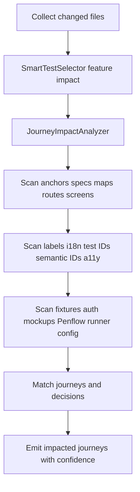

### Story 6 (P1) - Developer runs journeys without implicit recompilation

**Description:** A developer needs journey execution to be deterministic: journeys compile only when created or edited, and run commands execute compiled artifacts without regenerating them.

**Priority reason:** Runtime compilation makes tests dependent on the current translator state and prevents stable regression execution across Swift, React, Rust, Python, and Android projects.

**Independent test:** `livespec journey run` fails on a stale manifest and never rewrites compiled artifacts.

```gherkin
Feature: Compile-on-create/edit journey execution
  Scenario: Create flow compiles and runs once
    Given a valid new journey
    When "$spec-journey create" writes the journey
    Then LiveSpec validates the source
    And compiles the native artifact
    And runs the compiled artifact once
    And records "compiled/manifest.json" and a run result

  Scenario: Run refuses stale compiled artifact
    Given a journey was compiled with source hash "abc"
    And "journey.yaml" now hashes to "def"
    When the developer runs "livespec journey run --journey onboarding-first-project"
    Then the command fails with "journey_compiled_stale"
    And no compiled artifact is rewritten
```

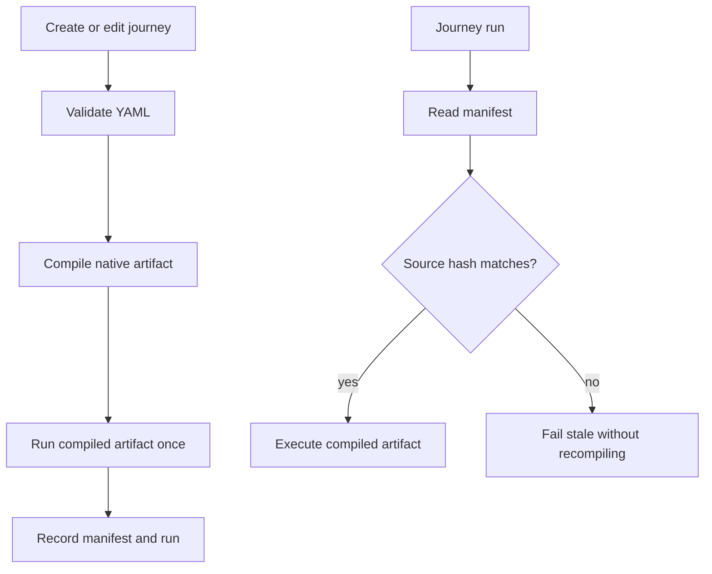

### Story 7 (P1) - Test pipeline uses journeys as regression tests

**Description:** `$spec-feature`, `$spec-implement`, `$spec-test`, CI, pre-push, and nightly runs need to execute the correct compiled journeys according to feature impact and stage run policies.

**Priority reason:** Journeys are long-lived non-regression tests. Old journey coverage must protect later feature work, but manual and disabled journeys must not be executed accidentally.

**Independent test:** `$spec-test <feature>` runs direct tests plus covering and impacted compiled journeys, while CI/pre-push/nightly honor `always`, `smoke`, `impacted`, `manual`, and `disabled` by stage.

```gherkin
Feature: Journey regression execution
  Scenario: Feature test runs direct and journey coverage
    Given feature "012-projects" has direct tests
    And journey "onboarding-first-project" covers "012-projects"
    And journey "checkout-success" is impacted by changed files
    When the user runs "$spec-test 012-projects"
    Then direct tests run
    And compiled covering journeys run
    And compiled impacted journeys run
    And stale journeys fail instead of compiling

  Scenario: Stage run policies are honored
    Given journeys have stage policies "always", "smoke", "impacted", "manual", and "disabled"
    When CI runs "livespec journey run --all --stage ci"
    Then journeys allowed for CI run
    And manual journeys are reported but not executed
    And disabled journeys are reported but not executed
```

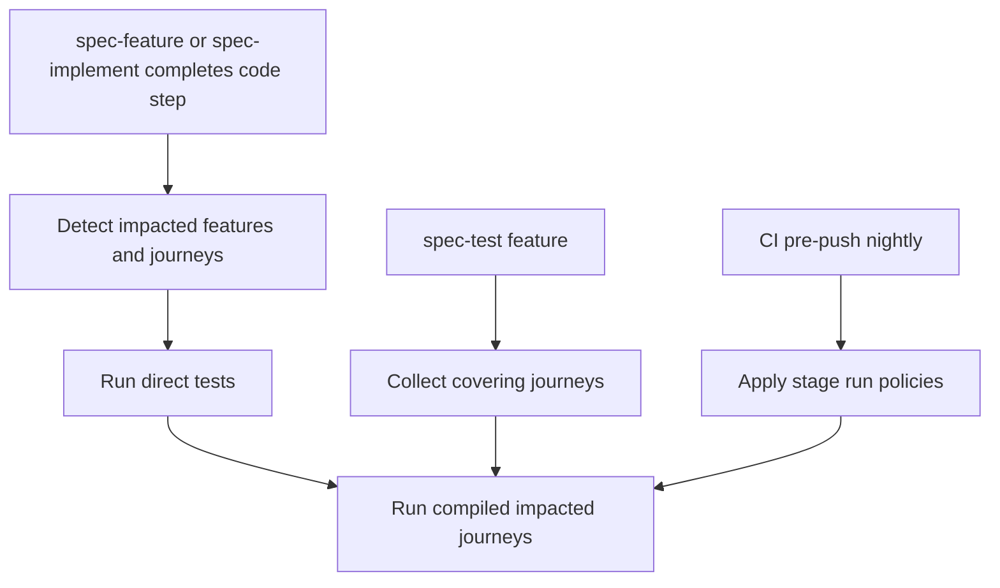

### Story 8 (P1) - Compiler maintainer targets native frameworks through a capability registry

**Description:** A compiler maintainer needs a registry that maps journey actions and checks to Playwright web, XCUITest Swift iOS/watchOS, Maestro Android, pytest/Python, cargo/Rust, and future runners.

**Priority reason:** User journeys are portable YAML, but compiled artifacts must be idiomatic native tests and must reject unsupported actions early.

**Independent test:** The same portable journey compiles to runner-specific artifacts only when the target capability matrix supports every action, assertion, visual check, fixture, and privacy requirement.

```gherkin
Feature: Native journey compiler registry
  Scenario: Compatible web journey compiles to Playwright
    Given a v2 journey targets runner "playwright"
    And all actions are supported by the Playwright compiler
    When "livespec journey compile --journey onboarding-first-project" runs
    Then a Playwright artifact is written
    And compiled manifest records compiler metadata and output path

  Scenario: Unsupported action is rejected
    Given a journey targets runner "cargo"
    And the journey contains a UI-only "click" step without a compatible Rust runner capability
    When "livespec journey compile" runs
    Then compilation fails with "journey_capability_unsupported"
```

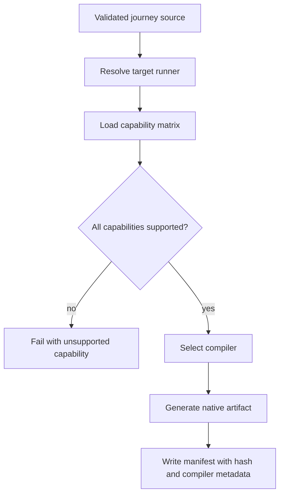

### Story 9 (P1) - QA author specifies functional, native visual, and LLM visual checks

**Description:** A QA author needs journeys to express user actions and visual quality expectations, including text fitting, no overflow, margins, centered alignment, padding, no overlap, screenshot regions, responsive viewports, and optional LLM screenshot evaluation.

**Priority reason:** Functional presence is not enough. A journey can pass text assertions while the UI is visually broken.

**Independent test:** Native visual checks compile into deterministic runner assertions, while LLM checks compile to native capture artifacts plus JSON visual contracts evaluated under privacy policy.

```gherkin
Feature: Visual journey checks
  Scenario: Native visual check rejects overflow
    Given a journey has a native visual check "text_fits" for selector "success-title"
    And the text overflows its parent in a long-content fixture
    When the compiled journey runs
    Then the native runner fails the check
    And the failure reports the measured bounds

  Scenario: LLM visual mode uses screenshots only
    Given a journey visual check has mode "llm"
    And project privacy permits LLM evaluation with masking
    When the journey is compiled
    Then LiveSpec generates a native screenshot capture artifact
    And generates a JSON visual contract
    And the LLM evaluator reads screenshots and contract criteria only
    And the LLM does not navigate or operate the UI
```

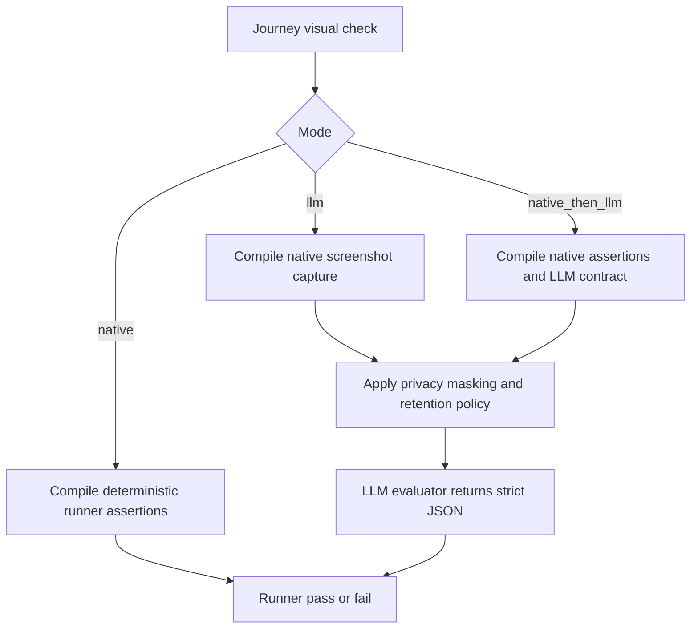

### Story 10 (P1) - Migration operator upgrades v1 journeys without losing traceability

**Description:** A migration operator needs to convert `.specs/journeys/<feature>/<id>.journey.yaml` v1 journeys into the v2 directory model with qualified refs, changelog, decision, manifest, backlinks, and doctor warnings for leftovers.

**Priority reason:** Existing projects already contain v1 journeys; v2 cannot strand them or silently change their meaning.

**Independent test:** `livespec journey migrate --from-v1` converts feature-scoped journeys and doctor reports any remaining v1 leftovers.

```gherkin
Feature: Journey v1 to v2 migration
  Scenario: V1 journey is converted
    Given ".specs/journeys/012-auth/login-happy-path.journey.yaml" exists
    When the user runs "livespec journey migrate --from-v1"
    Then ".specs/journeys/login-happy-path/journey.yaml" exists
    And covers refs qualify feature "012-auth"
    And changelog and decision files are created
    And feature backlinks are generated

  Scenario: V1 leftovers are reported
    Given a v1 journey remains after migration
    When the user runs "livespec doctor"
    Then the doctor report contains "journey_v1_leftover"
```

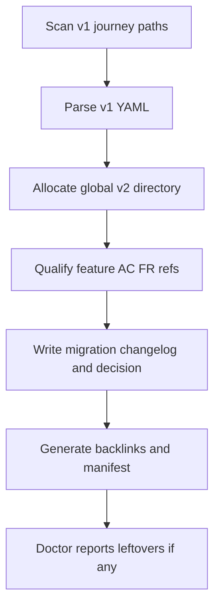

## Acceptance Criteria

- **AC-001:** v2 journey source files are stored canonically at `.specs/journeys/<journey-id>/journey.yaml`.
- **AC-002:** A valid journey directory contains `journey.yaml`, `changelog.md`, `decisions/*.md`, `compiled/manifest.json`, and may contain `runs/`.
- **AC-003:** Journey IDs are global, unique across `.specs/journeys/`, and validated before write.
- **AC-004:** v2 YAML requires `schema_version: 2`, `id`, `title`, `status`, `description`, `covers`, `targets`, stage run policies, `preconditions`, `steps`, `visual_checks`, and `privacy`.
- **AC-005:** Every `covers` entry qualifies the feature and the AC/FR because AC/FR IDs are local to features.
- **AC-006:** Feature backlinks are generated in `.specs/features/<feature>/journeys.md` for every covered feature.
- **AC-007:** Cross-feature changes write or update `.specs/features/<feature>/journey-impacts.md` for triggering and affected features.
- **AC-008:** `changelog.md` and at least one decision file are mandatory for existing journey edits.
- **AC-009:** Editing an existing journey requires one classification from `regression`, `intentional_update`, `obsolete`, `selector_fix`, or `coverage_expansion`.
- **AC-010:** `intentional_update` decisions include triggering feature, affected features, before/after refs, reason, author/tool, date, and validation run.
- **AC-011:** Journey edits without matching changelog, decision, and validation run are blocked.
- **AC-012:** `$spec-journey` exposes `create`, `edit`, `bootstrap --from-existing`, `impact`, `run`, `list`, and `inspect`.
- **AC-013:** `$spec-journey create` accepts free-form intent, auto-detects features/AC/FR, shows reasoning, allows interactive correction, then writes refs and backlinks.
- **AC-014:** `$spec-journey bootstrap --from-existing` analyzes specs, Gherkin, implementation maps, tests, routes, components, mockups, screens, Penflow, and logs.
- **AC-015:** Bootstrap proposes candidates and auto-assigned refs before writing anything.
- **AC-016:** Accepted bootstrap candidates validate, compile, run once, and record manifest/run artifacts.
- **AC-017:** Adding a journey to an implemented feature does not require `$spec-refine`.
- **AC-018:** Python/Pydantic validation checks schema, folder structure, unique IDs, refs, backlinks, run policies, manual/disabled reasons, secrets, fixtures, runner capabilities, visual checks, LLM privacy, compiled manifest, decisions, and changelog.
- **AC-019:** `livespec doctor` reports invalid schema, missing decision, stale/missing/orphan artifacts, missing refs, unresolved impacts, unsupported checks, privacy violations, backlink drift, and v1 leftovers.
- **AC-020:** `JourneyImpactAnalyzer` uses `SmartTestSelector` output plus anchors, specs, implementation maps, routes/screens/components, visible labels, i18n keys, `data-testid`, semantic IDs, accessibility labels, fixtures/seeds/auth, mockups/Penflow, runner config, journeys, and decisions.
- **AC-021:** Impact output lists impacted journey IDs, reasons, confidence, required classification, and recommended command.
- **AC-022:** Label, selector, and mockup changes that touch old journeys are detected before relying on test failure.
- **AC-023:** CLI supports `livespec journey validate [--journey ID] [--feature SLUG] [--json]`.
- **AC-024:** CLI supports `livespec journey compile [--journey ID] [--changed] [--force]`.
- **AC-025:** CLI supports `livespec journey run [--journey ID|--feature SLUG|--impacted|--all] [--stage local|pre-push|ci|nightly] [--json]`.
- **AC-026:** CLI supports `livespec journey impact`, `livespec journey migrate --from-v1`, `livespec journey list`, and `livespec journey inspect`.
- **AC-027:** Create/edit flow validates, compiles, runs once, and records manifest/run evidence.
- **AC-028:** `journey run` and `$spec-test` never recompile; stale compiled artifacts fail with actionable messages.
- **AC-029:** `$spec-feature` and `$spec-implement` run impacted existing compiled journeys after relevant implementation changes.
- **AC-030:** `$spec-test <feature>` runs direct tests plus covering and impacted compiled journeys.
- **AC-031:** CI, pre-push, and nightly runs honor `always`, `smoke`, `impacted`, `manual`, and `disabled` run policies by stage.
- **AC-032:** Compiler registry supports Playwright web, XCUITest Swift iOS/watchOS, Maestro Android, pytest/Python where applicable, cargo/Rust where compatible, and an extensible capability matrix.
- **AC-033:** Compiled manifest records source hash, compiler version, runner, output paths, visual contracts, capabilities, and date.
- **AC-034:** Compiled artifacts include markers for journey ID, source hash, schema version, and compiler version.
- **AC-035:** v1 actions remain supported: `open`, `click`, `fill`, `select`, `wait`, `assert`, `assert_not`, `screenshot`, `back`, and `press`.
- **AC-036:** Stable targets include `semantic_id`, `test_id`, `i18n_key`, `role+name`, and `accessibility_label`; visible text is allowed only when it is a product contract.
- **AC-037:** Functional assertions include URL/route, field value, enabled/disabled state, toast/notification, and displayed data.
- **AC-038:** Native visual checks cover text fits, no overflow, centered, min margin, padding/gap, within parent bounds, no overlap, screenshot region, responsive viewport matrix, and long-content fixtures.
- **AC-039:** Visual checks support modes `native`, `llm`, and `native_then_llm`.
- **AC-040:** LLM mode compiles a native capture artifact plus a JSON visual contract; the LLM evaluates screenshots only and never navigates or operates UI.
- **AC-041:** LLM evaluator returns strict JSON with pass/fail, criteria passed/failed, short explanation, confidence, and bounding boxes when possible.
- **AC-042:** LLM visual checks are advisory locally by default, blocking only when configured, and disabled unless project privacy policy permits them.
- **AC-043:** LLM privacy requires masking, retention, and local/offline policy fields before evaluation.
- **AC-044:** v1 migration converts `.specs/journeys/<feature>/<id>.journey.yaml` to v2 directories with qualified refs, changelog, decision, manifest, backlinks, and doctor warnings for leftovers.
- **AC-045:** Documentation and skill updates cover `system/testing/user-journeys.md`, `spec-feature`, `spec-implement`, `spec-test`, `spec-check`, `spec-migrate`, and command docs.
- **AC-046:** Implementation follows TDD and includes schema, migration, impact detection, compilation, run-without-compile, native visual, fake LLM provider, doctor, CLI, and skill behavior tests.

## Functional Requirements

- **FR-001:** Replace feature-scoped v1 journey ownership with a cross-feature User Journeys v2 model. Covers AC-001, AC-005, AC-006.
- **FR-002:** Set the canonical journey source path to `.specs/journeys/<journey-id>/journey.yaml`. Covers AC-001.
- **FR-003:** Define the journey directory contract with `journey.yaml`, `changelog.md`, `decisions/*.md`, `compiled/manifest.json`, and optional `runs/`. Covers AC-002.
- **FR-004:** Enforce globally unique journey IDs across `.specs/journeys/`. Covers AC-003.
- **FR-005:** Define the v2 YAML schema with `schema_version: 2`, `id`, `title`, `status`, `description`, qualified `covers`, `targets`, run policies by stage, `preconditions`, `steps`, `visual_checks`, and `privacy`. Covers AC-004.
- **FR-006:** Require every `covers` reference to qualify feature plus AC/FR. Covers AC-005.
- **FR-007:** Generate feature backlinks in `.specs/features/<feature>/journeys.md`. Covers AC-006.
- **FR-008:** Record cross-feature journey impacts in `.specs/features/<feature>/journey-impacts.md`. Covers AC-007.
- **FR-009:** Require per-journey history through `changelog.md` and `decisions/*.md`. Covers AC-008.
- **FR-010:** Require existing journey edits to be classified as `regression`, `intentional_update`, `obsolete`, `selector_fix`, or `coverage_expansion`. Covers AC-009.
- **FR-011:** Require intentional update decisions to explain triggering feature, affected features, before/after refs, reason, author/tool, date, and validation run. Covers AC-010.
- **FR-012:** Block invalid journey edits when changelog, decision, or validation run evidence is missing. Covers AC-011.
- **FR-013:** Add interactive `$spec-journey` skill/command with `create`, `edit`, `bootstrap --from-existing`, `impact`, `run`, `list`, and `inspect`. Covers AC-012.
- **FR-014:** Implement `$spec-journey create` free-form intent parsing, automatic feature/AC/FR detection, reasoning display, interactive correction, and final refs/backlinks write. Covers AC-013.
- **FR-015:** Implement `$spec-journey bootstrap --from-existing` for old features using specs, Gherkin, implementation maps, tests, routes, components, mockups, screens, Penflow, and logs. Covers AC-014, AC-015, AC-016.
- **FR-016:** Ensure `$spec-refine` is not required to add a journey to an already implemented feature. Covers AC-017.
- **FR-017:** Add Python/Pydantic validation for schema, folder structure, unique IDs, refs, backlinks, run policies, manual/disabled reasons, secrets, fixtures, runner capabilities, visual checks, LLM privacy, compiled manifest, decisions, and changelog. Covers AC-018.
- **FR-018:** Extend `livespec doctor` with v2 journey findings for invalid schema, missing decision, stale/missing/orphan artifacts, missing refs, unresolved impacts, unsupported checks, privacy violations, backlink drift, and v1 leftovers. Covers AC-019.
- **FR-019:** Add `JourneyImpactAnalyzer` above `SmartTestSelector` using anchors, specs, implementation maps, routes/screens/components, visible labels, i18n keys, `data-testid`, semantic IDs, accessibility labels, fixtures/seeds/auth, mockups/Penflow, runner config, journeys, and decisions. Covers AC-020.
- **FR-020:** Define impact output with impacted journeys, reasons, confidence, required classification, and recommended command. Covers AC-021.
- **FR-021:** Detect label, selector, and mockup changes touching old journeys before relying on journey test failure. Covers AC-022.
- **FR-022:** Extend CLI with `livespec journey validate [--journey ID] [--feature SLUG] [--json]`, `compile [--journey ID] [--changed] [--force]`, `run [--journey ID|--feature SLUG|--impacted|--all] [--stage local|pre-push|ci|nightly] [--json]`, `impact`, `migrate --from-v1`, `list`, and `inspect`. Covers AC-023, AC-024, AC-025, AC-026.
- **FR-023:** Make create/edit validate, compile, run once, and record manifest/run evidence. Covers AC-027.
- **FR-024:** Ensure `journey run` and `$spec-test` run compiled artifacts only and never recompile. Covers AC-028.
- **FR-025:** Integrate impacted existing compiled journeys into `$spec-feature` and `$spec-implement`. Covers AC-029.
- **FR-026:** Extend `$spec-test <feature>` to run direct tests plus covering and impacted compiled journeys. Covers AC-030.
- **FR-027:** Enforce stage run policies `always`, `smoke`, `impacted`, `manual`, and `disabled` for local, pre-push, CI, and nightly runs. Covers AC-031.
- **FR-028:** Add compiler/capability registry for Playwright web, XCUITest Swift iOS/watchOS, Maestro Android, pytest/Python where applicable, cargo/Rust where compatible, and future runners. Covers AC-032.
- **FR-029:** Write compiled manifest metadata: source hash, compiler version, runner, output paths, visual contracts, capabilities, and date. Covers AC-033.
- **FR-030:** Embed compiled artifact markers for journey ID, source hash, schema version, and compiler version. Covers AC-034.
- **FR-031:** Preserve v1 actions: `open`, `click`, `fill`, `select`, `wait`, `assert`, `assert_not`, `screenshot`, `back`, and `press`. Covers AC-035.
- **FR-032:** Add stable target selectors: `semantic_id`, `test_id`, `i18n_key`, `role+name`, and `accessibility_label`, with visible text limited to product contracts. Covers AC-036.
- **FR-033:** Add functional assertions for URL/route, field value, enabled/disabled state, toast/notification, and displayed data. Covers AC-037.
- **FR-034:** Add native visual checks for text fits, no overflow, centered, min margin, padding/gap, within parent bounds, no overlap, screenshot region, responsive viewport matrix, and long-content fixtures. Covers AC-038.
- **FR-035:** Add visual modes `native`, `llm`, and `native_then_llm`. Covers AC-039.
- **FR-036:** Compile LLM visual mode into native capture artifacts plus JSON visual contracts, with LLM evaluation limited to screenshots and criteria. Covers AC-040.
- **FR-037:** Require strict JSON output from LLM visual evaluator with pass/fail, criteria passed/failed, short explanation, confidence, and bounding boxes when possible. Covers AC-041.
- **FR-038:** Make LLM checks advisory locally by default, blocking only when configured, and disabled unless privacy permits. Covers AC-042.
- **FR-039:** Require LLM privacy fields for masking, retention, and local/offline policy. Covers AC-043.
- **FR-040:** Migrate v1 journeys to v2 directories with qualified refs, changelog, decision, manifest, backlinks, and doctor warnings for leftovers. Covers AC-044.
- **FR-041:** Update docs and skills, and require TDD coverage for schema, migration, impact detection, compilation, run-without-compile, native visual, fake LLM provider, doctor, CLI, and skill behavior. Covers AC-045, AC-046.

## Key Entities

- **JourneyId:** Global unique identifier used as the directory name under `.specs/journeys/<journey-id>/`.
- **JourneyDirectory:** Canonical v2 artifact folder containing source, history, decisions, compiled manifest, and optional run results.
- **JourneySource:** `journey.yaml` v2 file containing portable behavior, target, coverage, run policy, visual checks, and privacy.
- **QualifiedCoverageRef:** Reference containing `feature` plus one or more AC/FR identifiers; never bare `AC-001` or `FR-001`.
- **JourneyBacklink:** Generated feature-local reference in `.specs/features/<feature>/journeys.md`.
- **JourneyImpactRecord:** Feature-local record in `journey-impacts.md` explaining which journeys are touched by a feature or diff.
- **JourneyDecision:** Markdown decision file explaining why a journey was changed, archived, repaired, or expanded.
- **JourneyEditClassification:** One of `regression`, `intentional_update`, `obsolete`, `selector_fix`, or `coverage_expansion`.
- **JourneyImpactAnalyzer:** Analyzer that maps changed specs/code/design/fixtures/runner config to impacted journeys.
- **CompiledJourneyManifest:** JSON manifest storing source hash, compiler metadata, output paths, visual contracts, capabilities, and date.
- **CompilerCapabilityRegistry:** Registry mapping runner capabilities to actions, assertions, visual checks, fixtures, privacy, and output formats.
- **VisualCheckContract:** Native or LLM visual requirement attached to a journey step or screenshot region.
- **LLMVisualContract:** JSON contract consumed by the LLM evaluator after a native runner captures screenshots.
- **JourneyRunPolicy:** Stage-specific policy deciding when a journey runs automatically, manually, or never.

## Canonical V2 Journey Shape

```yaml
schema_version: 2
id: onboarding-first-project
title: First user creates a project
status: active
description: New account signs up, creates a first project, and sees success state.
covers:
  - feature: 001-onboarding
    ac: [AC-001, AC-002]
    fr: [FR-001]
    reason: Signup is the first step of this journey.
  - feature: 012-projects
    ac: [AC-003]
    fr: [FR-002, FR-004]
    reason: Project creation is the journey outcome.
targets:
  - surface: web
    runner: playwright
    viewport: 1440x900
run_policy:
  local: impacted
  pre-push: smoke
  ci: always
  nightly: always
preconditions:
  auth: anonymous
  seed: first_project_empty_workspace
  feature_flags: []
steps:
  - open: { route: "/signup" }
  - fill: { target: { semantic_id: "signup.email" }, value: "new-user@example.test" }
  - click: { target: { role: "button", name: "Create account" } }
  - assert: { displayed_data: "workspace is empty" }
visual_checks:
  - mode: native
    check: text_fits
    target: { semantic_id: "project.success_title" }
    min_margin_px: 16
  - mode: llm
    screenshot_region: { semantic_id: "project.success_card" }
    criteria:
      - The success card is centered.
      - Text does not overflow the card.
privacy:
  llm_allowed: true
  masking: ["email", "user_name"]
  retention: discard_after_run
  local_offline_required: false
```

## Command Surface

- **`$spec-journey create`** starts an interactive creation flow from free-form intent; it must infer features/AC/FR, show reasoning, accept correction, write v2 files, compile, run once, and update backlinks.
- **`$spec-journey edit <journey-id>`** starts a governed edit flow; it must require classification, decision, changelog, validation, compile, run once, and impact records when cross-feature.
- **`$spec-journey bootstrap --from-existing`** scans old projects and proposes candidate journeys before writing; accepted candidates follow create flow.
- **`$spec-journey impact`** analyzes a feature, diff, or changed files and reports impacted journeys with reasons and commands.
- **`$spec-journey run`** executes compiled artifacts only and refuses stale sources.
- **`$spec-journey list`** lists global journeys with status, covered features, run policies, and stale state.
- **`$spec-journey inspect <journey-id>`** shows source summary, coverage refs, decisions, compiled manifest, last run, and impacts.
- **`livespec journey validate [--journey ID] [--feature SLUG] [--json]`** validates source, structure, refs, history, policies, capabilities, privacy, and manifest consistency.
- **`livespec journey compile [--journey ID] [--changed] [--force]`** compiles source to native artifacts and writes manifest.
- **`livespec journey run [--journey ID|--feature SLUG|--impacted|--all] [--stage local|pre-push|ci|nightly] [--json]`** runs compiled artifacts only.
- **`livespec journey impact`** returns impact analysis for changed files, feature, or project state.
- **`livespec journey migrate --from-v1`** converts v1 sources into v2 directories.
- **`livespec journey list`** and **`livespec journey inspect`** provide machine and human introspection.

## Mermaid System Flows

### Create/Edit Lifecycle

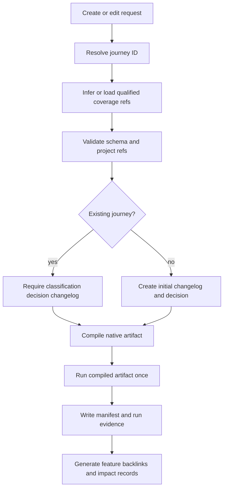

### Execution Lifecycle

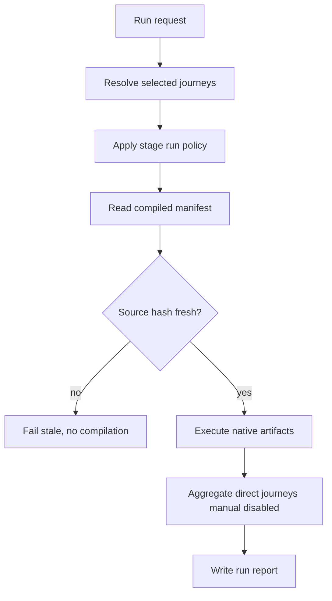

### LLM Visual Check Lifecycle

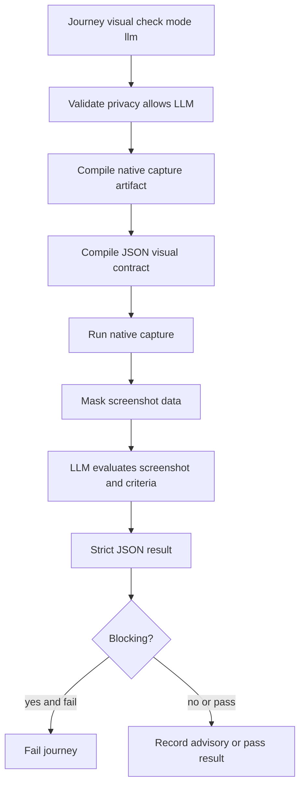

## Edge Cases

- A journey ID collides with an existing directory: creation is blocked and suggests a deterministic alternative.
- A journey references `AC-001` without a feature: validation blocks because AC/FR IDs are feature-local.
- A feature backlink exists but the journey no longer covers that feature: doctor reports backlink drift.
- A feature is renamed or migrated: qualified refs must update through migration tooling, not manual search/replace.
- A journey covers an implemented feature: creation remains allowed through `$spec-journey`, without `$spec-refine`.
- A `manual` journey has no reason: validation blocks.
- A `disabled` journey has no reason or owner: validation blocks.
- A journey contains a secret or credential in YAML, fixture values, screenshots, or LLM contract: validation blocks.
- A runner lacks a capability for an action or visual check: compile fails before run.
- A native compiler output exists without source YAML: doctor reports orphan artifact.
- Source hash mismatch during run: execution fails and does not recompile.
- A label change is both a product contract and selector target: impact analyzer requires classification before accepting the change.
- Visible text target is used for non-contract copy: validation warns or blocks according to strict mode.
- LLM visual check is configured but privacy policy denies LLM: validation blocks.
- LLM returns malformed JSON: result is blocked, not guessed from prose.
- LLM check fails locally in advisory mode: run reports the failure without blocking unless configured.
- LLM check fails in blocking mode: journey fails.
- Long-content fixtures create overflow while normal fixture passes: visual check fails because long-content fixtures are part of the contract.
- Bootstrap finds ambiguous feature ownership: candidate remains pending correction and no files are written.
- Bootstrap source evidence conflicts with current specs: candidate reports conflict and requires user validation.
- v1 migration sees an existing v2 journey ID: migration requires explicit conflict resolution.
- v1 migration cannot qualify a ref because the feature spec is missing: migration creates a blocked report and does not fabricate refs.
- CI runs with `manual` and `disabled` journeys: they are reported separately and never executed.
- Pre-push runs `impacted` journeys only when impact detection has enough confidence; unresolved low-confidence impacts block with required classification.

## Success Criteria

- **SC-001:** Every v2 journey is globally addressable by journey ID and can cover multiple features with qualified AC/FR refs.
- **SC-002:** `$spec-journey create` and `bootstrap --from-existing` can create journeys for old implemented features without `$spec-refine`.
- **SC-003:** Every journey edit has classification, changelog, decision, and validation run evidence.
- **SC-004:** Impact detection identifies old journeys touched by label, selector, mockup, fixture, route, component, or runner changes before relying on test failure.
- **SC-005:** Journey run commands execute compiled artifacts only and fail stale sources without recompiling.
- **SC-006:** `$spec-feature`, `$spec-implement`, `$spec-test`, CI, pre-push, and nightly runs execute the correct covering/impacted journeys according to run policies.
- **SC-007:** Playwright, XCUITest Swift, Maestro, pytest/Python, and cargo/Rust integration is governed by one capability registry and rejects unsupported capabilities early.
- **SC-008:** Native visual checks catch layout defects such as overflow, bad padding, missing margins, misalignment, and overlap.
- **SC-009:** LLM visual checks are screenshot-only, privacy-gated, strict-JSON evaluated, advisory by default locally, and blocking only when configured.
- **SC-010:** `livespec doctor` gives actionable journey health findings including v1 leftovers and backlink drift.
- **SC-011:** v1 journeys migrate to v2 without losing traceability or silently inventing missing refs.
- **SC-012:** TDD covers schema, migration, impact, compilation, run-without-compile, native visual, fake LLM provider, doctor, CLI, and skill behavior.
