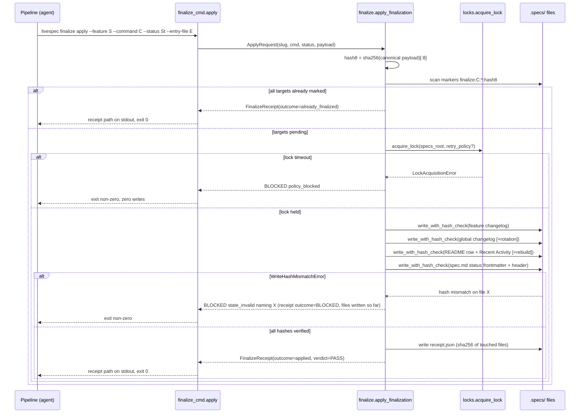
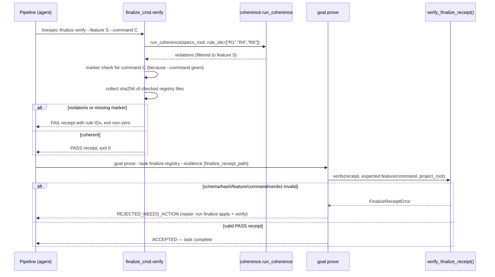
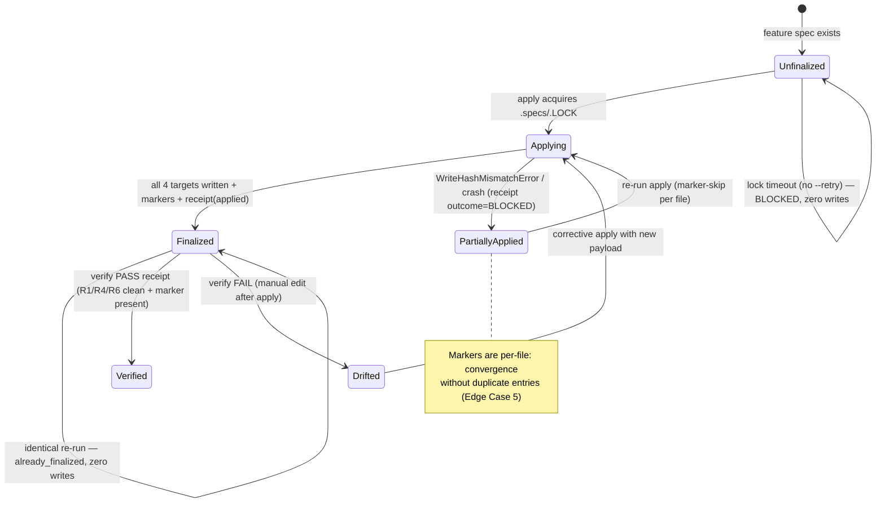
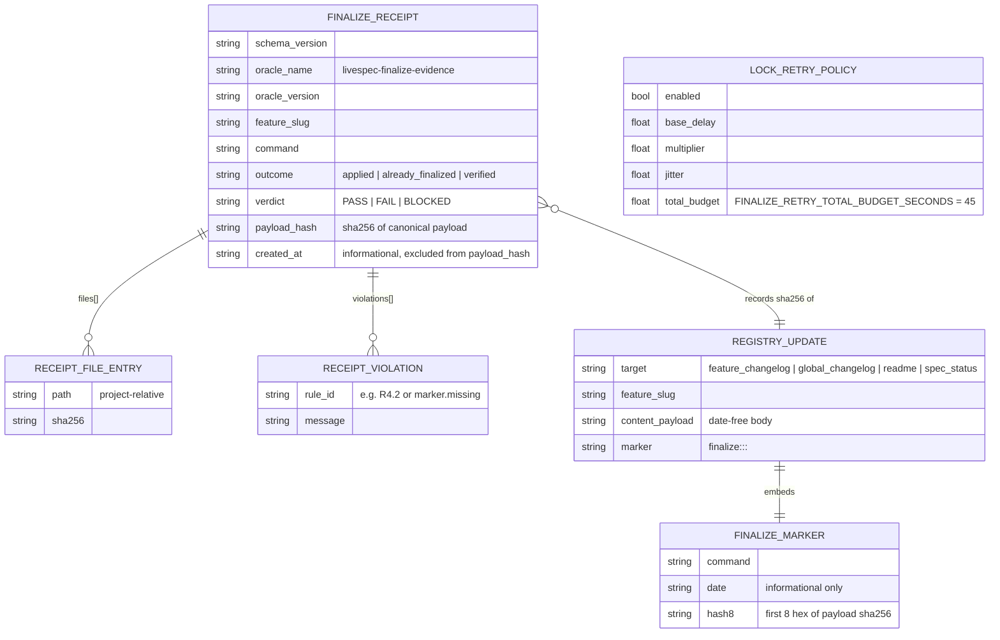

# Plan - Deterministic Finalization

## Summary

Deterministic end-of-command registry finalization: a new `validator/finalize.py` engine plus a `validator/cli_commands/finalize_cmd.py` typer sub-app exposing `livespec finalize apply` (atomic, idempotent, lock-guarded writes of the four registry targets with a JSON receipt) and `livespec finalize verify` (read-only re-check via coherence rules R1/R4/R6 scoped to the feature), backed by a `finalize.registry` goal evidence family in `validator/goal_contracts.py` validated by `verify_finalize_receipt()` (clone of the `verify_visual_receipt` pattern), and an opt-in backoff+jitter retry policy on `locks.acquire_lock` (~45s budget) for parallel `/spec-ship` safety.

## Technical Context

| Aspect | Choice | Reason |
|---|---|---|
| Language | Python ≥3.11 | From project stack (`.specs/stacks/_default.md`) |
| CLI Framework | Typer ≥0.12 | Existing `register(app)` pattern in `validator/cli_commands/` |
| Schema Validation | Pydantic ≥2.7 | Available; receipt payload stays plain `dict` + dataclasses like `visual_evidence.py` for shape parity |
| Hashing | stdlib `hashlib` (sha256) | Same primitive as `locks.write_with_hash_check` and `visual_evidence.receipt_payload_hash` |
| Locking | `validator/locks.py` (`fcntl.flock` on `.specs/.LOCK`) | Reuse — FR-001/FR-007 explicitly target this module |
| Coherence | `validator.coherence.rule_engine.run_coherence(rule_ids=["R1","R4","R6"])` | Reuse — FR-004 re-evaluates existing rules, no duplication |
| Testing | pytest 8.x (unit + integration on tmp `.specs/` fixtures) | From `.specs/testing/strategy.md`; no UI/visual tests |
| Lint/Types | ruff (E,F,I,UP,RUF,B,SIM) + pyright strict | Constitution Code Conventions |
| Platform | macOS + Linux CLI (POSIX flock) | Existing locks.py constraint |
| Project type | Local developer CLI — no DB, no network | Constitution principle 6 |

**Conventions loaded (domain: code):** `general.md`, `python.md`, `javascript.md`, `cli.md`, `stack-commands.md` from `ai-ressources/code-conventions/`. Applied: snake_case modules, typed public signatures, Google-style docstrings, domain exceptions raised internally and converted at the typer boundary, `--json` on every data-returning command, structured stdout (data) vs stderr (status), named constants for all thresholds, mandatory inline comments on diff/merge logic and order-dependent writes.

## Constitution Check

| Principle | Verdict | Note |
|---|---|---|
| 1. Layered Validation | ✅ | `finalize verify` reuses Layer 2 (`run_coherence` with `rule_ids=["R1","R4","R6"]`); no new validation layer, no silent skips — violations surface with rule ID + file. |
| 2. Provider-Agnostic LLM | ✅ | No LLM involvement anywhere in this feature. |
| 3. File-System as Source of Truth | ✅ | All reads/writes scoped to `.specs/`; receipts live under `.specs/features/<slug>/run/<run-id>/finalize/`; no state outside FS. |
| 4. Fail Fast, Exit Clearly | ✅ | New documented exit codes in `cli_exit_codes.py`; canonical BLOCKED lines (`policy_blocked`, `state_invalid`) per anti-drift-block §2; every error names file + rule + fix. |
| 5. Minimal Surface, Maximum Composability | ✅ | One typer sub-app `finalize` with two commands (`apply`, `verify`) composed via flags (`--retry`, `--json`, `--command`); stateless between invocations. |
| 6. No Hosted Infrastructure | ✅ | Local-only; no server, no telemetry. |
| Code Conventions (≤300 lines/file) | ⚠️ deviation note | FR-009 names `validator/finalize.py` as the logic home. If the module exceeds 300 lines, extract private helpers into `validator/finalize_receipt.py` (receipt write/verify) while re-exporting the public API (`apply_finalization`, `verify_finalization`, `verify_finalize_receipt`) from `validator/finalize.py` so the FR-009 import path holds. |

## Gherkin Scenarios + Mermaid Sequence Diagrams

### Apply — atomic, idempotent registry writes

```gherkin
Feature: Deterministic finalize apply
  Scenario: First apply writes all four targets under one lock
    Given a fixture .specs/ tree with feature 004-notifications and no finalize marker
    When the pipeline runs "livespec finalize apply --feature 004-notifications --command spec-specify --status Draft --entry-file entry.md"
    Then acquire_lock is entered once on .specs/.LOCK
    And the feature changelog, global changelog, README row + Recent Activity, and spec.md status are written via write_with_hash_check
    And each touched file carries "<!-- finalize:spec-specify:<date>:<hash8> -->"
    And a receipt.json with outcome "applied" and per-file sha256 is printed on stdout
    And the exit code is 0

  Scenario: Identical re-run is a zero-write no-op
    Given the marker for the same command and hash8 already exists in the registry files
    When the pipeline re-runs the identical apply invocation
    Then no file is opened for writing and all registry files stay byte-identical
    And the receipt outcome is "already_finalized"
    And the exit code is 0

  Scenario: Lock contention without retry fails BLOCKED
    Given another process holds .specs/.LOCK beyond 10 seconds
    When the pipeline runs apply without --retry
    Then stdout/stderr carries "BLOCKED at step <N> - policy_blocked - could not acquire .specs/.LOCK within 10s"
    And no registry file is modified
    And the exit code is non-zero
```



### Verify + goal prove — receipt as the only DONE evidence

```gherkin
Feature: Read-only verify feeding the goal gate
  Scenario: Coherent registry yields PASS receipt accepted by goal prove
    Given apply has finalized feature S for command C
    When the pipeline runs "livespec finalize verify --feature S --command C"
    Then no file under .specs/ is modified
    And run_coherence evaluates R1, R4, R6 scoped to feature S with zero violations
    And a PASS receipt with per-file sha256 is written
    When the agent submits goal evidence {"finalize_receipt_path": "<receipt>"}
    Then verify_finalize_receipt() re-validates schema, hashes, feature, command, verdict
    And the proof status is ACCEPTED

  Scenario: Prose substitution rejected
    Given a goal contract with a finalize.registry task
    When the agent submits evidence claiming registry updates without finalize_receipt_path
    Then the proof status is REJECTED_NEEDS_ACTION and missing_evidence includes "finalize_receipt_path"

  Scenario: Tampered receipt rejected
    Given a receipt whose recorded sha256 no longer matches the on-disk README
    When the agent submits that finalize_receipt_path
    Then verify_finalize_receipt() raises FinalizeReceiptError
    And the proof status is REJECTED_NEEDS_ACTION
```



## Gherkin Scenarios + Mermaid State Diagrams

```gherkin
Feature: Registry finalization lifecycle for a feature+command pair
  Scenario: Converge to Finalized
    Given a feature with pending registry updates
    When apply acquires the lock and all four hash-checked writes succeed
    Then the registry state transitions from Unfinalized to Finalized

  Scenario: Partial apply converges on re-run
    Given a previous apply crashed after writing two of four targets
    When apply re-runs with the identical payload
    Then files already carrying the marker are skipped
    And only the remaining targets are written
    And the state transitions from PartiallyApplied to Finalized

  Scenario: Post-finalization manual drift detected
    Given a finalized registry whose README row was manually deleted
    When finalize verify runs
    Then the state is reported Drifted with the violated rule ID (e.g. R4.2)
```



## Mermaid ER Diagrams

No database tables (file-system tool), but the feature introduces four new persistent/serialized entities:



## Canonical hash8 Payload Serialization (resolves spec review INFO #3)

The idempotence identity is `<cmd>` + `<hash8>` (FR-002). To make identity hold across days when content is identical:

1. **Structured, date-free payload.** `apply` receives structured inputs — `feature_slug`, `command`, `status`, the feature-changelog entry body, and the global-changelog summary line — whose bodies MUST NOT contain the entry date. `finalize` renders dates itself at write time (entry heading `### YYYY-MM-DD — ...`, marker `<date>` segment, receipt `created_at`).
2. **Canonical serialization.** `hash8 = hashlib.sha256(canonical)[:8]` where `canonical = json.dumps({"feature_slug": ..., "command": ..., "status": ..., "entry_body": ..., "global_summary": ...}, sort_keys=True, separators=(",", ":"), ensure_ascii=False).encode("utf-8")` — same canonical-JSON discipline as `visual_evidence.receipt_payload_hash`.
3. **Excluded volatile fields:** dates, timestamps, run IDs, receipt paths, absolute paths. Included fields are exactly the five keys above.
4. **Consequence:** re-running an identical apply on a later date produces the same `hash8`; the marker's `<date>` segment differs but is informational only — the run is recognized as `already_finalized` (Edge Case 1).
5. **Receipt `payload_hash`** records the full sha256 (not truncated) of the same canonical payload, so `verify_finalize_receipt()` can re-derive and cross-check `hash8`.

## Implementation Plan

> No new HTTP API endpoints — `contracts/openapi.yaml` is not applicable (CLI tool).
> No Infrastructure Requirements section in the spec — no Infrastructure Setup step.

### Step 1 — Opt-in lock retry policy in `validator/locks.py` (modified)

- Add frozen dataclass `LockRetryPolicy` with fields `base_delay: float = 0.5`, `multiplier: float = 2.0`, `jitter: float = 0.25`, `total_budget: float = FINALIZE_RETRY_TOTAL_BUDGET_SECONDS`.
- Add module constant `FINALIZE_RETRY_TOTAL_BUDGET_SECONDS: float = 45.0` (named constant per AC-009).
- Extend `acquire_lock(specs_root, timeout=10, poll_interval=0.05, retry_policy: LockRetryPolicy | None = None)`. `retry_policy=None` (default) keeps the existing single-window code path byte-for-byte (AC-010); when set, wrap acquisition attempts in an exponential backoff + jitter loop bounded by `total_budget`, re-raising `LockAcquisitionError` when the budget is exhausted.
- Time access goes through `time.monotonic` exactly as today; the retry loop accepts an injectable `sleep` callable (module-private parameter) for deterministic tests.

**FR covered:** FR-007.1: LockRetryPolicy + opt-in acquire_lock retry

### Step 2 — Receipt model + `verify_finalize_receipt()` in `validator/finalize.py` (new)

- Constants: `FINALIZE_ORACLE_NAME = "livespec-finalize-evidence"`, `FINALIZE_ORACLE_VERSION = "1"`, `FINALIZE_RECEIPT_SCHEMA_VERSION = "1"`, `MARKER_TEMPLATE = "<!-- finalize:{command}:{date}:{hash8} -->"`.
- Domain error `FinalizeReceiptError(ValueError)` (mirror of `VisualReceiptError`); plus `FinalizeError` base for apply/verify failures mapped to BLOCKED subtypes.
- Frozen dataclasses `FinalizeFileEntry(path, sha256)`, `FinalizeViolation(rule_id, message)`, `FinalizeReceipt(schema_version, oracle, oracle_version, feature_slug, command, outcome, verdict, files, violations, payload_hash, created_at, receipt_hash, path)`.
- `compute_payload_hash(payload) -> str` and `compute_hash8(payload) -> str` implementing the canonical serialization above, delegating hashing to `receipt_payload_hash` imported from `validator.visual_evidence`.
- **Import, do not clone:** `from validator.visual_evidence import receipt_payload_hash, sha256_file` — verified import-safe (`visual_evidence.py` imports stdlib only, no circular dependency with `finalize`/`coherence`/`goal_contracts`). Duplicating these helpers is forbidden; resolves plan-review INFO #2.
- `write_finalize_receipt(...) -> Path` — writes `receipt.json` under `.specs/features/<slug>/run/<run-id>/finalize/` (same containment as visual evidence) with `receipt_hash = receipt_payload_hash(payload)`.
- `verify_finalize_receipt(receipt_path, *, project_root, expected_feature_slug=None, expected_command=None) -> FinalizeReceipt` — clone of `verify_visual_receipt`: project containment check, JSON parse, oracle/schema match, expected feature/command match, **on-disk sha256 re-verification of every `files[]` entry**, `receipt_hash` recomputation, verdict consistency. Raises `FinalizeReceiptError` on any mismatch (AC-007, AC-008, Edge Case 8).

**FR covered:** FR-003.1: Receipt schema + write/verify, FR-006.1: verify_finalize_receipt() oracle clone, FR-002.1: canonical hash8 derivation

### Step 3 — Registry update builders in `validator/finalize.py` (new, same module)

- `build_registry_updates(specs_root, request) -> list[RegistryUpdate]` producing the four declarative targets:
  1. **Feature changelog** — append entry (rendered with today's date) to `.specs/features/<slug>/changelog.md`.
  2. **Global changelog** — insert summary line under the header of `.specs/changelog.md`; detect previous-year entries and rotate them to `.specs/archive/changelog-YYYY.md` with the "Previous years" link section (FR-010, AC-012).
  3. **README** — update the feature row (match feature number in column 1 between `<!-- readme:features:start/end -->`), set Status + Updated date, regenerate Recent Activity (cap 10) from the global changelog, refresh `Last updated`; if `.specs/README.md` is missing, rebuild it from `features/*/spec.md`, `stacks/decisions/ADR-*.md`, and `changelog.md` per spec-system README Recovery (FR-010, AC-012).
  4. **Spec status** — update both YAML frontmatter `status:` and the `- **Status:**` header line, kept in sync; if either anchor is absent/non-standard, raise `FinalizeError(state_invalid)` naming the file rather than guessing (Edge Case 10).
- Each `RegistryUpdate` carries its rendered new content and its marker string; marker insertion is per-file (appended as an HTML comment adjacent to the inserted entry/row).
- Roadmap is explicitly out of scope (Edge Case 11) — no roadmap writes here.

**FR covered:** FR-001.1: Four registry target builders, FR-010.1: README recovery + changelog year rotation

### Step 4 — `apply_finalization()` orchestration in `validator/finalize.py`

- `apply_finalization(project_root, request, *, retry_policy=None) -> FinalizeApplyResult`:
  1. Compute `hash8`; scan the four target files for marker `finalize:<cmd>:*:<hash8>` (date wildcard — identity is cmd+hash8).
  2. All four marked → return receipt `outcome="already_finalized"`, zero writes, exit 0 (AC-002).
  3. Else enter `with acquire_lock(specs_root, retry_policy=retry_policy)`; **re-scan markers inside the lock** (comment: order matters — pre-scan is an optimization, in-lock scan is the correctness check against concurrent appliers).
  4. For each unmarked target: render new content, `write_with_hash_check(target, content)`; record sha256.
  5. `LockAcquisitionError` → emit canonical `BLOCKED at step <N> - policy_blocked - ...`, exit non-zero, zero writes (AC-004).
  6. `WriteHashMismatchError` → emit `BLOCKED at step <N> - state_invalid - <file>`, write receipt `outcome="BLOCKED"` listing files written so far (Edge Case 5), exit non-zero (AC-004, FR-008).
  7. Success → write receipt `outcome="applied"`, verdict PASS, print receipt path on stdout (AC-003).
- Never force-delete `.specs/.LOCK` (Edge Case 6 — flock released by OS on process death).

**FR covered:** FR-001.2: Atomic lock-guarded apply, FR-002.2: Marker-based idempotence + per-file convergence, FR-007.2: Retry wiring into apply, FR-008.1: BLOCKED policy_blocked/state_invalid surfacing

### Step 5 — `verify_finalization()` read-only check in `validator/finalize.py`

- `verify_finalization(project_root, feature_slug, *, expected_command=None) -> FinalizeVerifyResult`:
  1. Strictly read-only — no write API imported into this code path (AC-005).
  2. `run_coherence(specs_root, rule_ids=["R1", "R4", "R6"])`, then filter violations to the feature: keep violations whose `context` `dir_name`/link/message references `<feature_slug>` (scoping comment required — diff/merge-style filter).
  3. If `expected_command` given: check each registry target carries `finalize:<cmd>:*:*` marker; missing → violation `marker.missing` (AC-006, Edge Case 12).
  4. Collect sha256 of every checked registry file; verdict `PASS` iff zero violations; write receipt `outcome="verified"` with violations list (rule IDs) on FAIL.
  5. Exit 0 on PASS, non-zero on FAIL (FR-008).

**FR covered:** FR-004.1: R1/R4/R6 feature-scoped re-evaluation, FR-003.2: verify receipt emission, FR-008.2: FAIL exit with rule IDs

### Step 6 — CLI surface `validator/cli_commands/finalize_cmd.py` (new) + exit codes (modified)

- `finalize_app = typer.Typer(name="finalize", help="Deterministic end-of-command registry finalization.")` with commands `apply` and `verify`; module-level `register(app)` does `app.add_typer(finalize_app, name="finalize")` — exactly the `utility_cmd.py` pattern (AC-011, FR-009).
- `apply` options: `--feature` (required), `--command` (required), `--status` (optional — when omitted, the `spec_status` target is skipped: only the three changelog/README targets are written, the receipt records the skipped target, and `status` is omitted from the hash8 payload so identity stays deterministic), `--entry-file` (feature changelog body, date-free), `--summary` (global changelog line, date-free; default derived from entry), `--retry/--no-retry` (default off), `--run-id` (default timestamp), `--json`.
- `verify` options: `--feature` (required), `--command` (optional marker check), `--run-id`, `--json`.
- Data on stdout (receipt path / JSON payload), status lines on stderr; typer boundary converts `FinalizeError`/`LockAcquisitionError`/`WriteHashMismatchError` into canonical BLOCKED lines + `typer.Exit(code)` (services never call exit — cli.md convention).
- `validator/cli_commands/__init__.py`: import `finalize_cmd` and call `finalize_cmd.register(app)` in `register_unified_commands`.
- `validator/cli_exit_codes.py`: add `EXIT_FINALIZE_BLOCKED: int = 9` (lock timeout / hash mismatch / partial apply) and `EXIT_FINALIZE_VERIFY_FAIL: int = 10` (coherence FAIL or missing marker); extend `__all__` and document in `docs/cli-reference.md`.

**FR covered:** FR-009.1: finalize.py + finalize_cmd.py via register(app), FR-008.3: Exit-code mapping, FR-001.3: apply CLI flags surface, FR-004.2: verify CLI flags surface

### Step 7 — `finalize.registry` evidence family in `validator/goal_contracts.py` (modified)

- `_task_id_for_description`: map descriptions containing `"finalize registry"` / `"livespec finalize"` to task id `finalize.registry` (before the generic `dod`/`task` fallback).
- Module constants: `FINALIZE_REQUIRED_EVIDENCE = ("finalize_receipt_path",)`, `FINALIZE_INVALID_SUBSTITUTES = ("prose_finalization_claim", "exit_code_without_receipt", "declared_file_list_without_receipt")`, `FINALIZE_REPAIR_ACTIONS = ("run `livespec finalize apply --feature <slug> --command <command>`", "run `livespec finalize verify --feature <slug> --command <command>` and submit the generated receipt.json path")`.
- `_required_evidence_for_task` / `_invalid_substitutes_for_task` / `_repair_actions_for_task`: return the above for `finalize.registry` (mirror of the `visual.design_fidelity` branches).
- `_validate_task_evidence`: dispatch `task_id == "finalize.registry"` or `task_id.startswith("finalize.registry.")` to new `_validate_finalize_receipt_evidence(task, evidence, contract=..., project_root=...)`:
  - mark invalid substitutes when evidence carries prose/exit-code/file-list keys without a receipt path;
  - missing `finalize_receipt_path` → REJECTED with `missing_evidence=["finalize_receipt_path"]` (AC-008);
  - call `verify_finalize_receipt(Path(receipt_path), project_root=..., expected_feature_slug=contract feature, expected_command=contract command)`; `FinalizeReceiptError`/`OSError` → `missing.append(f"finalize_receipt_valid:{exc}")`;
  - verdict != PASS → `missing.append("finalize_receipt_verdict_pass")` (AC-008 FAIL-verdict rejection).
- Import `from .finalize import FinalizeReceiptError, verify_finalize_receipt` (top of module, alongside the visual import).

**FR covered:** FR-005.1: finalize.registry family validation, FR-006.2: verify_finalize_receipt wired into goal prove

### Step 8 — Attach the family to the six registry-finalizing commands (modified SKILL.md + expectations.md)

- Add one `[always]` execution-task line to the `## Execution Tasks` inventory of each of the six skills — `spec-specify`, `spec-plan`, `spec-implement`, `spec-fix`, `spec-stack`, `spec-feature` (`.agent-sync/skills/<cmd>/SKILL.md`): `- [always] Finalize registry via \`livespec finalize apply\` + \`livespec finalize verify\` and prove finalize.registry with the receipt path`. The wording contains the `finalize registry` trigger so `_task_id_for_description` assigns the `finalize.registry` id, making the receipt structurally required for DONE (AC-007).
- Bump `last_reviewed` in each command's `.agent-sync/skills/<cmd>/expectations.md` to the change date (pre-commit hook `hooks/livespec-last-reviewed.py` hard-blocks otherwise).
- Document the Feature 048 distinction (run finalization vs registry finalization) in `docs/cli-reference.md` under the new `finalize` section (Edge Case 9).

**FR covered:** FR-005.2: Family attached to the six command goal contracts

### Step 9 — Tests (new `tests/test_finalize.py`, extended `tests/test_locks.py`, `tests/test_goal_contracts.py`)

- See Testing Strategy below for the file-level matrix; all tests run on tmp-path fixture `.specs/` trees (no LLM, level_3a-style).

**FR covered:** FR-001.4: Apply behavior tests, FR-002.3: Idempotence tests, FR-004.3: Verify tests, FR-005.3: Goal-prove rejection tests, FR-007.3: Retry/contention tests, FR-010.2: Recovery/rotation tests

## Testing Strategy

### Resolved Test Commands

| Action | Command | Tool | Status |
|---|---|---|---|
| Unit tests | `pytest tests/ --ignore=tests/integration -v --tb=short` | pytest 8.x | Verified |
| Targeted feature tests | `pytest tests/test_finalize.py tests/test_locks.py tests/test_goal_contracts.py -v` | pytest 8.x | Verified |
| Integration 3a (no LLM) | `pytest tests/integration/ -m level_3a -v --tb=short` | pytest + fixtures | Verified |
| Chaos tests | `pytest tests/ -m chaos -v --tb=short` | pytest | Verified |
| E2E tests | N/A — no UI; CLI integration covered by subprocess tests | — | Not applicable |
| Visual tests | N/A — non-UI feature (constitution: No Visual Testing) | — | Not applicable |
| Type check | `pyright validator/` | Pyright strict | Verified |
| Lint | `ruff check validator/ tests/ && ruff format --check validator/ tests/` | Ruff | Verified |
| Full suite | `pytest tests/ --ignore=tests/integration -v` | pytest | Verified |

### Test Matrix

| Test Type | What | File | Command | FR/AC |
|---|---|---|---|---|
| Unit | hash8 canonical serialization: date-free identity, stable across days, field ordering | tests/test_finalize.py | `pytest tests/test_finalize.py -k hash8` | FR-002, AC-002 |
| Unit | apply writes 4 targets, markers present, receipt sha256 correct | tests/test_finalize.py | `pytest tests/test_finalize.py -k apply_writes` | FR-001, AC-001, AC-003 |
| Unit | idempotent re-run: byte-identical files, outcome already_finalized, exit 0 | tests/test_finalize.py | `pytest tests/test_finalize.py -k idempotent` | FR-002, AC-002, SC-002 |
| Unit | hash-mismatch abort: monkeypatched `write_with_hash_check` raising → BLOCKED state_invalid naming file, receipt outcome BLOCKED | tests/test_finalize.py | `pytest tests/test_finalize.py -k hash_mismatch` | FR-008, AC-004 |
| Unit | partial-apply convergence: pre-marked subset → only remaining targets written | tests/test_finalize.py | `pytest tests/test_finalize.py -k partial` | FR-002, Edge Case 5 |
| Unit | README recovery rebuild + global changelog year rotation | tests/test_finalize.py | `pytest tests/test_finalize.py -k recovery or rotation` | FR-010, AC-012 |
| Unit | spec status sync (frontmatter + header) and state_invalid on missing status anchors | tests/test_finalize.py | `pytest tests/test_finalize.py -k status` | FR-001, AC-001, Edge Case 10 |
| Unit | verify read-only (mtime/bytes unchanged), R1/R4/R6 scoping, FAIL lists rule IDs, missing marker FAIL with --command | tests/test_finalize.py | `pytest tests/test_finalize.py -k verify` | FR-004, AC-005, AC-006, SC-003 |
| Unit | verify_finalize_receipt: valid PASS accepted; tampered sha256, wrong feature/command, FAIL verdict, outside-root path all raise | tests/test_finalize.py | `pytest tests/test_finalize.py -k receipt` | FR-006, AC-007, Edge Case 8 |
| Unit | lock retry: fake sleep, lock released at T+20s → success; held past budget → LockAcquisitionError at ~45s ±5s; default path untouched (existing tests pass unmodified) | tests/test_locks.py | `pytest tests/test_locks.py -k retry` | FR-007, AC-009, AC-010, SC-006 |
| Integration | 2-process lock contention: helper process holds `.specs/.LOCK` 20s, `apply --retry` succeeds; without `--retry` BLOCKED after 10s | tests/test_finalize.py (subprocess) | `pytest tests/test_finalize.py -k contention` | FR-007, AC-004, AC-009, SC-005 |
| Integration | CLI surface: `livespec finalize --help` lists apply+verify; `--json` payload shape; exit codes 0/9/10 | tests/test_finalize.py (CliRunner) | `pytest tests/test_finalize.py -k cli` | FR-009, AC-011 |
| Unit | goal prove finalize.registry: valid receipt ACCEPTED; prose / missing path / tampered / FAIL verdict all REJECTED_NEEDS_ACTION with named missing evidence | tests/test_goal_contracts.py | `pytest tests/test_goal_contracts.py -k finalize` | FR-005, FR-006, AC-007, AC-008, SC-004 |
| Chaos | malformed receipt JSON, binary receipt, empty .specs/, missing changelog header → clear error, no crash | tests/test_finalize.py | `pytest tests/test_finalize.py -m chaos` | FR-008, SC-001 |

### TDD Order

1. Step 2 receipt + hash8 (pure functions first), 2. Step 1 lock retry (deterministic fake sleep), 3. Steps 3–5 registry builders/apply/verify on tmp fixtures, 4. Step 6 CLI via `typer.testing.CliRunner` + subprocess contention, 5. Step 7 goal family, 6. Step 8 SKILL.md lines verified by rendering a contract on a fixture and asserting the `finalize.registry` task exists.

## Risks & Considerations

| Risk | Impact | Mitigation |
|---|---|---|
| README Recent Activity regeneration diverges from prose-era formatting | R4 false positives after first deterministic apply | Regenerate strictly from `.specs/changelog.md` entries using the existing marker block format; assert zero R4/R6 findings on a fixture finalized via apply (SC-003) |
| Marker comments alter Markdown rendering of registry files | Cosmetic noise in GitHub preview | HTML comments are invisible in rendered Markdown; place markers adjacent to inserted entries/rows |
| `finalize.py` exceeds the 300-line constitution cap | Lint/review friction | Planned extraction path: private `validator/finalize_receipt.py`, public API re-exported from `finalize.py` (Constitution Check deviation note) |
| Six SKILL.md edits trip the `last_reviewed` pre-commit hook | Blocked commit | Step 8 explicitly bumps each command's `expectations.md` `last_reviewed` |
| Retry timing test flakiness (~45s ±5s) | Slow/flaky CI | Inject fake `sleep`/clock in unit tests; mark the real 2-process contention test `@pytest.mark.slow` |
| Feature-scoped violation filtering misses cross-feature violations referencing the slug indirectly | False PASS on verify | Filter on `Violation.context` dir_name first, fall back to message substring match; covered by a dedicated scoping test |
| Concurrent applies for two features interleaving README writes | Lost update | Single `.specs/.LOCK` serializes all four targets; in-lock marker re-scan prevents double-apply (Edge Case 7) |

### Phased Delivery (L-size)

- **Phase A (Steps 1–2):** lock retry + receipt primitives — independently testable, zero behavior change.
- **Phase B (Steps 3–6):** registry builders, apply/verify, CLI surface — the user-visible deliverable.
- **Phase C (Steps 7–9):** goal-system enforcement + six-command attachment + full test matrix — closes the structural-DONE loop.

## Requirement Coverage

| Requirement | Plan Step(s) |
|---|---|
| FR-001 | Step 3, Step 4, Step 6, Step 9 |
| FR-002 | Step 2, Step 4, Step 9 |
| FR-003 | Step 2, Step 5 |
| FR-004 | Step 5, Step 6, Step 9 |
| FR-005 | Step 7, Step 8, Step 9 |
| FR-006 | Step 2, Step 7, Step 9 |
| FR-007 | Step 1, Step 4, Step 9 |
| FR-008 | Step 4, Step 5, Step 6 |
| FR-009 | Step 6 |
| FR-010 | Step 3, Step 9 |

---

*Generated by `/spec-plan` — LiveSpec v3*
