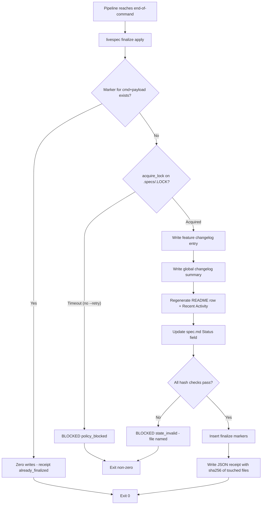
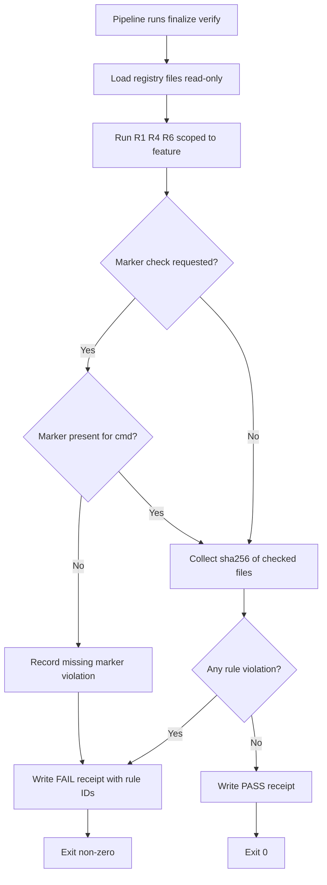
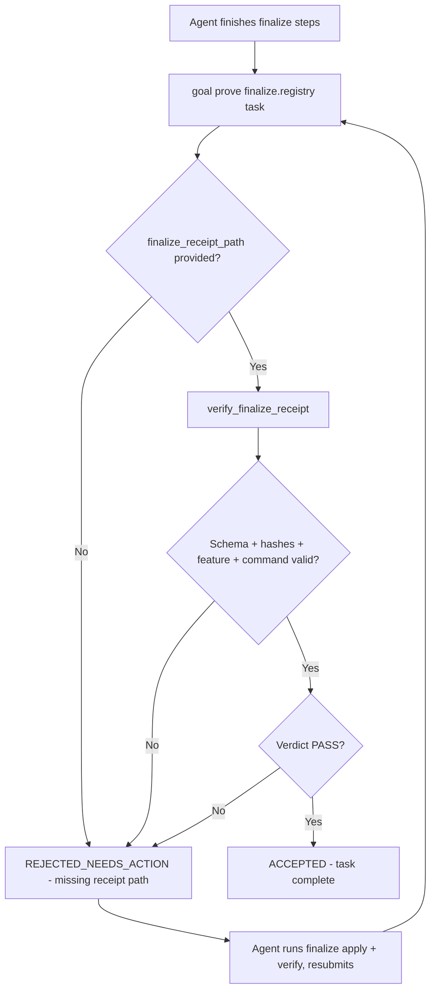
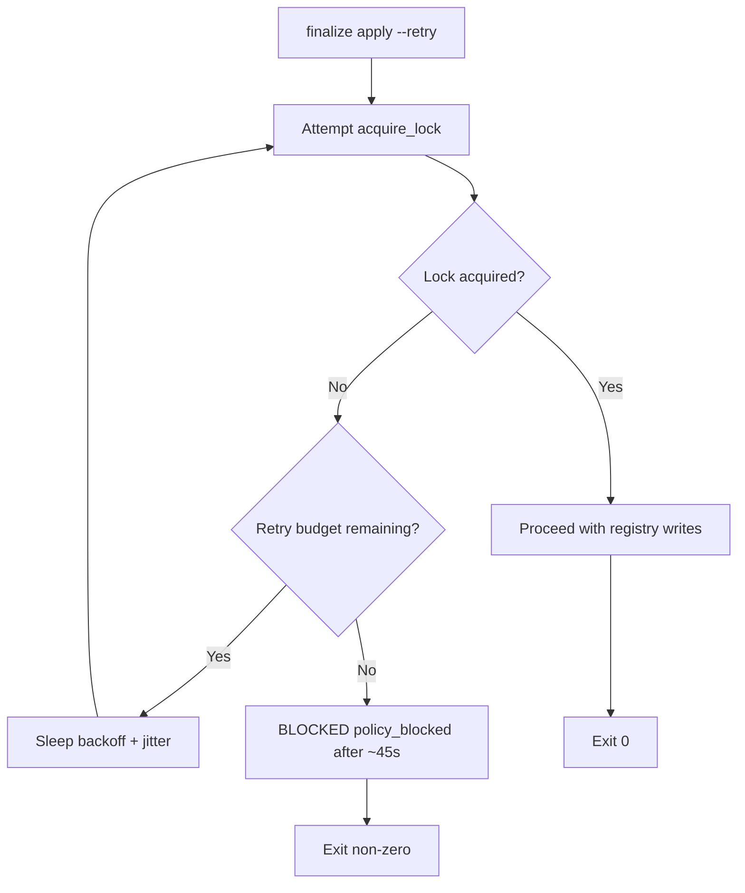

# Feature Spec: Deterministic Finalization

---

## Header

- **Feature:** Deterministic Finalization
- **Branch:** `feature/058-deterministic-finalization`
- **Date:** 2026-06-10
- **Status:** Implemented
- **Input:** Deterministic finalization CLI: new `livespec finalize apply` command writes all end-of-command registry updates (feature changelog entry, global `.specs/changelog.md` entry, README feature row + Recent Activity, status frontmatter) atomically and idempotently under `locks.acquire_lock` with `write_with_hash_check`, using marker `<!-- finalize:<cmd>:<date>:<hash8> -->` for idempotence; companion `livespec finalize verify` (read-only) re-checks registry coherence by reusing coherence rules R1/R4/R6 scoped to the feature and emits a JSON receipt (sha256 of touched files, same shape as the visual receipt); new goal evidence family `finalize.registry` in `goal_contracts.py` requiring `finalize_receipt_path` validated by `verify_finalize_receipt()` (clone of the `verify_visual_receipt` pattern) so DONE is structurally impossible without real finalization; plus opt-in retry with backoff+jitter on `locks.acquire_lock` (~45s total) for parallel `/spec-ship` safety.
- **Feature Number:** 058

**Why now:** today, end-of-command registry updates are LLM prose duplicated across 6 command prompts (`/spec-specify`, `/spec-plan`, `/spec-implement`, `/spec-fix`, `/spec-stack`, `/spec-feature`), causing recurring omissions surfaced as R4/R6 findings by `/spec-check`. This feature makes finalization deterministic, idempotent, lockable, verifiable by receipt, and structurally required by the goal system.

**Naming note:** Feature 048 introduced *run finalization* (RunArtifact verification against `expectations.md`). This feature is *registry finalization* (changelog/README/status writes). The two are distinct: `livespec finalize` exclusively governs registry artifacts.

---

## User Scenarios & Testing

### Story 1 — Pipeline applies all registry updates with one deterministic call `P1`

**As a** LiveSpec command pipeline (AI agent executing a `/spec-*` command), **I want to** run `livespec finalize apply` once at end-of-command and have it write the feature changelog entry, the global changelog entry, the README feature row + Recent Activity, and the spec status field atomically and idempotently, **so that** registry updates never depend on LLM prose and never get partially applied.

**Priority reason:** This is the core deliverable — without it, registry updates remain prose-driven and R4/R6 drift keeps recurring.

**Independent test:** On a fixture `.specs/` tree, run `livespec finalize apply --feature 004-notifications --command spec-specify --status Draft --entry-file entry.md`; verify all four registry targets are updated under a single lock window, each write goes through `write_with_hash_check`, a `<!-- finalize:spec-specify:<date>:<hash8> -->` marker is present, and a JSON receipt is emitted. Re-run the identical command and verify zero file modifications.

#### Acceptance Scenarios (Gherkin — source of truth for tests)

```gherkin
Feature: Deterministic registry apply
  Scenario: Apply writes all registry targets atomically
    Given a feature directory with a spec.md and a prepared changelog entry payload
    And no finalize marker for this command and payload exists
    When the pipeline runs "livespec finalize apply --feature <slug> --command <cmd> --status <status>"
    Then the feature changelog.md receives the new entry
    And the global .specs/changelog.md receives the summary line
    And the .specs/README.md features table row and Recent Activity section are regenerated
    And the spec.md status is set to <status> in both the YAML frontmatter and the header Status line, kept in sync
    And all writes happen inside one acquire_lock critical section via write_with_hash_check
    And each touched file carries the marker "<!-- finalize:<cmd>:<date>:<hash8> -->"
    And a JSON finalize receipt is written and its path printed on stdout
    And the exit code is 0

  Scenario: Idempotent re-run performs zero writes
    Given a previous identical apply already inserted the finalize marker
    When the pipeline re-runs the same "livespec finalize apply" invocation
    Then no registry file is modified (byte-identical before/after)
    And the receipt reports the outcome "already_finalized"
    And the exit code is 0

  Scenario: Lock timeout without retry opt-in
    Given another process holds .specs/.LOCK beyond the default 10s timeout
    When the pipeline runs "livespec finalize apply" without --retry
    Then the command emits the canonical BLOCKED line with subtype policy_blocked
    And no registry file is modified
    And the exit code is non-zero

  Scenario: Post-write hash mismatch halts
    Given a write to a registry file produces a SHA256 different from the expected content hash
    When write_with_hash_check raises WriteHashMismatchError
    Then the command emits the canonical BLOCKED line with subtype state_invalid naming the file
    And the exit code is non-zero
```

#### User Flow



---

### Story 2 — Pipeline verifies registry coherence and gets a receipt `P1`

**As a** LiveSpec command pipeline, **I want to** run `livespec finalize verify` (read-only) after applying, **so that** I get machine-checkable proof that the registry is coherent for this feature — the same proof the goal system will demand.

**Priority reason:** Without an independent verifier, `apply` could silently produce incoherent registries; the receipt is the structural evidence consumed by Story 3.

**Independent test:** On a fixture where `apply` has run, run `livespec finalize verify --feature <slug>`; verify it modifies no files, re-runs coherence rules R1/R4/R6 scoped to the feature, and writes a JSON receipt with per-file sha256 and verdict PASS. Corrupt the README row and verify the verdict flips to FAIL with the violated rule ID listed.

#### Acceptance Scenarios (Gherkin — source of truth for tests)

```gherkin
Feature: Read-only registry verification with receipt
  Scenario: Coherent registry yields a PASS receipt
    Given a feature whose registry updates were applied by finalize apply
    When the pipeline runs "livespec finalize verify --feature <slug>"
    Then no file under .specs/ is modified
    And coherence rules R1, R4, and R6 are evaluated scoped to the feature
    And a JSON receipt is written containing the sha256 of every checked registry file
    And the receipt verdict is "PASS"
    And the exit code is 0

  Scenario: Incoherent registry yields a FAIL receipt
    Given the README features table row for the feature was removed after apply
    When the pipeline runs "livespec finalize verify --feature <slug>"
    Then the receipt verdict is "FAIL"
    And the receipt lists the violated rule IDs (e.g. R4.2)
    And the exit code is non-zero

  Scenario: Missing finalize marker is reported
    Given the feature registry files carry no finalize marker for the expected command
    When the pipeline runs "livespec finalize verify --feature <slug> --command <cmd>"
    Then the receipt verdict is "FAIL"
    And the receipt records the missing marker for <cmd>
    And the exit code is non-zero
```

#### User Flow



---

### Story 3 — Goal system makes DONE structurally impossible without real finalization `P1`

**As a** LiveSpec maintainer, **I want** goal contracts of state-changing commands to include a `finalize.registry` evidence family that only accepts a `finalize_receipt_path` validated by `verify_finalize_receipt()`, **so that** an agent cannot declare DONE by prose — only a real, hash-verified finalize receipt completes the task.

**Priority reason:** This closes the enforcement loop: deterministic tooling (Stories 1–2) is only effective if the goal system structurally requires its output.

**Independent test:** Render a goal contract for a finalizing command, then `livespec goal prove --task <finalize.registry task>` with (a) a valid receipt path → ACCEPTED; (b) no receipt / prose claims → REJECTED_NEEDS_ACTION; (c) a tampered receipt (edited sha256) → REJECTED_NEEDS_ACTION.

#### Acceptance Scenarios (Gherkin — source of truth for tests)

```gherkin
Feature: finalize.registry goal evidence family
  Scenario: Valid receipt is accepted
    Given a goal contract containing a task in the finalize.registry family
    And a finalize receipt produced by "livespec finalize verify" with verdict PASS
    When the agent submits evidence with finalize_receipt_path pointing to the receipt
    Then verify_finalize_receipt() re-validates the receipt schema, file hashes, feature, and command
    And the proof status is "ACCEPTED"

  Scenario: Prose substitution is rejected
    Given a goal contract containing a task in the finalize.registry family
    When the agent submits evidence claiming registry updates without a finalize_receipt_path
    Then the proof status is "REJECTED_NEEDS_ACTION"
    And missing_evidence includes "finalize_receipt_path"

  Scenario: Tampered or stale receipt is rejected
    Given a finalize receipt whose recorded sha256 no longer matches the on-disk registry file
    When the agent submits evidence with that finalize_receipt_path
    Then verify_finalize_receipt() raises a receipt error
    And the proof status is "REJECTED_NEEDS_ACTION"

  Scenario: FAIL receipt is rejected
    Given a finalize receipt with verdict "FAIL"
    When the agent submits evidence with that finalize_receipt_path
    Then the proof status is "REJECTED_NEEDS_ACTION"
    And missing_evidence includes the receipt verdict requirement
```

#### User Flow



---

### Story 4 — Parallel /spec-ship runs queue safely on the registry lock `P2`

**As a** developer running `/spec-ship` with parallel feature pipelines, **I want** `finalize apply` to support an opt-in retry with exponential backoff and jitter (~45s total budget) on `locks.acquire_lock`, **so that** concurrent finalizations serialize instead of failing on the first 10s contention.

**Priority reason:** P2 — single-pipeline runs work with the default 10s timeout; this only matters under parallel ship load.

**Independent test:** Hold `.specs/.LOCK` from a helper process for 20s, run `finalize apply --retry`; verify the command retries with backoff+jitter and succeeds once the lock is released. Hold the lock for >45s and verify the command fails BLOCKED after exhausting the budget.

#### Acceptance Scenarios (Gherkin — source of truth for tests)

```gherkin
Feature: Opt-in lock retry with backoff and jitter
  Scenario: Retry succeeds after transient contention
    Given another finalize apply holds .specs/.LOCK for 20 seconds
    When the pipeline runs "livespec finalize apply --retry"
    Then acquire_lock attempts are retried with exponential backoff plus jitter
    And the command acquires the lock after the contention clears
    And the registry updates complete normally with exit code 0

  Scenario: Retry budget exhausted
    Given another process holds .specs/.LOCK for longer than the total retry budget (~45s)
    When the pipeline runs "livespec finalize apply --retry"
    Then the command emits the canonical BLOCKED line with subtype policy_blocked after ~45s
    And no registry file is modified
    And the exit code is non-zero

  Scenario: Default behavior is unchanged without opt-in
    Given another process holds .specs/.LOCK
    When the pipeline runs "livespec finalize apply" without --retry
    Then the lock attempt uses the existing single 10s timeout
    And the command fails BLOCKED after 10s
```

#### User Flow



---

## Acceptance Criteria

| ID | Criterion | Priority | Story |
|---|---|---|---|
| AC-001 | `livespec finalize apply --feature <slug> --command <cmd>` writes the feature changelog entry, the global `.specs/changelog.md` summary, the README features row + Recent Activity regeneration, and the spec.md status (YAML frontmatter `status:` + header `- **Status:**` line, kept in sync) inside a single `acquire_lock` critical section, each write via `write_with_hash_check` | P1 | Story 1 |
| AC-002 | Every registry file touched by apply carries the idempotence marker `<!-- finalize:<cmd>:<date>:<hash8> -->`; re-running the identical apply detects the marker by `<cmd>` + `<hash8>` and performs zero writes, exits 0, and reports `already_finalized` | P1 | Story 1 |
| AC-003 | apply emits a JSON finalize receipt (path printed on stdout) recording schema version, feature slug, command, outcome, and the sha256 of every touched file — same structural shape as the visual evidence receipt | P1 | Story 1 |
| AC-004 | On lock timeout (default 10s, no `--retry`) apply exits non-zero with the canonical `BLOCKED ... policy_blocked` line and modifies no registry file; on post-write hash mismatch it exits non-zero with `BLOCKED ... state_invalid` naming the file | P1 | Story 1 |
| AC-005 | `livespec finalize verify --feature <slug>` is strictly read-only and re-evaluates coherence rules R1, R4, and R6 scoped to the feature | P1 | Story 2 |
| AC-006 | verify emits a JSON receipt with verdict PASS/FAIL, per-file sha256, and the violated rule IDs on FAIL; exit 0 on PASS, non-zero on FAIL (including missing expected marker when `--command` is given) | P1 | Story 2 |
| AC-007 | Goal contracts for registry-finalizing commands include a `finalize.registry` evidence-family task whose only accepted completion evidence is a `finalize_receipt_path` validated by `verify_finalize_receipt()` (schema, on-disk hash re-verification, expected feature slug, expected command, verdict PASS) | P1 | Story 3 |
| AC-008 | `livespec goal prove` rejects finalize.registry evidence lacking a valid receipt — prose claims, missing paths, FAIL verdicts, and tampered hashes all return `REJECTED_NEEDS_ACTION` with the missing evidence named | P1 | Story 3 |
| AC-009 | With `--retry`, lock acquisition retries with exponential backoff plus jitter within a total budget defined by a named constant defaulting to 45 seconds (tested with ±5s tolerance) before failing BLOCKED | P2 | Story 4 |
| AC-010 | Without `--retry`, lock behavior is byte-for-byte the existing `acquire_lock` contract (single attempt window, 10s default timeout) — no behavior change for current callers | P2 | Story 4 |
| AC-011 | `livespec finalize --help` lists `apply` and `verify`; the command group is registered through the existing typer `register(app)` pattern of `validator/cli_commands/` | P1 | Story 1 |
| AC-012 | If `.specs/README.md` is missing, apply rebuilds it from existing artifacts (per spec-system README Recovery) before inserting the feature row; if the global changelog contains previous-year entries, apply performs the documented year rotation into `.specs/archive/` | P2 | Story 1 |

> **Deep-link anchors:** Each AC below has a heading anchor (`#ac-001`, ...) enabling direct navigation from `implementation.md` and `@spec` comments.

### AC-001

**Criterion:** `livespec finalize apply --feature <slug> --command <cmd>` writes the feature changelog entry, the global `.specs/changelog.md` summary, the README features row + Recent Activity regeneration, and the spec.md status (YAML frontmatter `status:` + header `- **Status:**` line, kept in sync) inside a single `acquire_lock` critical section, each write via `write_with_hash_check`
**Priority:** P1 | **Story:** Story 1

### AC-002

**Criterion:** Every registry file touched by apply carries the idempotence marker `<!-- finalize:<cmd>:<date>:<hash8> -->`; re-running the identical apply detects the marker by `<cmd>` + `<hash8>` and performs zero writes, exits 0, and reports `already_finalized`
**Priority:** P1 | **Story:** Story 1

### AC-003

**Criterion:** apply emits a JSON finalize receipt (path printed on stdout) recording schema version, feature slug, command, outcome, and the sha256 of every touched file — same structural shape as the visual evidence receipt
**Priority:** P1 | **Story:** Story 1

### AC-004

**Criterion:** On lock timeout (default 10s, no `--retry`) apply exits non-zero with the canonical `BLOCKED ... policy_blocked` line and modifies no registry file; on post-write hash mismatch it exits non-zero with `BLOCKED ... state_invalid` naming the file
**Priority:** P1 | **Story:** Story 1

### AC-005

**Criterion:** `livespec finalize verify --feature <slug>` is strictly read-only and re-evaluates coherence rules R1, R4, and R6 scoped to the feature
**Priority:** P1 | **Story:** Story 2

### AC-006

**Criterion:** verify emits a JSON receipt with verdict PASS/FAIL, per-file sha256, and the violated rule IDs on FAIL; exit 0 on PASS, non-zero on FAIL (including missing expected marker when `--command` is given)
**Priority:** P1 | **Story:** Story 2

### AC-007

**Criterion:** Goal contracts for registry-finalizing commands include a `finalize.registry` evidence-family task whose only accepted completion evidence is a `finalize_receipt_path` validated by `verify_finalize_receipt()` (schema, on-disk hash re-verification, expected feature slug, expected command, verdict PASS)
**Priority:** P1 | **Story:** Story 3

### AC-008

**Criterion:** `livespec goal prove` rejects finalize.registry evidence lacking a valid receipt — prose claims, missing paths, FAIL verdicts, and tampered hashes all return `REJECTED_NEEDS_ACTION` with the missing evidence named
**Priority:** P1 | **Story:** Story 3

### AC-009

**Criterion:** With `--retry`, lock acquisition retries with exponential backoff plus jitter within a total budget defined by a named constant defaulting to 45 seconds (tested with ±5s tolerance) before failing BLOCKED
**Priority:** P2 | **Story:** Story 4

### AC-010

**Criterion:** Without `--retry`, lock behavior is byte-for-byte the existing `acquire_lock` contract (single attempt window, 10s default timeout) — no behavior change for current callers
**Priority:** P2 | **Story:** Story 4

### AC-011

**Criterion:** `livespec finalize --help` lists `apply` and `verify`; the command group is registered through the existing typer `register(app)` pattern of `validator/cli_commands/`
**Priority:** P1 | **Story:** Story 1

### AC-012

**Criterion:** If `.specs/README.md` is missing, apply rebuilds it from existing artifacts (per spec-system README Recovery) before inserting the feature row; if the global changelog contains previous-year entries, apply performs the documented year rotation into `.specs/archive/`
**Priority:** P2 | **Story:** Story 1

---

## Functional Requirements

| ID | Requirement | AC References |
|---|---|---|
| FR-001 | System must provide a `livespec finalize apply` subcommand that performs all four end-of-command registry updates (feature changelog, global changelog, README row + Recent Activity, spec status) in one atomic, lock-guarded, hash-verified operation | AC-001, AC-011 |
| FR-002 | System must make apply idempotent via the deterministic marker `<!-- finalize:<cmd>:<date>:<hash8> -->`, where `<hash8>` is derived from the feature slug, command, and update payload — identity is `<cmd>` + `<hash8>` (the `<date>` segment is informational only) | AC-002 |
| FR-003 | System must emit a JSON finalize receipt for both apply and verify, recording the sha256 of every touched/checked registry file, structurally aligned with the visual evidence receipt (schema version, oracle name/version, payload hash, verdict) | AC-003, AC-006 |
| FR-004 | System must provide a strictly read-only `livespec finalize verify` subcommand that re-evaluates coherence rules R1, R4, and R6 scoped to the target feature and reports violations by rule ID | AC-005, AC-006 |
| FR-005 | System must add a `finalize.registry` evidence family to the goal contract validator that requires `finalize_receipt_path` and rejects all substitute evidence (prose, exit codes, declared file lists); the family is attached to the goal contracts of the six registry-finalizing commands: `spec-specify`, `spec-plan`, `spec-implement`, `spec-fix`, `spec-stack`, `spec-feature` | AC-007, AC-008 |
| FR-006 | System must provide `verify_finalize_receipt()` following the `verify_visual_receipt` pattern: schema validation, receipt payload-hash check, on-disk file sha256 re-verification, and expected feature/command/verdict matching | AC-007, AC-008 |
| FR-007 | System must support an opt-in retry mode on `locks.acquire_lock` with exponential backoff plus jitter and a total budget of ~45 seconds, leaving default (non-retry) lock behavior unchanged | AC-009, AC-010 |
| FR-008 | System must surface failures with the canonical anti-drift BLOCKED format and specific exit codes: lock timeout → `policy_blocked`, hash mismatch → `state_invalid`, coherence FAIL → non-zero with rule IDs | AC-004, AC-006 |
| FR-009 | System must implement the feature as `validator/finalize.py` (logic) plus `validator/cli_commands/finalize_cmd.py` (typer surface) registered via the existing `register(app)` pattern | AC-011 |
| FR-010 | System must handle registry recovery and rotation during apply: rebuild a missing README from artifacts and rotate previous-year global changelog entries to `.specs/archive/changelog-YYYY.md` | AC-012 |

> **Deep-link anchors:** Each FR below has a heading anchor (`#fr-001`, ...) enabling direct navigation from `implementation.md` and `@spec` comments.

### FR-001

**Requirement:** System must provide a `livespec finalize apply` subcommand that performs all four end-of-command registry updates (feature changelog, global changelog, README row + Recent Activity, spec status) in one atomic, lock-guarded, hash-verified operation
**AC References:** [AC-001](#ac-001), [AC-011](#ac-011)

### FR-002

**Requirement:** System must make apply idempotent via the deterministic marker `<!-- finalize:<cmd>:<date>:<hash8> -->`, where `<hash8>` is derived from the feature slug, command, and update payload — identity is `<cmd>` + `<hash8>` (the `<date>` segment is informational only)
**AC References:** [AC-002](#ac-002)

### FR-003

**Requirement:** System must emit a JSON finalize receipt for both apply and verify, recording the sha256 of every touched/checked registry file, structurally aligned with the visual evidence receipt (schema version, oracle name/version, payload hash, verdict)
**AC References:** [AC-003](#ac-003), [AC-006](#ac-006)

### FR-004

**Requirement:** System must provide a strictly read-only `livespec finalize verify` subcommand that re-evaluates coherence rules R1, R4, and R6 scoped to the target feature and reports violations by rule ID
**AC References:** [AC-005](#ac-005), [AC-006](#ac-006)

### FR-005

**Requirement:** System must add a `finalize.registry` evidence family to the goal contract validator that requires `finalize_receipt_path` and rejects all substitute evidence (prose, exit codes, declared file lists); the family is attached to the goal contracts of the six registry-finalizing commands: `spec-specify`, `spec-plan`, `spec-implement`, `spec-fix`, `spec-stack`, `spec-feature`
**AC References:** [AC-007](#ac-007), [AC-008](#ac-008)

### FR-006

**Requirement:** System must provide `verify_finalize_receipt()` following the `verify_visual_receipt` pattern: schema validation, receipt payload-hash check, on-disk file sha256 re-verification, and expected feature/command/verdict matching
**AC References:** [AC-007](#ac-007), [AC-008](#ac-008)

### FR-007

**Requirement:** System must support an opt-in retry mode on `locks.acquire_lock` with exponential backoff plus jitter and a total budget of ~45 seconds, leaving default (non-retry) lock behavior unchanged
**AC References:** [AC-009](#ac-009), [AC-010](#ac-010)

### FR-008

**Requirement:** System must surface failures with the canonical anti-drift BLOCKED format and specific exit codes: lock timeout → `policy_blocked`, hash mismatch → `state_invalid`, coherence FAIL → non-zero with rule IDs
**AC References:** [AC-004](#ac-004), [AC-006](#ac-006)

### FR-009

**Requirement:** System must implement the feature as `validator/finalize.py` (logic) plus `validator/cli_commands/finalize_cmd.py` (typer surface) registered via the existing `register(app)` pattern
**AC References:** [AC-011](#ac-011)

### FR-010

**Requirement:** System must handle registry recovery and rotation during apply: rebuild a missing README from artifacts and rotate previous-year global changelog entries to `.specs/archive/changelog-YYYY.md`
**AC References:** [AC-012](#ac-012)

---

## Key Entities

| Entity | Description | Key Fields |
|---|---|---|
| FinalizeReceipt | JSON proof of an apply/verify run, same structural shape as the visual evidence receipt | schema_version, oracle_name, oracle_version, feature_slug, command, outcome (applied / already_finalized / verified), verdict (PASS / FAIL / BLOCKED), files[] (path, sha256), violations[] (rule_id, message), payload_hash, created_at |
| FinalizeMarker | HTML-comment idempotence marker embedded in touched registry files | command, date, hash8 (first 8 hex of sha256 over slug + command + payload) |
| RegistryUpdate | One declarative end-of-command update applied under lock | target (feature_changelog / global_changelog / readme / spec_status), feature_slug, content payload, marker |
| LockRetryPolicy | Opt-in retry configuration for `acquire_lock` | enabled, base_delay, multiplier, jitter, total_budget (~45s) |

---

## Edge Cases

- **Re-run on a later date with identical payload:** marker identity is `<cmd>` + `<hash8>` (payload-derived); the `<date>` segment differs but the run is still recognized as already finalized — no duplicate entry.
- **Marker present but registry content manually edited afterwards:** `apply` stays idempotent (marker found), but `finalize verify` FAILs via R4/R6 with the violated rule ID; the receipt makes the drift visible.
- **`.specs/README.md` missing:** apply rebuilds it from `features/*/spec.md`, ADRs, and `changelog.md` (spec-system README Recovery) before inserting the row — never crashes on a missing registry file.
- **Global changelog year rotation:** if previous-year entries exist when apply appends, they are moved to `.specs/archive/changelog-YYYY.md` with the "Previous years" link section, per the documented rotation rules.
- **Partial apply after a mid-section failure:** markers are per-file, so a re-run after a `WriteHashMismatchError` (or crash) skips the files already carrying the marker and writes only the remaining targets — apply converges to the fully finalized state without duplicating entries; the receipt of the failed run records outcome `BLOCKED` plus the files written so far.
- **Lock held by a crashed process:** flock is released by the OS on process death; apply retries (with `--retry`) or fails BLOCKED — it never force-deletes `.specs/.LOCK`.
- **Concurrent applies for two different features:** serialized by the single `.specs/.LOCK`; with `--retry`, both complete; markers and receipts stay feature-scoped, so no cross-contamination.
- **Receipt path outside the project root or pointing to a non-receipt file:** `verify_finalize_receipt()` rejects it (same containment rule as visual receipts).
- **Name collision with Feature 048 "run finalization":** `livespec finalize` governs registry artifacts only; RunArtifact/expectations verification remains a separate surface — documentation must state the distinction.
- **Spec status line absent or non-standard in spec.md:** apply reports BLOCKED `state_invalid` naming the file rather than guessing an insertion point. When present, apply updates both the YAML frontmatter `status:` and the `- **Status:**` header line so they never diverge.
- **Roadmap stays outside apply scope:** apply writes only the four registry targets; roadmap checkbox updates remain owned by `/spec-specify` Step 7.7 — `finalize verify` still surfaces roadmap drift through rule R1.
- **Partial historical registries (feature never finalized before):** verify with `--command` reports the missing marker as FAIL; verify without `--command` only evaluates R1/R4/R6 coherence.

---

## Success Criteria

| ID | Criterion | How to Measure |
|---|---|---|
| SC-001 | All P1 acceptance criteria pass automated tests | pytest suite green (unit + integration on fixture `.specs/` trees) |
| SC-002 | Apply is provably idempotent | Integration test: two identical apply runs produce byte-identical registry files on the second run |
| SC-003 | A freshly finalized feature produces zero R4/R6 findings | `/spec-check` (coherence layer) on a fixture finalized via apply reports no R4/R6 violations |
| SC-004 | DONE without finalization is structurally impossible | Goal-prove tests: 100% of fabricated, missing, tampered, or FAIL-verdict receipts are REJECTED_NEEDS_ACTION |
| SC-005 | Parallel finalization is safe | Stress test: N concurrent `apply --retry` runs over distinct features complete with no hash mismatch and no lost update |
| SC-006 | Default lock semantics are untouched | Existing `tests/` for `validator/locks.py` pass unmodified |

---

*Generated by `/spec-specify` — LiveSpec v3*

<!-- finalize:spec-implement:2026-06-10:9a1dbf71 -->

<!-- finalize:spec-feature:2026-06-10:96deb6de -->
