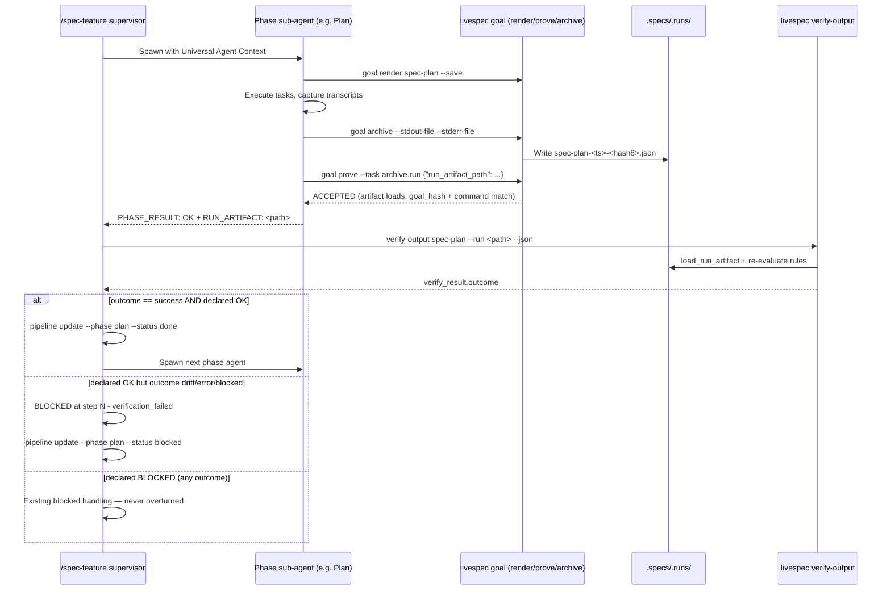
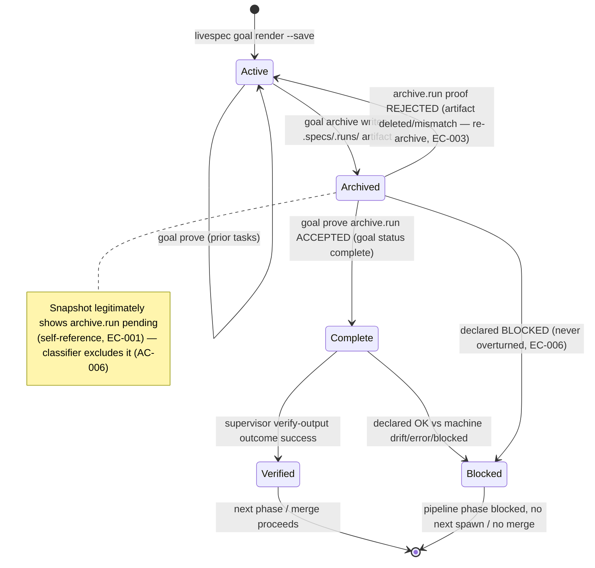
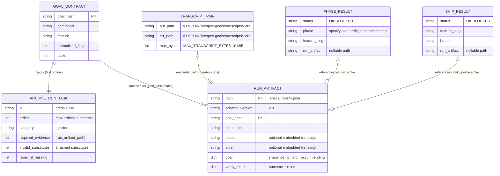

# Plan - Pipeline Verify Phase

## Summary

Close the supervisor↔subagent proof chain in four dependency-ordered bricks: (1) compiler-side injection of an `archive.run` goal task (new evidence family on the `finalize.registry` model) in `validator/goal_contracts.py` `_build_goal_tasks`, proven read-only against the `.specs/.runs/` artifact; (2) a supervisor Verify phase in `/spec-feature` that cross-checks each PHASE_RESULT declaration (new `run_artifact` field in `validator/contracts.py` `PhaseResult`) against the machine verdict of `livespec verify-output <sub-command> --run <path> --json`; (3) artifact-backed SHIP_RESULT consumption in `/spec-ship` Step 3 (new `run_artifact` field in `ShipResult`) gating merge/branch-delete; (4) a transcript capture protocol (documented centrally in `system/anti-drift-block.md` §5) feeding `--stdout-file`/`--stderr-file` into `livespec goal archive` so `contains` rules evaluate real PASS/FAIL — with `_goal_incomplete` in `validator/run_artifacts.py` (and the verify-output re-derivation) excluding the self-referencing `archive.run` task.

## Technical Context

| Aspect | Choice | Reason |
|---|---|---|
| Language | Python ≥3.11 (3.14 in .venv) | From project stack (`.specs/stacks/_default.md`) |
| CLI Framework | Typer ≥0.12 | Existing `goal_app` / `verify-output` command surfaces; **zero new subcommands** (constitution principle 5) |
| Schema Validation | Pydantic ≥2.7 | `PhaseResult` / `ShipResult` models in `validator/contracts.py` extend with `run_artifact` |
| Artifact layer | `validator/run_artifacts.py` (RunArtifact v2) | Reuse `archive_goal_run`, `load_run_artifact`, `find_latest_artifact` — no schema version bump: **optional `stdout`/`stderr` embedding already exists** (`archive_goal_run` L116-119, 039.1 FR-003); this feature adds no artifact field |
| Transcript flags | `livespec goal archive --stdout-file/--stderr-file` | **Already implemented** (`validator/cli_commands/goal_cmd.py` L54-55, `MAX_TRANSCRIPT_BYTES` L59, `_read_transcript` L212 — 039.1). This feature wires the executor protocol around them; zero new CLI flags |
| Evidence families | `validator/goal_contracts.py` | Clone the `finalize.registry` constants + dedicated-validator pattern (`FINALIZE_*` at L108-120, `_validate_finalize_receipt_evidence` at L1288) |
| Alias resolution | `validator/command_registry.py` `canonical_command_name` | Reuse for the supervisor Verify sub-command match (AC-009, EC-005) |
| Testing | pytest 8.x, unit + integration on tmp fixtures | From `.specs/testing/strategy.md`; markers `level_3a` for sweep tests; **zero skipped tests introduced** |
| Lint/Types | ruff + pyright strict | Pre-commit gates; all new public functions fully typed |
| Platform | macOS + Linux CLI | `$TMPDIR` via `tempfile.gettempdir()` (same as `goal_cmd.render_cmd`) |
| Project type | Local developer CLI — no DB, no network, no UI | No ER persistence; entities are JSON/file shapes |

**Conventions loaded (domain: code):** `general.md`, `python.md`, `javascript.md`, `cli.md`, `stack-commands.md` from `ai-ressources/code-conventions/` (`javascript.md` is part of the goal-contract-mandated bundle and was read for proof completeness; no JS-owned file exists in this plan — Python is the only implementation language). Applied: snake_case modules, typed public signatures (pyright strict), Google-style docstrings on all new public functions, domain errors propagated and converted at the typer boundary, named constants for every threshold (no new magic values — `MAX_TRANSCRIPT_BYTES` already exists), mandatory inline comments for backward-compatibility code (trigger 8: pre-059 artifact tolerance), order-dependent operations (trigger 9: archive-before-prove bootstrap), and non-trivial business branches (trigger 5: demote-never-promote rules).

## Constitution Check

| Principle | Verdict | Note |
|---|---|---|
| 1. Layered Validation | ✅ | The `archive.run` prove validator is disk-side validation only (containment → v2 load → hash/command match); `verify-output` rule layering untouched; failures surface with named substitutes + repair actions. |
| 2. Provider-Agnostic LLM | ✅ | No LLM involvement anywhere in this feature. |
| 3. File-System as Source of Truth | ✅ | Durable proof lives in `.specs/.runs/` artifacts; transcripts under `$TMPDIR/livespec-goals/transcripts/` are scratch — the durable copy is the `stdout`/`stderr` embedded in the artifact (spec locked decision); nothing committed under `.specs/` for transcripts. |
| 4. Fail Fast, Exit Clearly | ✅ | `REJECTED_NEEDS_ACTION` names each offered substitute (AC-003); `goal archive` keeps blocked/exit 2 for unreadable/oversized transcripts (EC-008/EC-009); supervisor/ship emit canonical `BLOCKED at step <N> - verification_failed - <reason>` lines. |
| 5. Minimal Surface, Maximum Composability | ✅ | Zero new CLI commands or flags — composition of existing `goal render/prove/archive`, `verify-output --run`, `pipeline update`. The only new surface is one injected task id and two optional contract fields. |
| 6. No Hosted Infrastructure | ✅ | Local FS only. |
| Testing Standards | ✅ | TDD per step (failing test → implement → green); unit tests beside the module (`tests/test_goal_contracts.py`, `tests/test_run_artifact.py`, `tests/test_contracts.py`, `tests/test_verify_output_cli.py`); chaos cases for malformed artifacts; no visual testing (no UI). |
| Protected scope | ✅ | `validator/journeys/runner.py` and `tests/test_journey_v2_runner.py` are NOT touched (FR-011/AC-015). |

## Design Reference

No `## Screens` section in spec.md — CLI/protocol feature, no design mockups, no theme step.

## Sequence Diagram — Supervisor Verify flow (Gherkin + Mermaid)

```gherkin
Feature: Supervisor Verify phase cross-checks PHASE_RESULT against the archived artifact
  Scenario: Declaration and machine verdict agree
    Given the Plan sub-agent archived its run and emitted PHASE_RESULT: OK with RUN_ARTIFACT
    When  the supervisor runs `livespec verify-output spec-plan --run <path> --json`
    Then  the envelope verify_result.outcome is "success"
    And   the supervisor runs `livespec pipeline update --phase plan --status done`
    And   spawns the next phase agent

  Scenario: Declared OK contradicted by the machine verdict
    Given a sub-agent emitted PHASE_RESULT: OK with RUN_ARTIFACT
    And   the artifact outcome re-evaluates to drift
    When  the supervisor cross-checks declaration vs machine outcome
    Then  it emits `BLOCKED at step <N> - verification_failed - declared OK but machine outcome drift`
    And   runs `livespec pipeline update --phase <phase> --status blocked`
    And   never spawns the next phase agent

  Scenario: RUN_ARTIFACT absent falls back to the latest sub-command artifact
    Given a parseable PHASE_RESULT without run_artifact (legacy agent or timeout recovery)
    When  the supervisor enters Verify
    Then  it resolves the lexicographically latest .specs/.runs/<sub-command>-*.json
    And   blocks with the canonical line if no artifact exists for the sub-command

  Scenario: Foreign-command artifact is blocked explicitly
    Given RUN_ARTIFACT points at another command's artifact
    When  the supervisor compares the artifact command field to the alias-normalized sub-command
    Then  the mismatch is treated as blocked and the canonical BLOCKED line is emitted
```



## State Diagram — Goal-locked run lifecycle (Gherkin + Mermaid)

```gherkin
Feature: Run lifecycle from active goal to verified or blocked
  Scenario: Enforced run reaches verified
    Given an active goal whose contract carries archive.run as last ordinal
    When  every prior task is proven and `livespec goal archive` writes the artifact
    And   archive.run is proven with the artifact path
    And   the supervisor Verify phase re-evaluates the artifact to outcome success
    Then  the run is verified and the pipeline proceeds

  Scenario: Run blocked at verification
    Given an archived run whose artifact outcome is drift, error, or blocked
    When  the supervisor Verify phase cross-checks a declared OK
    Then  the run transitions to blocked and the pipeline stops

  Scenario: Goal cannot complete without archiving
    Given an executor that skipped `livespec goal archive`
    When  it tries to prove archive.run with prose or an exit code
    Then  the proof is REJECTED_NEEDS_ACTION and the goal stays active (EC-010)
```



## ER Diagram — Entities (Mermaid only)

File/JSON shapes — no database. Relationships express containment and reference.



## Implementation Plan

TDD discipline for every step: write the failing tests listed in the step first, run them red, implement, run green, then `ruff check` + `pyright` on touched files. No step introduces a skipped test.

### Step 1 — `archive.run` evidence family constants + compiler-side injection

**Files:** `validator/goal_contracts.py` (modified), `validator/run_artifacts.py` (modified), `tests/test_goal_contracts.py` (modified)

- `validator/run_artifacts.py`: add module constant `ARCHIVE_RUN_TASK_ID = "archive.run"` (single shared definition; `run_artifacts` is import-safe from `goal_contracts` — no cycle: `goal_contracts` does not currently import `run_artifacts`, and `run_artifacts` never imports `goal_contracts`). Export in `__all__`.
- `validator/goal_contracts.py`: next to the `FINALIZE_*` block (L108-120), add:
  - `ARCHIVE_REQUIRED_EVIDENCE: tuple[str, ...] = ("run_artifact_path",)`
  - `ARCHIVE_INVALID_SUBSTITUTES: tuple[str, ...] = ("prose_archive_claim", "exit_code_without_artifact", "tmpdir_contract_state_paths_without_artifact")`
  - `ARCHIVE_REPAIR_ACTIONS: tuple[str, ...]` — instruct running `` `livespec goal archive --contract <c> --state <s> [--feature <slug>]` `` and resubmitting the printed artifact path (AC-003 wording).
  - `ARCHIVE_RUN_TASK_DESCRIPTION = "Archive the run via `livespec goal archive` and prove archive.run with the artifact path"`.
- `_build_goal_tasks`: after the existing row loop, append exactly one synthetic task: id `ARCHIVE_RUN_TASK_ID`, `ordinal = len-derived max + 1` (always the highest ordinal — it snapshots all prior evidence, AC-002), `category: "injected"`, fixed description, `required_evidence = list(ARCHIVE_REQUIRED_EVIDENCE)` (exactly the AC-003 tuple — **no** convention-evidence layering: the task is synthetic compiler work, not prose execution, and its dedicated validator ignores convention fields), `invalid_substitutes`/`repair_if_missing` from the constants, `completion_actor: "goal"`, `expected_evidence: {"command": command, "feature_slug": None}`. Deterministic: same inputs → same canonical JSON → same hash (the injected task is a pure function of the command, AC-002).
- **Tests first** (`tests/test_goal_contracts.py`):
  - exactly one task with id `archive.run` in every compiled contract (fixture commands with and without execution tasks, with/without features/flags);
  - `archive.run` has the strictly highest ordinal;
  - `required_evidence == ["run_artifact_path"]`, substitutes and repair actions match constants;
  - hash determinism: two renders with identical inputs produce identical hashes (extend the existing L553 determinism test);
  - **deliberate fixture updates**: audit every existing assertion over `contract["tasks"]` / `state["tasks"]` (e.g. L762-771 `all(...)` and set-equality assertions hold automatically; any test proving "all tasks complete" or counting tasks must explicitly account for the injected task — update each with a comment naming this feature, never by loosening to `>=`).

**FR covered:** FR-001.1: Inject archive.run last ordinal, FR-002.1: Evidence family constants

### Step 2 — Dedicated read-only prove validator for `archive.run`

**Files:** `validator/goal_contracts.py` (modified), `tests/test_goal_contracts.py` (modified)

- `_validate_task_evidence`: route `task_id == ARCHIVE_RUN_TASK_ID` (and `task_id.startswith("archive.run.")` for symmetry with the finalize router) to new `_validate_archive_run_evidence(task, evidence, contract=contract, project_root=project_root)` — placed beside `_validate_finalize_receipt_evidence` and modeled on it.
- `_validate_archive_run_evidence` behavior:
  1. **Substitute naming** (AC-003): when `run_artifact_path` is missing/empty — `evidence.get("output") or evidence.get("prose") or evidence.get("archived")` → `prose_archive_claim`; `"exit_code" in evidence` → `exit_code_without_artifact`; any of `contract_file`/`state_file`/`contract`/`state` keys or a string value containing the `livespec-goals` `$TMPDIR` marker (`CHILD_GOAL_ARTIFACT_ROOT_MARKER`) → `tmpdir_contract_state_paths_without_artifact`; always append `run_artifact_path` to `missing`.
  2. **Containment** (AC-004): `project_root` required; resolve the submitted path and require it under `(project_root / ".specs" / ".runs").resolve()` via `Path.relative_to` (reject traversal/symlink escapes — same confinement idea as `verify_output._confined_project_path`).
  3. **Load** (AC-004): `load_run_artifact(path)`; catch `(OSError, ArtifactMalformed)` → `missing.append(f"run_artifact_valid:{exc}")`.
  4. **Identity match** (AC-004): `artifact["goal_hash"] == contract["goal_hash"]` and `artifact["command"] == contract["command"]` — each failure appends a named missing item (`run_artifact_goal_hash_match`, `run_artifact_command_match`).
  5. **Read-only bootstrap** (AC-005): the validator only reads — it never calls `archive_goal_run` (inline comment, convention trigger 9: prove happens AFTER archive ran; a single archive per run is canonical). Any artifact with a matching hash is accepted — not only the latest (EC-002).
- Import `load_run_artifact`, `ArtifactMalformed`, `ARCHIVE_RUN_TASK_ID` at the top of `goal_contracts.py` (one-way import, no cycle).
- **Tests first**: prose-only evidence → `REJECTED_NEEDS_ACTION` naming `prose_archive_claim`; exit-code evidence → `exit_code_without_artifact`; `$TMPDIR` contract/state paths → `tmpdir_contract_state_paths_without_artifact`; path outside `.specs/.runs/` rejected; malformed JSON file rejected (chaos case); wrong `goal_hash` rejected; wrong `command` rejected; valid artifact (written by a real `archive_goal_run` call on the fixture contract/state) → `ACCEPTED` and state `complete`; the prove call writes nothing new under `.specs/.runs/` (read-only assertion: directory listing unchanged); non-latest matching artifact accepted (EC-002); artifact deleted between archive and prove → rejected with repair actions (EC-003).

**FR covered:** FR-003.1: Read-only prove validator

### Step 3 — Outcome classifier exclusion + verify-output re-derivation

**Files:** `validator/run_artifacts.py` (modified), `validator/cli_commands/verify_output_cmd.py` (modified), `tests/test_run_artifact.py` (modified), `tests/test_verify_output_cli.py` (modified)

- `validator/run_artifacts.py` `_goal_incomplete`: skip tasks whose `id == ARCHIVE_RUN_TASK_ID` (inline comment, convention trigger 5/8: the snapshot is taken before the archive proof, so `archive.run` pending is the expected shape of every enforced artifact — EC-001/AC-006). Promote to a public helper `goal_tasks_incomplete(tasks: list[dict[str, Any]]) -> bool` (exported) so the CLI re-derivation shares the exact same rule instead of duplicating it.
- `validator/cli_commands/verify_output_cmd.py` L103: replace the inline `any(task.get("status") != "complete" ...)` with the shared `goal_tasks_incomplete(tasks)` (AC-006 "any verify-output re-derivation").
- Backward compatibility (FR-005/AC-007): pre-059 snapshots simply contain no `archive.run` id — the exclusion never matches; no loader/schema change (`RUN_ARTIFACT_SCHEMA_VERSION` stays `2.0`); `verify-output` never requires the archive task's presence.
- **Tests first**:
  - `tests/test_run_artifact.py`: snapshot with every required task complete except `archive.run` pending → `archive_goal_run` outcome `success` not `drift` (SC-004); snapshot with another pending task AND `archive.run` pending → still `drift`; pre-059 snapshot (no `archive.run`) with a pending task → `drift` unchanged; fully-complete pre-059 snapshot → `success` unchanged.
  - `tests/test_verify_output_cli.py`: CLI run over an artifact whose only pending task is `archive.run` → outcome `success` (exit 0); pre-059 fixture artifact verifies cleanly (AC-007).
  - Keep `tests/test_verify_output.py::test_goal_incomplete_with_exit_zero_is_drift` untouched — `evaluate_rules` keeps its `goal_incomplete` parameter; only the call sites change how the flag is derived.

**FR covered:** FR-004.1: Classifier excludes archive.run, FR-005.1: Pre-059 artifact compatibility

### Step 4 — Transcript capture protocol (central wiring + engine-behavior locks)

> Ordered before any supervisor/ship consumption step: the Verify phase (Step 7) and ship gate (Step 8) depend on artifacts whose `contains` rules produce real PASS/FAIL, which requires the transcript protocol to exist first.

**Files:** `system/anti-drift-block.md` (modified), `tests/test_goal_archive_cli.py` (modified)

The CLI surface is **already complete** (039.1): `goal archive --stdout-file/--stderr-file` (`goal_cmd.py` L54-55), `MAX_TRANSCRIPT_BYTES` (L59), `_read_transcript` oversized rejection (L212-226), and optional `stdout`/`stderr` embedding in `archive_goal_run` (L116-119). FR-009/FR-010 are therefore protocol wiring + behavior-locking tests, with **no engine change**.

**Why there is no "phase launcher code" step:** LiveSpec phases are not Python subprocesses — they are LLM sub-agents spawned from prompt blocks and executed against SKILL.md/anti-drift instructions (constitution: the validator is a CLI, command orchestration is Markdown-driven). The executable wiring points for transcript capture are therefore exactly two, both planned: (a) this central protocol text that every goal-locked executor must follow (with the verbatim `tee -a` capture pattern below), and (b) the per-phase spawned prompt blocks updated in Step 7 to carry the capture + archive-flag instructions inline. The SKIP→PASS/FAIL movement is machine-tested in this step's CLI tests.

- `system/anti-drift-block.md` §5 (Runtime goal contract) — the section every goal-locked SKILL.md header mandates reading — gains two short subsections, wiring all 20 goal-locked commands **without editing 20 SKILL.md files** (consistent with the locked compiler-side-injection decision; only spec-feature/spec-ship get direct SKILL edits in Steps 7-8, so only those two `expectations.md` files need `last_reviewed` bumps):
  - **Transcript capture:** during the run, append the stdout/stderr of key CLI executions (e.g. `livespec validate`, `pytest`, `livespec finalize verify`) to `$TMPDIR/livespec-goals/transcripts/<command>-<hash8>.out` / `.err` (create the directory with `mkdir -p`; `<hash8>` = first 8 chars of the active goal hash — pairs the transcript to the contract). Concrete executor pattern documented verbatim: `<cli command> 2>>"$T/<command>-<hash8>.err" | tee -a "$T/<command>-<hash8>.out"`. Before archiving, if a file exceeds `MAX_TRANSCRIPT_BYTES` (10 MiB) truncate it keeping the **most recent** bytes (`tail -c`) — most recent output is the diagnostic payload (EC-009); if a transcript is missing or unreadable, **omit** the flag instead of passing a broken path (EC-008 — `goal archive` blocks exit 2 on unreadable input); absence is honest: `contains` rules stay SKIP and the archive still succeeds (AC-014, FR-010).
  - **Archive & prove archive.run:** before `DONE`, run `livespec goal archive --contract <c> --state <s> [--feature <slug>] [--exit-code <n>] [--stdout-file <out>] [--stderr-file <err>]`, then prove the injected last task: `livespec goal prove --task archive.run --evidence '{"run_artifact_path": "<printed path>"}'` — `goal status` can only report complete after this proof (EC-010).
- The per-phase wiring point for `/spec-feature` sub-agents is Step 7: each phase agent prompt block explicitly instructs transcript capture + archive flags (so the wiring is in the spawned prompt itself, not only in the central doc).
- **Tests first** (`tests/test_goal_archive_cli.py` — engine-behavior locks, FR-010): archive with `--stdout-file`/`--stderr-file` containing a `contains`-rule needle → that rule reports PASS (and FAIL when the needle is absent from the transcript); same goal archived without the flags → the rule reports SKIP with a descriptive detail and the archive succeeds (AC-014); oversized transcript still blocked exit 2 (existing-behavior regression guard); executor-style truncated file (most recent bytes under the bound) accepted.

**FR covered:** FR-009.1: Transcript protocol documented + wired, FR-010.1: SKIP semantics locked by tests

### Step 5 — Contract models: `run_artifact` on PhaseResult + ShipResult, preflight phase

**Files:** `validator/contracts.py` (modified), `tests/test_contracts.py` (modified)

- `PhaseResult`: add `run_artifact: str | None = None` (legacy tolerance — blocks without the key parse with `None`, AC-008; `extra: forbid` still rejects unknown keys). Extend `phase: Literal["specify", "plan", "preflight", "implement", "test"]` — this is the answer to spec-review INFO (a): **the Preflight sub-agent result rides in the same PHASE_RESULT contract with `phase: "preflight"`**; its READY/WARNINGS verdict goes in `extra`, and `run_artifact` carries the `spec-preflight` run artifact path at top level exactly like the other phases. FR-006's scope is therefore one Literal extension + one optional field — no separate preflight contract.
- `_legacy_to_phase_result`: map a legacy `RUN_ARTIFACT` KV line to `run_artifact` (and exclude it from `extra`) so legacy-format agents can still carry the field (inline comment, convention trigger 8).
- `ShipResult`: add `run_artifact: str | None = None` (AC-011; `extra: forbid` updated implicitly by the field addition).
- **Tests first** (`tests/test_contracts.py`) — covering the full text-protocol surface (both the JSON wire format and the legacy uppercase `RUN_ARTIFACT:` KV form): JSON block with `run_artifact` parses and exposes the path; block without it parses with `run_artifact is None` (legacy tolerance); `run_artifact` with a non-string JSON value raises `ContractValidationError` (type guard); `phase: "preflight"` validates; legacy KV block with `RUN_ARTIFACT: <path>` maps to the field (and is excluded from `extra`), without the line stays `None`, with an empty/whitespace value normalizes to `None` (malformed tolerance — the supervisor then takes the AC-010 fallback); ShipResult with/without `run_artifact`; unknown top-level key still raises `ContractValidationError` (extra-forbid regression guard); `render_phase_result`/`render_ship_result` round-trip includes the field. Non-path *string* values are intentionally not rejected by the parser — path validity is the Verify phase's job (`verify-output --run` exits 2 on a nonexistent path), keeping parse vs verify responsibilities separated.

**FR covered:** FR-006.1: PhaseResult run_artifact + preflight literal, FR-008.1: ShipResult run_artifact

### Step 6 — Contract documentation: PHASE_RESULT.md + SHIP_RESULT.md

**Files:** `system/contracts/PHASE_RESULT.md` (modified), `system/contracts/SHIP_RESULT.md` (modified)

- `PHASE_RESULT.md`: add `"run_artifact": "string | null"` to the schema block + wire-format example; add `preflight` to the `phase` enum; document the supervisor Verify caller behavior (verify-output cross-check, fallback to latest artifact, BLOCKED on disagreement, declared BLOCKED never overturned); extend the phase-specific extras table with the `preflight` row (`verdict` READY/WARNINGS/BLOCKED).
- `SHIP_RESULT.md`: add `"run_artifact": "string | null"` to schema + wire example; extend the **Critical safety property** section: merge/delete additionally gated on the child artifact's `verify_result.outcome == "success"`; OK without a verifiable artifact is not trusted; BLOCKED is never overturned (AC-011/AC-012, EC-007).

**FR covered:** FR-006.2: PHASE_RESULT doc, FR-008.2: SHIP_RESULT doc

### Step 7 — `/spec-feature` SKILL: schemas, agent prompts, Verify phase, Execution Tasks, Ship Result emitter

**Files:** `.agent-sync/skills/spec-feature/SKILL.md` (modified), `.agent-sync/skills/spec-feature/expectations.md` (modified — bump `last_reviewed: 2026-06-11`, pre-commit hook requirement)

This step updates **both sides of the contract**: the emitters (the inline agent prompt blocks the supervisor spawns) and the consumer (the new Verify phase). The parser side already landed in Step 5.

- **Emitter side — § PHASE_RESULT Schemas:** add `RUN_ARTIFACT: <.specs/.runs/<sub-command>-...json>` line to the Specify, Plan, Implement, and Test agent schemas; add a **Preflight agent schema** block (`PHASE_RESULT / PHASE: preflight / VERDICT: READY|WARNINGS|BLOCKED / RUN_ARTIFACT / SUMMARY`) consumed by Phase 2.7.
- **Emitter side — phase agent prompt blocks:** update the inline spawned-agent instruction blocks of Phase 1 (Specify), Phase 2 (Plan), Phase 2.7 (Preflight), Phase 3 (Implement), and Phase 3.5 (Test) so each spawned agent is explicitly instructed to: (a) capture key-CLI transcripts per `system/anti-drift-block.md` §5 and pass them to `livespec goal archive --stdout-file/--stderr-file`; (b) set `RUN_ARTIFACT` to the exact artifact path printed by its own `goal archive` (the same path accepted for its `archive.run` proof). This is what makes every sub-agent actually emit the field — the schemas alone are not enough.
- **Consumer side — new § Supervisor Verify Phase** (after § Phase Agent Timeout and Artifact Recovery), executed after parsing each goal-locked PHASE_RESULT (Specify, Plan, Preflight, Implement, Test):
  1. Resolve the sub-command (`spec-specify`, `spec-plan`, `spec-preflight`, `spec-implement`, `spec-test`) via alias normalization (`validator/command_registry.py` `canonical_command_name`).
  2. `RUN_ARTIFACT` present → run `livespec verify-output <sub-command> --run <path> --json`. Absent → fall back to the lexicographically latest `.specs/.runs/<sub-command>-*.json`. **This fallback is spec-mandated, not a plan choice** — spec AC-010 verbatim: *"Missing `RUN_ARTIFACT` (legacy agent output or § Phase Agent Timeout and Artifact Recovery): the supervisor falls back to the lexicographically latest `.specs/.runs/<sub-command>-*.json`; if none exists, it emits the canonical BLOCKED line — a phase without any run artifact cannot pass Verify"* (also Story 2 scenario 3). It exists for legacy agents and timeout-recovery synthesized PHASE_RESULTs only; the fallback artifact still passes the full command-identity check (step 3) and outcome cross-check (step 4), so it can never promote a stale/foreign success silently below the pre-059 trust baseline. None found → `BLOCKED at step <N> - verification_failed - no run artifact for <sub-command>`.
  3. Explicitly compare the loaded artifact's `command` field against the resolved sub-command — mismatch is `blocked`, not assumed from rule evaluation (EC-005).
  4. Cross-check matrix — exhaustive over the PHASE_RESULT status domain (`status` is `Literal["OK","BLOCKED"]`; there is no third declared state) × machine outcome domain (`success`/`drift`/`error`/`blocked`), reproduced verbatim in the SKILL:

     | Declared | Machine outcome | Supervisor action |
     |---|---|---|
     | OK | success | `pipeline update --status done`, spawn next phase |
     | OK | drift | `BLOCKED at step <N> - verification_failed - declared OK but machine outcome drift`; `pipeline update --status blocked`; no next spawn |
     | OK | error | same canonical BLOCKED path (reason names `error`) |
     | OK | blocked | same canonical BLOCKED path (reason names `blocked`) |
     | OK | artifact missing/foreign | canonical BLOCKED (steps 2-3 above) |
     | BLOCKED | any (incl. success) | existing blocked handling — machine verdict never overturns a declared failure (EC-006) |

  5. § Phase Agent Timeout and Artifact Recovery gains one cross-reference line: synthesized PHASE_RESULTs have `run_artifact = null` → Verify step 2 fallback applies before the phase is considered done.
- **§ Execution Tasks:** add `[always]` entries — one per phase section (`Phase 1 — Specify`, `Phase 2 — Plan`, `Phase 2.7 — Preflight`, `Phase 3 — Implement`, `Phase 3.5 — Test`): `- [always] Run supervisor Verify phase: livespec verify-output <sub-command> --run <RUN_ARTIFACT> --json, cross-check declared status vs machine outcome per the Verify matrix, block on disagreement` (these become enforced goal tasks of the supervisor's own contract, FR-007).
- **§ Ship Result:** document `RUN_ARTIFACT`/`run_artifact` in both the canonical JSON SHIP_RESULT and the legacy block: the main context sets it to its **own** `spec-feature` run artifact path (the one proven for its `archive.run` task) so `/spec-ship` verifies the exact child pipeline run.
- Note: per-phase goal hashes change because of the injected task — covered in Risks (spec-review INFO (b)); no SKILL content depends on a specific hash.

**FR covered:** FR-006.3: RUN_ARTIFACT in schemas + prompts, FR-007.1: Supervisor Verify phase + matrix, FR-009.2: Transcript wiring in phase prompts

### Step 8 — `/spec-ship` SKILL: artifact-backed Step 3

**Files:** `.agent-sync/skills/spec-ship/SKILL.md` (modified), `.agent-sync/skills/spec-ship/expectations.md` (modified — bump `last_reviewed: 2026-06-11`)

- Step 3 — Parse Result: after the existing `parse_ship_result` + status + branch/slug gates, add the **artifact cross-check** (executes BEFORE Step 3.5/Step 4, i.e. before any `livespec git merge`/`livespec git delete`, AC-012). `run_artifact` in the SHIP_RESULT text is **only a pointer, never a verdict** — every trust decision below derives from independently loading and re-evaluating the on-disk artifact, so no self-declared text field is trusted. The exact consumption procedure, written into the SKILL:
  1. Read `result.run_artifact` from the parsed `ShipResult`. Null/absent → mark feature `Blocked` in `ship.md` (`OK without a verifiable artifact is not trusted`, AC-011) — no merge, no delete.
  2. **Independent load + identity validation:** run `livespec verify-output spec-feature --run <result.run_artifact> --json` — this loads the artifact from disk (`load_run_artifact`: schema v2, internal `goal_hash`/`command` filename-grammar validation) and **re-evaluates** its verify rules with the shared engine; exit 2 (path missing, unreadable, or malformed v2) → Blocked. Then check artifact identity from the envelope/file: artifact `command` must be `spec-feature` and, defense-in-depth, artifact `feature` must equal `result.feature_slug` — a foreign, wrong-feature, or stale-other-run artifact is Blocked (mirror of EC-005 at ship scope). (The child's goal-hash integrity is internal to the artifact: the embedded goal snapshot and rules were archived under that hash by `goal archive`, and the child's own `archive.run` proof already bound artifact↔contract hash — ship re-verifies outcome, not the child's `$TMPDIR` contract, which no longer needs to exist.)
  3. Derive the verdict **from the artifact**: read `verify_result.outcome` from the verify-output envelope (machine re-evaluation, same engine as the supervisor Verify phase — NOT the `verify_result` text stored in the artifact, and not the SHIP_RESULT text). `status: OK` + outcome `success` → proceed to Step 3.5 as today; `status: OK` + outcome `drift`/`error`/`blocked` → feature `Blocked` in `ship.md`, no merge, no branch delete (machine verdict overrides text).
  4. `status: BLOCKED` → existing handling regardless of artifact outcome (artifact backing demotes, never promotes — EC-007).
  5. Staleness/concurrency: ship always reads the **exact** path from each child's SHIP_RESULT, never "latest" (EC-011; filenames are timestamp+hash8-unique per 039.1 AC-003), so a concurrent child's artifact can never be selected by mistake.
- Update the Step 2 sub-agent prompt block to require `run_artifact` in the returned SHIP_RESULT.
- § Execution Tasks: add `[always] Cross-check SHIP_RESULT against the exact child run artifact via livespec verify-output spec-feature --run <run_artifact> --json (command + feature identity, then outcome) before any merge/delete; mark Blocked on non-success, foreign, or missing artifact`.

**FR covered:** FR-008.3: Ship Step 3 artifact gate + identity checks

### Step 9 — Registry sweep + end-to-end proof-chain integration test

**Files:** `tests/test_goal_contracts.py` (modified), `tests/test_finalize.py` (read-only reference), `tests/test_goal_archive_cli.py` (modified)

- **SC-001 sweep** (level_3a): parametrized test iterating every goal-locked command in `validator/command_registry.py`, compiling its goal against a minimal fixture project, asserting the max-ordinal task id is `archive.run` for each.
- **SC-002 drill**: full sequence on a fixture goal — prove all prior tasks, `goal archive`, prove `archive.run` with the printed path → ACCEPTED on first attempt; rejected for prose/exit-code/`$TMPDIR` substitutes and foreign-goal artifacts (cross-goal artifact from another contract).
- **SC-004 observability**: the artifact written in the drill above has `verify_result.outcome == "success"` while its snapshot shows `archive.run` pending — asserting the self-reference exclusion end-to-end.
- **Verify-matrix substrate** (`tests/test_verify_output_cli.py`): one fixture artifact per outcome class (`success`, `drift`, `error`, `blocked`) exercised through `livespec verify-output <cmd> --run <path> --json`, asserting envelope `verify_result.outcome` and exit code per class, plus a foreign-command artifact case — these are the exact machine verdicts the Step 7 cross-check matrix consumes row by row.
- Protected-scope guard: no test file in this feature imports or touches `validator/journeys/runner.py` / `tests/test_journey_v2_runner.py` (FR-011 — enforced by review, listed in implementation.md).

**FR covered:** FR-001.2: Sweep over registry, FR-002.2: Substitute drill, FR-003.2: First-attempt accept, FR-004.2: Success observable, FR-011.1: Protected scope honored

### Step 10 — Docs sync

**Files:** `.specs/features/059-pipeline-verify-phase/changelog.md` (modified), `.specs/changelog.md` (modified), `.specs/README.md` (modified)

- Feature changelog: Plan entry (this command) and later Implement entries per convention.
- README feature row → status updates per lifecycle.
- No `system/expectations.md` change needed: the verify-rule engine and expectations format are untouched (only artifact consumption around them changes).

**FR covered:** FR-009.3: Protocol documentation cross-links

## API Contracts

No HTTP/OpenAPI endpoints — the "contracts" of this feature are the PHASE_RESULT/SHIP_RESULT Pydantic models and Markdown contract docs (Steps 4-5). No `contracts/openapi.yaml` is generated.

## Resolved Test Commands

| Action | Command | Tool | Status |
|---|---|---|---|
| Unit tests | `pytest tests/ --ignore=tests/integration -v --tb=short` | pytest 8.x | Verified |
| Targeted (this feature) | `pytest tests/test_goal_contracts.py tests/test_run_artifact.py tests/test_contracts.py tests/test_verify_output.py tests/test_verify_output_cli.py tests/test_goal_archive_cli.py -v` | pytest 8.x | Verified |
| Integration 3a | `pytest tests/integration/ -m level_3a -v --tb=short` | pytest + fixtures | Verified |
| Chaos | `pytest tests/ -m chaos -v --tb=short` | pytest | Verified |
| Type check | `pyright validator/` | pyright strict | Verified |
| Lint | `ruff check validator/ tests/ && ruff format --check validator/ tests/` | ruff | Verified |
| Full suite | `pytest tests/ --ignore=tests/integration -v` | pytest | Verified |

## Testing Strategy

TDD per step (red → green → lint/type). All tests are plain pytest — no markers requiring an LLM; zero `skip`/`xfail` introduced.

| Test Type | What | File | Command | FR/AC |
|---|---|---|---|---|
| Unit | archive.run injected once, last ordinal, evidence family, hash determinism | tests/test_goal_contracts.py | `pytest tests/test_goal_contracts.py -v` | FR-001, FR-002 / AC-001, AC-002, AC-003 |
| Unit | Prove validator: substitutes named, containment, v2 load, hash+command match, read-only, EC-002/EC-003 | tests/test_goal_contracts.py | `pytest tests/test_goal_contracts.py -v` | FR-003 / AC-004, AC-005 |
| Unit + chaos | Malformed artifact file rejected by prove (chaos fixture) | tests/test_goal_contracts.py | `pytest tests/test_goal_contracts.py -m "" -v` | FR-003 / AC-004 |
| Unit | `_goal_incomplete` exclusion: archive.run-only-pending → success; other pending → drift; pre-059 snapshots unchanged | tests/test_run_artifact.py | `pytest tests/test_run_artifact.py -v` | FR-004, FR-005 / AC-006, AC-007 |
| Integration (CLI) | verify-output re-derivation excludes archive.run; pre-059 artifact verifies cleanly | tests/test_verify_output_cli.py | `pytest tests/test_verify_output_cli.py -v` | FR-004, FR-005 / AC-006, AC-007 |
| Unit | PhaseResult.run_artifact (present/absent/legacy KV), preflight literal, ShipResult.run_artifact, extra-forbid guard | tests/test_contracts.py | `pytest tests/test_contracts.py -v` | FR-006, FR-008 / AC-008, AC-011 |
| Integration (CLI) | Transcripts → contains PASS/FAIL; absence → SKIP + archive succeeds; oversized blocked exit 2; truncated accepted | tests/test_goal_archive_cli.py | `pytest tests/test_goal_archive_cli.py -v` | FR-009, FR-010 / AC-013, AC-014 |
| Integration (level_3a) | SC-001 sweep over the command registry: every goal-locked contract ends with archive.run | tests/test_goal_contracts.py | `pytest tests/test_goal_contracts.py -m level_3a -v` | FR-001 / AC-001, SC-001 |
| Integration | End-to-end drill: prove → archive → prove archive.run → ACCEPTED; outcome success with archive.run pending in snapshot | tests/test_goal_archive_cli.py | `pytest tests/test_goal_archive_cli.py -v` | FR-003, FR-004 / SC-002, SC-004 |
| Integration (CLI) | Verify-matrix substrate: `verify-output --run` per outcome class (success/drift/error/blocked) + foreign-command artifact + exit-code mapping | tests/test_verify_output_cli.py | `pytest tests/test_verify_output_cli.py -v` | FR-007 / AC-009, AC-010 |
| Regression | Full suite green incl. pre-059 fixtures; protected files untouched | tests/ | `pytest tests/ --ignore=tests/integration -v` | FR-005, FR-011 / AC-007, AC-015, SC-006 |

Supervisor Verify (AC-009/AC-010) and ship gating (AC-011/AC-012) are Markdown-skill behavior executed by the LLM supervisor — their machine-verifiable substrate is fully covered deterministically: `parse_phase_result`/`parse_ship_result` with `run_artifact` (Step 5 tests), and `verify-output --run` exit codes / `verify_result.outcome` for **every** outcome class incl. foreign-command artifacts (Steps 3, 9 tests reproduce each row of the Step 7 cross-check matrix at the CLI level). The prose itself — canonical BLOCKED emission, pipeline phase set to blocked, and **no next phase spawned** after a verification failure — is validated by the SC-003 tamper drill: a pipeline run where a phase declares OK over a `drift` artifact, asserted at `/spec-test 059` time (level_3c, SDK-driven, runs on PR per `.specs/testing/strategy.md`; not a skipped pytest — it is out of this feature's unit suite by design).

## Risks & Considerations

Phased delivery in dependency order (the four bricks ship together but are implemented sequentially — each brick's tests lock its predecessor's evidence chain): Brick 1 archive enforcement (Steps 1-3) → Brick 4 transcripts (Step 4 — before any consumer, so `contains` rules are real when Verify lands) → Brick 2 supervisor Verify (Steps 5-7) → Brick 3 ship gate (Step 8) → cross-cutting proof (Step 9).

1. **Goal-hash change post-upgrade (spec-review INFO (b))** — injecting `archive.run` changes the canonical JSON, therefore **every** command goal hash changes the moment this feature lands. Consequence and resolution: **in-flight `$TMPDIR/livespec-goals/` contract/state pairs are self-authoritative** — `goal prove` validates evidence against the *saved* contract file (never re-renders), `goal archive` matches contract↔state hashes against *each other*, and `verify-output` matches the artifact against its own embedded rules. A pre-059 in-flight run therefore completes cleanly without an `archive.run` task, and its artifact verifies via the AC-007 tolerance. **No migration step is required or written**; new renders simply produce new hashes. The only deliberate work is updating test fixtures that pin hashes/task sets (Step 1, explicit).
2. **Existing test fixture breakage** — `tests/test_goal_contracts.py` has broad assertions over `contract["tasks"]`. Mitigation: Step 1 includes a deliberate audit-and-update pass (each touched assertion updated with a comment naming the injected task; set-equality contract↔state assertions are injection-proof by construction and stay as-is).
3. **Import cycle risk** — `goal_contracts` gains an import of `run_artifacts`. Verified one-way (`run_artifacts` → `verify_output`/`run_receipts`/`exceptions`/`outcome` only). Guard: pyright + full test run would surface a cycle immediately.
4. **Self-reference exclusion too broad** — excluding `archive.run` from incompleteness must not mask a *skipped* archive: impossible by construction — the artifact only exists because `goal archive` ran, and `goal status`/DONE still requires `archive.run` complete in the **state file** (`_refresh_state_status` is untouched; only the artifact-side classifier excludes it).
5. **Supervisor/ship behavior is prose, not code** — the Verify phase and ship gate live in SKILL.md files executed by an LLM. Mitigation: `[always]` Execution Task entries make them enforced goal tasks of the supervisor's own contract; the canonical BLOCKED lines and verify-output exit codes are machine-checkable; SC-003 tamper drill validates end-to-end at test time.
6. **Pre-commit `last_reviewed` hook** — Steps 7-8 touch two SKILL.md files; both paired `expectations.md` files are bumped to `2026-06-11` in the same change. Steps 4 and 6 touch `system/` docs (not subject to the hook).
7. **Transcript truncation is executor-side** — `goal archive` deliberately keeps rejecting oversized files (no silent engine truncation, AC-014). The protocol text makes the executor responsible (`tail -c`), keeping the engine deterministic and the bound auditable.
8. **EC-005 foreign-artifact check** — the supervisor must compare `artifact.command` explicitly; relying on rule evaluation alone could pass a foreign artifact whose rules coincidentally hold. The SKILL procedure makes the command match step 3 of the Verify phase, before the outcome cross-check.

---

**Next:** `/spec-implement 059-pipeline-verify-phase`
