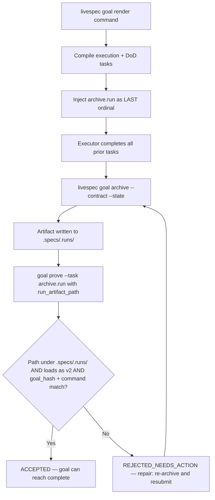
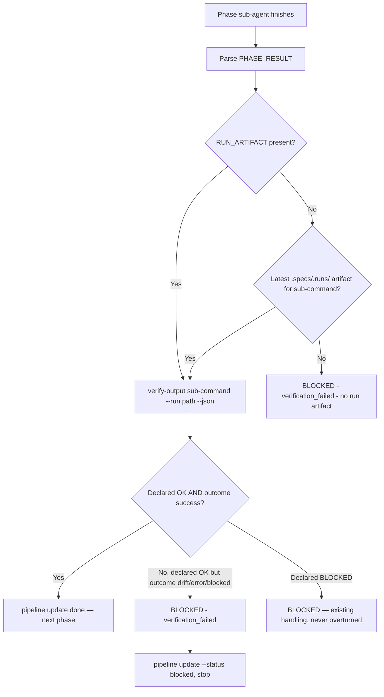
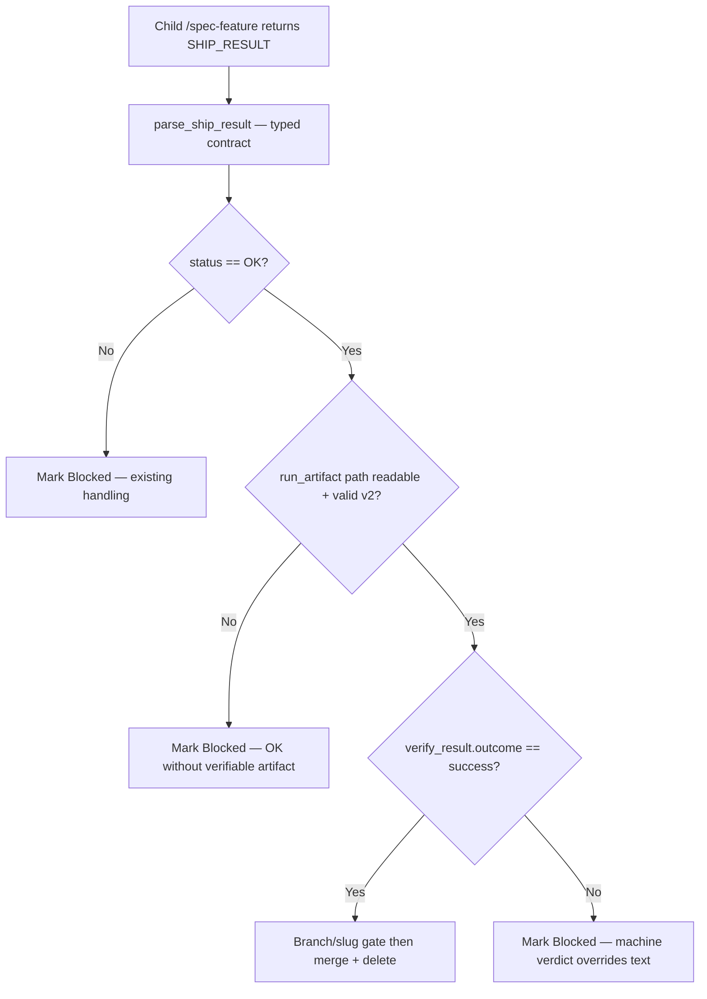
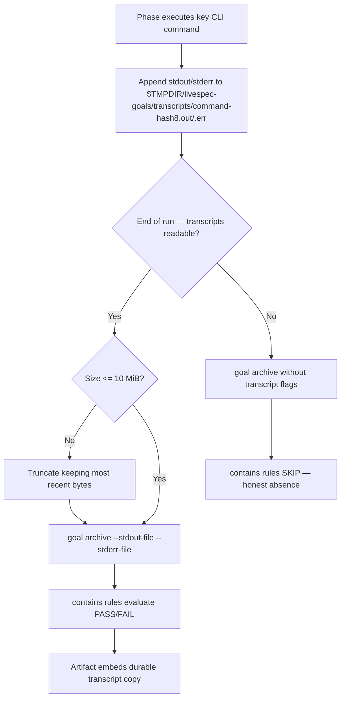

# Feature Spec: Pipeline Verify Phase

---

## Header

- **Feature:** Pipeline Verify Phase (Chantier 2 — supervisor↔subagent proof chain, complete)
- **Branch:** `feature/059-pipeline-verify-phase`
- **Date:** 2026-06-11
- **Status:** Implemented
- **Feature Number:** 059
- **Priority:** P1
- **Dependencies:** 039.1-goal-archive-run-artifacts, 052-deterministic-command-goal-contracts, 058-deterministic-finalization, 014-supervisor-contracts
- **Input:** Pipeline verify-phase (Chantier 2 complet): (1) archive enforced — an `[always]` "archive the run" task injected by `livespec goal render` into every goal-locked command contract, proven via the `.specs/.runs/` artifact path (finalize.registry model); (2) supervisor Verify phase — after each sub-agent PHASE_RESULT, `/spec-feature` runs `livespec verify-output <sub-command>` against the archived artifact and cross-checks the PHASE_RESULT declaration with the machine verdict `verify_result.outcome`, disagreement → BLOCKED; (3) SHIP_RESULT artifact-backed — `/spec-ship` reads the child pipeline's run artifact instead of trusting the text block; (4) sub-agent transcript capture — phase stdout/stderr captured to files and passed via `--stdout-file`/`--stderr-file` to `goal archive` so `contains` rules evaluate real PASS/FAIL instead of SKIP.

**Scope note:** the four bricks are one locked scope (user decision — split declined); each brick depends on the previous one's evidence chain, so they ship together.

**Design decisions locked by the approved scope (encoded below, not re-litigated):**

- The archive task is injected **compiler-side** in `validator/goal_contracts.py` (`_build_goal_tasks`), not via per-SKILL `## Execution Tasks` lines — every goal-locked command gets it without 22 SKILL.md edits. Its evidence family follows the `finalize.registry` injection/validation model (dedicated constants + dedicated prove validator).
- The archive task is always the **last ordinal** of the contract — it snapshots all prior evidence.
- The prove validator for `archive.run` is **read-only**: it loads the artifact from disk and matches `goal_hash`; it never re-archives (bootstrap: `goal prove` happens AFTER `goal archive` ran).
- The outcome classifier (`validator/run_artifacts.py` `_goal_incomplete`) **excludes the archive task itself** — the archived snapshot is taken before the archive task is proven, so it legitimately shows `archive.run` as pending (self-reference); without the exclusion every enforced run would classify as drift.
- Transcript files live under `$TMPDIR/livespec-goals/transcripts/` — the durable copy is the `stdout`/`stderr` embedded in the artifact itself, so no transcript files are committed under `.specs/`.
- Transcript absence stays honest: a phase that cannot capture leaves `contains` rules at SKIP (039.1 AC-005 semantics unchanged); the enforced archive never converts a missing transcript into a failure.

---

## User Scenarios & Testing

### Story 1 — Goal contract cannot reach DONE without a durable run artifact `P1`

**Description:** A LiveSpec command executor renders any goal-locked command goal. `livespec goal render` injects a synthetic task — id `archive.run`, description "Archive the run via `livespec goal archive` and prove archive.run with the artifact path", evidence family modeled on `finalize.registry` — as the **last ordinal** of the contract. The executor completes all other tasks, runs `livespec goal archive`, then proves `archive.run` by submitting `{"run_artifact_path": "<.specs/.runs/...json>"}`. The prove validator loads the artifact from disk, requires it under `.specs/.runs/`, and matches its `goal_hash` and `command` against the contract. `goal status` can therefore never report all tasks complete without a durable artifact on disk.

**Priority reason:** This is the root of the proof chain — bricks 2 and 3 verify artifacts that only exist reliably if archiving is structurally enforced.

**Independent test:** `livespec goal render spec-status --flags "" --save` → contract's max-ordinal task id is `archive.run`; prove it with a prose claim → `REJECTED_NEEDS_ACTION` naming `prose_archive_claim`; run `goal archive` then prove with the printed path → `ACCEPTED` and `goal status` shows complete.

```gherkin
Feature: Enforced run archiving via injected archive.run goal task
  Scenario: Happy path — every rendered contract carries archive.run as last task
    Given any goal-locked command and any feature/flags combination
    When  the executor runs `livespec goal render <command> --save`
    Then  the contract tasks contain exactly one task with id "archive.run"
    And   that task has the highest ordinal in the contract
    And   its required evidence is ["run_artifact_path"]

  Scenario: Happy path — archive then prove with the artifact path
    Given every other required task in the state file is complete
    And   the executor ran `livespec goal archive --contract <c> --state <s> --exit-code 0`
    When  the executor runs `livespec goal prove --task archive.run --evidence '{"run_artifact_path": "<archived path>"}'`
    Then  the validator loads the artifact from disk without re-archiving
    And   the proof is ACCEPTED because the artifact goal_hash matches the contract goal_hash
    And   `livespec goal status` reports the goal complete

  Scenario: Edge case — substitute evidence is rejected
    Given the executor submits prose, an exit code, or $TMPDIR contract/state paths instead of an artifact path
    When  `livespec goal prove --task archive.run` runs
    Then  the result is REJECTED_NEEDS_ACTION naming the offered substitute
    And   the repair actions instruct running `livespec goal archive` and resubmitting the artifact path

  Scenario: Edge case — artifact outside .specs/.runs/ or wrong goal
    Given the submitted run_artifact_path is outside .specs/.runs/ OR its goal_hash differs from the contract
    When  `livespec goal prove --task archive.run` runs
    Then  the proof is REJECTED_NEEDS_ACTION
    And   the task stays pending
```



---

### Story 2 — Supervisor verifies each phase result against the archived artifact `P1`

**Description:** The `/spec-feature` supervisor receives a PHASE_RESULT from a goal-locked phase sub-agent (Specify, Plan, Preflight, Implement, Test). PHASE_RESULT schemas gain a `RUN_ARTIFACT: <path>` field carrying the exact artifact archived by the sub-agent's `goal archive` run. The supervisor then executes a **Verify phase**: `livespec verify-output <sub-command> --run <RUN_ARTIFACT> --json`, reads the machine `verify_result.outcome`, and cross-checks it against the declaration. `PHASE_RESULT: OK` with machine outcome `drift`, `error`, or `blocked` is a disagreement → the supervisor emits the canonical BLOCKED line, marks the pipeline phase blocked, and never spawns the next phase.

**Priority reason:** Today the supervisor trusts a self-declared text block; a sub-agent can claim OK while its own goal evidence says otherwise. The Verify phase closes that gap with a machine verdict.

**Independent test:** Run a pipeline where the Specify sub-agent's goal state has a pending required task (artifact outcome `drift`) but its PHASE_RESULT says OK → the supervisor emits `BLOCKED at step <N> - verification_failed - ...` and `pipeline.md` shows Specify as Blocked.

```gherkin
Feature: Supervisor Verify phase after each PHASE_RESULT
  Scenario: Happy path — declaration and machine verdict agree
    Given a phase sub-agent returns PHASE_RESULT: OK with RUN_ARTIFACT: <path>
    When  the supervisor runs `livespec verify-output <sub-command> --run <path> --json`
    Then  the machine outcome is success
    And   the supervisor proceeds to the next phase

  Scenario: Edge case — declared OK but machine verdict disagrees
    Given a phase sub-agent returns PHASE_RESULT: OK with RUN_ARTIFACT: <path>
    And   the artifact's verify_result.outcome is drift, error, or blocked
    When  the supervisor cross-checks the declaration against the machine outcome
    Then  the supervisor emits the canonical line `BLOCKED at step <N> - verification_failed - <reason>`
    And   runs `livespec pipeline update --feature <slug> --phase <phase> --status blocked`
    And   does not spawn the next phase agent

  Scenario: Edge case — RUN_ARTIFACT field absent (legacy agent or timeout recovery)
    Given a parseable PHASE_RESULT without a RUN_ARTIFACT field
    When  the supervisor enters the Verify phase
    Then  it falls back to the lexicographically latest `.specs/.runs/<sub-command>-*.json`
    And   if no artifact exists for the sub-command, it blocks with the canonical BLOCKED line

  Scenario: Edge case — PHASE_RESULT BLOCKED is never overturned
    Given a phase sub-agent returns PHASE_RESULT: BLOCKED
    And   the archived artifact outcome is success
    When  the supervisor processes the result
    Then  the pipeline still stops as blocked (the machine verdict never un-blocks a declared failure)
```



---

### Story 3 — Ship trusts the child run artifact over the SHIP_RESULT text `P1`

**Description:** `/spec-ship` spawns a child `/spec-feature` pipeline and receives a SHIP_RESULT block. The SHIP_RESULT schema gains a `run_artifact` field (path to the child pipeline's `spec-feature` run artifact under `.specs/.runs/`). Before any merge or branch delete, the ship orchestrator loads that artifact and trusts its `verify_result.outcome` over the text: `status: OK` with machine outcome `success` → merge proceeds; `status: OK` with non-success outcome, or a missing/unreadable artifact → the child is marked failed (`ship.md` → Blocked), no merge, no branch delete.

**Priority reason:** SHIP_RESULT gates destructive git operations (merge + branch delete). Backing it with the artifact removes the last trust-the-text step in the batch autopilot.

**Independent test:** Feed `/spec-ship` Step 3 a SHIP_RESULT with `status: OK` whose `run_artifact` points to an artifact with `verify_result.outcome: drift` → ship marks the feature Blocked and `livespec git merge`/`livespec git delete` are never invoked.

```gherkin
Feature: Artifact-backed SHIP_RESULT consumption
  Scenario: Happy path — OK status confirmed by the artifact
    Given a child pipeline returns SHIP_RESULT status OK with run_artifact <path>
    And   the artifact at <path> has verify_result.outcome success
    When  the ship orchestrator validates the result
    Then  the merge and roadmap steps proceed as today

  Scenario: Edge case — OK status contradicted by the artifact
    Given a child pipeline returns SHIP_RESULT status OK with run_artifact <path>
    And   the artifact's verify_result.outcome is drift, error, or blocked
    When  the ship orchestrator cross-checks the artifact
    Then  the feature is marked Blocked in ship.md
    And   `livespec git merge` and `livespec git delete` are not invoked

  Scenario: Edge case — artifact missing or unreadable
    Given SHIP_RESULT status OK with run_artifact null, absent, or pointing to a malformed file
    When  the ship orchestrator cross-checks the artifact
    Then  the feature is marked Blocked (an OK without a verifiable artifact is not trusted)

  Scenario: Edge case — BLOCKED status is never overturned
    Given SHIP_RESULT status BLOCKED with an artifact whose outcome is success
    When  the ship orchestrator processes the result
    Then  the feature is still marked Blocked (artifact backing only demotes, never promotes)
```



---

### Story 4 — Phase transcripts turn contains rules into real verdicts `P1`

**Description:** Goal-locked command executors capture the stdout and stderr of their key CLI executions (e.g., `livespec validate`, `pytest`, `livespec finalize verify`) by appending them to a transcript pair `$TMPDIR/livespec-goals/transcripts/<command>-<hash8>.out` / `.err`, then pass both files via `--stdout-file`/`--stderr-file` to `livespec goal archive`. The archived artifact embeds the transcripts, so `contains` verify rules evaluate PASS/FAIL against real output instead of SKIP. When a phase cannot capture, the flags are simply omitted and `contains` rules stay SKIP — the enforced archive (Story 1) never fails because transcripts are missing.

**Priority reason:** Without transcripts, every `contains` rule in every expectations contract is permanently SKIP — Story 2's machine verdict would be blind to output-level drift.

**Independent test:** Run a goal-locked command capturing transcripts, archive with `--stdout-file/--stderr-file`, then `livespec verify-output <command> --json` → at least one `contains` rule reports PASS or FAIL (not SKIP); re-archive the same goal without the flags → the same rules report SKIP and the archive still succeeds.

```gherkin
Feature: Transcript capture for goal archive
  Scenario: Happy path — captured transcripts make contains rules real
    Given the executor appended key CLI stdout/stderr to the transcript pair in $TMPDIR/livespec-goals/transcripts/
    When  it runs `livespec goal archive --stdout-file <out> --stderr-file <err>`
    Then  the artifact embeds stdout and stderr
    And   every contains rule evaluates PASS or FAIL against the embedded text

  Scenario: Edge case — no capture stays honest SKIP
    Given a phase that could not capture transcripts
    When  it runs `livespec goal archive` without --stdout-file and --stderr-file
    Then  every contains rule reports SKIP with a descriptive detail
    And   the archive succeeds and archive.run remains provable

  Scenario: Edge case — oversized transcript is truncated by the executor
    Given a transcript file larger than MAX_TRANSCRIPT_BYTES (10 MiB)
    When  the executor prepares the archive call
    Then  it truncates the file keeping the most recent bytes under the bound before passing it
    And   `goal archive` accepts the truncated file (it still rejects oversized inputs with blocked, exit 2)
```



---

## Acceptance Criteria

- **AC-001** — `livespec goal render` injects exactly one synthetic task with id `archive.run` into every goal-locked command contract, regardless of command, feature, or flags. Injection is compiler-side in `validator/goal_contracts.py` (`_build_goal_tasks`) — no `## Execution Tasks` edit in any SKILL.md is required for the task to appear.
- **AC-002** — The `archive.run` task always carries the highest ordinal in the contract (it snapshots all prior evidence). Goal hash determinism is preserved: same project state + command + feature + flags → same canonical JSON and hash, with the injected task included.
- **AC-003** — The `archive.run` evidence family mirrors the `finalize.registry` model: `required_evidence = ("run_artifact_path",)`; invalid substitutes `prose_archive_claim`, `exit_code_without_artifact`, `tmpdir_contract_state_paths_without_artifact` are individually named in rejections; repair actions instruct running `livespec goal archive --contract <c> --state <s> [--feature <slug>]` and resubmitting the printed artifact path.
- **AC-004** — The dedicated prove validator accepts `archive.run` evidence only when ALL hold: the path resolves under `.specs/.runs/` inside `project_root`; the file loads as a RunArtifact v2 (`load_run_artifact` — malformed → rejection); the artifact `goal_hash` equals the contract `goal_hash`; the artifact `command` equals the contract command. Any failure → `REJECTED_NEEDS_ACTION`, task stays pending.
- **AC-005** — Bootstrap is read-only: the prove validator never invokes archiving; it only reads the artifact produced by a prior `livespec goal archive` run. A single archive per run is canonical — no re-archive is required after the proof is accepted.
- **AC-006** — The outcome classifier excludes the archive task from incompleteness: `_goal_incomplete` (and any verify-output re-derivation of goal completeness) ignores tasks whose id is `archive.run`. An otherwise-complete goal whose snapshot shows only `archive.run` pending classifies as `success`, not `drift` (self-reference exclusion).
- **AC-007** — Backward compatibility: artifacts archived before this feature (goal snapshot without an `archive.run` task) verify cleanly; `livespec verify-output` never requires the archive task's presence in the snapshot; loading and rule evaluation are unchanged for pre-059 artifacts.
- **AC-008** — All PHASE_RESULT schemas for goal-locked phases (Specify, Plan, Implement, Test — and the Preflight sub-agent result) gain a `RUN_ARTIFACT: <path>` field (canonical JSON key `run_artifact`, string). `validator/contracts.py` `parse_phase_result()` accepts the field; blocks without it remain parseable with `run_artifact = null` (legacy tolerance — no hard parse failure).
- **AC-009** — Supervisor Verify phase: after parsing each PHASE_RESULT from a goal-locked sub-agent, `/spec-feature` runs `livespec verify-output <sub-command> --run <RUN_ARTIFACT> --json` and reads `verify_result.outcome` (alias resolution via `validator/command_registry.py`). Declared `OK` + machine outcome `success` → continue. Declared `OK` + machine outcome `drift`/`error`/`blocked` → emit canonical `BLOCKED at step <N> - verification_failed - <reason>`, run `livespec pipeline update --feature <slug> --phase <phase> --status blocked`, and do not spawn the next phase. A declared `BLOCKED` is never overturned by a passing artifact.
- **AC-010** — Missing `RUN_ARTIFACT` (legacy agent output or § Phase Agent Timeout and Artifact Recovery): the supervisor falls back to the lexicographically latest `.specs/.runs/<sub-command>-*.json`; if none exists, it emits the canonical BLOCKED line — a phase without any run artifact cannot pass Verify.
- **AC-011** — The SHIP_RESULT schema (`system/contracts/SHIP_RESULT.md` + `validator/contracts.py` `ShipResult`, `extra: forbid` updated) gains `run_artifact: string | null`. `/spec-ship` Step 3 loads the artifact at that path and trusts `verify_result.outcome` over the text: `status: OK` + outcome `success` → proceed; `status: OK` + non-success outcome, or `run_artifact` null/absent/unreadable/malformed → feature marked `Blocked` in `ship.md`, no merge.
- **AC-012** — The artifact cross-check executes BEFORE any destructive git operation: `livespec git merge` and `livespec git delete` are never invoked unless SHIP_RESULT parsed, branch/slug matched, AND the artifact outcome is `success` (extends the existing critical safety property).
- **AC-013** — Transcript capture protocol: goal-locked executors append key CLI stdout/stderr to `$TMPDIR/livespec-goals/transcripts/<command>-<hash8>.out` / `.err` during the run and pass both via `--stdout-file`/`--stderr-file` to `livespec goal archive`. With transcripts embedded, `contains` rules evaluate PASS/FAIL against the embedded text (no engine change — 039.1 FR-003 behavior).
- **AC-014** — Honest absence preserved: when a phase cannot capture, the flags are omitted and every `contains` rule reports SKIP (039.1 AC-005 unchanged); the enforced archive and the `archive.run` proof succeed regardless. Oversized transcripts are truncated by the executor to the most recent bytes under `MAX_TRANSCRIPT_BYTES` (10 MiB) before the archive call; `goal archive` keeps rejecting oversized inputs with blocked/exit 2.
- **AC-015** — Protected scope honored: `validator/journeys/runner.py` and `tests/test_journey_v2_runner.py` are not modified.

---

## Functional Requirements

- **FR-001** — Inject the `archive.run` task compiler-side in `validator/goal_contracts.py` `_build_goal_tasks`, as the last ordinal of every goal-locked command contract, with a fixed description naming `livespec goal archive`. → AC-001, AC-002
- **FR-002** — Define the `archive.run` evidence family constants (required evidence, named invalid substitutes, repair actions) on the `finalize.registry` model. → AC-003
- **FR-003** — Implement the dedicated prove validator for `archive.run`: path containment under `.specs/.runs/`, RunArtifact v2 load, `goal_hash` + `command` match against the contract; read-only (never re-archives). → AC-004, AC-005
- **FR-004** — Exclude `archive.run` task ids from goal-incompleteness classification in `validator/run_artifacts.py` (`_goal_incomplete`) so the self-referencing snapshot never forces `drift`. → AC-006
- **FR-005** — Preserve backward compatibility in `livespec verify-output` and artifact loading for pre-059 artifacts and contracts without the archive task. → AC-007
- **FR-006** — Add the `RUN_ARTIFACT` field to the PHASE_RESULT schemas (`system/contracts/PHASE_RESULT.md`, `.agent-sync/skills/spec-feature/SKILL.md` § PHASE_RESULT Schemas) and extend `validator/contracts.py` `parse_phase_result()` with legacy-tolerant parsing. → AC-008
- **FR-007** — Add the supervisor Verify phase to `/spec-feature` (SKILL prose + § Execution Tasks `[always]` entries): run `livespec verify-output <sub-command> --run <path> --json` after each goal-locked PHASE_RESULT, cross-check declaration vs machine outcome, block on disagreement, fall back to the latest sub-command artifact when `RUN_ARTIFACT` is absent. → AC-009, AC-010
- **FR-008** — Add `run_artifact` to the SHIP_RESULT contract (`system/contracts/SHIP_RESULT.md`, `validator/contracts.py` `ShipResult`) and rewrite `/spec-ship` Step 3 to gate merge/delete on the artifact's `verify_result.outcome`. → AC-011, AC-012
- **FR-009** — Document and wire the transcript capture protocol in the goal-locked command skills (capture to `$TMPDIR/livespec-goals/transcripts/`, pass via `--stdout-file`/`--stderr-file`, executor-side truncation rule). → AC-013, AC-014
- **FR-010** — Keep SKIP semantics and archive success independent of transcript availability (no engine behavior change for absent transcripts). → AC-014
- **FR-011** — Enforce the protected scope: no changes to `validator/journeys/runner.py` or `tests/test_journey_v2_runner.py`. → AC-015

---

## Key Entities

- **ArchiveRunTask** — Synthetic goal task injected by the compiler into every goal-locked contract: id `archive.run`, last ordinal, category `injected`, `required_evidence ["run_artifact_path"]`, named invalid substitutes, repair actions pointing at `livespec goal archive`.
- **RunArtifactPathEvidence** — Proof payload `{"run_artifact_path": "<.specs/.runs/<command>-<ISO-fs>-<hash8>.json>"}` accepted only after disk-side validation (containment, v2 load, `goal_hash`/`command` match).
- **PhaseRunArtifact** — New `RUN_ARTIFACT` field (canonical key `run_artifact`) in every goal-locked PHASE_RESULT schema; carries the exact artifact the supervisor must verify (not just "latest").
- **VerifyPhase** — Supervisor step in `/spec-feature` executed after each PHASE_RESULT: machine verdict via `livespec verify-output <sub-command> --run <path> --json`, disagreement → canonical BLOCKED.
- **ShipRunArtifact** — New `run_artifact: string | null` field in the SHIP_RESULT contract; gates merge/branch-delete on the child artifact's `verify_result.outcome`.
- **TranscriptPair** — `$TMPDIR/livespec-goals/transcripts/<command>-<hash8>.out` / `.err`; append-only during the run; embedded into the artifact at archive time (durable copy lives in the artifact, not in `.specs/`).

---

## Edge Cases

- **EC-001** — Self-reference: the archived snapshot always shows `archive.run` as pending (the snapshot is taken before the proof). The classifier exclusion (AC-006) makes this the expected, non-drifting shape of every enforced artifact.
- **EC-002** — Multiple archives of the same goal (re-runs): the prove validator accepts any artifact whose `goal_hash` matches the contract — it does not require the lexicographically latest file.
- **EC-003** — Artifact deleted between `goal archive` and `goal prove`: rejection with repair actions → re-archive (append-only journal, EC-010 of 039.1) and resubmit the new path.
- **EC-004** — Pre-059 contract/state pair archived after this feature ships: no `archive.run` task in the snapshot → archives and verifies cleanly (AC-007); the exclusion rule simply never matches.
- **EC-005** — Supervisor Verify with a `RUN_ARTIFACT` pointing at another command's artifact (e.g., a `spec-plan` artifact handed to the specify Verify): the Verify phase MUST compare the loaded artifact's `command` field against the resolved sub-command (alias-normalized) and treat a mismatch as `blocked` → supervisor emits the canonical BLOCKED line. The check is explicit — it is not assumed from rule evaluation.
- **EC-006** — `PHASE_RESULT: BLOCKED` with a success artifact: the supervisor still blocks — machine verdicts demote, never promote (same rule for SHIP_RESULT, EC-007).
- **EC-007** — `SHIP_RESULT: BLOCKED` with a success artifact: feature stays Blocked; artifact backing never un-blocks a declared failure.
- **EC-008** — Transcript file unreadable at archive time: `goal archive` blocks (exit 2, existing behavior) — the executor must check readability and omit the flags instead of passing a broken path.
- **EC-009** — Transcript exceeds `MAX_TRANSCRIPT_BYTES`: executor truncates keeping the most recent bytes under the bound before the archive call (most recent output is the diagnostic payload); passing the oversized original stays blocked/exit 2.
- **EC-010** — `goal status` before DONE: with the injected task, a goal can only report complete after `archive.run` is ACCEPTED — an executor that skips archiving is structurally unable to emit DONE.
- **EC-011** — Concurrent pipelines (`/spec-ship` batch): artifact filenames are timestamp+hash8-unique (039.1 AC-003), so per-child `run_artifact` paths never collide; ship always reads the exact path from each child's SHIP_RESULT, never "latest".

---

## Success Criteria

- **SC-001** — For every goal-locked command, `livespec goal render <command>` produces a contract whose max-ordinal task id is `archive.run` (scriptable sweep over the command registry).
- **SC-002** — `livespec goal prove --task archive.run` rejects 100% of proofs lacking a valid on-disk artifact (prose, exit codes, `$TMPDIR` paths, foreign-goal artifacts) and accepts a matching `.specs/.runs/` artifact on the first attempt.
- **SC-003** — Tamper drill: a PHASE_RESULT declaring OK over an artifact with outcome `drift` blocks the pipeline in 100% of runs (canonical BLOCKED line + pipeline phase Blocked); same drill on SHIP_RESULT never reaches `livespec git merge`.
- **SC-004** — An otherwise-complete enforced run archives as `success` (not `drift`) — the self-reference exclusion is observable in `verify_result.outcome` of real pipeline artifacts.
- **SC-005** — With transcripts captured, `livespec verify-output` reports PASS/FAIL (not SKIP) for every `contains` rule targeting a captured channel; without capture, the same rules report SKIP and the run still archives.
- **SC-006** — Full regression: `pytest` passes, including pre-059 artifact fixtures (backward compatibility) and the untouched protected files (`validator/journeys/runner.py`, `tests/test_journey_v2_runner.py`).

<!-- finalize:spec-specify:2026-06-11:799a2740 -->

<!-- finalize:spec-plan:2026-06-11:79911967 -->

<!-- finalize:spec-implement:2026-06-11:0cb1ffd0 -->
