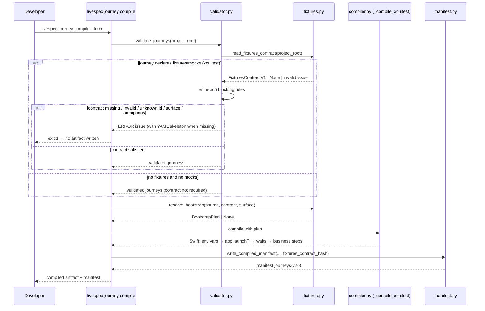
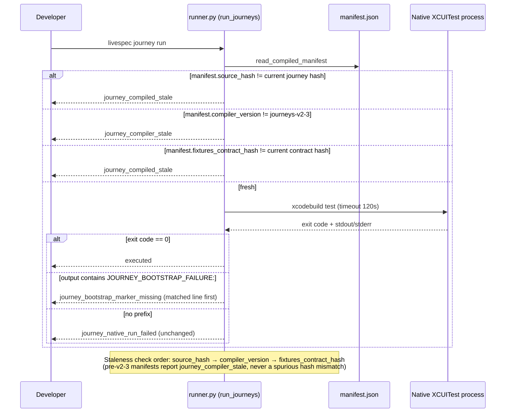
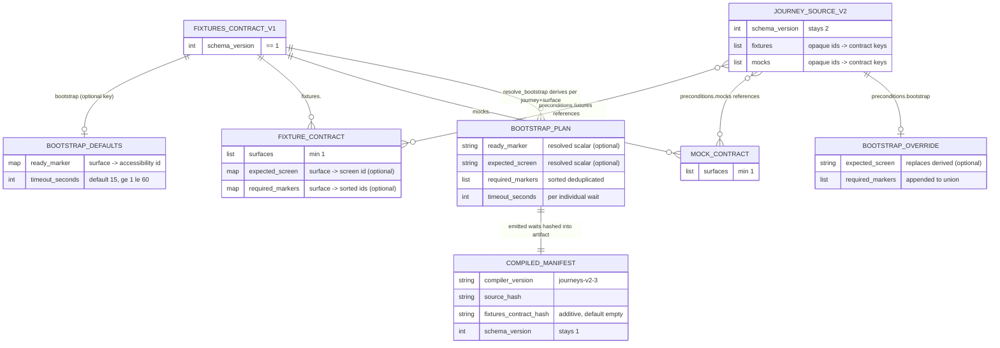

# Plan - Journey Fixture Bootstrap Contract

## Summary

Introduce a project-local fixtures contract (`.specs/journeys/fixtures.yaml`, schema_version 1) as the single source of truth for fixture bootstrap guarantees, in seven dependency-ordered bricks: (1) a new `validator/journeys/fixtures.py` module with frozen Pydantic models, `read_fixtures_contract`, the shared `BOOTSTRAP_FAILURE_PREFIX` constant, and a pure `resolve_bootstrap` derivation (sorted marker union, 0–1 distinct expected_screen, journey-override replace/append semantics); (2) an additive `Preconditions.bootstrap: BootstrapOverride | None` on the v2 journey schema (schema_version stays 2); (3) five blocking XCUITest-only validation rules in `validator/journeys/validator.py` (missing contract with paste-ready YAML skeleton, invalid contract, unknown id, unsupported surface, ambiguous screen); (4) derived `waitForJourneyBootstrap` waits emitted by `_compile_xcuitest` immediately after `app.launch()` with an `XCTFail("JOURNEY_BOOTSTRAP_FAILURE: …")` helper via the existing `_xcuitest_helpers` mechanism; (5) `COMPILER_VERSION` bump to `journeys-v2-3` plus an additive `CompiledManifest.fixtures_contract_hash` (empty-string default, tolerant reader, `MANIFEST_SCHEMA_VERSION` stays 1) checked by the runner alongside `source_hash`; (6) runtime reclassification of non-zero native exits whose combined output contains the prefix into `journey_bootstrap_marker_missing` (no xcresult parsing); (7) an idempotent `scaffold_fixtures_contract` + `livespec journey fixtures scaffold` CLI subcommand wired into a fully automatic `migrations/21/` (agent-sync refresh → scaffold → `journey compile --force` → `SET_VERSION 21`), documented in `system/testing/user-journeys.md`.

## Technical Context

| Aspect | Choice | Reason |
|---|---|---|
| Language | Python ≥3.11 (3.14 in .venv) | From project stack (`.specs/stacks/_default.md`) |
| CLI Framework | Typer ≥0.12 | Existing `journey_app` in `validator/cli_commands/journey_cmd.py`; one new nested subcommand `journey fixtures scaffold` (AC-013) |
| Schema Validation | Pydantic ≥2.7 | Contract models follow the existing `JourneyBaseModel` pattern (`extra="forbid"`, `frozen=True`) in `validator/journeys/schema.py` |
| YAML | pyyaml ≥6.0 | `fixtures.yaml` parsing mirrors `validate_journey_file` (`yaml.safe_load` + `ValidationError` → issue) |
| Hashing | hashlib sha256 | Contract hash mirrors the existing `source_hash` mechanism (`runner.py` L168, `validator.py` L73) |
| Generated code | Swift/XCUITest strings | Extends `_compile_xcuitest` (`compiler.py` L281) and `_xcuitest_helpers` (L534); deterministic output for stable artifact hashing |
| Migration | `migrations/21/migrate.md` + `scripts/*.sh` | Exact `migrations/20/` precedent (RUN wrappers + `SET_VERSION`); scaffold wrapper clones `scripts/migrate-journeys-compile.sh` PYTHONPATH pattern |
| Testing | pytest 8.x, unit + integration on tmp fixtures | From `.specs/testing/strategy.md`; new `tests/test_journey_v2_fixtures_contract.py` + extensions of `tests/test_journey_v2_compiler.py` (15 tests today) and `tests/test_journey_v2_runner.py` (22 tests today); zero skips (SC-001) |
| Lint/Types | ruff + pyright strict | Pre-commit gates; all new public functions fully typed with Google-style docstrings |
| Platform | macOS + Linux CLI | Local developer tool; XCUITest execution itself stays consumer-side (simulator), LiveSpec only generates/classifies |
| Project type | Local developer CLI — no DB, no network, no UI | Entities are YAML/JSON file shapes; ER diagram models the contract document, not database tables |

**Conventions loaded (domain: code):** `general.md`, `python.md`, `javascript.md`, `cli.md`, `stack-commands.md` from `ai-ressources/code-conventions/` (`javascript.md` is part of the goal-contract-mandated bundle and was read for proof completeness; no JS-owned file changes in this plan — generated Playwright output is untouched). Applied: snake_case modules, typed public signatures (pyright strict), Pydantic for external data at the YAML boundary, domain errors propagated and converted to issues at the validator/CLI boundary, named constants (`BOOTSTRAP_FAILURE_PREFIX`, `DEFAULT_BOOTSTRAP_TIMEOUT_SECONDS`, bounds 1–60 as Field constraints), mandatory inline comments for arbitrary thresholds (trigger 14: 15s default / 60s cap inside the 120s XCUITest budget), template/string building (trigger 4: Swift wait emission flow), order-dependent operations (trigger 9: ready → screen → sorted markers determinism for stable hashing), and backward-compatibility code (trigger 8: tolerant manifest reader for pre-060 manifests).

## Constitution Check

| Principle | Verdict | Note |
|---|---|---|
| 1. Layered Validation | ✅ | Contract enforcement is Layer-1-style boundary validation inside the existing journey validator: YAML parse → Pydantic schema → cross-file rules, each failure surfaced as a structured `JourneyIssue` with file path, stable code, and actionable message (skeleton embedded for the missing-contract case). Compile refuses to proceed past validation errors (existing `compile_journeys` gate at `compiler.py` L81). |
| 2. Provider-Agnostic LLM | ✅ | No LLM involvement anywhere in this feature. |
| 3. File-System as Source of Truth | ✅ | The contract is a committed project file (`.specs/journeys/fixtures.yaml`); freshness is enforced by content hash recorded in the compiled manifest — no hidden state, no implicit recompilation. |
| 4. Fail Fast, Exit Clearly | ✅ | All five new validation codes are blocking ERRORs raised at validate/compile time; runtime bootstrap failures fail in ~`timeout_seconds` (≤60s) instead of 120s with a stable issue code; `timeout_seconds` bounds rejected at parse time. CLI keeps exit 0/1 conventions of `journey_cmd.py`. |
| 5. Minimal Surface, Maximum Composability | ✅ | One new CLI subcommand (`journey fixtures scaffold`, required by AC-013 for the automatic migration); everything else composes existing surfaces (`journey validate/compile/run`, `/spec-migrate` RUN scripts). No new flags on existing commands. |
| 6. No Hosted Infrastructure | ✅ | Local FS only. |
| Testing Standards | ✅ | TDD per step (failing test → implement → green); unit tests beside the module; chaos cases (invalid YAML, out-of-bounds timeout, non-mapping root); no visual testing (no UI). |
| Structure (max 300 lines/file) | ✅ | `fixtures.py` hosts the spec-mandated public API (FR-001/FR-002/FR-009 name the module). Target ≤300 lines via lean private helpers; if the bound is reached during implementation, extract private internals (`_load_yaml_mapping`, skeleton renderer, scaffold internals) into `validator/journeys/_fixtures_helpers.py` — the spec mandates the public API surface of `fixtures.py`, not the physical location of private helpers, so the 300-line rule is satisfied without deviation. |

## Design Reference

No `## Screens` section in spec.md — CLI/codegen feature, no design mockups, no theme step.

## Sequence Diagram — Contract-driven validate + compile (Gherkin + Mermaid)

```gherkin
Feature: Fixtures contract drives validation and XCUITest codegen
  Scenario: Correctly declared journey compiles with bootstrap waits
    Given .specs/journeys/fixtures.yaml declares the journey's fixtures for surface ios
    When  livespec journey compile runs
    Then  validation passes with no fixture-contract issue
    And   the generated Swift contains app.launch() followed by waitForJourneyBootstrap calls
    And   the wait order is ready_marker, then expected_screen, then sorted required_markers
    And   the manifest records compiler_version journeys-v2-3 and fixtures_contract_hash

  Scenario: Missing contract blocks compilation with a paste-ready skeleton
    Given an XCUITest journey declaring fixtures and no fixtures.yaml
    When  livespec journey validate runs
    Then  validation fails with ERROR journey_fixture_contract_missing
    And   the message embeds a YAML skeleton listing the journey's fixture and mock ids

  Scenario: Journey without fixtures is unaffected
    Given an XCUITest journey with no fixtures and no mocks and no contract file
    When  the journey is validated and compiled
    Then  no fixture-contract issue is reported
    And   the codegen is identical to the previous compiler except the version header
```



## Sequence Diagram — Runtime run, staleness, and reclassification (Gherkin + Mermaid)

```gherkin
Feature: Runner enforces contract freshness and reclassifies bootstrap failures
  Scenario: Contract change after compilation marks the artifact stale
    Given a journey compiled with fixtures_contract_hash recorded in its manifest
    When  fixtures.yaml changes and livespec journey run executes
    Then  the runner reports issue journey_compiled_stale
    And   no implicit recompilation is performed

  Scenario: Bootstrap failure prefix reclassifies the issue
    Given a compiled fixture journey whose bootstrap wait fails in the simulator
    When  the native process exits non-zero with a JOURNEY_BOOTSTRAP_FAILURE: line in its output
    Then  the runner reports journey_bootstrap_marker_missing with the matched line leading the message

  Scenario: Non-bootstrap failures keep the existing classification
    Given a compiled journey failing on a business step
    When  the native process exits non-zero without the prefix
    Then  the runner reports journey_native_run_failed unchanged
    And   no .xcresult bundle is read or parsed
```



## State Diagram — Compiled artifact freshness lifecycle (Gherkin + Mermaid)

```gherkin
Feature: Compiled artifact freshness under the bootstrap contract
  Scenario: Compilation produces a fresh artifact
    Given a validated fixture journey and a valid fixtures contract
    When  livespec journey compile --force runs
    Then  the manifest is Fresh with compiler_version journeys-v2-3 and the current contract hash

  Scenario: Editing the contract invalidates the artifact
    Given a Fresh compiled artifact
    When  .specs/journeys/fixtures.yaml is modified
    Then  the artifact state becomes Stale (contract hash mismatch)
    And   livespec journey run refuses it with journey_compiled_stale

  Scenario: Pre-bump manifests are rejected unconditionally
    Given a manifest written by compiler journeys-v2-2
    When  the runner checks it against COMPILER_VERSION journeys-v2-3
    Then  the artifact state is StaleCompiler and the issue is journey_compiler_stale
```



```mermaid
stateDiagram-v2
    [*] --> Missing: no manifest
    Missing --> Fresh: journey compile (validation green)
    Fresh --> StaleSource: journey.yaml edited
    Fresh --> StaleContract: fixtures.yaml edited or deleted
    Fresh --> StaleCompiler: COMPILER_VERSION bumped (journeys-v2-3)
    StaleSource --> Fresh: journey compile --force
    StaleContract --> Fresh: journey compile --force
    StaleCompiler --> Fresh: journey compile --force
    Fresh --> Executed: journey run (exit 0)
    Fresh --> BootstrapFailed: run exits non-zero with JOURNEY_BOOTSTRAP_FAILURE prefix
    Fresh --> RunFailed: run exits non-zero without prefix
    note right of StaleCompiler
        Rejected unconditionally by the existing
        journey_compiler_stale mechanism (runner.py L183)
        — no conditional logic needed
    end note
    note right of BootstrapFailed
        journey_bootstrap_marker_missing
        matched line leads the message
    end note
```

## ER Diagram — Fixtures contract data model (Mermaid only)

> File-shape entities (YAML/JSON documents), not database tables — this project has no DB.



## Implementation Plan

> TDD order locked by the approved design: fixtures.py+paths → schema → validator → compiler+manifest → runner → migration+CLI → doc → full suite. Each step: write the failing tests first, implement, re-run to green.

### Step 1 — Contract models, loader, and path helper

**Files:**
- `validator/journeys/fixtures.py` (NEW) — module header docstring; `BOOTSTRAP_FAILURE_PREFIX = "JOURNEY_BOOTSTRAP_FAILURE:"` (shared compiler/runner constant); `DEFAULT_BOOTSTRAP_TIMEOUT_SECONDS = 15` (inline comment: bounds 1–60 keep the per-wait budget inside the 120s XCUITest runner timeout); frozen Pydantic models on the `JourneyBaseModel` pattern (`extra="forbid"`, `frozen=True`): `BootstrapDefaults` (`ready_marker: dict[str, str]` default `{}`, `timeout_seconds: int = Field(default=15, ge=1, le=60)`), `FixtureContract` (`surfaces: list[str]` min_length 1, `expected_screen: dict[str, str]` default `{}`, `required_markers: dict[str, list[str]]` default `{}`), `MockContract` (`surfaces: list[str]` min_length 1), `FixturesContractV1` (`schema_version: Literal[1]`, `bootstrap: BootstrapDefaults | None = None`, `fixtures: dict[str, FixtureContract]` default `{}`, `mocks: dict[str, MockContract]` default `{}`); resolved single-surface `BootstrapPlan` frozen model (`ready_marker: str | None`, `expected_screen: str | None`, `required_markers: list[str]` sorted, `timeout_seconds: int`); `read_fixtures_contract(project_root: Path) -> tuple[FixturesContractV1 | None, JourneyIssue | None]` — `(contract, None)` on success, `(None, None)` when the file is absent, `(None, journey_fixtures_contract_invalid issue)` on unreadable YAML / non-mapping root / `ValidationError` (mirrors `validate_journey_file` error conversion); `fixtures_contract_hash(project_root: Path) -> str` — sha256 of file bytes, `""` when absent (used by the runner's staleness check; the compiler derives the same hash from the bytes it already read — review finding #6, no double read)
- `validator/journeys/paths.py` (MODIFIED) — add `fixtures_contract_path(project_root: Path) -> Path` returning `journey_source_root(project_root) / "fixtures.yaml"`
- `tests/test_journey_v2_fixtures_contract.py` (NEW) — parse valid full contract; parse minimal contract (no `bootstrap` key → no ready_marker, default timeout 15); invalid YAML → `journey_fixtures_contract_invalid`; non-mapping root; unknown key rejected (`extra="forbid"`); `timeout_seconds` 0 and 61 rejected at parse time; absent file → `(None, None)`; hash empty-string when absent, stable sha256 otherwise

**FR covered:** FR-001.1: Contract models, loader, path helper, FR-008.1: Shared bootstrap failure prefix constant

### Step 2 — Pure bootstrap derivation (`resolve_bootstrap`)

**Files:**
- `validator/journeys/fixtures.py` (MODIFIED) — `BootstrapAmbiguityError(Exception)` domain error (distinct screens listed in message); pure function `resolve_bootstrap(source: JourneySourceV2, contract: FixturesContractV1 | None, surface: str) -> BootstrapPlan | None`: returns `None` when the journey declares no fixtures/mocks; **collapse rule (review finding #2):** also returns `None` — never an all-empty `BootstrapPlan` — when the resolved plan would carry zero waits (`ready_marker is None`, `expected_screen is None`, empty `required_markers`), regardless of contract presence, so codegen stays byte-identical (AC-014) and no empty helper is emitted; `required_markers` = sorted deduplicated union of each referenced fixture's `required_markers[surface]`; `expected_screen` derived when fixtures yield 0–1 distinct `expected_screen[surface]` value; ≥2 distinct values without journey override → raise `BootstrapAmbiguityError`; `preconditions.bootstrap` override: `expected_screen` replaces the derived value (and resolves ambiguity), `required_markers` append to the union (re-sorted); `ready_marker` resolved from `contract.bootstrap.ready_marker.get(surface)`; only the journey's surface maps are read (other surfaces never leak)
- `tests/test_journey_v2_fixtures_contract.py` (MODIFIED) — single fixture full plan; multi-fixture sorted deduplicated union; 0 screens → omitted; 2 distinct screens no override → `BootstrapAmbiguityError`; override replaces screen + appends markers; seed-only fixture (no screen/markers) → ready-only plan; no bootstrap key + no guarantees → `None`; **contract present but fixture has no navigation and no bootstrap key → `None` (collapse rule)**; mixed-surface fixture only reads `ios` maps

**FR covered:** FR-002.1: Derivation rules and override semantics

### Step 3 — Journey schema extension (additive)

**Files:**
- `validator/journeys/schema.py` (MODIFIED) — `BootstrapOverride(JourneyBaseModel)` with `expected_screen: str | None = None`, `required_markers: list[str] = Field(default_factory=list)`; `Preconditions` gains `bootstrap: BootstrapOverride | None = None`; `__all__` gains `BootstrapOverride`; `schema_version` stays `Literal[2]`
- `tests/test_journey_v2_fixtures_contract.py` (MODIFIED) — journey YAML with `preconditions.bootstrap` parses; existing journey YAML without the key remains valid (backward compatibility)

**FR covered:** FR-003.1: Optional preconditions.bootstrap override

### Step 4 — Blocking contract validation (XCUITest-only)

**Files:**
- `validator/journeys/fixtures.py` (MODIFIED) — `render_contract_skeleton(fixture_ids: list[str], mock_ids: list[str], surfaces: list[str]) -> str` producing a paste-ready `fixtures.yaml` skeleton (schema_version 1, every declared id, surfaces from journey targets, no screens/markers) embedded in the missing-contract message
- `validator/journeys/validator.py` (MODIFIED) — new private `_validate_fixtures_contract(project_root, path, source) -> list[JourneyIssue]` called from `validate_journey_file` after `_validate_source_contract`; exempt when `preconditions.fixtures` and `preconditions.mocks` are both empty; enforce only for journeys whose targets include an `xcuitest` runner (Playwright/Maestro deferred — surface-agnostic maps keep the schema forward-compatible); rules, all `JourneySeverity.ERROR`: `journey_fixture_contract_missing` (no contract file; message embeds skeleton), `journey_fixtures_contract_invalid` (loader issue passthrough), `journey_fixture_unknown` (fixture or mock id absent from contract maps), `journey_fixture_surface_unsupported` (journey xcuitest surface not in the referenced fixture's/mock's `surfaces`), `journey_bootstrap_ambiguous` (`BootstrapAmbiguityError` from `resolve_bootstrap` dry resolution per xcuitest surface)
- `tests/test_journey_v2_fixtures_contract.py` (MODIFIED) — each of the 5 codes triggered; skeleton content asserts fixture+mock ids present; correctly declared journey passes; journey without fixtures/mocks + no contract passes; contract deleted after a previous compile still yields `journey_fixture_contract_missing` at validation; non-XCUITest journey with fixtures is not enforced; **ambiguous fixture screens resolved by a `preconditions.bootstrap.expected_screen` override pass validation with no `journey_bootstrap_ambiguous` (review finding #5)**

**FR covered:** FR-004.1: Five blocking validation rules with skeleton

### Step 5 — XCUITest codegen: derived bootstrap waits

> **Dependency lock (review finding #1):** Steps 5 and 6 land as a single diff — the compiler changes here and the manifest changes in Step 6 are one atomic unit. Both manifest write paths must receive `fixtures_contract_hash` in the same commit that introduces the codegen waits; the Step 5 manifest assertions (`compiler_version`, hash) are only runnable once Step 6's `write_compiled_manifest` signature exists. TDD: write the failing tests for both steps, implement both, then go green together.

**Files:**
- `validator/journeys/compiler.py` (MODIFIED) — `compile_journeys` loads the contract **once per compile invocation** (not per journey) via `read_fixtures_contract` (validation already green, so no error path) and derives `fixtures_contract_hash` from the same read content (review finding #6: single read for content + hash); `_compile_xcuitest` (L281) gains the resolved `BootstrapPlan | None`: after `app.launch()` (L298) and before the first business step, emit one `waitForJourneyBootstrap(app, <marker>, timeout: <timeout_seconds>)` per wait in deterministic order — ready_marker → expected_screen → sorted required_markers (inline comment trigger 9: order is part of the artifact hash); `timeout_seconds` applies uniformly to each individual wait call (not a total budget); `_xcuitest_helpers` (L534) gains the helper **only when the plan is non-`None`** (the Step 2 collapse rule guarantees a non-`None` plan has ≥1 wait — no empty helper can be emitted): `private func waitForJourneyBootstrap(_ app: XCUIApplication, _ marker: String, timeout: TimeInterval)` failing via `XCTFail("JOURNEY_BOOTSTRAP_FAILURE: marker '\(marker)' not found within \(Int(timeout))s")` using the shared prefix constant; journeys without fixtures/mocks (plan `None`) → codegen byte-identical to journeys-v2-2 output except the manifest version (AC-014)
- `tests/test_journey_v2_compiler.py` (MODIFIED, modeled on `test_compile_v2_xcuitest_injects_preconditions_before_launch` L342) — line-index ordering assert: env vars < `app.launch()` < wait(ready) < wait(screen) < wait(markers…) < first business step; markers sorted; helper present with `XCTFail` prefix; seed-only fixture → ready-only wait; fixture-less journey codegen identical to previous compiler output except version header (snapshot comparison, SC-005)

**FR covered:** FR-005.1: Derived waits, helper, fixture-less identity

### Step 6 — Manifest: compiler bump + additive contract hash

> **Dependency lock (review finding #1):** single atomic diff with Step 5 — see the Step 5 lock note. Both manifest write paths (direct L117 and pending-XCUITest L140) gain the hash argument in the same commit; no intermediate state where one path records the hash and the other does not.

**Files:**
- `validator/journeys/manifest.py` (MODIFIED) — `COMPILER_VERSION = "journeys-v2-3"`; `CompiledManifest` gains `fixtures_contract_hash: str = ""` (additive; `MANIFEST_SCHEMA_VERSION` stays 1); `write_compiled_manifest` gains keyword `fixtures_contract_hash: str = ""`; `read_compiled_manifest` reads `str(data.get("fixtures_contract_hash", ""))` (inline comment trigger 8: tolerant reader for pre-060 manifests — they are already rejected by the version check, no conditional logic)
- `validator/journeys/compiler.py` (MODIFIED) — both manifest write paths (direct, L117, and pending-XCUITest, L140) pass the computed `fixtures_contract_hash`
- `tests/test_journey_v2_compiler.py` (MODIFIED) — written manifest contains `compiler_version == "journeys-v2-3"` and the contract sha256 (empty string when no contract file); manifest JSON without the field parses with `""` and `schema_version` 1

**FR covered:** FR-006.1: Version bump and additive hash field

### Step 7 — Runner: contract staleness + bootstrap reclassification

**Files:**
- `validator/journeys/runner.py` (MODIFIED) — staleness (FR-007): **check order locked (review finding #3): `source_hash` (L174) → `compiler_version` (L183) → new `fixtures_contract_hash` check inserted after the version check** — pre-v2-3 manifests (tolerant-read hash `""`) always surface the actionable `journey_compiler_stale`, never a spurious `journey_compiled_stale` from the empty hash; compare `manifest.fixtures_contract_hash` to the current contract hash → `journey_compiled_stale` ("compiled manifest fixtures contract hash is stale"); reclassification (FR-008): in `_run_command` (L261), when `completed.returncode != 0`, scan the existing `_process_output(...)` combined string (L314) for `BOOTSTRAP_FAILURE_PREFIX` imported from `fixtures.py`; on match → issue `journey_bootstrap_marker_missing` with the first matched line leading the message (full output appended after); without the prefix → `journey_native_run_failed` unchanged; no `.xcresult` access of any kind
- `tests/test_journey_v2_runner.py` (MODIFIED) — stub executor exits non-zero with the prefix in stdout → `journey_bootstrap_marker_missing`, matched line first, and no `.xcresult` path touched (stub asserts no extra filesystem reads); non-zero without prefix → `journey_native_run_failed`; prefix in a passing run (exit 0) → executed, no issue; `fixtures.yaml` modified post-compile → `journey_compiled_stale`; contract deleted post-compile (recorded hash non-empty, current `""`) → `journey_compiled_stale`; `journeys-v2-2` manifest → `journey_compiler_stale` (existing test ~L135 covers the mechanism — extend for the new version string)

**FR covered:** FR-007.1: Contract hash staleness check, FR-008.2: Prefix scan and reclassification

### Step 8 — Scaffold + `livespec journey fixtures scaffold` CLI

**Files:**
- `validator/journeys/fixtures.py` (MODIFIED) — `scaffold_fixtures_contract(project_root: Path) -> Path | None`: return `None` untouched when `fixtures.yaml` exists (idempotent, never overwrites — byte-identical file) or when no v2 journey declares fixtures/mocks; otherwise enumerate fixture/mock ids across `iter_journey_source_paths` sources, infer each entry's `surfaces` from the union of the referencing journeys' `targets[].surface`, write a minimal valid contract (schema_version 1, no `bootstrap` block, no `expected_screen`, no `required_markers`) and return the written path
- `validator/cli_commands/journey_cmd.py` (MODIFIED) — `fixtures_app = typer.Typer(help=...)` added via `journey_app.add_typer(fixtures_app, name="fixtures")`; `scaffold` command calls `require_specs_root()` + `scaffold_fixtures_contract`, echoes `scaffolded: <path>` or `fixtures contract already present` / `no fixture journeys found`, uses `emit_summary` and exit code 0 on success/no-op, 1 on write failure (project conventions)
- `tests/test_journey_v2_fixtures_contract.py` (MODIFIED) — scaffold enumerates fixtures/mocks across journeys; surfaces inferred from targets; no screens/markers/bootstrap written; existing file left byte-identical with exit success; scaffolded contract passes validation and compiles without emitting bootstrap waits (AC-011 round-trip); CLI invocation test for exit codes and output

**FR covered:** FR-009.1: Idempotent scaffold and CLI subcommand

### Step 9 — Migration v21 (fully automatic)

**Files:**
- `migrations/21/migrate.md` (NEW) — frontmatter `version: 21`, `kind: asset-sync`, name `journey-fixture-bootstrap-contract`; body documents the journeys-v2-3 bump and the scaffold; actions in order: `RUN migrate-agent-sync.sh` → `RUN migrate-journeys-fixtures-scaffold.sh` → `RUN migrate-journeys-compile.sh` → `SET_VERSION 21` (exact `migrations/20/migrate.md` structure)
- `scripts/migrate-journeys-fixtures-scaffold.sh` (NEW) — clone of the `scripts/migrate-journeys-compile.sh` wrapper pattern (`set -euo pipefail`, `<project-dir> <livespec-dir>` args, `PYTHONPATH="$LIVESPEC_DIR" python3 -m validator.cli journey fixtures scaffold`) so the scaffold runs with the LiveSpec version being applied, not a stale global CLI; **exit-code guarantee (review finding #7): exit 0 covers all three outcomes — scaffolded, contract already present, and no fixture journeys found — documented in `migrate.md` so neither no-op is treated as failure (AC-012 green with and without fixture journeys)**
- `tests/test_journey_v2_fixtures_contract.py` (MODIFIED) — migration-shaped integration test on a tmp project: version-20 fixture project → scaffold creates contract → `compile_journeys(force=True)` green with no bootstrap waits → re-run leaves file byte-identical; project without fixture journeys → no `fixtures.yaml` created, compile green

**FR covered:** FR-010.1: migrations/21 scripts and SET_VERSION

### Step 10 — Documentation

**Files:**
- `system/testing/user-journeys.md` (MODIFIED) — new "Fixture bootstrap contract" section: full `fixtures.yaml` schema with the annotated example from the spec input; derivation rules (sorted union, 0–1 distinct screen, ambiguity → journey override; override replaces screen / appends markers); app-side responsibilities (expose the ready_marker accessibilityIdentifier once the `UI_TEST_JOURNEY_FIXTURES` handler completes; only declare `expected_screen` for fixtures that actually navigate); mandatory recompilation after any contract change (`fixtures_contract_hash` → `journey_compiled_stale`); the five validation error codes with the skeleton recovery path; XCUITest-only enforcement note

**FR covered:** FR-011.1: Fixture bootstrap contract doc section

### Step 11 — Full suite + quality gates

**Files:** none new — verification step.

- `pytest tests/test_journey_v2_*.py -q` — green, zero skips (SC-001)
- `pytest tests/ --ignore=tests/integration -v --tb=short` — full unit sweep (regression: features 056/057 journey behavior unchanged for fixture-less journeys)
- `ruff check validator/ tests/ && ruff format --check validator/ tests/` and `pyright validator/` — clean

**FR covered:** FR-004.2: Validation regression sweep, FR-005.2: Fixture-less codegen identity verification

## Resolved Test Commands

| Action | Command | Tool | Status |
|---|---|---|---|
| Unit tests (feature) | `pytest tests/test_journey_v2_fixtures_contract.py tests/test_journey_v2_compiler.py tests/test_journey_v2_runner.py -q` | pytest 8.x | Verified |
| Unit tests (all journey v2) | `pytest tests/test_journey_v2_*.py -q` | pytest 8.x | Verified |
| Unit tests (full, no LLM) | `pytest tests/ --ignore=tests/integration -v --tb=short` | pytest 8.x | Verified |
| Chaos tests | `pytest tests/ -m chaos -v --tb=short` | pytest | Verified |
| Type check | `pyright validator/` | Pyright strict | Verified |
| Lint + format check | `ruff check validator/ tests/ && ruff format --check validator/ tests/` | Ruff | Verified |
| E2E (simulator) | Manual on consumer project (STRAPT) post-release | xcodebuild + simctl | Not available (CI has no simulator) |
| Visual tests | N/A — no UI | — | N/A |

## Testing Strategy

| Test Type | What | File | Command | FR/AC |
|---|---|---|---|---|
| Unit | Contract parsing: valid/minimal/invalid YAML, extra keys, timeout bounds 1–60, absent file, hash stability | tests/test_journey_v2_fixtures_contract.py | `pytest tests/test_journey_v2_fixtures_contract.py -q` | FR-001 / AC-001 |
| Unit | `resolve_bootstrap`: single fixture, sorted union, 0–1 screens, ambiguity error, override replace/append, seed-only ready plan, surface isolation | tests/test_journey_v2_fixtures_contract.py | `pytest tests/test_journey_v2_fixtures_contract.py -q` | FR-002 / AC-002, AC-003, AC-004 |
| Unit | `BootstrapOverride` schema additivity, schema_version stays 2, legacy journeys valid | tests/test_journey_v2_fixtures_contract.py | `pytest tests/test_journey_v2_fixtures_contract.py -q` | FR-003 / AC-004 |
| Unit + Integration | 5 blocking validation codes + skeleton message + exemptions (no fixtures, non-XCUITest) | tests/test_journey_v2_fixtures_contract.py | `pytest tests/test_journey_v2_fixtures_contract.py -q` | FR-004 / AC-006, AC-007, AC-014; SC-002 |
| Unit | Swift wait ordering by line index (launch < ready < screen < markers < first step), sorted markers, `XCTFail` prefix helper | tests/test_journey_v2_compiler.py | `pytest tests/test_journey_v2_compiler.py -q` | FR-005 / AC-005; SC-003 |
| Unit | Fixture-less codegen snapshot identity (except version header) | tests/test_journey_v2_compiler.py | `pytest tests/test_journey_v2_compiler.py -q` | FR-005 / AC-014; SC-005 |
| Unit | Manifest `journeys-v2-3` + `fixtures_contract_hash` written; tolerant reader default `""`; schema_version stays 1 | tests/test_journey_v2_compiler.py | `pytest tests/test_journey_v2_compiler.py -q` | FR-006 / AC-008, AC-009 |
| Unit | Runner staleness: contract edited/deleted post-compile → `journey_compiled_stale`; v2-2 manifest → `journey_compiler_stale` | tests/test_journey_v2_runner.py | `pytest tests/test_journey_v2_runner.py -q` | FR-007 / AC-008, AC-009 |
| Unit | Reclassification with stubbed process output: prefix → `journey_bootstrap_marker_missing` (line first, no xcresult read); no prefix → `journey_native_run_failed`; exit-0 prefix ignored | tests/test_journey_v2_runner.py | `pytest tests/test_journey_v2_runner.py -q` | FR-008 / AC-010; SC-004 |
| Integration | Scaffold: enumeration, surface inference, idempotence (byte-identical), round-trip validate+compile without waits; CLI exit codes | tests/test_journey_v2_fixtures_contract.py | `pytest tests/test_journey_v2_fixtures_contract.py -q` | FR-009 / AC-011, AC-013 |
| Integration | Migration-shaped tmp project: scaffold → force compile green → SET_VERSION semantics, with and without fixture journeys | tests/test_journey_v2_fixtures_contract.py | `pytest tests/test_journey_v2_fixtures_contract.py -q` | FR-010 / AC-012; SC-006 |
| Doc check | "Fixture bootstrap contract" section present and referenced from error guidance | system/testing/user-journeys.md (review) | manual review at implement | FR-011 / AC-015; SC-007 |
| Chaos | Malformed contract (binary, partial YAML, huge file) never crashes — structured issue + non-zero exit | tests/test_journey_v2_fixtures_contract.py (`@pytest.mark.chaos`) | `pytest tests/ -m chaos -q` | FR-001 / AC-001 |

**Test intent invariant:** a fixture journey can never generate a test that asserts business UI before bootstrap is proven — protected by the Step 5 ordering test and the Step 4 enforcement tests.

## API Contracts

No HTTP/GraphQL endpoints — `livespec journey fixtures scaffold` is a local CLI subcommand following existing `journey_cmd.py` conventions (exit 0/1, `emit_summary`). No `contracts/openapi.yaml` generated.

## Risks & Considerations

| Risk | Impact | Mitigation |
|---|---|---|
| `fixtures.py` exceeds the 300-line constitution bound (models + loader + resolver + scaffold + skeleton are spec-locked to one module) | Lint/review friction | Lean private helpers, shared `_load_yaml_mapping`; if still over, record the deviation in implementation.md — spec-mandated module placement wins over the soft line bound |
| Codegen determinism regression — wait emission order or helper text accidentally varies, breaking artifact-hash stability | Spurious `journey_compiled_stale` on consumer projects | Deterministic ordering locked by test (ready → screen → sorted markers); helper text built from the shared constant; snapshot test for fixture-less identity |
| Bump to `journeys-v2-3` invalidates every existing compiled manifest at once | Consumer projects blocked until recompile | Intended behavior (Story 4); migration v21 force-recompiles automatically; `/spec-migrate` stays green end-to-end with zero manual action |
| Scaffold misses fixtures declared in unreadable/invalid journey YAML | Contract incomplete → false `journey_fixture_unknown` after manual fixes | Scaffold only reads journeys that parse (same boundary as the validator); unreadable journeys already fail validation first, so enforcement cannot outrun the scaffold |
| False-positive reclassification if app logs contain the prefix in unrelated noise on a failing business step | Misleading diagnostic | Prefix is namespaced (`JOURNEY_BOOTSTRAP_FAILURE:`) and only emitted by the generated helper; scan only on non-zero exit; spec accepts this trade-off (no xcresult parsing) |
| Per-wait timeout stacking (ready + screen + N markers × ≤60s) could approach the 120s runner timeout | Timeout instead of clean bootstrap failure | Documented in user-journeys.md guidance (keep marker lists short, default 15s); bounds 1–60 enforced at parse time; runner timeout remains the hard ceiling |
| Phased delivery (L scope) | Partial merges leave the contract half-enforced | TDD step order is dependency-safe: validation (Step 4) only blocks after the loader exists; codegen/manifest/runner (5–7) ship together behind the version bump; migration (9) lands last |

## Penflow Contract Inputs

Not applicable — non-UI feature, no root `penflow/` involvement. Penflow Contract Verdict: ABSENT.

---

*Generated by `/spec-plan` — LiveSpec v3*
