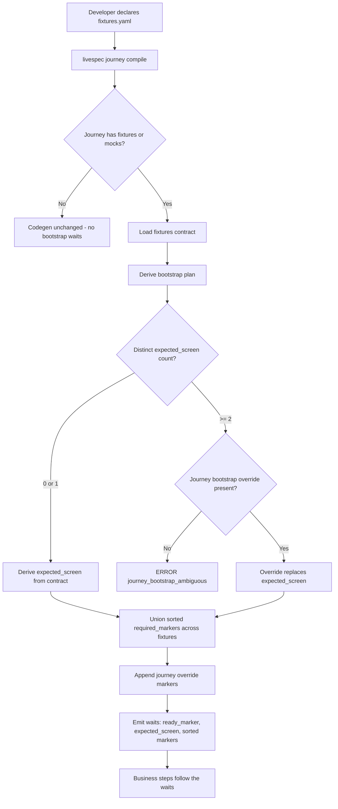
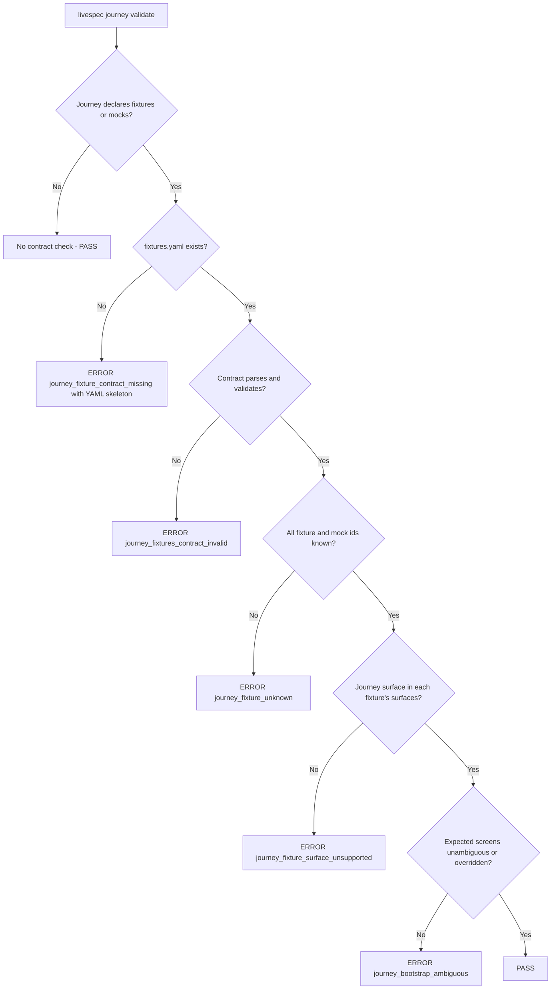
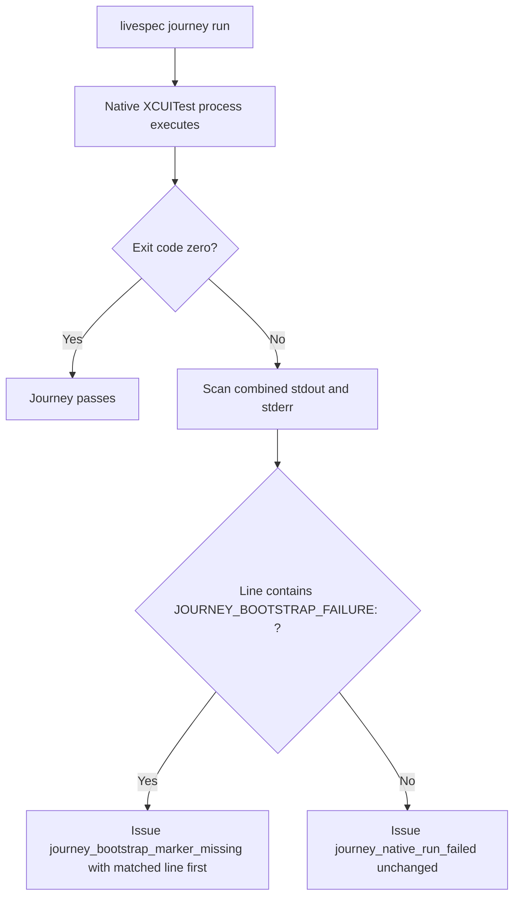
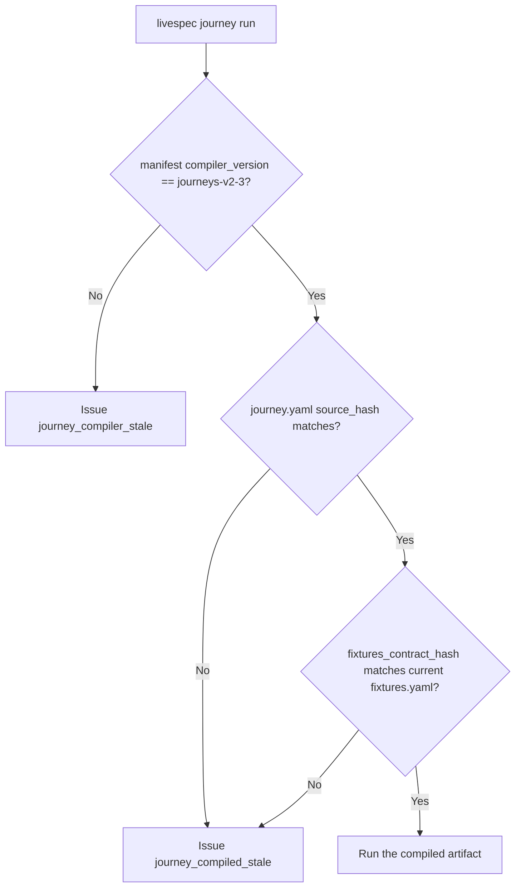
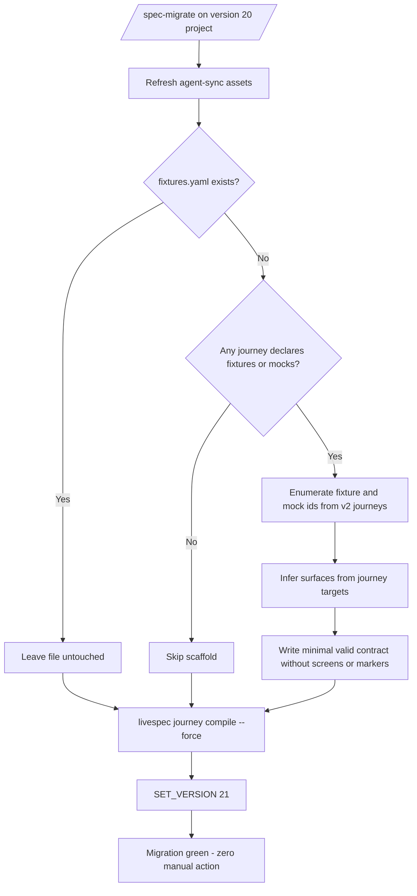

# Feature Spec: Journey Fixture Bootstrap Contract

---

## Header

- **Feature:** Journey Fixture Bootstrap Contract
- **Branch:** `feature/060-journey-fixture-bootstrap-contract`
- **Date:** 2026-06-11
- **Status:** Implemented
- **Input:** Journey fixture bootstrap contract: project-local `.specs/journeys/fixtures.yaml`, derived XCUITest bootstrap waits, blocking validation, compiler bump journeys-v2-3, runtime bootstrap failure reclassification, automatic v21 migration with fixtures contract scaffold. Root cause (consumer project STRAPT): v2 journeys declare fixtures via `UI_TEST_JOURNEY_FIXTURES` then immediately assert business screen IDs while the app is still on Home — the fixture seeds data without guaranteeing navigation, so the failure surfaces after 120s of simulator time as a generic `journey_native_run_failed`, indistinguishable from a business bug.
- **Feature Number:** 060

---

## User Scenarios & Testing

> Prioritize stories as P1 (critical — must ship), P2 (important — should ship), P3 (nice-to-have — can defer).

### Story 1 — Declare a fixture bootstrap contract and get derived XCUITest bootstrap waits `P1`

**As a** developer of a LiveSpec consumer project with XCUITest journeys, **I want to** declare my fixtures and their bootstrap guarantees once in a project-local `.specs/journeys/fixtures.yaml`, **so that** the journey compiler derives explicit bootstrap waits in the generated Swift code and a fixture-driven journey can never assert business UI before the app has proven it finished bootstrapping.

**Priority reason:** This is the core of the bug being fixed. Without the contract and the derived waits, every fixture journey races the app's bootstrap and fails late (120s) with an unactionable generic error.

**Independent test:** Create a `.specs/journeys/fixtures.yaml` declaring a fixture with `expected_screen` and `required_markers` for `ios`, reference that fixture from an XCUITest journey, run `livespec journey compile --force`, and inspect the generated Swift: `app.launch()` must be followed by `waitForJourneyBootstrap` calls (ready_marker, then expected_screen, then sorted required_markers) before the first business step.

#### Acceptance Scenarios (Gherkin — source of truth for tests)

> These Gherkin blocks are the source of truth for test scaffolding. All tests (unit, integration, E2E, visual) are derived from these scenarios, never from Mermaid diagrams.

```gherkin
Feature: Fixture bootstrap contract drives XCUITest codegen
  Scenario: Compiler derives bootstrap waits from the contract
    Given a project with .specs/journeys/fixtures.yaml declaring schema_version 1
    And   a bootstrap ready_marker "ui-test-bootstrap-ready" for surface "ios" with timeout_seconds 15
    And   a fixture "session-workout" with expected_screen "iphone-session-page" and required_markers ["session-exercise-list"] for surface "ios"
    And   an XCUITest journey whose preconditions.fixtures contains "session-workout"
    When  the journey is compiled
    Then  the generated Swift contains app.launch() followed by waitForJourneyBootstrap calls
    And   the wait order is ready_marker, then expected_screen, then sorted required_markers
    And   every wait precedes the first business step
    And   the waitForJourneyBootstrap helper fails with XCTFail prefixed "JOURNEY_BOOTSTRAP_FAILURE:"

  Scenario: Markers are derived as a sorted deduplicated union across fixtures
    Given two fixtures referenced by the same journey
    And   their required_markers for "ios" overlap
    When  the bootstrap plan is resolved
    Then  required_markers is the sorted deduplicated union of both fixtures' markers

  Scenario: Expected screen is derived only when unambiguous
    Given a journey referencing fixtures whose expected_screen values for "ios" yield zero or one distinct value
    When  the bootstrap plan is resolved
    Then  expected_screen is the single distinct value, or omitted when no fixture declares one

  Scenario: Ambiguous expected screens require a journey-level override
    Given a journey referencing two fixtures with two distinct expected_screen values for "ios"
    And   the journey declares no preconditions.bootstrap override
    When  the journey is validated
    Then  validation fails with ERROR journey_bootstrap_ambiguous

  Scenario: Journey-level override replaces screen and appends markers
    Given a journey with preconditions.bootstrap declaring expected_screen "custom-screen" and required_markers ["extra-marker"]
    When  the bootstrap plan is resolved
    Then  expected_screen is "custom-screen" regardless of contract-derived values
    And   required_markers contains the contract-derived union plus "extra-marker"

  Scenario: Fixture without navigation produces a ready-only plan
    Given a fixture declaring surfaces but no expected_screen and no required_markers
    And   a bootstrap ready_marker is configured
    When  a journey referencing only that fixture is compiled
    Then  the generated Swift waits only for the ready_marker after app.launch()

  Scenario: Journey without fixtures is unaffected
    Given an XCUITest journey with no fixtures and no mocks
    When  the journey is compiled
    Then  the generated Swift contains no waitForJourneyBootstrap call
    And   the codegen is identical to the previous compiler output except the version header
```

#### User Flow

> The Mermaid flowchart below visualizes the same flow defined in the Gherkin scenarios above.



---

### Story 2 — Blocking validation rejects undeclared or inconsistent fixtures `P1`

**As a** developer running `livespec journey validate` (or compile), **I want** every XCUITest journey that uses fixtures or mocks to be checked against the project's fixtures contract with blocking errors, **so that** a missing, unknown, or surface-incompatible fixture is caught at validation time with an actionable message instead of failing at runtime in the simulator.

**Priority reason:** Enforcement is what makes the contract the single source of truth. Without blocking validation, the contract degrades into optional documentation and the original bug persists. User decision locked: immediate blocking enforcement, all ERROR, no warning phase.

**Independent test:** Declare a fixture in a journey without creating `.specs/journeys/fixtures.yaml`, run `livespec journey validate`, and confirm the output is an ERROR `journey_fixture_contract_missing` whose message contains a ready-to-paste YAML skeleton for the missing contract.

#### Acceptance Scenarios (Gherkin — source of truth for tests)

```gherkin
Feature: Blocking validation of the fixtures contract
  Scenario: Missing contract file is a blocking error with a paste-ready skeleton
    Given an XCUITest journey declaring fixtures or mocks
    And   no .specs/journeys/fixtures.yaml exists
    When  the journey is validated
    Then  validation fails with ERROR journey_fixture_contract_missing
    And   the error message includes a ready-to-paste fixtures.yaml skeleton listing the journey's fixture and mock ids

  Scenario: Invalid contract file is a blocking error
    Given a .specs/journeys/fixtures.yaml with invalid YAML or a schema violation such as timeout_seconds 0
    When  the contract is loaded during validation
    Then  validation fails with ERROR journey_fixtures_contract_invalid

  Scenario: Unknown fixture id is a blocking error
    Given a valid fixtures contract
    And   a journey declaring a fixture id absent from the contract's fixtures map
    When  the journey is validated
    Then  validation fails with ERROR journey_fixture_unknown

  Scenario: Unknown mock id is a blocking error
    Given a valid fixtures contract
    And   a journey declaring a mock id absent from the contract's mocks map
    When  the journey is validated
    Then  validation fails with ERROR journey_fixture_unknown

  Scenario: Surface mismatch is a blocking error
    Given a fixture declared with surfaces [watchos] only
    And   an XCUITest journey targeting an ios surface that references this fixture
    When  the journey is validated
    Then  validation fails with ERROR journey_fixture_surface_unsupported

  Scenario: Correctly declared journey passes validation
    Given a valid fixtures contract covering every fixture and mock the journey declares for its surface
    When  the journey is validated
    Then  no fixture-contract issue is reported

  Scenario: Journey without fixtures requires no contract
    Given an XCUITest journey with no fixtures and no mocks
    And   no .specs/journeys/fixtures.yaml exists
    When  the journey is validated
    Then  no fixture-contract issue is reported
```

#### User Flow

> The Mermaid flowchart below visualizes the same flow defined in the Gherkin scenarios above.



---

### Story 3 — Runtime bootstrap failures are reclassified with a stable diagnostic `P2`

**As a** developer running `livespec journey run`, **I want** a bootstrap timeout in the simulator to be reported as `journey_bootstrap_marker_missing` within the configured bootstrap timeout, **so that** I can immediately distinguish "the app never reached the seeded state" from a genuine business assertion failure.

**Priority reason:** Codegen alone makes failures fast (~15s instead of 120s) but they would still surface as generic `journey_native_run_failed`. Reclassification completes the diagnostic loop. P2 because Story 1 already bounds the failure time.

**Independent test:** Run a compiled fixture journey against an app build that never exposes the required marker; confirm the runner reports `journey_bootstrap_marker_missing` (with the matched `JOURNEY_BOOTSTRAP_FAILURE:` line leading the message) in roughly the bootstrap timeout, not 120s, and that a journey failing on a business step still reports `journey_native_run_failed`.

#### Acceptance Scenarios (Gherkin — source of truth for tests)

```gherkin
Feature: Runtime reclassification of bootstrap failures
  Scenario: Bootstrap failure prefix reclassifies the issue
    Given a compiled XCUITest journey whose bootstrap wait fails at runtime
    When  the native test process exits non-zero
    And   the combined stdout and stderr contain a line with "JOURNEY_BOOTSTRAP_FAILURE:"
    Then  the runner reports issue journey_bootstrap_marker_missing
    And   the matched failure line leads the issue message

  Scenario: Non-bootstrap failures keep the existing classification
    Given a compiled XCUITest journey that fails on a business step
    When  the native test process exits non-zero
    And   the combined output contains no "JOURNEY_BOOTSTRAP_FAILURE:" line
    Then  the runner reports issue journey_native_run_failed unchanged

  Scenario: No xcresult parsing is introduced
    Given the runner processes a failed XCUITest run
    When  it scans for the bootstrap failure prefix
    Then  it only scans the captured process output
    And   it does not read or parse any .xcresult bundle
```

#### User Flow

> The Mermaid flowchart below visualizes the same flow defined in the Gherkin scenarios above.



---

### Story 4 — Stale artifacts are rejected when the compiler or the contract changes `P2`

**As a** developer, **I want** compiled journey manifests to be invalidated both by the compiler version bump (`journeys-v2-3`) and by any change to `fixtures.yaml` after compilation, **so that** I can never run Swift artifacts that silently predate the bootstrap contract.

**Priority reason:** Without staleness enforcement the contract can drift from the compiled artifacts, reintroducing the silent-divergence failure mode the feature exists to eliminate. P2 because the version-bump mechanism already exists and only needs the new version string plus one additive hash field.

**Independent test:** Compile a fixture journey, then edit `fixtures.yaml`, then run `livespec journey run`: the runner must report `journey_compiled_stale`. Separately, attempt to run a manifest produced by compiler `journeys-v2-2`: the runner must report `journey_compiler_stale`.

#### Acceptance Scenarios (Gherkin — source of truth for tests)

```gherkin
Feature: Staleness enforcement for bootstrap-aware artifacts
  Scenario: Old compiler version is rejected unconditionally
    Given a compiled manifest produced with compiler_version "journeys-v2-2"
    When  the runner checks the manifest against COMPILER_VERSION "journeys-v2-3"
    Then  the runner reports issue journey_compiler_stale
    And   no implicit recompilation is performed

  Scenario: Contract change after compilation marks the artifact stale
    Given a journey compiled with a fixtures_contract_hash recorded in its manifest
    When  .specs/journeys/fixtures.yaml changes after compilation
    And   the runner compares the recorded hash with the current contract hash
    Then  the runner reports issue journey_compiled_stale

  Scenario: Manifest field stays additive for tolerant readers
    Given the CompiledManifest schema gains the fixtures_contract_hash field with an empty-string default
    When  a manifest written without the field is read
    Then  parsing succeeds with fixtures_contract_hash as the empty string
    And   MANIFEST_SCHEMA_VERSION remains 1
```

#### User Flow

> The Mermaid flowchart below visualizes the same flow defined in the Gherkin scenarios above.



---

### Story 5 — Existing projects migrate automatically with a scaffolded contract `P2`

**As a** maintainer of an existing LiveSpec project with v2 fixture journeys, **I want** `/spec-migrate` (migration v21) to scaffold a valid fixtures contract from my existing journeys and recompile everything, **so that** the new blocking enforcement activates with zero manual action and unchanged runtime behavior until I enrich the contract.

**Priority reason:** User decision locked: migration must be 100% automatic. Without the scaffold, the new blocking validation would break every existing fixture project on upgrade. P2 because it gates release, not the core mechanism.

**Independent test:** On a project at LiveSpec version 20 containing v2 journeys with fixtures, run `/spec-migrate`: it must create `.specs/journeys/fixtures.yaml` listing every fixture/mock id found in journeys with surfaces inferred from journey targets, recompile via `livespec journey compile --force`, set version 21, and end green with no prompt. Running the scaffold again must leave the existing file untouched.

#### Acceptance Scenarios (Gherkin — source of truth for tests)

```gherkin
Feature: Automatic v21 migration with fixtures contract scaffold
  Scenario: Scaffold generates a valid contract from existing journeys
    Given a project with v2 journeys declaring fixtures and mocks
    And   no .specs/journeys/fixtures.yaml exists
    When  livespec journey fixtures scaffold runs
    Then  a fixtures.yaml is written with schema_version 1
    And   every fixture and mock id declared in the journeys appears in the contract
    And   each entry's surfaces are inferred from the targets of the journeys referencing it
    And   no expected_screen and no required_markers are written
    And   the scaffolded contract passes validation and compiles without emitting bootstrap waits

  Scenario: Scaffold is idempotent and never overwrites
    Given a .specs/journeys/fixtures.yaml already exists
    When  livespec journey fixtures scaffold runs
    Then  the existing file is left byte-identical
    And   the command exits successfully

  Scenario: Migration v21 is end-to-end automatic
    Given a project at LiveSpec version 20 with v2 fixture journeys
    When  /spec-migrate applies migration 21
    Then  agent-sync assets are refreshed
    And   the fixtures contract is scaffolded if absent
    And   livespec journey compile --force recompiles all journeys
    And   the project version is set to 21
    And   no manual action or prompt is required

  Scenario: Project without fixture journeys migrates without a contract
    Given a project at version 20 whose journeys declare no fixtures and no mocks
    When  /spec-migrate applies migration 21
    Then  no fixtures.yaml is created
    And   the migration completes green
```

#### User Flow

> The Mermaid flowchart below visualizes the same flow defined in the Gherkin scenarios above.



---

## Acceptance Criteria

> Each AC must be specific, testable, and verifiable. Reference them from FR below.

| ID | Criterion | Priority | Story |
|---|---|---|---|
| AC-001 | `.specs/journeys/fixtures.yaml` (schema_version 1) parses into frozen Pydantic models with optional top-level `bootstrap` (per-surface `ready_marker` map, `timeout_seconds` default 15 bounded 1–60; omitting the `bootstrap` key means no ready_marker and default timeout), `fixtures.<id>` (`surfaces`, per-surface `expected_screen` map, per-surface `required_markers` map), and `mocks.<id>` (`surfaces`); invalid YAML or schema violation yields `journey_fixtures_contract_invalid` | P1 | Story 1, Story 2 |
| AC-002 | `resolve_bootstrap` derives `required_markers` as the sorted deduplicated union across the journey's fixtures and derives `expected_screen` when fixtures yield 0–1 distinct value for the surface | P1 | Story 1 |
| AC-003 | Two or more distinct `expected_screen` values for the journey's surface without a journey-level override yield ERROR `journey_bootstrap_ambiguous` | P1 | Story 1, Story 2 |
| AC-004 | Journey schema gains optional `preconditions.bootstrap` (`BootstrapOverride`): `expected_screen` replaces the derived value, `required_markers` append to the derived union; journey `schema_version` stays 2 and existing journeys remain valid | P1 | Story 1 |
| AC-005 | Generated XCUITest code emits, after `app.launch()` and before the first business step, `waitForJourneyBootstrap` waits in deterministic order ready_marker → expected_screen → sorted required_markers, with a helper that fails via `XCTFail` prefixed `JOURNEY_BOOTSTRAP_FAILURE:`; `timeout_seconds` applies uniformly to each individual emitted wait call (not a total budget) | P1 | Story 1 |
| AC-006 | An XCUITest journey declaring fixtures or mocks without a fixtures contract file — whether the contract never existed or was deleted after a previous compile — yields ERROR `journey_fixture_contract_missing` whose message includes a ready-to-paste YAML skeleton for the journey's declared ids | P1 | Story 2 |
| AC-007 | A fixture or mock id absent from the contract yields ERROR `journey_fixture_unknown`; a journey surface absent from the fixture's `surfaces` yields ERROR `journey_fixture_surface_unsupported`; enforcement is XCUITest-only in this feature (Playwright/Maestro enforcement is deferred to a future feature; the surface-agnostic maps keep the schema forward-compatible without changes) | P1 | Story 2 |
| AC-008 | `COMPILER_VERSION` becomes `journeys-v2-3` and manifests from older compiler versions are rejected by the existing unconditional `journey_compiler_stale` mechanism | P2 | Story 4 |
| AC-009 | `CompiledManifest` gains additive `fixtures_contract_hash` (empty-string default, tolerant reader, `MANIFEST_SCHEMA_VERSION` stays 1) written at compile time; the runner compares it to the current contract hash and reports `journey_compiled_stale` when `fixtures.yaml` changed post-compile | P2 | Story 4 |
| AC-010 | On non-zero native exit, the runner scans combined process output for `JOURNEY_BOOTSTRAP_FAILURE:` and reclassifies the issue as `journey_bootstrap_marker_missing` (matched line leading the message); without the prefix the issue stays `journey_native_run_failed`; no xcresult parsing | P2 | Story 3 |
| AC-011 | `scaffold_fixtures_contract(project_root)` enumerates fixtures/mocks from existing v2 journeys, infers `surfaces` from journey targets, writes a valid contract without `expected_screen`/`required_markers` and without the optional `bootstrap` block, and never overwrites an existing file (idempotent) | P2 | Story 5 |
| AC-012 | Migration `migrations/21/` runs agent-sync refresh, the contract scaffold, `livespec journey compile --force`, and `SET_VERSION 21` end-to-end with zero manual action, staying green on projects with and without fixture journeys | P2 | Story 5 |
| AC-013 | CLI subcommand `livespec journey fixtures scaffold` exposes the scaffold with the project's standard exit codes and output conventions | P2 | Story 5 |
| AC-014 | Journeys declaring no fixtures and no mocks compile to output identical to the previous compiler except the version header, and require no contract file | P1 | Story 1, Story 2 |
| AC-015 | `system/testing/user-journeys.md` documents the fixtures contract: schema, app-side responsibilities (ready marker exposure), derivation rules, and the mandatory recompilation after contract changes | P3 | Story 5 |

> **Deep-link anchors:** Each AC below has a heading anchor (`#ac-001`, `#ac-002`, ...) enabling direct navigation from `implementation.md` and `@spec` comments.

### AC-001

**Criterion:** `.specs/journeys/fixtures.yaml` (schema_version 1) parses into frozen Pydantic models with optional top-level `bootstrap` (per-surface `ready_marker` map, `timeout_seconds` default 15 bounded 1–60; omitting the `bootstrap` key means no ready_marker and default timeout), `fixtures.<id>` (`surfaces`, per-surface `expected_screen` map, per-surface `required_markers` map), and `mocks.<id>` (`surfaces`); invalid YAML or schema violation yields `journey_fixtures_contract_invalid`
**Priority:** P1 | **Story:** Story 1, Story 2

### AC-002

**Criterion:** `resolve_bootstrap` derives `required_markers` as the sorted deduplicated union across the journey's fixtures and derives `expected_screen` when fixtures yield 0–1 distinct value for the surface
**Priority:** P1 | **Story:** Story 1

### AC-003

**Criterion:** Two or more distinct `expected_screen` values for the journey's surface without a journey-level override yield ERROR `journey_bootstrap_ambiguous`
**Priority:** P1 | **Story:** Story 1, Story 2

### AC-004

**Criterion:** Journey schema gains optional `preconditions.bootstrap` (`BootstrapOverride`): `expected_screen` replaces the derived value, `required_markers` append to the derived union; journey `schema_version` stays 2 and existing journeys remain valid
**Priority:** P1 | **Story:** Story 1

### AC-005

**Criterion:** Generated XCUITest code emits, after `app.launch()` and before the first business step, `waitForJourneyBootstrap` waits in deterministic order ready_marker → expected_screen → sorted required_markers, with a helper that fails via `XCTFail` prefixed `JOURNEY_BOOTSTRAP_FAILURE:`; `timeout_seconds` applies uniformly to each individual emitted wait call (not a total budget)
**Priority:** P1 | **Story:** Story 1

### AC-006

**Criterion:** An XCUITest journey declaring fixtures or mocks without a fixtures contract file — whether the contract never existed or was deleted after a previous compile — yields ERROR `journey_fixture_contract_missing` whose message includes a ready-to-paste YAML skeleton for the journey's declared ids
**Priority:** P1 | **Story:** Story 2

### AC-007

**Criterion:** A fixture or mock id absent from the contract yields ERROR `journey_fixture_unknown`; a journey surface absent from the fixture's `surfaces` yields ERROR `journey_fixture_surface_unsupported`; enforcement is XCUITest-only in this feature (Playwright/Maestro enforcement is deferred to a future feature; the surface-agnostic maps keep the schema forward-compatible without changes)
**Priority:** P1 | **Story:** Story 2

### AC-008

**Criterion:** `COMPILER_VERSION` becomes `journeys-v2-3` and manifests from older compiler versions are rejected by the existing unconditional `journey_compiler_stale` mechanism
**Priority:** P2 | **Story:** Story 4

### AC-009

**Criterion:** `CompiledManifest` gains additive `fixtures_contract_hash` (empty-string default, tolerant reader, `MANIFEST_SCHEMA_VERSION` stays 1) written at compile time; the runner compares it to the current contract hash and reports `journey_compiled_stale` when `fixtures.yaml` changed post-compile
**Priority:** P2 | **Story:** Story 4

### AC-010

**Criterion:** On non-zero native exit, the runner scans combined process output for `JOURNEY_BOOTSTRAP_FAILURE:` and reclassifies the issue as `journey_bootstrap_marker_missing` (matched line leading the message); without the prefix the issue stays `journey_native_run_failed`; no xcresult parsing
**Priority:** P2 | **Story:** Story 3

### AC-011

**Criterion:** `scaffold_fixtures_contract(project_root)` enumerates fixtures/mocks from existing v2 journeys, infers `surfaces` from journey targets, writes a valid contract without `expected_screen`/`required_markers` and without the optional `bootstrap` block, and never overwrites an existing file (idempotent)
**Priority:** P2 | **Story:** Story 5

### AC-012

**Criterion:** Migration `migrations/21/` runs agent-sync refresh, the contract scaffold, `livespec journey compile --force`, and `SET_VERSION 21` end-to-end with zero manual action, staying green on projects with and without fixture journeys
**Priority:** P2 | **Story:** Story 5

### AC-013

**Criterion:** CLI subcommand `livespec journey fixtures scaffold` exposes the scaffold with the project's standard exit codes and output conventions
**Priority:** P2 | **Story:** Story 5

### AC-014

**Criterion:** Journeys declaring no fixtures and no mocks compile to output identical to the previous compiler except the version header, and require no contract file
**Priority:** P1 | **Story:** Story 1, Story 2

### AC-015

**Criterion:** `system/testing/user-journeys.md` documents the fixtures contract: schema, app-side responsibilities (ready marker exposure), derivation rules, and the mandatory recompilation after contract changes
**Priority:** P3 | **Story:** Story 5

---

## Functional Requirements

> Each FR must map to at least one AC. These become the rows in implementation.md.

| ID | Requirement | AC References |
|---|---|---|
| FR-001 | The system must provide a new module `validator/journeys/fixtures.py` with frozen Pydantic models (`FixturesContractV1` with optional `bootstrap` key, `FixtureContract`, `MockContract`, `BootstrapDefaults` with per-surface `ready_marker` map and `timeout_seconds` `ge=1, le=60` default 15, and the resolved single-surface `BootstrapPlan`) and `read_fixtures_contract(project_root)` returning the parsed contract, `None` when absent, and a `journey_fixtures_contract_invalid` issue on invalid input; `validator/journeys/paths.py` must expose `fixtures_contract_path()` | AC-001 |
| FR-002 | The system must provide, in `validator/journeys/fixtures.py` (the compiler imports only the resulting `BootstrapPlan`), a pure function `resolve_bootstrap(source, contract, surface) -> BootstrapPlan \| None` implementing the derivation rules: sorted deduplicated marker union, expected_screen from 0–1 distinct value, ambiguity error on ≥2 distinct values, and journey-override semantics (screen replaces, markers append) | AC-002, AC-003, AC-004 |
| FR-003 | The journey schema must gain an optional additive `Preconditions.bootstrap: BootstrapOverride \| None` (`expected_screen: str \| None`, `required_markers: list[str]`) with journey `schema_version` unchanged at 2 | AC-004 |
| FR-004 | Journey validation must enforce the contract for XCUITest journeys with five blocking ERROR rules: `journey_fixture_contract_missing` (message embeds a ready-to-paste YAML skeleton), `journey_fixtures_contract_invalid`, `journey_fixture_unknown`, `journey_fixture_surface_unsupported`, `journey_bootstrap_ambiguous`; journeys without fixtures/mocks are exempt | AC-001, AC-003, AC-006, AC-007, AC-014 |
| FR-005 | The XCUITest compiler must emit, immediately after `app.launch()`, `waitForJourneyBootstrap` calls in deterministic order ready_marker → expected_screen → sorted required_markers, add the helper function (via the existing helpers mechanism) that fails with `XCTFail("JOURNEY_BOOTSTRAP_FAILURE: ...")` using the contract timeout, and leave fixture-less journeys' codegen unchanged apart from the version header | AC-005, AC-014 |
| FR-006 | The manifest module must bump `COMPILER_VERSION` to `journeys-v2-3` and add the additive `CompiledManifest.fixtures_contract_hash: str = ""` field (tolerant reader, `MANIFEST_SCHEMA_VERSION` stays 1) populated at compile time from the contract file content | AC-008, AC-009 |
| FR-007 | The runner must check `fixtures_contract_hash` against the current contract alongside the existing `source_hash` staleness check, reporting `journey_compiled_stale` on mismatch, and must keep rejecting older compiler versions via `journey_compiler_stale` | AC-008, AC-009 |
| FR-008 | The runner must, when the native process exits non-zero, scan the combined captured output for the shared constant `BOOTSTRAP_FAILURE_PREFIX = "JOURNEY_BOOTSTRAP_FAILURE:"` and reclassify the issue as `journey_bootstrap_marker_missing` with the matched line leading the message, leaving `journey_native_run_failed` unchanged otherwise and performing no xcresult parsing | AC-010 |
| FR-009 | The system must provide `scaffold_fixtures_contract(project_root)` in `validator/journeys/fixtures.py` and the CLI subcommand `livespec journey fixtures scaffold`: enumerate fixture/mock ids from existing v2 journeys, infer `surfaces` from journey targets, write a minimal valid contract without `expected_screen`/`required_markers`, and never overwrite an existing file | AC-011, AC-013 |
| FR-010 | The system must ship migration `migrations/21/` following the `migrations/20/` structure (`migrate.md` + shell scripts): agent-sync refresh, automatic contract scaffold invoked through the `livespec journey fixtures scaffold` CLI subcommand, `livespec journey compile --force`, `SET_VERSION 21` — fully automatic with zero manual action | AC-012 |
| FR-011 | `system/testing/user-journeys.md` must gain a "Fixture bootstrap contract" section covering the contract schema, derivation and override rules, app-side ready-marker responsibilities, and mandatory recompilation after contract changes | AC-015 |

> **Deep-link anchors:** Each FR below has a heading anchor (`#fr-001`, `#fr-002`, ...) enabling direct navigation from `implementation.md` and `@spec` comments.

### FR-001

**Requirement:** The system must provide a new module `validator/journeys/fixtures.py` with frozen Pydantic models (`FixturesContractV1` with optional `bootstrap` key, `FixtureContract`, `MockContract`, `BootstrapDefaults` with per-surface `ready_marker` map and `timeout_seconds` `ge=1, le=60` default 15, and the resolved single-surface `BootstrapPlan`) and `read_fixtures_contract(project_root)` returning the parsed contract, `None` when absent, and a `journey_fixtures_contract_invalid` issue on invalid input; `validator/journeys/paths.py` must expose `fixtures_contract_path()`
**AC References:** [AC-001](#ac-001)

### FR-002

**Requirement:** The system must provide, in `validator/journeys/fixtures.py` (the compiler imports only the resulting `BootstrapPlan`), a pure function `resolve_bootstrap(source, contract, surface) -> BootstrapPlan | None` implementing the derivation rules: sorted deduplicated marker union, expected_screen from 0–1 distinct value, ambiguity error on ≥2 distinct values, and journey-override semantics (screen replaces, markers append)
**AC References:** [AC-002](#ac-002), [AC-003](#ac-003), [AC-004](#ac-004)

### FR-003

**Requirement:** The journey schema must gain an optional additive `Preconditions.bootstrap: BootstrapOverride | None` (`expected_screen: str | None`, `required_markers: list[str]`) with journey `schema_version` unchanged at 2
**AC References:** [AC-004](#ac-004)

### FR-004

**Requirement:** Journey validation must enforce the contract for XCUITest journeys with five blocking ERROR rules: `journey_fixture_contract_missing` (message embeds a ready-to-paste YAML skeleton), `journey_fixtures_contract_invalid`, `journey_fixture_unknown`, `journey_fixture_surface_unsupported`, `journey_bootstrap_ambiguous`; journeys without fixtures/mocks are exempt
**AC References:** [AC-001](#ac-001), [AC-003](#ac-003), [AC-006](#ac-006), [AC-007](#ac-007), [AC-014](#ac-014)

### FR-005

**Requirement:** The XCUITest compiler must emit, immediately after `app.launch()`, `waitForJourneyBootstrap` calls in deterministic order ready_marker → expected_screen → sorted required_markers, add the helper function (via the existing helpers mechanism) that fails with `XCTFail("JOURNEY_BOOTSTRAP_FAILURE: ...")` using the contract timeout, and leave fixture-less journeys' codegen unchanged apart from the version header
**AC References:** [AC-005](#ac-005), [AC-014](#ac-014)

### FR-006

**Requirement:** The manifest module must bump `COMPILER_VERSION` to `journeys-v2-3` and add the additive `CompiledManifest.fixtures_contract_hash: str = ""` field (tolerant reader, `MANIFEST_SCHEMA_VERSION` stays 1) populated at compile time from the contract file content
**AC References:** [AC-008](#ac-008), [AC-009](#ac-009)

### FR-007

**Requirement:** The runner must check `fixtures_contract_hash` against the current contract alongside the existing `source_hash` staleness check, reporting `journey_compiled_stale` on mismatch, and must keep rejecting older compiler versions via `journey_compiler_stale`
**AC References:** [AC-008](#ac-008), [AC-009](#ac-009)

### FR-008

**Requirement:** The runner must, when the native process exits non-zero, scan the combined captured output for the shared constant `BOOTSTRAP_FAILURE_PREFIX = "JOURNEY_BOOTSTRAP_FAILURE:"` and reclassify the issue as `journey_bootstrap_marker_missing` with the matched line leading the message, leaving `journey_native_run_failed` unchanged otherwise and performing no xcresult parsing
**AC References:** [AC-010](#ac-010)

### FR-009

**Requirement:** The system must provide `scaffold_fixtures_contract(project_root)` in `validator/journeys/fixtures.py` and the CLI subcommand `livespec journey fixtures scaffold`: enumerate fixture/mock ids from existing v2 journeys, infer `surfaces` from journey targets, write a minimal valid contract without `expected_screen`/`required_markers`, and never overwrite an existing file
**AC References:** [AC-011](#ac-011), [AC-013](#ac-013)

### FR-010

**Requirement:** The system must ship migration `migrations/21/` following the `migrations/20/` structure (`migrate.md` + shell scripts): agent-sync refresh, automatic contract scaffold invoked through the `livespec journey fixtures scaffold` CLI subcommand, `livespec journey compile --force`, `SET_VERSION 21` — fully automatic with zero manual action
**AC References:** [AC-012](#ac-012)

### FR-011

**Requirement:** `system/testing/user-journeys.md` must gain a "Fixture bootstrap contract" section covering the contract schema, derivation and override rules, app-side ready-marker responsibilities, and mandatory recompilation after contract changes
**AC References:** [AC-015](#ac-015)

---

## Key Entities

> List the main data objects involved in this feature.

| Entity | Description | Key Fields |
|---|---|---|
| FixturesContractV1 | Root of the project-local fixtures contract (`.specs/journeys/fixtures.yaml`, frozen Pydantic) | schema_version: int (== 1), bootstrap: BootstrapDefaults \| None (optional key), fixtures: dict[str, FixtureContract], mocks: dict[str, MockContract] |
| BootstrapDefaults | App-level bootstrap contract shared by all journeys | ready_marker: dict[surface, str] (per-surface map, may be empty), timeout_seconds: int (default 15, ge=1 le=60) |
| FixtureContract | One declared fixture id with its per-surface bootstrap guarantees | surfaces: list[str], expected_screen: dict[surface, str] (optional map), required_markers: dict[surface, list[str]] (optional map) |
| MockContract | One declared mock id | surfaces: list[str] |
| BootstrapOverride | Optional journey-level override under `preconditions.bootstrap` | expected_screen: str \| None (replaces), required_markers: list[str] (append) |
| BootstrapPlan | Resolved, deterministic, single-surface bootstrap wait plan consumed by the compiler | ready_marker: str \| None (resolved scalar for the journey's surface), expected_screen: str \| None, required_markers: list[str] (sorted), timeout_seconds: int |
| CompiledManifest (extended) | Compilation metadata, gains contract staleness tracking | compiler_version = journeys-v2-3, fixtures_contract_hash (additive, default "") |
| JourneyIssue (new codes) | Structured validation/run diagnostics | journey_fixture_contract_missing, journey_fixtures_contract_invalid, journey_fixture_unknown, journey_fixture_surface_unsupported, journey_bootstrap_ambiguous, journey_bootstrap_marker_missing |

---

## Edge Cases

> Scenarios that aren't in the happy path but must be handled correctly.

- **Fixture without navigation (seed-only):** A fixture declaring neither `expected_screen` nor `required_markers` produces a ready-marker-only plan (or no waits at all when no `ready_marker` is configured) — never an error.
- **No ready_marker configured:** the `bootstrap` key itself is optional; omitting it (or its `ready_marker` map) means no ready-marker wait and the default 15s timeout — the derived plan simply starts at expected_screen/markers. A contract with no bootstrap guarantees at all yields no waits and codegen behaves as before.
- **timeout_seconds out of bounds:** Values < 1 or > 60 are rejected at parse time as `journey_fixtures_contract_invalid` (bounds keep the budget inside the 120s XCUITest timeout).
- **Scaffold with existing file:** `scaffold_fixtures_contract` never touches an existing `fixtures.yaml` — re-running migration or the CLI subcommand is a safe no-op.
- **Manifest written before this feature:** Older manifests lack `fixtures_contract_hash`; the tolerant reader parses them (empty string), but they are already rejected unconditionally by the `journeys-v2-3` compiler-version check — no conditional logic needed.
- **Contract deleted after compile:** A journey compiled with a non-empty `fixtures_contract_hash` whose contract file disappears is stale (`journey_compiled_stale` for the hash mismatch) and fails validation on the next compile (`journey_fixture_contract_missing`).
- **Non-XCUITest journey with fixtures:** Playwright/Maestro journeys declaring fixtures are not enforced in v1 (surface-agnostic schema is forward-compatible); no contract errors are raised for them.
- **Mixed-surface fixture (e.g. ios + watchos):** Derivation only reads the maps for the journey's surface; other surfaces' values never leak into the plan.
- **Bootstrap prefix appearing in passing runs:** Reclassification only triggers on non-zero exit codes; stray prefix text in a passing run's output changes nothing.

---

## Success Criteria

> Measurable outcomes that define when this feature is complete and successful.

| ID | Criterion | How to Measure |
|---|---|---|
| SC-001 | `pytest tests/test_journey_v2_*.py -q` passes with zero skips; ruff and pyright clean | CI / local test run |
| SC-002 | An XCUITest journey with a fixture and no `fixtures.yaml` is refused at validation with the YAML skeleton in the message | Validation integration test asserting code + message content |
| SC-003 | A correctly declared journey compiles to Swift with order env vars → `app.launch()` → bootstrap waits → business steps | Compiler test asserting line indices (launch < ready < screen < markers < first step) |
| SC-004 | A runtime bootstrap failure is reported as `journey_bootstrap_marker_missing` within the configured bootstrap timeout instead of `journey_native_run_failed` after 120s | Runner test with stubbed process output asserting no `.xcresult` bundle is read; manual verification on consumer project |
| SC-005 | Journeys without fixtures produce codegen identical to the previous compiler apart from the version header | Compiler snapshot comparison test |
| SC-006 | `/spec-migrate` on a version-20 project with fixture journeys completes green end-to-end with zero manual action (scaffold + recompile + SET_VERSION 21) | Migration test on fixture project; scaffolded contract passes validation |
| SC-007 | `user-journeys.md` documents the contract, app-side responsibilities, and mandatory recompilation | Doc section present and referenced from validation error guidance |

---

*Generated by `/spec-specify` — LiveSpec v3*

<!-- finalize:spec-specify:2026-06-11:15d1d511 -->

<!-- finalize:spec-plan:2026-06-11:8bbd6ff2 -->

<!-- finalize:spec-implement:2026-06-11:b2cd1c13 -->
