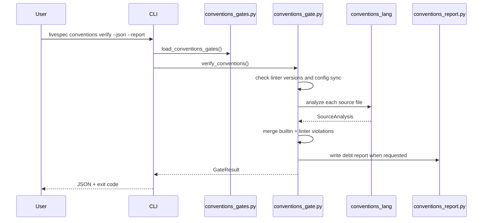
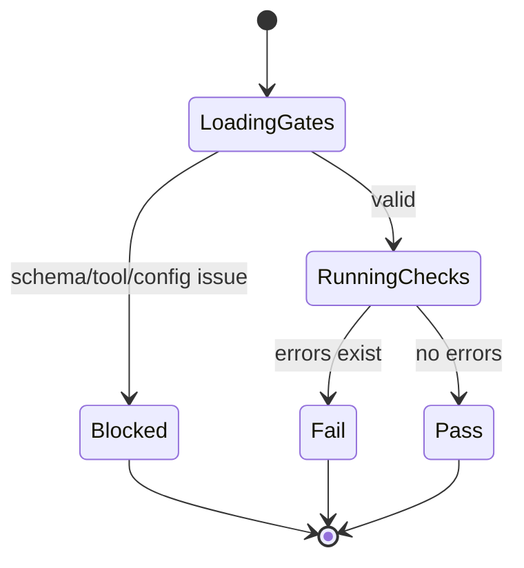
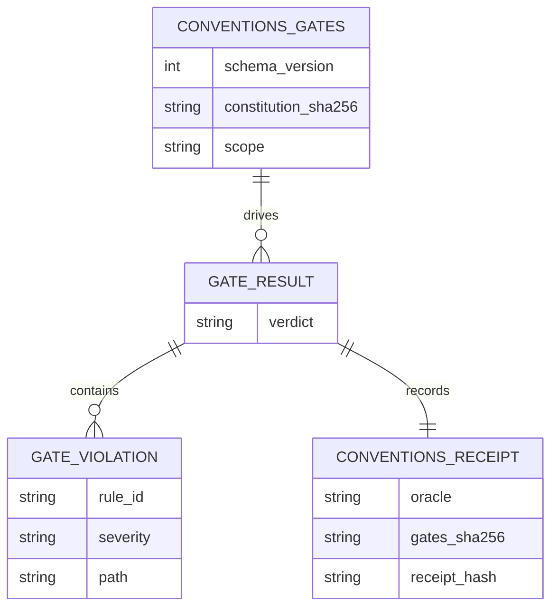

# Plan - Conventions Gates Engine

## Summary

Add the deterministic conventions gate as a set of small Python modules: gates schema/generator,
adapter registry, verification engine, debt report, receipt oracle, CLI wiring, and focused tests.

## Technical Context

| Aspect | Choice |
|---|---|
| Language | Python 3.11+ |
| CLI | Typer existing `conventions_app` |
| Validation | Pydantic v2 |
| YAML | PyYAML |
| Tests | pytest |
| Formatting | ruff via `uvx` in this environment |

## Constitution Check

- **Layered validation:** schema load precedes tool execution; BLOCKED is reserved for invalid
  environment/config.
- **Provider agnostic:** no LLM is involved; Python computes every verdict.
- **Filesystem source of truth:** gates live in `.specs/conventions-gates.yaml`.
- **Fail fast:** invalid gates, tool mismatch, and config mismatch stop before producing PASS/FAIL.
- **Minimal surface:** one nested `gates init`, one `verify`, one `scaffold`.

## Sequence Diagram — Verify

```gherkin
Feature: Verify conventions
  Scenario: Deterministic fail
    Given a valid gates file
    And   at least one builtin error violation
    When  livespec conventions verify --json runs
    Then  the CLI exits 1
    And   the JSON verdict is FAIL

  Scenario: Deterministic block
    Given a declared linter version mismatch
    When  livespec conventions verify --json runs
    Then  the CLI exits 2
    And   the JSON verdict is BLOCKED
```



## State Diagram — Verdict

```gherkin
Feature: Verdict state
  Scenario: PASS without errors
    Given no blockers and no error violations
    When  the result is computed
    Then  verdict is PASS

  Scenario: FAIL with errors
    Given no blockers and at least one error violation
    When  the result is computed
    Then  verdict is FAIL

  Scenario: BLOCKED with blockers
    Given at least one blocker
    When  the result is computed
    Then  verdict is BLOCKED
```



## ER Diagram — File Artifacts



## Implementation Plan

1. Add tests first for schema/generation, verify/report/CLI, and receipt.
2. Implement `validator/conventions_gates.py`.
3. Implement `validator/conventions_lang/` adapters.
4. Implement `validator/conventions_gate.py` and `validator/conventions_report.py`.
5. Implement `validator/conventions_receipt.py`.
6. Wire Typer commands in `validator/cli_commands/utility_cmd.py`.
7. Generate `.specs/conventions-gates.yaml`.
8. Run focused tests, ruff, and broader pytest.

## Testing Strategy

- `tests/test_conventions_gates_schema.py`
- `tests/test_conventions_verify.py`
- `tests/test_conventions_receipt.py`
- `python3 -m pytest tests/test_conventions_*.py -q`
- `uvx ruff check ...`
- `uvx ruff format --check ...`

## Risks & Considerations

- Full repo `conventions verify` may report debt before later remediation features; 061 only installs the
  engine and report machinery.
- TS/Swift function parsing is heuristic until delegated linters cover richer language semantics.
