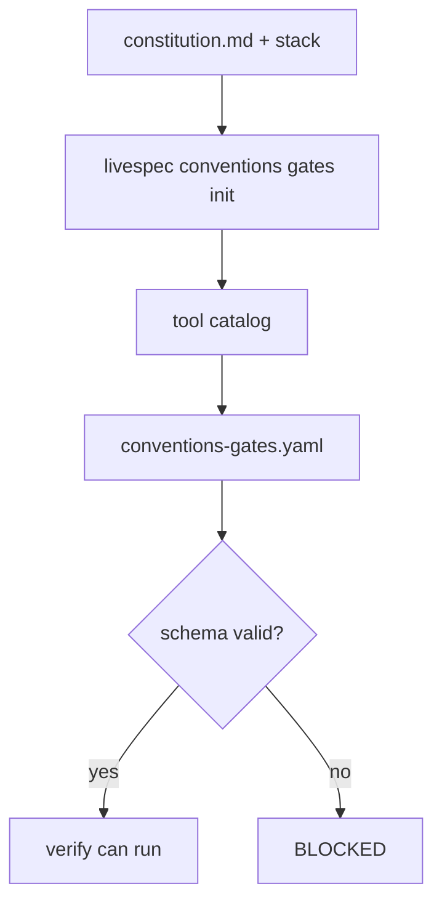
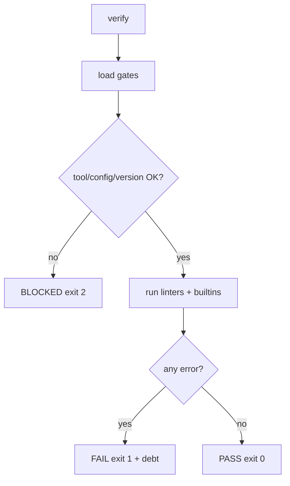
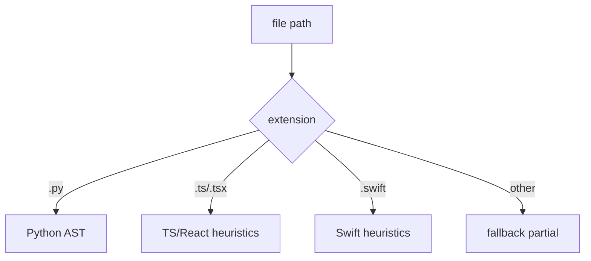

# Feature Spec: Conventions Gates Engine

## Header

- **Feature:** Conventions Gates Engine
- **Branch:** `feature/061-conventions-gates-engine`
- **Date:** 2026-06-12
- **Status:** Implemented
- **Input:** Feature 061 from the conventions gates reference plan: gates schema,
  deterministic engine A, multi-language adapters, receipt, debt report, CLI, and tests.
- **Feature Number:** 061

## User Scenarios & Testing

### Story 1 — Generate and load project gates `P1`

As a LiveSpec maintainer, I want `.specs/conventions-gates.yaml` generated from project
constitution and stack, so deterministic convention checks have an auditable source of truth.

```gherkin
Feature: Conventions gates initialization
  Scenario: Generate gates from constitution and stack
    Given a LiveSpec project with constitution.md and stacks/_default.md
    When  the user runs livespec conventions gates init
    Then  .specs/conventions-gates.yaml is written
    And   file line thresholds are target 400 and limit 500
    And   function thresholds are target 30 and limit 60
    And   generated_from.constitution_sha256 records the constitution hash

  Scenario: Reject invalid threshold order
    Given a gates file where target is greater than limit
    When  LiveSpec loads the gates file
    Then  validation fails before any verifier runs
```



### Story 2 — Verify conventions deterministically `P1`

As a pipeline supervisor, I want `livespec conventions verify` to compute PASS, FAIL, or BLOCKED
from code, never agent prose, so only hard errors block while warnings become debt.

```gherkin
Feature: Deterministic conventions verify
  Scenario: Warnings and errors are separated
    Given source files exceeding target and limit thresholds
    When  livespec conventions verify --json --report runs
    Then  target violations are warnings
    And   limit violations are errors
    And   the verdict is FAIL only when at least one error exists
    And   .specs/conventions/debt-report.md and debt.json are written

  Scenario: Tool mismatch blocks verification
    Given a gates file pinning a linter version
    When  the detected linter version differs
    Then  the verdict is BLOCKED
    And   the fix hint points to scaffold --sync-limits where relevant
```



### Story 3 — Analyze Python, TS/React, Swift, and fallback files `P1`

As a maintainer of a multi-language LiveSpec consumer, I want adapter-based analysis so each
language gets honest deterministic coverage and unknown files never pretend to be fully checked.

```gherkin
Feature: Multi-language adapter registry
  Scenario: Known source extensions use specific adapters
    Given Python, TypeScript React, and Swift files
    When  conventions verify scans the repository
    Then  Python functions are read through ast
    And   TypeScript and React functions use deterministic heuristics
    And   Swift functions and suppressions are detected

  Scenario: Unknown extensions use fallback coverage
    Given a file extension with no registered adapter
    When  conventions verify scans the repository
    Then  fallback coverage is partial and visible
```



## Acceptance Criteria

- **AC-001:** Gates model loads `.specs/conventions-gates.yaml`, rejects malformed thresholds, and
  preserves `generated_from.constitution_sha256`.
- **AC-002:** `livespec conventions gates init` writes `.specs/conventions-gates.yaml` with file
  thresholds target 400/limit 500 and function thresholds target 30/limit 60.
- **AC-003:** `livespec conventions verify [--json] [--report]` returns exit codes 0 PASS, 1 FAIL,
  2 BLOCKED.
- **AC-004:** Verify executes declared linters, detects linter version mismatch, and checks
  gates-to-linter limit sync.
- **AC-005:** Builtins detect file/function length, file headers, public doc coverage, token scale,
  suppression directives, and import rules.
- **AC-006:** Adapter registry covers Python, TypeScript/React, Swift, and a partial fallback.
- **AC-007:** Receipt kind `conventions` records `gates_sha256`, verdict, blockers, violations, and
  rejects PASS with error violations.
- **AC-008:** `--report` writes `.specs/conventions/debt-report.md` and `debt.json` grouped
  worst-first with warnings, errors, and suppression counts.
- **AC-009:** `livespec conventions scaffold --apply --sync-limits` syncs managed SwiftLint limits.
- **AC-010:** Pytest coverage for 061 runs with zero skipped tests.
- **AC-011:** Ruff flat JSON diagnostics are parsed as linter violations and make the gate fail.
- **AC-012:** Conventions receipts are rejected when their `gates_sha256` differs from the current
  `.specs/conventions-gates.yaml`.
- **AC-013:** `delegate_to` disables a builtin only when the target command is known or wired to
  cover that specific rule.
- **AC-014:** Verification blocks when `generated_from.constitution_sha256` is stale, and
  `.specs/conventions/debt.json` remains a regenerable ignored artifact.

## Functional Requirements

- **FR-001:** Provide `validator/conventions_gates.py` with Pydantic `ConventionsGates`, loader,
  path helper, and generator.
- **FR-002:** Provide `validator/conventions_gate.py` deterministic engine and `GateResult`.
- **FR-003:** Provide `validator/conventions_lang/` adapter registry for Python, TS/React, Swift,
  and fallback.
- **FR-004:** Provide conventions receipt and debt report modules.
- **FR-005:** Register `conventions verify`, `conventions gates init`, and `conventions scaffold`.
- **FR-006:** Add pytest coverage for schema, verify, CLI, adapters, report, and receipt.
- **FR-007:** Parse Ruff flat JSON, validate current gates hashes in receipts, and enforce
  rule-specific delegation/staleness guards.

## Key Entities

- `ConventionsGates`
- `GateResult`
- `GateViolation`
- `ConventionsReceipt`
- Language adapter `SourceAnalysis`

## Edge Cases

- YAML all-zero SHA values parsed as integer `0` are normalized before validation.
- Missing or mismatched linter versions produce BLOCKED, not FAIL.
- Unknown extensions use fallback partial coverage.
- PASS receipts with error violations are rejected.
- Receipts become invalid when the gates file changes after receipt creation.
- Stale constitution metadata blocks verification until gates are regenerated.

## Success Criteria

- **SC-001:** `python3 -m pytest tests/test_conventions_*.py -q` passes with 0 skipped tests.
- **SC-002:** `uvx ruff check` and `uvx ruff format --check` pass for all touched 061 files.
- **SC-003:** `livespec conventions gates init` produces `.specs/conventions-gates.yaml`.

<!-- finalize:spec-feature:2026-06-12:a140dc75 -->
