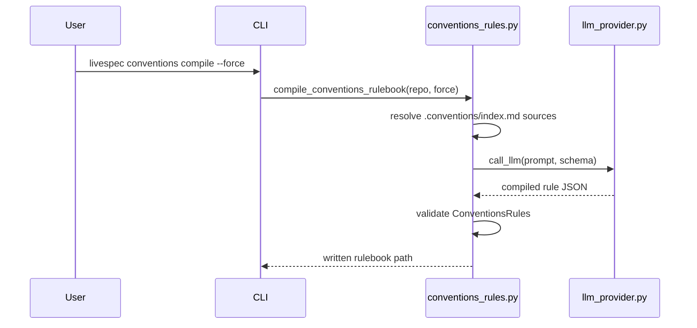
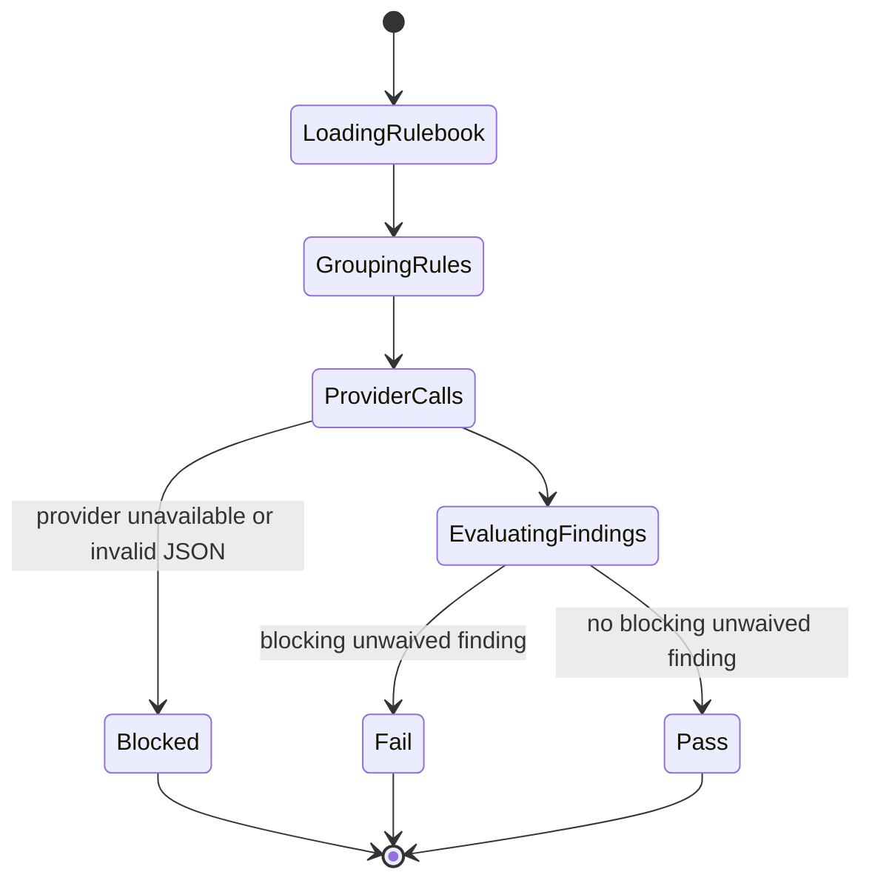
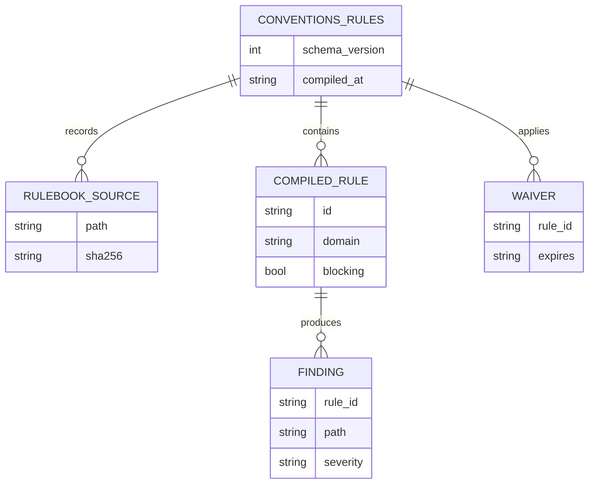

# Plan - Conventions Rulebook Semantic

## Summary

Add a self-contained conventions rulebook compiler and Layer 4 semantic Engine C that uses direct
LLM provider calls, Pydantic schemas, waiver-aware Python verdict calculation, and CLI wiring.

## Technical Context

| Aspect | Choice |
|---|---|
| Language | Python 3.11+ |
| CLI | Existing Typer `conventions_app` in `validator/cli_commands/utility_cmd.py` |
| Validation | Pydantic v2 |
| YAML | PyYAML |
| LLM | Existing `validator/llm_provider.py` only |
| Tests | pytest |
| Quality | ruff + pyright |

## Constitution Check

- **Layered validation:** Engine C is a Layer 4 semantic gate and must preserve deterministic
  schema validation before verdict computation.
- **Provider agnostic:** calls go through `validator/llm_provider.py`; no provider-specific code.
- **Filesystem source of truth:** compiled rulebook lives at `.specs/conventions-rulebook.yaml`.
- **Fail fast:** provider down and malformed provider JSON return BLOCKED.
- **Minimal surface:** one new CLI command, two small validator modules, focused tests.

## Sequence Diagram - Compile

```gherkin
Feature: Compile conventions rulebook
  Scenario: Successful compile
    Given .conventions/index.md references convention sources
    When  livespec conventions compile runs
    Then  the compiler hashes each source
    And   calls the configured provider directly
    And   writes .specs/conventions-rulebook.yaml

  Scenario: Stale rulebook without force
    Given a rulebook exists with old source hashes
    When  livespec conventions compile runs without --force
    Then  the command refuses to overwrite the rulebook
```



## State Diagram - Engine Verdict

```gherkin
Feature: Semantic engine verdict
  Scenario: Blocking finding
    Given a provider finding for a blocking rule
    When  no active waiver matches it
    Then  the verdict is FAIL

  Scenario: Provider unavailable
    Given the provider call fails before returning findings
    When  Engine C runs
    Then  the verdict is BLOCKED
```



## ER Diagram - Rulebook Entities



## Implementation Plan

1. Create feature 062 spec artifacts and progress checkpoint.
2. Write RED tests in `tests/test_conventions_compile.py` for extraction, stale hashes,
   waiver expiry, and CLI wiring.
3. Write RED tests in `tests/test_conventions_semantic.py` for Engine C blocking,
   non-blocking, waived, and provider-down behavior.
4. Implement `validator/conventions_rules.py`.
5. Implement `validator/conventions_engine_c.py`.
6. Register `livespec conventions compile [--force]` and `livespec conventions semantic` in
   `validator/cli_commands/utility_cmd.py`.
7. Update implementation mapping, feature changelog, global changelog, and README registry.
8. Run targeted tests, ruff, pyright, and focused no-LLM verification.

## Testing Strategy

- `python3 -m pytest tests/test_conventions_compile.py tests/test_conventions_semantic.py -q`
- `ruff check validator/conventions_rules.py validator/conventions_engine_c.py tests/test_conventions_compile.py tests/test_conventions_semantic.py`
- `ruff format --check validator/conventions_rules.py validator/conventions_engine_c.py tests/test_conventions_compile.py tests/test_conventions_semantic.py`
- `pyright validator/conventions_rules.py validator/conventions_engine_c.py`

## Resolved Test Commands

| Action | Command | Tool | Status |
|---|---|---|---|
| Targeted tests | `python3 -m pytest tests/test_conventions_compile.py tests/test_conventions_semantic.py -q` | pytest | Resolved |
| Lint | `ruff check validator/conventions_rules.py validator/conventions_engine_c.py tests/test_conventions_compile.py tests/test_conventions_semantic.py` | ruff | Resolved |
| Format | `ruff format --check validator/conventions_rules.py validator/conventions_engine_c.py tests/test_conventions_compile.py tests/test_conventions_semantic.py` | ruff | Resolved |
| Type check | `pyright validator/conventions_rules.py validator/conventions_engine_c.py` | pyright | Resolved |

## Risks & Considerations

- The provider interface currently documents `call_llm(prompt, json_schema, model)`. Temperature
  support must be best-effort and remain compatible with existing providers.
- Semantic Engine C should not replace deterministic Feature 061 gates; it complements them.
- Rule extraction quality depends on provider output, but verdict calculation remains deterministic.
