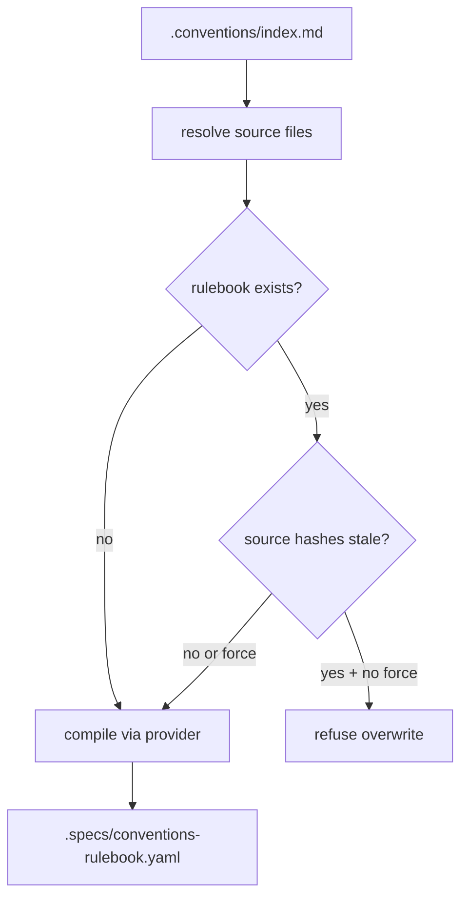
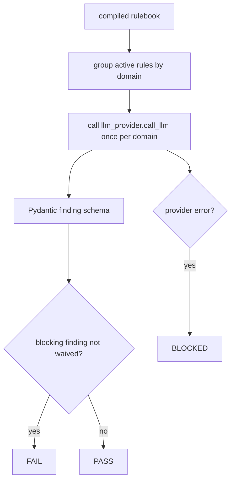
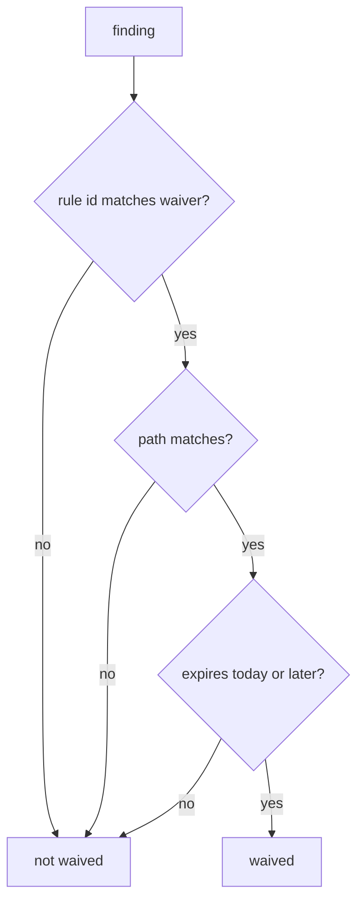

# Feature Spec: Conventions Rulebook Semantic

## Header

- **Feature:** Conventions Rulebook Semantic
- **Branch:** `main`
- **Date:** 2026-06-12
- **Status:** Implemented
- **Input:** Validated brief W-062-conventions-gates-8a73: compile a self-contained
  conventions rulebook with LLM assistance, then run Layer 4 semantic convention checks
  through direct provider calls.
- **Feature Number:** 062

## User Scenarios & Testing

### Story 1 - Compile a self-contained rulebook `P1`

As a LiveSpec maintainer, I want the conventions bundle compiled into a
self-contained rulebook, so semantic convention checks do not depend on hidden
agent memory or remote subagents.

```gherkin
Feature: Rulebook compilation
  Scenario: Compile a rulebook from configured convention sources
    Given a LiveSpec repository with .conventions/index.md
    And   convention source files under the configured AI resources root
    When  the user runs livespec conventions compile
    Then  LiveSpec writes .specs/conventions-rulebook.yaml
    And   the rulebook records every source path and content hash used
    And   the rulebook contains rules grouped by semantic domain

  Scenario: Refuse stale source hashes without force
    Given a compiled rulebook exists
    And   at least one recorded source file hash has changed
    When  the user runs livespec conventions compile without --force
    Then  the command exits without overwriting the rulebook
    And   the output says the rulebook is stale
```



### Story 2 - Run semantic Layer 4 checks `P1`

As a pipeline supervisor, I want semantic convention findings to be produced by
one direct LLM provider call per domain group, so the gate is auditable and does
not delegate verdict computation to an agent.

```gherkin
Feature: Semantic conventions engine
  Scenario: Blocking finding fails the semantic gate
    Given a compiled rulebook with a blocking rule in domain code-semantic
    And   the provider returns a finding for that rule
    When  the semantic conventions engine runs
    Then  LiveSpec returns verdict FAIL
    And   the finding is preserved in the result schema

  Scenario: Provider unavailable blocks the semantic gate
    Given the configured LLM provider is unavailable
    When  the semantic conventions engine runs
    Then  LiveSpec returns verdict BLOCKED
    And   no PASS or FAIL verdict is inferred from missing provider data
```



### Story 3 - Apply waivers deterministically `P1`

As a maintainer, I want waivers to suppress only matching, non-expired findings,
so temporary exceptions are explicit and cannot hide unrelated blocking rules.

```gherkin
Feature: Semantic convention waivers
  Scenario: Active waiver suppresses a matching blocking finding
    Given a rulebook waiver matching a rule id and file path
    And   the waiver expiry is in the future
    When  the provider returns the matching finding
    Then  LiveSpec records the finding as waived
    And   the final verdict ignores that finding for FAIL calculation

  Scenario: Expired waiver does not suppress a finding
    Given a waiver whose expiry date is before today
    When  the provider returns a matching finding
    Then  LiveSpec treats the finding as unwaived
    And   a blocking rule still fails the semantic gate
```



## Acceptance Criteria

- **AC-001:** `validator/conventions_rules.py` defines Pydantic models for source metadata,
  compiled rules, unenforceable rules, waivers, and the root rulebook.
- **AC-002:** The rulebook loader reads YAML from `.specs/conventions-rulebook.yaml` and rejects
  malformed roots before semantic execution.
- **AC-003:** The compile function resolves `.conventions/index.md` entries to source files and
  records each source path plus SHA-256 hash.
- **AC-004:** Rulebook compilation calls `validator/llm_provider.call_llm` directly and never
  invokes a subagent or agent CLI.
- **AC-005:** Rulebook compilation passes a structured JSON schema to the provider.
- **AC-006:** Rulebook compilation writes `.specs/conventions-rulebook.yaml` with ASCII-safe YAML.
- **AC-007:** Existing rulebooks are not overwritten when source hashes changed unless `--force`
  is provided.
- **AC-008:** `livespec conventions compile [--force]` and `livespec conventions semantic` are
  registered under the existing Typer `conventions` app.
- **AC-009:** `validator/conventions_engine_c.py` defines Pydantic models for provider findings
  and semantic gate results.
- **AC-010:** Engine C groups rules by domain and performs exactly one provider call per active
  domain group.
- **AC-011:** Engine C uses temperature `0` in the provider payload when the provider accepts it.
- **AC-012:** Engine C computes PASS, FAIL, or BLOCKED in Python code, never by trusting provider
  prose.
- **AC-013:** A finding tied to a rule with `blocking: true` makes the verdict FAIL unless a
  matching non-expired waiver applies.
- **AC-014:** Non-blocking findings are preserved but do not fail the gate.
- **AC-015:** Expired waivers never suppress findings.
- **AC-016:** Waivers match by rule id and optional path glob.
- **AC-017:** Provider unavailability returns BLOCKED with an actionable blocker message.
- **AC-018:** Invalid provider JSON returns BLOCKED rather than PASS or FAIL.
- **AC-019:** The provider prompt is self-contained: it includes rule text, source excerpts, and
  requested output schema context.
- **AC-020:** Tests cover rulebook extraction, waiver expiry, stale hash refusal, blocking and
  non-blocking findings, waiver application, and provider-down behavior.
- **AC-021:** New production modules remain below 500 lines each.
- **AC-022:** Source files implementing FRs include `@spec` anchors linking to this spec.
- **AC-023:** Engine C reads `review_model` from `.specs/semantic/config.yaml` or provider
  config, falls back to `claude-3-5-sonnet-latest`, and never uses the caller's implementation
  model for semantic review calls.

## Functional Requirements

- **FR-001:** Provide `validator/conventions_rules.py` with the rulebook Pydantic schema, path
  helpers, YAML loader, and compiler.
- **FR-002:** Resolve `.conventions/index.md` into concrete convention source files and hashes.
- **FR-003:** Compile the self-contained rulebook through direct `llm_provider.call_llm` calls.
- **FR-004:** Enforce stale-hash overwrite protection with `--force` as the only bypass.
- **FR-005:** Provide `validator/conventions_engine_c.py` with semantic finding/result schemas.
- **FR-006:** Batch Engine C provider calls by domain group, one call per domain.
- **FR-007:** Compute semantic verdicts in Python from blocking flags and waiver state.
- **FR-008:** Treat provider down or invalid provider JSON as BLOCKED.
- **FR-009:** Register `livespec conventions compile [--force]` and
  `livespec conventions semantic`.
- **FR-010:** Add focused pytest coverage for compiler, waivers, stale hashes, and Engine C.

## Key Entities

- `ConventionsRules`
- `RulebookSource`
- `CompiledConventionRule`
- `UnenforceableConventionRule`
- `ConventionWaiver`
- `SemanticFinding`
- `SemanticConventionsResult`

## Edge Cases

- `.conventions/index.md` exists but references a missing source file.
- Provider returns syntactically invalid JSON.
- Provider returns an unknown rule id.
- A waiver has no path glob and applies repository-wide to the matching rule id.
- A waiver expiry equals today's date and remains active for that date.
- A domain has no active rules and therefore produces no provider call.
- A rule is marked unenforceable and is skipped by Engine C.

## Success Criteria

- **SC-001:** `python3 -m pytest tests/test_conventions_compile.py tests/test_conventions_semantic.py -q`
  passes.
- **SC-002:** `ruff check validator/conventions_rules.py validator/conventions_engine_c.py tests/test_conventions_compile.py tests/test_conventions_semantic.py`
  passes.
- **SC-003:** `pyright validator/conventions_rules.py validator/conventions_engine_c.py` passes.

<!-- finalize:spec-implement:2026-06-12:3e197383 -->
