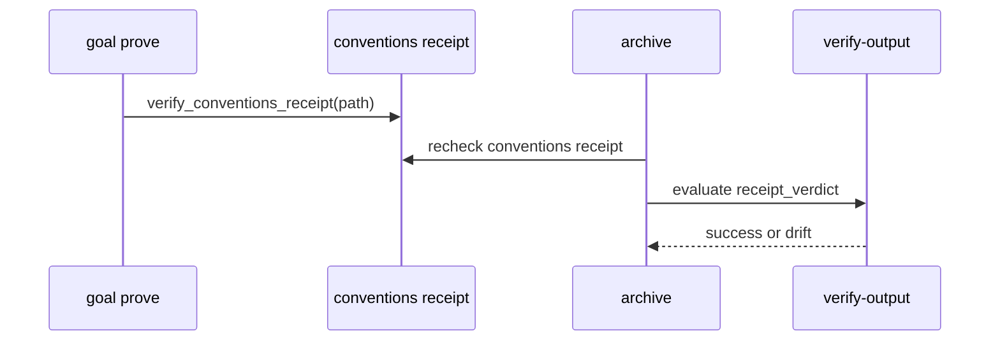
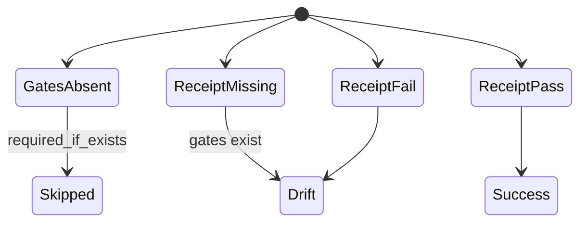

# Plan — Conventions Blocking Pipeline

## Summary

Wire conventions receipts into the command completion pipeline so final command success requires a fresh repo-scope conventions PASS.

## Technical Context

- Language: Python 3.12+
- Test runner: pytest
- Quality gates: ruff, ruff format, pyright
- Command docs: `.agent-sync/skills/*/{SKILL.md,expectations.md}` and `.agent-sync/agents/*/prompt.md`

## Constitution Check

- Keep new modules focused and below the line limit.
- Prefer typed dataclasses and pure helpers for diff/hash locks.
- Preserve existing command contracts and extend them through tests first.

## Gherkin Scenarios + Mermaid Sequence Diagrams

```gherkin
Feature: Conventions receipt verification
  Scenario: A command archives a PASS conventions receipt
    Given a goal task submits conventions_receipt_path
    When RunArtifact archiving re-verifies receipts
    Then the conventions receipt is marked verified
    And verify-output can require verdict PASS

  Scenario: A command archives a FAIL conventions receipt
    Given a verified conventions receipt has verdict FAIL
    When verify-output evaluates receipt_verdict PASS
    Then the artifact outcome is drift
```



## Mermaid State Diagrams



## Implementation Plan

1. Add the feature spec before code.
2. Add failing tests for receipt re-verification, artifact outcome, verify-output, goal proof, R7, diff/hash/fresh locks, and command docs.
3. Extend `validator/run_receipts.py` for conventions receipts.
4. Extend `validator/verify_output.py` and `validator/expectations.py` for `receipt_verdict`.
5. Extend `validator/goal_contracts.py` so gates-aware tasks require and verify `conventions_receipt_path`.
6. Add `validator/coherence/rules/r7_conventions_gates.py` and register it.
7. Add `validator/conventions_diffguard.py` for supervisor diff, hash, and fresh-run locks.
8. Update command expectations, command SKILLs, and verifier/supervisor prompts.
9. Run targeted tests, full tests, ruff, format check, and pyright.

## Testing Strategy

- Read and run [`tests/test_run_receipts.py`](../../../tests/test_run_receipts.py) for conventions receipt re-verification.
- Read and run [`tests/test_conventions_diffguard.py`](../../../tests/test_conventions_diffguard.py) for supervisor locks.
- Read and run [`tests/test_conventions_pipeline_docs.py`](../../../tests/test_conventions_pipeline_docs.py) for command documentation contracts.
- Re-run the full `pytest tests/ -x -q` suite.

## Risks & Considerations

- `validator/goal_contracts.py` is pre-existing large shared code; this plan limits edits to the conventions receipt proof path.
- The global test suite contains existing skipped tests; the feature-specific targeted tests add no skips.
