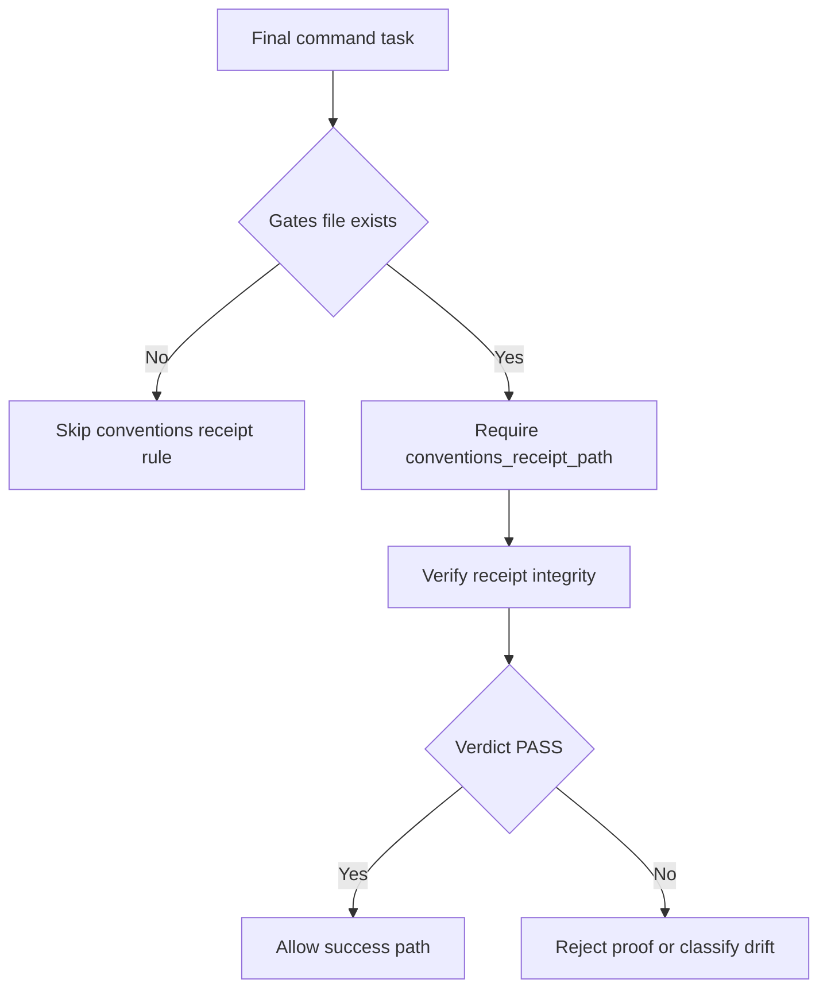
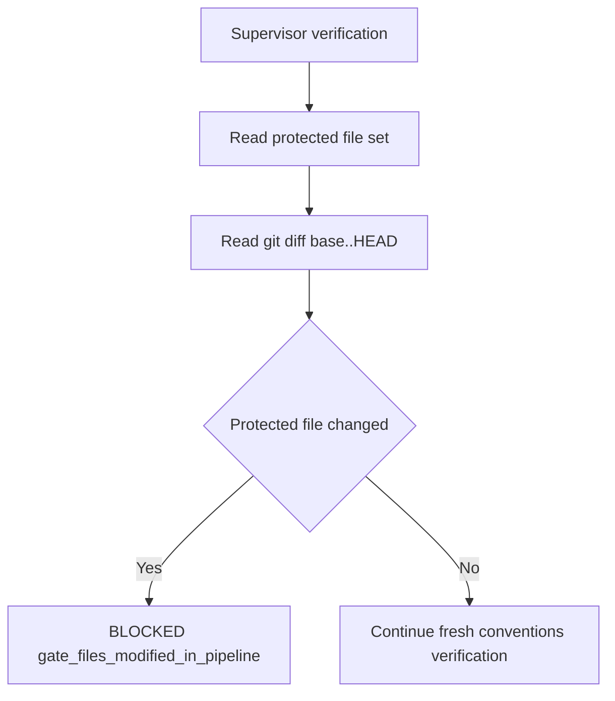
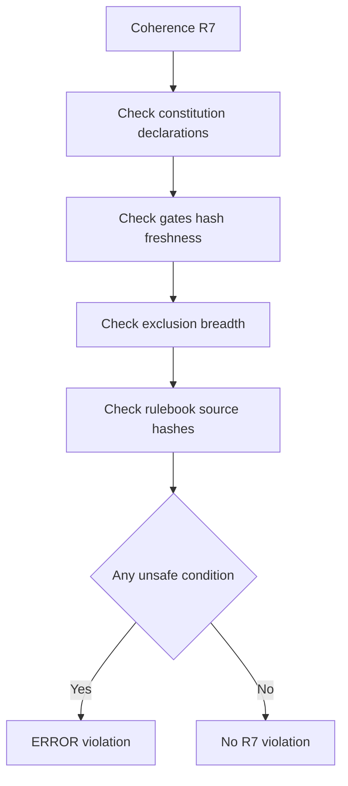

# Conventions Blocking Pipeline

Branch: main
Date: 2026-06-13
Status: Implemented
Input: Implement feature 063-conventions-blocking-pipeline so conventions gates become a hard repo-wide pipeline gate across run receipts, run artifacts, verify-output, goal contracts, command skills, agent prompts, coherence rules, and supervisor locks.

## User Scenarios & Testing

### P1 Story: Command runs cannot finish without a valid conventions PASS receipt

Priority reason: The conventions gate must be blocking for final implementation, test, and fix workflows, not advisory.

Independent test: A goal proof and archived run with a missing, FAIL, or BLOCKED conventions receipt is rejected or classified as drift/blocking; a PASS receipt is accepted.

```gherkin
Feature: Conventions receipt hard gate
  Scenario: Final task has a PASS conventions receipt
    Given the repository contains conventions gates
    And a final command task provides a conventions receipt path
    When the goal proof and run artifact are verified
    Then the conventions receipt is re-verified
    And the command outcome is allowed to pass

  Scenario: Final task has a non-PASS conventions receipt
    Given the repository contains conventions gates
    And a final command task provides a FAIL or BLOCKED conventions receipt
    When the goal proof and run artifact are verified
    Then the proof is rejected or the artifact outcome is drift
    And the command cannot report success
```



### P1 Story: Supervisor protects gate files from pipeline tampering

Priority reason: A worker must not pass by modifying gates, rulebooks, or declared linter configs during the same pipeline run.

Independent test: A git diff that touches protected gate files blocks the conventions supervisor with `gate_files_modified_in_pipeline`.

```gherkin
Feature: Protected conventions gate files
  Scenario: Pipeline modifies a protected gates file
    Given a base ref and HEAD diff include conventions-gates.yaml
    When the supervisor verifies conventions
    Then the supervisor returns BLOCKED
    And the reason is gate_files_modified_in_pipeline

  Scenario: Pipeline modifies only unprotected source files
    Given a base ref and HEAD diff excludes protected gates files
    When the supervisor verifies conventions
    Then the diff guard does not block the gate
```



### P1 Story: Coherence rules detect stale or unsafe conventions setup

Priority reason: Repo-wide conventions are only trustworthy if constitution, gates, exclusions, and rulebook sources remain coherent.

Independent test: R7 reports ERROR for missing/stale gates, broad exclusions, or stale source hashes.

```gherkin
Feature: Conventions coherence rules
  Scenario: Constitution declares conventions limits without gates
    Given the constitution declares conventions limits or linters
    And the gates file is absent or stale
    When coherence rules run
    Then R7 reports an ERROR

  Scenario: A conventions exclusion covers more than 30 percent of the repo
    Given the gates file excludes a pattern matching more than 30 percent of tracked files
    When coherence rules run
    Then R7 reports an ERROR
```



## Acceptance Criteria

- AC-001: Given run receipt verification receives `conventions_receipt_path`, When it classifies the evidence key, Then it recognizes kind `conventions` and verifies it with the conventions receipt oracle.
- AC-002: Given a verified conventions receipt has verdict `FAIL` or `BLOCKED`, When proof-chain verification evaluates it, Then it is not treated as proof-chain corruption but prevents success by producing drift or rejection.
- AC-003: Given verify-output evaluates `receipt_verdict` rules, When receipts are kind `conventions` or `visual`, Then it supports both kinds and skips conventions rules for unmigrated projects when gates are absent.
- AC-004: Given conventions gates exist, When final implement, test, or fix goal tasks are compiled, Then they require `conventions_receipt_path`.
- AC-005: Given `livespec goal prove` receives conventions evidence, When the receipt verdict is not `PASS`, Then it rejects that evidence.
- AC-006: Given command expectations are defined for spec-implement, spec-test, spec-fix, spec-feature, and spec-ship, When they declare receipt checks, Then they require a conventions `receipt_verdict` rule.
- AC-007: Given spec-implement, spec-test, or spec-fix reaches pre-`PHASE_RESULT` verification, When conventions verification runs, Then it uses `livespec conventions verify --json --feature <slug>` and repo-scope goals use explicit `--feature repo` rather than an implicit receipt from `verify --json`.
- AC-008: Given a skill emits `PHASE_RESULT`, When conventions verification completes, Then the output includes `extra.conventions_verdict` and a `FAIL` or `BLOCKED` verdict emits `PHASE_RESULT: BLOCKED - conventions_gate_failed`.
- AC-009: Given gates exist and a verifier or supervisor prompt observes a conventions gate failure, When it decides whether the run may continue, Then it treats the failure as blocking and forbids "pre-existing" as a skip justification.
- AC-010: Given the constitution declares conventions limits or linters, When R7 coherence rules find stale or missing gates, Then they report ERROR.
- AC-011: Given conventions exclusions are configured, When R7 coherence rules find an exclusion matching more than 30 percent of repo files, Then they report ERROR.
- AC-012: Given rulebook source hashes are recorded, When R7 coherence rules find them stale versus ai-ressources, Then they report ERROR.
- AC-013: Given a pipeline diff touches protected gate, rulebook, or declared linter config files, When the supervisor diff guard runs, Then it blocks the pipeline diff.
- AC-014: Given base branch gates/rules hashes are known, When current gates/rules hashes differ, Then the supervisor hash guard blocks.
- AC-015: Given a worker provides a conventions receipt, When the supervisor evaluates the gate, Then it gates on a fresh conventions verification result rather than the stale worker-provided receipt.

## Functional Requirements

- FR-001: Extend run receipt evidence keys with `conventions_receipt_path` mapped to receipt kind `conventions`.
- FR-002: Re-verify conventions receipts through `verify_conventions_receipt()` with feature scoping.
- FR-003: Classify non-PASS conventions receipt verdicts as gate failures that become drift, not proof-chain errors.
- FR-004: Add verify-output `receipt_verdict` rule evaluation over archived `receipts[]`.
- FR-005: Skip conventions `receipt_verdict` rules when conventions gates are absent from an unmigrated project.
- FR-006: Require and validate conventions receipt evidence in final command goal tasks when gates exist.
- FR-007: Update command expectations and skills so conventions verification is part of command definition of done.
- FR-008: Update verifier and supervisor prompts with blocking conventions gate semantics.
- FR-009: Add and register R7 conventions coherence rules.
- FR-010: Add diff, hash, and fresh re-execution supervisor locks for conventions gates.

## Key Entities

- Conventions receipt: Signed JSON receipt emitted by conventions verification.
- Protected gate file: Human-owned conventions gate, rulebook, or linter config file that cannot change inside a worker pipeline diff.
- Receipt verdict rule: Verify-output rule requiring a named receipt kind to have a specific verdict.
- R7 coherence rule: Repo health rule validating conventions gate setup consistency.

## Edge Cases

- EC-001: Projects without conventions gates skip conventions receipt rules instead of failing migration-incomplete repositories.
- EC-002: Unknown receipt kinds remain SKIP or invalid according to existing verify-output behavior.
- EC-003: Missing receipt paths in final tasks fail only when conventions gates exist.
- EC-004: Tampered conventions receipts still force proof-chain error through receipt verification failure.
- EC-005: Stale worker receipts cannot override a fresh supervisor BLOCKED verdict.

## Success Criteria

- SC-001: Targeted tests for each FR fail before implementation and pass after implementation.
- SC-002: `pytest tests/ -x -q` exits 0 with the accepted project skip baseline reported.
- SC-003: `ruff check .`, `ruff format --check .`, and `pyright` complete with zero errors.
