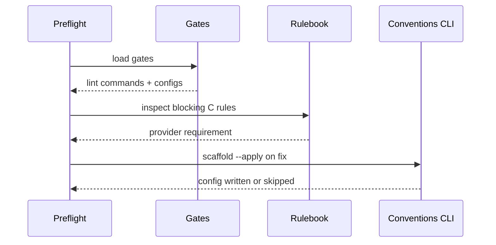
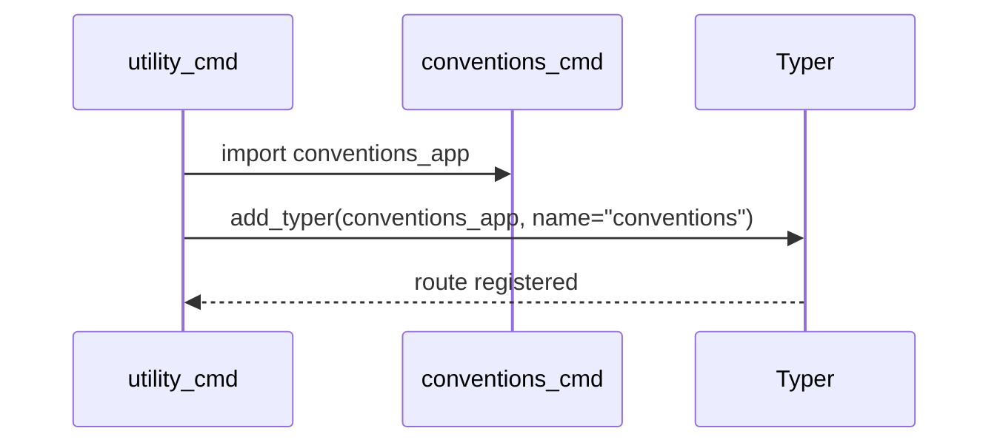

# Plan — Conventions Bootstrap Remediation

## Summary

Add conventions bootstrap remediation by deriving preflight checks from gates, rendering linter templates, documenting `/spec-fix --conventions`, and extracting conventions CLI routes to a dedicated module.

## Technical Context

- Language: Python 3.12+.
- CLI framework: Typer.
- Test framework: pytest.
- Existing modules: `validator/preflight_autofix.py`, `validator/cli_commands/utility_cmd.py`, `validator/conventions_gates.py`, `validator/conventions_rules.py`, `validator/conventions_gate.py`.
- New module: `validator/cli_commands/conventions_cmd.py`.
- New templates: `templates/conventions/python_ruff.toml.tmpl`, `templates/conventions/typescript_eslint.json.tmpl`.

## Constitution Check

- Keep command registration explicit and deterministic.
- Preserve existing CLI JSON contracts and exit code semantics.
- Avoid overwriting human-owned linter configs unless `--sync-limits` is explicitly requested.
- Add tests before each behavior change.
- Keep split modules below 400 lines.

## Gherkin Scenarios + Mermaid Sequence Diagrams

```gherkin
Feature: Conventions bootstrap preflight
  Scenario: Preflight derives checks from gates
    Given a project has conventions gates
    When preflight parses requirements
    Then binary, version, config, provider, and scaffold items are available

  Scenario: Fix mode runs scaffold
    Given a scaffold item is selected
    When preflight runs with fix enabled
    Then `livespec conventions scaffold --apply` is invoked
```



```gherkin
Feature: Conventions CLI split
  Scenario: Utility commands register conventions routes from another module
    Given `conventions_cmd.py` owns `conventions_app`
    When `utility_cmd.register()` runs
    Then the app adds `conventions_app` under `conventions`

  Scenario: Route behavior is preserved
    Given the split is complete
    When existing conventions commands run
    Then outputs and exit codes remain compatible
```



## Implementation Plan

1. Feature artifacts
   - Create `spec.md`, `plan.md`, `progress.md`, `implementation.md`, and `changelog.md`.
   - Update `.specs/README.md`, `.specs/roadmap.md`, and `.specs/changelog.md`.
2. Preflight TDD
   - Add tests in `tests/test_preflight_autofix.py` for gates-derived binary, version, config, provider, and scaffold items.
   - Implement conventions item discovery and scaffold installer execution in `validator/preflight_autofix.py`.
3. Scaffold TDD
   - Add tests in `tests/test_status_play_conventions_cli.py` for Python and TypeScript scaffold template rendering and non-overwrite behavior.
   - Add templates in `templates/conventions/`.
   - Update scaffold command implementation to detect stack and render templates using gates limits.
4. Spec-fix docs TDD
   - Add static tests for `--conventions` documentation in `tests/test_conventions_pipeline_docs.py`.
   - Update `.agent-sync/skills/spec-fix/SKILL.md` and paired expectations `last_reviewed`.
5. CLI split TDD
   - Add tests proving `utility_cmd.py` and `conventions_cmd.py` line counts and route preservation.
   - Move conventions app and subcommands to `validator/cli_commands/conventions_cmd.py`.
   - Keep `utility_cmd.py` importing and registering `conventions_app`.
6. Verification
   - Run targeted tests after each RED/GREEN cycle.
   - Run full pytest, ruff, format, pyright, and doctor before commit.

## Testing Strategy

- Unit tests for preflight item discovery and fix command construction.
- CLI tests through Typer `CliRunner` for scaffold behavior and route preservation.
- Static documentation tests for `/spec-fix --conventions`.
- File-size tests for dogfood remediation.
- Full suite after refactor to catch import and route regressions.

## Risks & Considerations

- `utility_cmd.py` extraction can accidentally change route names; tests must invoke the public CLI.
- Scaffold must not clobber human-owned configs.
- Rulebook schema may evolve; provider detection should be tolerant of absent or minimal rulebooks.
- `preflight_autofix.py` is already oversized; keep additions small and focused.
