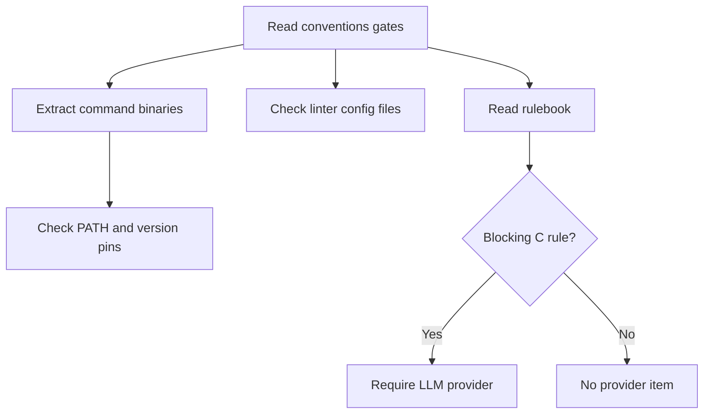
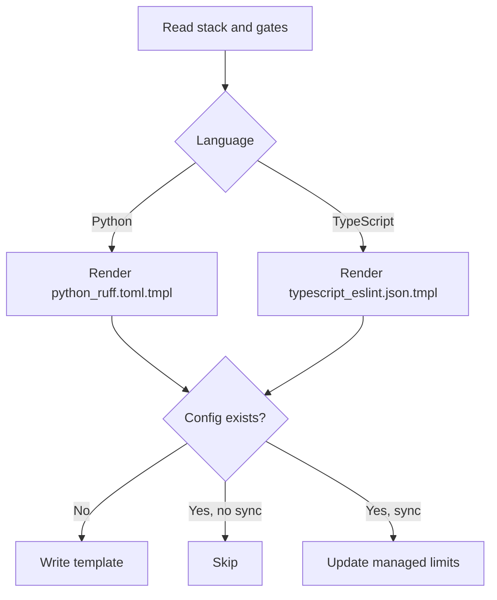
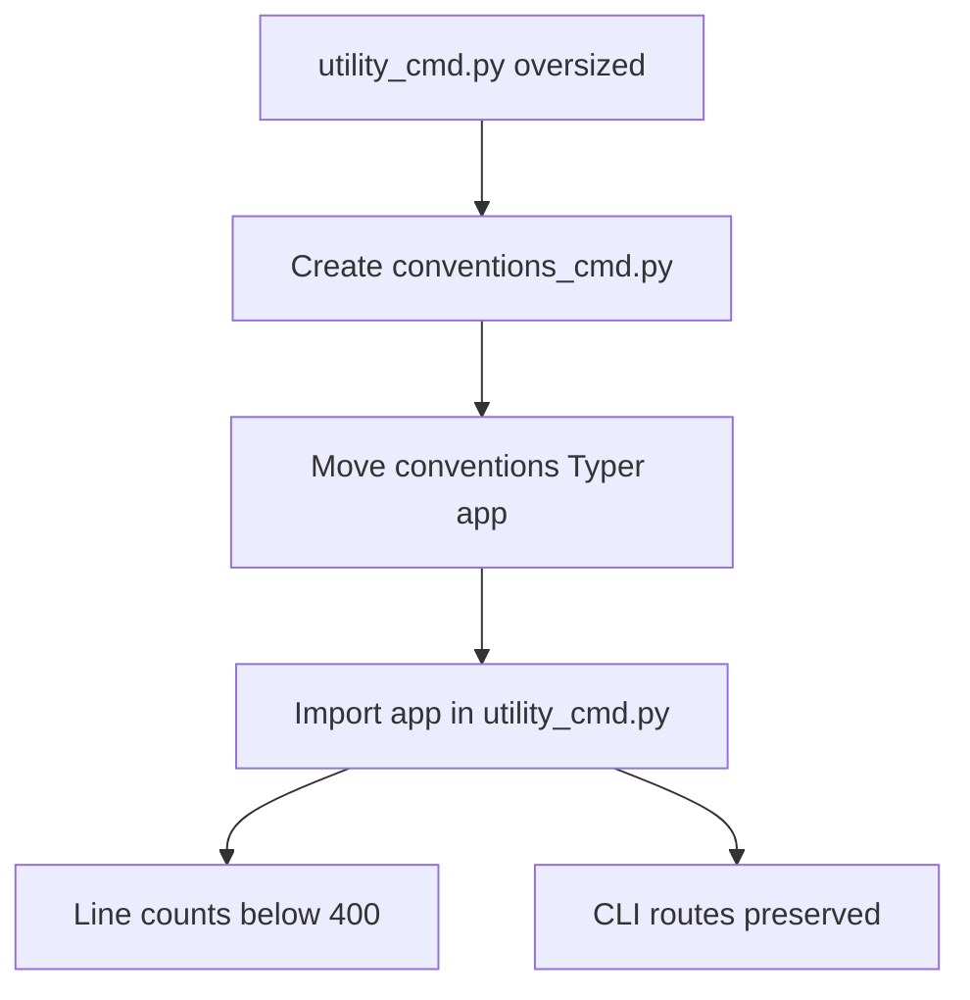

# Conventions Bootstrap Remediation

Branch: main
Date: 2026-06-13
Status: Implemented
Input: Implement conventions bootstrap remediation so existing projects can detect missing conventions tooling, scaffold linter config, run `/spec-fix --conventions`, and dogfood the line-limit remediation by splitting conventions CLI code out of `utility_cmd.py`.

## User Scenarios & Testing

### P1 Story: Existing projects get actionable conventions preflight

Priority reason: Conventions gates are blocking only when operators know which binaries, configs, providers, or scaffold steps are missing before autonomous work starts.

Independent test: A project with `.specs/conventions-gates.yaml` produces preflight items for declared linter binaries, version pins, config paths, blocking semantic providers, and scaffold actions.

```gherkin
Feature: Conventions preflight items
  Scenario: Gates file declares a linter command
    Given a project has conventions gates with a lint command and config file
    When preflight auto-fix parses project requirements
    Then the preflight items include the lint binary on PATH
    And the configured linter config path must exist

  Scenario: Blocking semantic rules require an LLM provider
    Given the conventions rulebook contains a blocking Engine C rule
    When preflight auto-fix parses project requirements
    Then the preflight items require an available LLM provider
```



### P1 Story: Scaffold fills missing linter configs without overwriting user config

Priority reason: Existing projects need a deterministic way to bootstrap conventions configs while preserving human-owned lint settings.

Independent test: `livespec conventions scaffold --apply` writes the right template for Python or TypeScript projects, uses gates limits, and refuses to overwrite an existing config unless `--sync-limits` is set.

```gherkin
Feature: Conventions scaffold templates
  Scenario: Python project lacks a Ruff config
    Given a Python stack and conventions gates with file and function limits
    When conventions scaffold runs with apply
    Then a Ruff config is written from the Python template
    And Ruff enables Pylint rules for function statement limits
    And the file line-count limit remains enforced by the LiveSpec gate

  Scenario: Existing config is human-owned
    Given a linter config already exists
    When conventions scaffold runs without sync-limits
    Then the command reports the config was skipped
    And the existing file content is unchanged
```



### P2 Story: `/spec-fix --conventions` repairs debt worst-first

Priority reason: Operators need a documented recovery path that burns down conventions debt instead of treating conventions failures as generic test failures.

Independent test: The `spec-fix` skill documents `--conventions`, debt loading or report regeneration, worst-first ordering, and the non-regression gate.

```gherkin
Feature: Conventions fix mode documentation
  Scenario: Operator asks for conventions remediation
    Given a conventions debt report exists
    When `/spec-fix --conventions` is invoked
    Then the command loads debt.json or reruns verify with report
    And it fixes the worst debt first

  Scenario: Remediation would add new debt
    Given a fix reduces one violation but adds another
    When the conventions gate compares before and after debt
    Then the command blocks because new violations are not allowed
```

```mermaid
flowchart TD
    A[/spec-fix --conventions] --> B{debt.json exists?}
    B -- Yes --> C[Load debt]
    B -- No --> D[Run verify --report]
    C --> E[Sort worst-first]
    D --> E
    E --> F[Apply focused fixes]
    F --> G{Debt strictly decreases and no new violations?}
    G -- Yes --> H[Continue]
    G -- No --> I[BLOCKED]
```

### P2 Story: LiveSpec dogfoods conventions limits by splitting the conventions CLI

Priority reason: The repo must prove that conventions remediation applies to LiveSpec itself by reducing oversized command modules.

Independent test: `utility_cmd.py` falls below 400 lines after extracting conventions commands to `conventions_cmd.py`, and both modules remain below 400 lines while all CLI routes still work.

```gherkin
Feature: Conventions CLI split
  Scenario: Utility command module is too large
    Given `utility_cmd.py` owns status, coverage, refresh, and conventions commands
    When conventions commands are extracted
    Then `utility_cmd.py` keeps only status, coverage, and wiring
    And `conventions_cmd.py` owns conventions subcommands

  Scenario: Existing conventions routes keep working
    Given the CLI split is complete
    When users run `livespec conventions verify`, `compile`, `semantic`, `scaffold`, `supervisor-gate`, or `gates init`
    Then the same Typer routes remain registered
```



## Acceptance Criteria

- AC-001: Projects with conventions gates produce preflight items for declared linter binaries.
- AC-002: Preflight checks enforce pinned linter version strings when gates declare a version.
- AC-003: Preflight checks enforce referenced linter config file existence.
- AC-004: Preflight checks require an LLM provider when the conventions rulebook contains blocking Engine C rules.
- AC-005: `preflight --fix` can execute conventions scaffold actions via `livespec conventions scaffold --apply`.
- AC-006: `templates/conventions/python_ruff.toml.tmpl` enables `PLR` for Ruff Pylint checks, renders `max-statements` from gates values, and does not map file line-count limits to Ruff `line-length`.
- AC-007: `templates/conventions/typescript_eslint.json.tmpl` renders ESLint max-lines and max-statements limits from gates values.
- AC-008: `conventions scaffold --apply` detects Python and TypeScript stacks and writes the appropriate config when missing.
- AC-009: `conventions scaffold --apply` never overwrites an existing config unless `--sync-limits` is set.
- AC-010: `spec-fix` documents `--conventions` as a valid flag with debt loading or report regeneration.
- AC-011: `spec-fix --conventions` documentation requires worst-first burn-down.
- AC-012: `spec-fix --conventions` documentation gates success on strictly decreasing debt and zero new violations.
- AC-013: Conventions CLI routes are extracted into `validator/cli_commands/conventions_cmd.py`.
- AC-014: `validator/cli_commands/utility_cmd.py` remains below 400 lines.
- AC-015: `validator/cli_commands/conventions_cmd.py` remains below 400 lines.
- AC-016: Existing conventions CLI routes keep working after the split.

## Functional Requirements

- FR-001: Extend preflight auto-fix item discovery with conventions gates-derived binary checks.
- FR-002: Validate declared conventions command versions when a gate command has `version`.
- FR-003: Validate declared conventions command config paths.
- FR-004: Detect blocking semantic rulebook rules and require an LLM provider.
- FR-005: Add a scaffold preflight item that runs `livespec conventions scaffold --apply`.
- FR-006: Add Python Ruff and TypeScript ESLint scaffold templates under `templates/conventions/`.
- FR-007: Render scaffold templates using gates `max_file_lines.limit` and `max_function_lines.limit`.
- FR-008: Detect scaffold language from stack markers and preserve existing configs unless `--sync-limits`.
- FR-009: Document `/spec-fix --conventions` behavior, ordering, and success gate.
- FR-010: Extract conventions CLI commands from `utility_cmd.py` into `conventions_cmd.py`.
- FR-011: Keep `utility_cmd.register()` wiring the conventions Typer app.
- FR-012: Preserve existing conventions subcommand behavior and JSON contracts.

## Key Entities

- Conventions preflight item: Auto-fix requirement derived from gates and rulebooks.
- Scaffold template: Language-specific linter config skeleton rendered with gates limits.
- Conventions debt: Debt report JSON written by `livespec conventions verify --report`.
- Conventions CLI module: Dedicated Typer command module for conventions routes.

## Edge Cases

- EC-001: Projects without gates do not receive conventions preflight items.
- EC-002: Existing linter configs are skipped by scaffold unless `--sync-limits` is set.
- EC-003: Missing rulebook does not require an LLM provider.
- EC-004: Unknown stacks skip scaffold with an actionable message instead of writing an arbitrary config.
- EC-005: CLI split must not change public command names or exit code semantics.

## Success Criteria

- SC-001: Targeted tests fail before implementation and pass after each module fix.
- SC-002: `python3 -m pytest tests/ -x -q` passes.
- SC-003: `ruff check .`, `ruff format --check .`, and `pyright` complete with zero errors.
- SC-004: `utility_cmd.py` and `conventions_cmd.py` are each below 400 lines.
