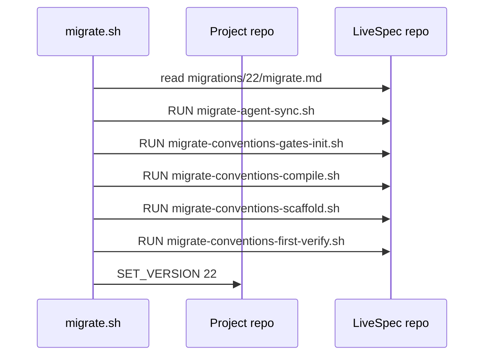

# Plan — Conventions Migration Docs

## Summary

Add static migration assets, documentation, and tests for conventions enforcement rollout in migration v22.

## Technical Context

- Language/runtime: Bash migration wrappers plus Markdown documentation.
- Test framework: pytest static filesystem checks.
- Existing patterns: `migrations/<N>/migrate.md` DSL with `RUN` and `SET_VERSION`; wrapper scripts take `<project-dir> <livespec-dir>`.
- Scope: Docs and migration assets only; no runtime verifier behavior changes.

## Constitution Check

- Specs remain source of truth: feature 065 artifacts are created before implementation.
- Tests are added before migration/docs implementation.
- Migration scripts are idempotent and no-op safe for partial project states.
- Documentation updates keep README, system template, and project agent instructions aligned.

## Gherkin Scenarios + Mermaid Sequence Diagrams

```gherkin
Feature: Migration v22 bootstrap
  Scenario: Migration runner executes conventions wrappers
    Given a project upgrades from a version below 22
    When migration v22 is applied
    Then agent assets sync
    And conventions gates, rulebook, scaffold, and first verify wrappers run
```



## Implementation Plan

1. Add RED pytest coverage for migration v22 manifest, executable scripts, and reference doc sections.
2. Create `migrations/22/migrate.md` with the requested DSL sequence.
3. Add four executable migration wrapper scripts under `scripts/`.
4. Create `system/conventions-enforcement.md` with engines, schemas, operations, locks, and CLI reference.
5. Update `README.md` with a `## Conventions Enforcement` section.
6. Update `system/spec-system.md` Quality Gates with repo-scope conventions PASS before implement/test/fix OK.
7. Update `CLAUDE.md` and `AGENTS.md` with conventions commands.
8. Update `.specs` registry/changelog and feature implementation mapping.
9. Run full verification and commit via the required commit skill path.

## Testing Strategy

- Static tests verify migration manifest and executable scripts.
- Static tests verify required sections in `system/conventions-enforcement.md`.
- Existing full test suite catches command/docs regressions.

## Risks & Considerations

- `livespec conventions verify --semantic-full` may be a future-facing flag; migration wrapper must follow the requested command and swallow its failure.
- Migration wrappers must run from the project root because downstream projects own `.specs/` and `.conventions/`.
- Documentation should distinguish first migration verification from later blocking pipeline gates.
