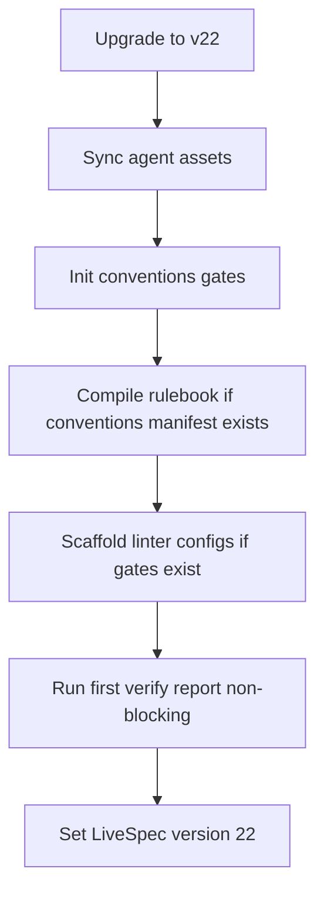
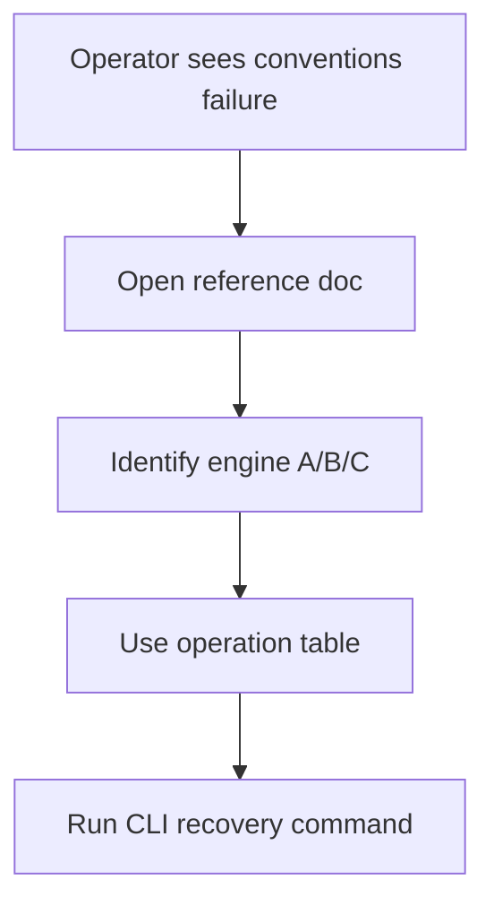
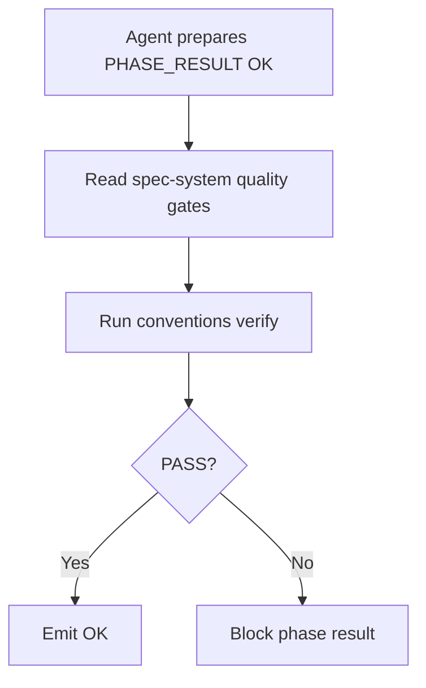

# Conventions Migration Docs

Branch: main
Date: 2026-06-13
Status: Implemented
Input: Add migration v22 for conventions bootstrap, a complete conventions enforcement reference document, and README/spec-system/CLAUDE guidance for conventions gates.

## User Scenarios & Testing

### P1 Story: Existing projects receive conventions bootstrap migration

Priority reason: Projects upgrading to the conventions gates pipeline need deterministic migration steps that install assets, initialize gates, compile rulebooks, scaffold linter configs, and record first verification debt without blocking migration.

Independent test: Migration v22 manifest includes the requested ordered steps, and every conventions migration wrapper script exists and is executable.

```gherkin
Feature: Migration v22 conventions bootstrap
  Scenario: Migration manifest wires every conventions step
    Given a LiveSpec project upgrades through migration v22
    When the migration runner reads `migrations/22/migrate.md`
    Then it runs agent-sync refresh, gates init, compile, scaffold, and first verify wrappers
    And it sets the project version to 22 after every wrapper has completed

  Scenario: First conventions verify records debt without blocking migration
    Given the upgraded project has conventions debt
    When the first verify wrapper runs conventions verification
    Then the wrapper exits successfully
    And the next pipeline run remains responsible for blocking on the conventions gate
```



### P1 Story: Operators can understand conventions enforcement

Priority reason: Conventions are now blocking pipeline gates; humans need one reference explaining engines, files, bypass locks, operating procedures, and CLI commands.

Independent test: `system/conventions-enforcement.md` exists and contains the required architecture, human operations, anti-bypass locks, and CLI reference sections.

```gherkin
Feature: Conventions enforcement reference
  Scenario: Operator reads the reference doc
    Given conventions gates are blocking pipeline completion
    When an operator opens `system/conventions-enforcement.md`
    Then the document explains engines A, B, and C
    And it documents gates and rulebook schemas
    And it lists human operations, anti-bypass locks, and CLI commands
```



### P2 Story: LiveSpec command docs surface conventions gates

Priority reason: Agents and humans need the gate requirement in the primary README, spec-system quality gates, and project agent instruction files.

Independent test: README, `system/spec-system.md`, and project agent docs mention repo-scope conventions verification before successful implement/test/fix phase results.

```gherkin
Feature: Conventions gate documentation
  Scenario: Agent prepares to emit a phase result
    Given an implement, test, or fix command is about to report success
    When the agent reads the LiveSpec system docs
    Then it sees that `livespec conventions verify` must PASS at repo scope
    And pre-existing debt is not an exemption
```



## Acceptance Criteria

- AC-001: `migrations/22/migrate.md` exists and sets `SET_VERSION 22` after every `RUN` instruction.
- AC-002: Migration v22 runs `migrate-agent-sync.sh`, `migrate-conventions-gates-init.sh`, `migrate-conventions-compile.sh`, `migrate-conventions-scaffold.sh`, and `migrate-conventions-first-verify.sh`.
- AC-003: `scripts/migrate-conventions-gates-init.sh` exists, is executable, uses `set -euo pipefail`, and runs `livespec conventions gates init --force || true` as a no-error migration wrapper.
- AC-004: `scripts/migrate-conventions-compile.sh` exists, is executable, uses `set -euo pipefail`, and only runs `livespec conventions compile --force || true` when `.conventions/manifest.yaml` exists.
- AC-005: `scripts/migrate-conventions-scaffold.sh` exists, is executable, uses `set -euo pipefail`, and only runs `livespec conventions scaffold --apply || true` when the gates file exists.
- AC-006: `scripts/migrate-conventions-first-verify.sh` exists, is executable, uses `set -euo pipefail`, runs `livespec conventions verify --report || true`, and always exits 0.
- AC-007: `system/conventions-enforcement.md` documents the three engines: A deterministic subprocess, B visual receipt, and C Layer 4 LLM review.
- AC-008: `system/conventions-enforcement.md` documents `conventions-gates.yaml` and conventions rulebook schema responsibilities.
- AC-009: `system/conventions-enforcement.md` includes human operation guidance for constitution changes, ai-ressources changes, false-positive waivers, linter config, adding languages, and dirty project recovery.
- AC-010: `system/conventions-enforcement.md` includes a table of 10 anti-bypass locks.
- AC-011: `system/conventions-enforcement.md` includes a CLI reference for conventions verify, supervisor-gate, compile, scaffold, and gates init.
- AC-012: `README.md` has a `## Conventions Enforcement` section linking to the reference doc.
- AC-013: `system/spec-system.md` Quality Gates require a repo-scope `livespec conventions verify` PASS before `PHASE_RESULT: OK` for implement, test, and fix, with no pre-existing exemption.
- AC-014: `CLAUDE.md` documents `/spec-feature`, `/spec-fix --conventions`, `livespec conventions verify`, and `livespec conventions supervisor-gate`.

## Functional Requirements

- FR-001: Ship migration v22 manifest and wrapper scripts.
- FR-002: Ensure conventions migration wrappers are idempotent or no-op safe.
- FR-003: Add the conventions enforcement reference document.
- FR-004: Update README with primary conventions enforcement guidance.
- FR-005: Update the LiveSpec system quality gate template with repo-scope conventions receipt requirements.
- FR-006: Update project agent instructions with the conventions commands needed by humans and agents.

## Edge Cases

- EC-001: Projects without `.conventions/manifest.yaml` skip rulebook compilation.
- EC-002: Projects without `.specs/conventions-gates.yaml` skip scaffold and first verify setup steps that require gates.
- EC-003: First verify failures do not fail migration; pipeline gates enforce debt on later command runs.
- EC-004: Migration scripts may be rerun without failing existing projects.

## Success Criteria

- SC-001: New tests fail before implementation and pass after implementation.
- SC-002: Migration v22 scripts are executable.
- SC-003: `python3 -m pytest tests/ -x -q`, `ruff check .`, `ruff format --check .`, and `pyright` pass before commit.
