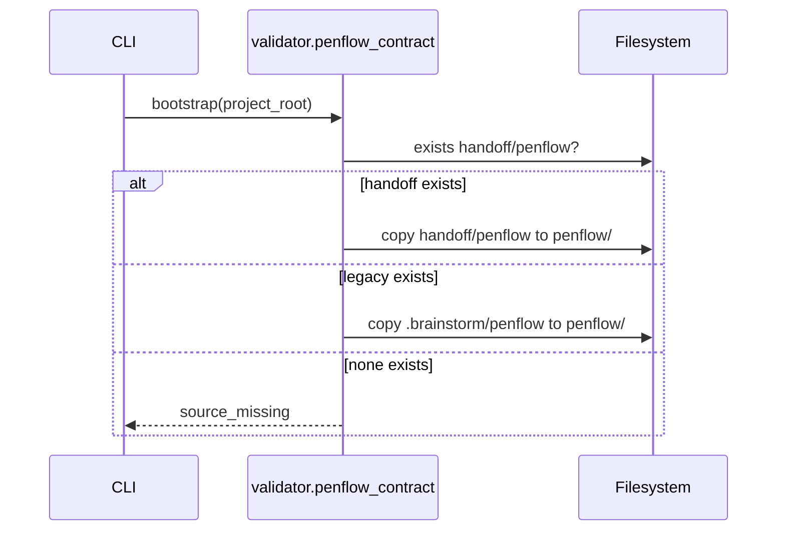

# Technical Plan: Handoff Input Compatibility

## Summary

Add handoff-first input resolution at LiveSpec import boundaries while keeping root LiveSpec contracts stable.

**Feature:** Handoff Input Compatibility
**Spec:** `.specs/features/066-handoff-input-compatibility/spec.md`
**Date:** 2026-06-15
**Status:** Approved

## Technical Context

| Aspect | Choice | Reason |
|---|---|---|
| Language | Python + Markdown command contracts | Existing validator and skills surface |
| Testing | Pytest static contract tests + unit tests | Existing repo pattern |
| Platform | CLI / agent skills | Change affects import and sync boundaries |

## Constitution Check

- [x] Simplicity: boundary-only changes, no internal workspace move.
- [x] Separation: `handoff/` stays import source; `penflow/` remains internal workspace.
- [x] Explicit: source order is documented and tested.
- [x] Testing: new RED tests cover source preference, duplicate scan, and command docs.
- [x] Naming: new feature directory uses kebab-case.

## Sequence Diagrams

```gherkin
Feature: Penflow bootstrap source resolution
  Scenario: Default source resolution
    Given no explicit source is passed
    When LiveSpec bootstraps the Penflow workspace
    Then it checks `handoff/penflow`
    And falls back to `.brainstorm/penflow`
```



## Implementation Plan

1. Add failing tests in `tests/test_penflow_contract.py` for handoff-first bootstrap and duplicate `.pen` ignore.
2. Add failing command contract tests in `tests/test_penflow_contract_command_contract.py`.
3. Update `validator/penflow_contract.py` with `HANDOFF_PENFLOW_DIR`, handoff-first default source resolution, and duplicate scan ignore for `handoff/`.
4. Update `.agent-sync/skills/spec-init/SKILL.md`, `.agent-sync/skills/spec-refresh-from-brainstorm/SKILL.md`, and expectations.
5. Update LiveSpec feature docs, registry, and roadmap.
6. Run targeted tests, then broader relevant validation.

## Testing Strategy

- `pytest tests/test_penflow_contract.py tests/test_penflow_contract_command_contract.py -q`
- `ruff check .`
- `pyright`
- `pytest tests/ --ignore=tests/integration -q` if time allows.

## Risks & Considerations

- Ignoring all `.pen` files under `handoff/` is intentional because `handoff/` is an import container, not the LiveSpec canonical Penflow workspace.
- The actual `/spec-refresh-from-brainstorm` implementation is currently a skill contract, so this feature updates command instructions and expectations rather than Python runtime code.
