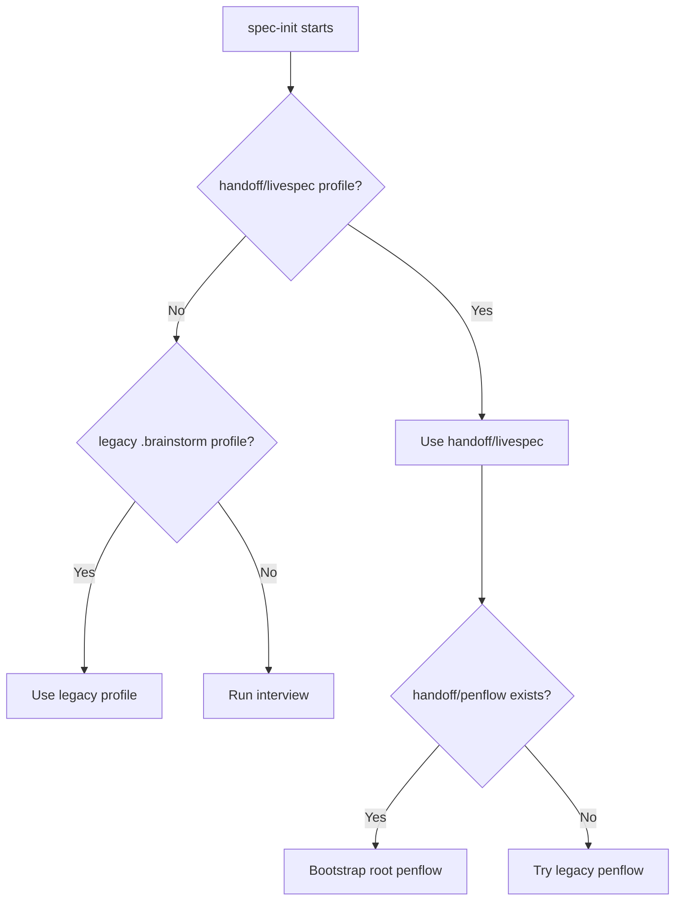
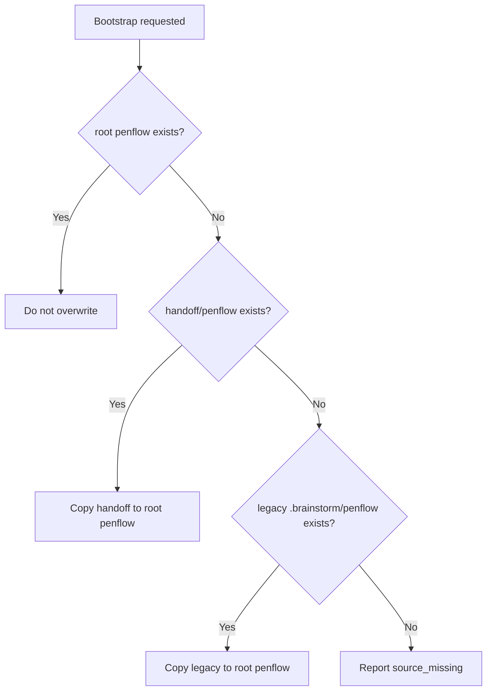
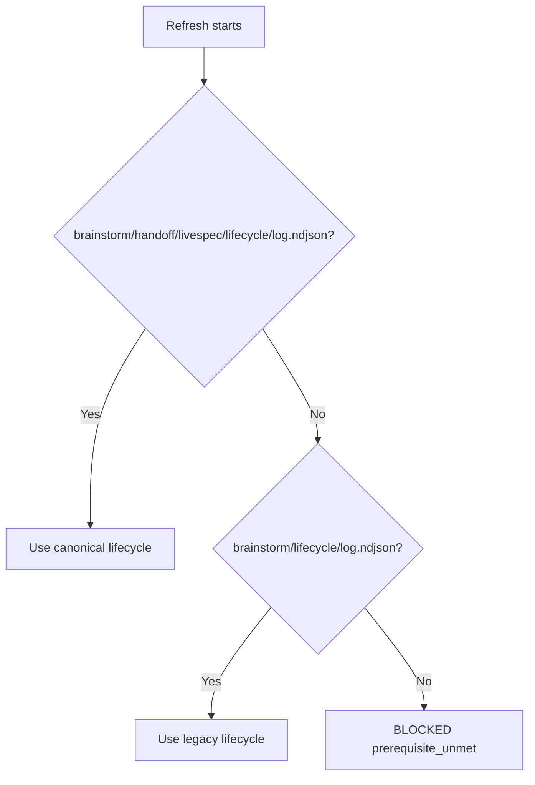

# Handoff Input Compatibility

Branch: main
Date: 2026-06-15
Status: Implemented
Input: Multi-repo handoff-structure-alignment mission requires LiveSpec to consume Project Brainstorm outputs under `handoff/` while preserving legacy inputs.

## User Scenarios & Testing

### P1 Story: Initialize LiveSpec from canonical Brainstorm handoff

Priority reason: New Project Brainstorm projects must not need `.brainstorm/` compatibility folders to initialize LiveSpec.

Independent test: Command contract tests confirm `/spec-init` documents `handoff/livespec` and `handoff/penflow` as preferred inputs.

```gherkin
Feature: Handoff-first spec init
  Scenario: Canonical brainstorm handoff exists
    Given a Brainstorm project exposes `handoff/livespec/project-profile.md`
    And it exposes `handoff/penflow/`
    When `/spec-init` resolves Brainstorm imports
    Then it prefers the `handoff/` paths
    And it keeps legacy `.brainstorm/` and root `penflow/` fallbacks
```



### P1 Story: Bootstrap Penflow without duplicate source failure

Priority reason: A LiveSpec project may keep `handoff/penflow/ui.pen` as an import source after copying to root `penflow/ui.pen`; status must not fail on that source duplicate.

Independent test: `test_bootstrap_prefers_handoff_penflow_before_legacy_brainstorm` and `test_status_ignores_handoff_penflow_source_duplicate_after_import`.

```gherkin
Feature: Penflow handoff bootstrap
  Scenario: Canonical and legacy sources both exist
    Given `handoff/penflow/semantic-ui-tree.json` exists
    And `.brainstorm/penflow/semantic-ui-tree.json` exists
    When LiveSpec bootstraps the Penflow workspace without an explicit source
    Then it copies from `handoff/penflow`

  Scenario: Handoff source remains after import
    Given root `penflow/ui.pen` exists
    And source `handoff/penflow/ui.pen` also exists
    When LiveSpec checks the Penflow contract status
    Then the handoff source `.pen` is ignored as an external import source
```



### P2 Story: Refresh Brainstorm lifecycle from canonical handoff

Priority reason: Brainstorm lifecycle sync should follow the same handoff convention as the import artifacts.

Independent test: `test_spec_refresh_from_brainstorm_resolves_handoff_lifecycle_first`.

```gherkin
Feature: Handoff lifecycle refresh
  Scenario: Canonical lifecycle exists
    Given `brainstorm/handoff/livespec/lifecycle/log.ndjson` is readable
    When `/spec-refresh-from-brainstorm` resolves the lifecycle directory
    Then it uses the canonical lifecycle before `brainstorm/lifecycle`
```



## Acceptance Criteria

- AC-001: `/spec-init` documents `handoff/livespec/project-profile.md`, `handoff/livespec/*.md`, `handoff/livespec/mockups/`, and `handoff/livespec/theme.css` as preferred Brainstorm import inputs.
- AC-002: `/spec-init` documents `handoff/penflow` as the preferred Penflow bootstrap source and `<brainstorm-project>/penflow` as legacy fallback.
- AC-003: `bootstrap_penflow_workspace()` prefers `handoff/penflow` over `.brainstorm/penflow` when no explicit source is passed.
- AC-004: `get_penflow_contract_status()` ignores `.pen` files under `handoff/` when checking duplicate Penflow sources.
- AC-005: `/spec-refresh-from-brainstorm` resolves `brainstorm/handoff/livespec/lifecycle/` before legacy `brainstorm/lifecycle/`.
- AC-006: All legacy paths remain documented or implemented as fallbacks.

## Functional Requirements

- FR-001: Resolve Brainstorm LiveSpec import documentation as handoff-first with legacy `.brainstorm` fallback.
- FR-002: Resolve Penflow bootstrap source as `handoff/penflow` before legacy `.brainstorm/penflow`.
- FR-003: Treat `handoff/` as an external import container during duplicate `.pen` checks.
- FR-004: Resolve Brainstorm lifecycle documentation as canonical `handoff/livespec/lifecycle` before legacy lifecycle.
- FR-005: Preserve root `penflow/`, `.specs/`, and `.mockup-validation/` as LiveSpec internal contracts.

## Edge Cases

- EC-001: Explicit `--source` still overrides default source resolution.
- EC-002: Existing root `penflow/` remains non-destructive and is never overwritten.
- EC-003: If no handoff or legacy source exists, bootstrap reports `source_missing`.

## Success Criteria

- SC-001: New tests fail before implementation and pass after implementation.
- SC-002: Targeted Penflow contract and command contract tests pass.
- SC-003: Ruff, Pyright, and relevant pytest suites pass or blockers are reported.
