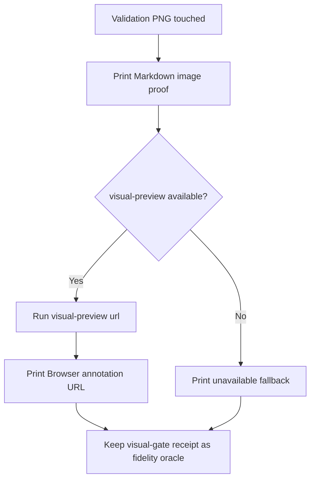

# Plan — Visual Preview Proof Publishing

## Summary

Add presentation-proof contracts to LiveSpec visual skills while leaving `validator.visual_gate` receipt semantics unchanged.

## Technical Context

- Project type: Python CLI plus Markdown skill contracts.
- Runtime change: none; text-contract implementation only.
- Test framework: `pytest` with focused contract assertions.
- Lint/format: `ruff`.

## Constitution Check

- Spec-first: Feature 067 records the behavior before modifying skills/tests.
- Traceability: Modified files carry `@spec` anchors to this feature.
- Determinism: Contracts require exact output strings for Markdown proof, CLI registration, annotation URL, fallback marker, and receipt path.

## Implementation Plan

1. Update `$spec-test` with a shared Visual Proof Publishing rule and execution-task/DoD hooks.
2. Update `$spec-feature` Test PHASE_RESULT schema, Phase 3.5 runtime evidence gate, and Phase 3.6 visual gate.
3. Update `$spec-fix` visual analysis and verification paths so mockup, baseline, runtime, and diff PNGs are published.
4. Update command expectation docs and README Visual Gate docs.
5. Add text-contract regression coverage to `tests/test_visual_implementation_gate.py`.

## Testing Strategy

- `pytest tests/test_visual_implementation_gate.py -q`
- `pytest tests/test_goal_contracts.py -q`
- `ruff check tests/test_visual_implementation_gate.py`
- `ruff format --check tests/test_visual_implementation_gate.py`

## Risks & Considerations

- `visual-preview` is a human proof channel only; do not move it into receipt validation.
- Missing `visual-preview` should be visible but non-fatal when Markdown proof and visual-gate receipt exist.
- Browser preview URLs are local-only and should not become canonical receipt data.
