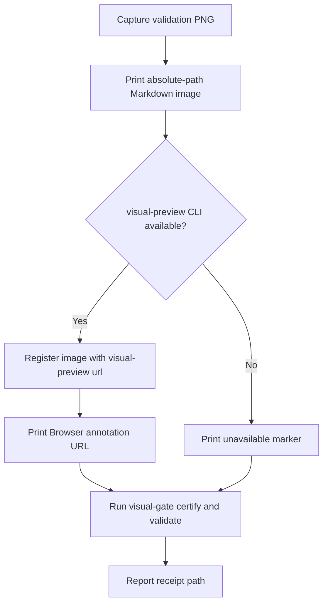
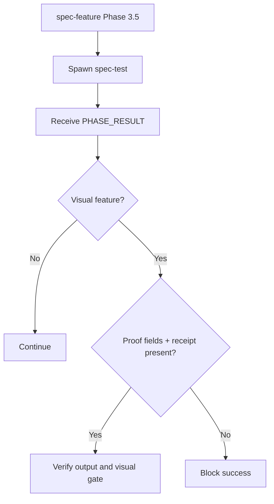
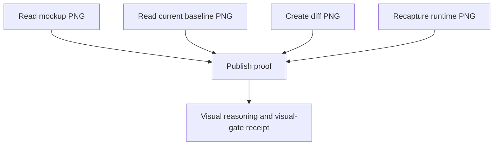

# Visual Preview Proof Publishing

Branch: main
Date: 2026-06-25
Status: Implemented
Input: Publish every LiveSpec validation PNG in both terminal-rendered Markdown and Browser preview while preserving `livespec visual-gate` receipts as the fidelity oracle.

## User Scenarios & Testing

### P1 Story: Inspect captured visual proof immediately

Priority reason: UI workflow success must be auditable by humans without hunting through run folders.

Independent test: Contract tests assert `$spec-test` requires Markdown image output, `visual-preview url`, Browser annotation URL, fallback text, and `visual_evidence_receipt_path`.

```gherkin
Feature: Runtime screenshot proof
  Scenario: Visual workflow captures a PNG
    Given `/spec-test` captures or approves a runtime PNG
    When it reports visual evidence
    Then it prints ``
    And it runs `visual-preview url /absolute/path/to/image.png`
    And it prints `Open for annotation: http://127.0.0.1:<port>/i/<id>`
    And it still reports `visual_evidence_receipt_path`
```



### P1 Story: Supervisor blocks UI success without published proof

Priority reason: `$spec-feature` delegates screenshots to `$spec-test`; the parent must not report UI success from a receipt alone when the human proof channel is absent.

Independent test: Contract tests assert `$spec-feature` requires child PHASE_RESULT visual proof fields plus the receipt path.

```gherkin
Feature: Feature supervisor proof enforcement
  Scenario: Child test succeeds for a UI feature
    Given `/spec-test` returns `PHASE_RESULT: OK`
    And the feature is visual
    When `/spec-feature` verifies Phase 3.5 and Phase 3.6
    Then it requires visual proof Markdown lines
    And it requires Browser annotation URLs or the unavailable marker
    And it requires `visual_evidence_receipt_path`
```



### P1 Story: Fix validation exposes every touched image

Priority reason: Visual fixes compare multiple PNGs; operators need to annotate mockup, baseline, new capture, and diff images.

Independent test: Contract tests assert `$spec-fix` requires publication for every validation PNG it touches.

```gherkin
Feature: Visual fix proof publishing
  Scenario: Visual fix compares images
    Given `/spec-fix` reads a mockup PNG
    And it reads a current baseline PNG
    And it creates a diff or recaptured runtime PNG
    When it reasons about the visual fix
    Then each PNG is published through Markdown image output
    And each PNG is registered with `visual-preview url` when available
```



## Acceptance Criteria

- AC-001: `$spec-test` requires every captured, approved, compared, or displayed validation PNG to be printed as ``.
- AC-002: `$spec-test` requires `visual-preview url /absolute/path/to/image.png` and `Open for annotation: http://127.0.0.1:<port>/i/<id>` for every published PNG when the CLI is available.
- AC-003: `$spec-feature` requires UI `$spec-test` PHASE_RESULT output to include visual proof Markdown, preview URL or unavailable status, and `visual_evidence_receipt_path` before UI success.
- AC-004: `$spec-fix` requires visual proof publication for mockup PNGs, current baselines, newly recaptured runtime PNGs, and diff PNGs.
- AC-005: Command expectations and README Visual Gate docs distinguish fidelity receipt proof from human-visible/annotable proof.
- AC-006: Missing `visual-preview` emits `Visual preview: unavailable - visual-preview CLI missing`, keeps Markdown image proof, and never forges a URL.
- AC-007: `visual_evidence_receipt_path` remains required as the only pixel-fidelity proof accepted by `goal prove`.

## Functional Requirements

- FR-001: Define a shared Visual Proof Publishing rule in `$spec-test` for validation PNG Markdown proof, `visual-preview url`, annotation URL, and unavailable fallback.
- FR-002: Enforce proof publication in `$spec-feature` Phase 3.5 and Phase 3.6 for visual child-test success.
- FR-003: Enforce proof publication in `$spec-fix` visual analysis and verification paths for every validation PNG it touches.
- FR-004: Document proof-channel semantics in command expectations and README Visual Gate docs.
- FR-005: Preserve `livespec visual-gate` receipt semantics and `visual_evidence_receipt_path` as the fidelity oracle.
- FR-006: Add text-contract regression coverage for `$spec-feature`, `$spec-test`, and `$spec-fix`.

## Edge Cases

- EC-001: `visual-preview` missing from PATH must not block receipt-based visual fidelity by itself.
- EC-002: Browser annotation URLs must be local `127.0.0.1` URLs and must not be written into canonical receipt files.
- EC-003: Relative image paths do not satisfy the proof contract; Markdown and `visual-preview` commands must use absolute paths.

## Success Criteria

- SC-001: Focused visual implementation gate tests pass.
- SC-002: Goal contract tests remain green.
- SC-003: Ruff check and format check pass for the modified Python test.
