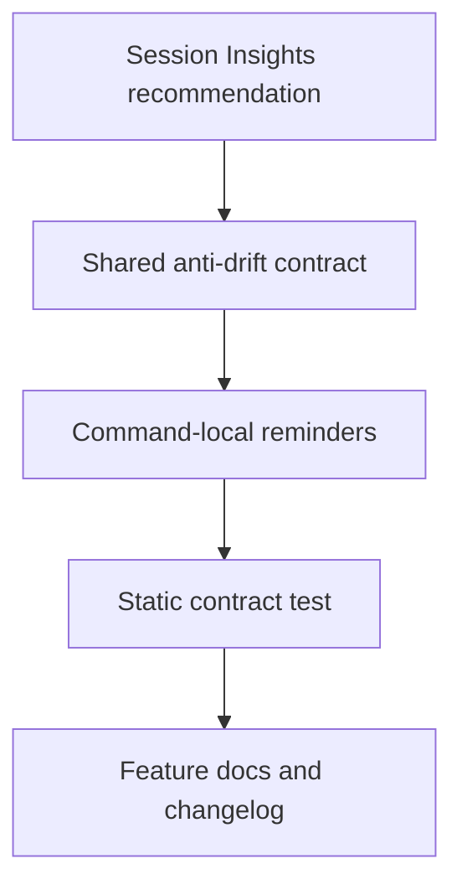

# Plan — Evidence-First Retry Contract

## Summary

Document and test a shared retry proof contract for LiveSpec command executors, using Session Insights W26 recommendations as source evidence.

## Technical Context

- Project type: Python CLI plus Markdown skill contracts.
- Runtime change: none; this is a command-contract documentation change.
- Test framework: `pytest` static contract assertions.
- Lint/format: `ruff`.

## Constitution Check

- Spec-first: Feature 068 records the behavior before final verification.
- Traceability: Modified docs and tests map to FR/AC through `implementation.md`.
- Determinism: The retry fields are exact strings, so tests can detect drift.

## Implementation Plan

1. Add failing static test covering the shared contract and command-local reminders.
2. Add `Evidence-first retry contract` to `system/anti-drift-block.md`.
3. Add `STEP 0.8 — Evidence-First Retry Contract` to `spec-check`, `spec-feature`, `spec-fix`, `spec-implement`, `spec-plan`, and `spec-test`.
4. Create Feature 068 artifacts and update the global registry files.
5. Run focused tests and lint for touched files.

## Testing Strategy

- `python3 -m pytest tests/test_conventions_pipeline_docs.py::test_evidence_first_retry_contract_is_documented_for_goal_locked_commands -q`
- `python3 -m pytest tests/test_conventions_pipeline_docs.py -q`
- `ruff check tests/test_conventions_pipeline_docs.py`

## Risks & Considerations

- This does not change retry execution code; it standardizes the agent command contract.
- Existing dirty worktree changes in conventions features are preserved and not reverted.
- The shared contract avoids adding new command flags or CLI APIs.
