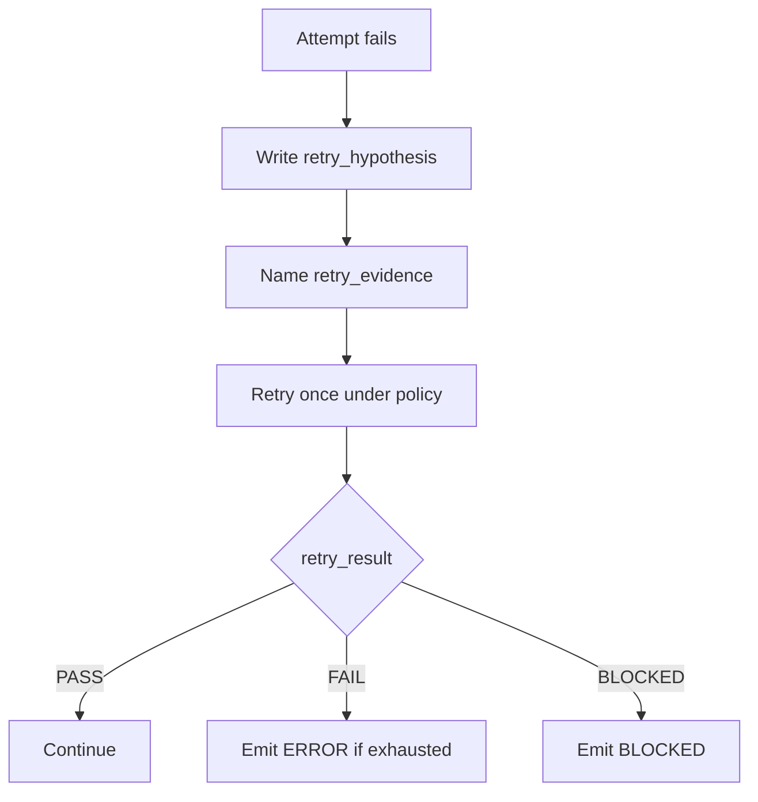
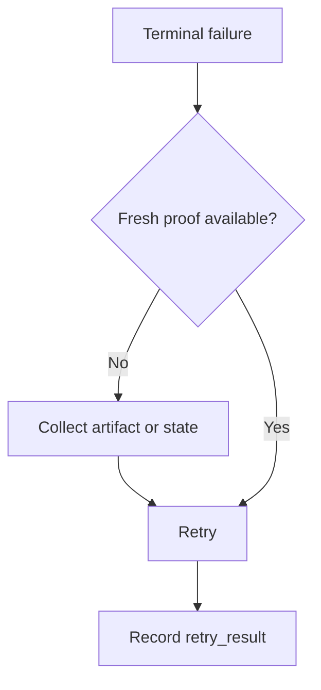

# Evidence-First Retry Contract

Branch: conventions-receipt-contract-77a1-c2
Date: 2026-06-26
Status: Implemented
Input: Session Insights W26 recommendations `RECO-d050eca4` and `RECO-651223e4` showed repeated `debug_sans_preuve` and `write_stdin` retry streaks in LiveSpec command work. Agents need a shared hypothesis -> evidence -> retry contract before repeating failed commands.

## User Scenarios & Testing

### P1 Story: Retry only after a concrete hypothesis and proof target

Priority reason: Repeating the same failing command without a new proof target causes noisy sessions, lost time, and unclear post-mortems.

Independent test: Static contract tests assert the shared anti-drift block defines `retry_hypothesis`, `retry_evidence`, and `retry_result`, and command skills expose the same fields.

```gherkin
Feature: Evidence-first retry
  Scenario: A command fails once
    Given a LiveSpec command step runs a tool or subprocess
    And the attempt fails
    When the executor retries the action
    Then it records `retry_hypothesis`
    And it records `retry_evidence`
    And after the retry it records `retry_result`
```



### P1 Story: Terminal and polling failures do not reuse stale evidence

Priority reason: Session Insights surfaced `write_stdin` and screen/poll retry streaks. These are especially prone to stale prompt or scrollback evidence.

Independent test: The shared contract names `write_stdin` and requires fresh observable evidence before retry.

```gherkin
Feature: Terminal retry evidence
  Scenario: Terminal interaction fails
    Given `write_stdin` or a terminal poll fails
    When the executor prepares a retry
    Then the retry evidence names a fresh artifact, state file, timestamp, or screen region
    And the executor does not treat stale screen lines as proof
```



## Acceptance Criteria

- AC-001: The shared anti-drift block defines an evidence-first retry contract with `retry_hypothesis`, `retry_evidence`, and `retry_result`.
- AC-002: The contract explicitly covers terminal/polling failures including `write_stdin`.
- AC-003: Goal-locked command skill docs for check, feature, fix, implement, plan, and test expose the same evidence-first retry fields.
- AC-004: Repeating the same failed action without fresh evidence is explicitly prohibited.
- AC-005: Regression tests fail if the shared contract or command skill references are removed.

## Functional Requirements

- FR-001: Add a shared evidence-first retry contract to `system/anti-drift-block.md`.
- FR-002: Add command-local references to the shared contract in high-signal goal-locked command skills.
- FR-003: Add static regression coverage for the shared contract and command-local references.
- FR-004: Preserve existing deterministic retry policy defaults (`timeout=90s`, `max_retries=1`) while requiring evidence before retry.

## Edge Cases

- EC-001: A command with no retry left still records the hypothesis/evidence before emitting canonical ERROR or BLOCKED.
- EC-002: `REJECTED_NEEDS_ACTION` from `livespec goal prove` remains a repair instruction, but a repeated prove attempt still needs fresh evidence.
- EC-003: For terminal polling, stale scrollback or an echoed sentinel is not fresh evidence.

## Success Criteria

- SC-001: `tests/test_conventions_pipeline_docs.py::test_evidence_first_retry_contract_is_documented_for_goal_locked_commands` passes.
- SC-002: The full conventions pipeline docs test file passes.
- SC-003: Ruff accepts the modified Python test file.
