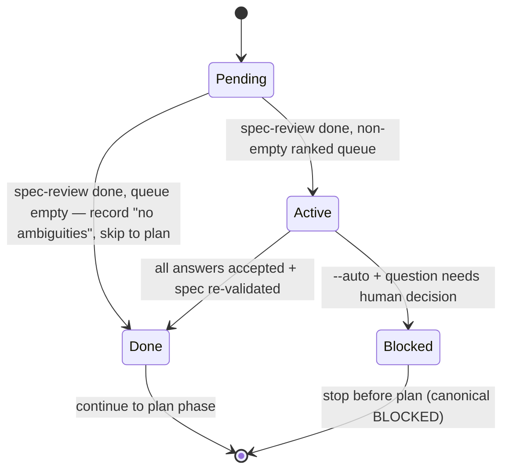

# Technical Plan: Clarify Gate

> **Retroactive plan.** The Clarify gate is already implemented and committed on `main` (commit `c519f40`). This plan maps every spec requirement to the **existing** code; it does **not** propose rewriting or duplicating working code. Each FR/AC below points to the real artifact that already satisfies it and the test that protects it.

---

## Summary

A deterministic, integrated pipeline phase (`clarify`) sits between `spec-review` and `plan`. Its detection/ranking core is a pure-stdlib Python module (`validator/clarify_gate.py`); its interactive question loop, write-back, auto-mode safety, and re-validation are the orchestration prose of `/spec-feature` Phase 1.6. No new command surface is added — the phase is wired into `PHASE_ORDER` in `validator/pipeline.py`.

---

## Technical Context

> Auto-filled from `.specs/stacks/_default.md` and `.specs/constitution.md`.

| Aspect | Choice | Reason |
|---|---|---|
| Language | Python ≥3.11 | Only language in the project (`pyproject.toml`) |
| Detection/ranking deps | stdlib only — `re`, `dataclasses`, `pathlib` | Constitution §3 (FS-as-truth) + §5 (minimal surface); no third-party need |
| Orchestration | `/spec-feature` SKILL.md Phase 1.6 (Markdown command prose) | Gate is an inline main-context phase, not a CLI subcommand |
| Pipeline wiring | `validator/pipeline.py` `PHASE_ORDER` / `PHASE_MAP` | Existing pipeline state machine |
| Re-validation | `livespec validate <spec.md> --format compact` | Existing structural validator (Layer 1) |
| Testing | pytest 8.x (`tests/test_clarify_gate.py`, `tests/test_pipeline.py`) | From testing strategy |
| Lint / Types | ruff (E,F,I,UP,RUF,B,SIM) + pyright strict | From `_default.md` |
| Project type | Local CLI tool, no UI, no DB, no network | `constitution.md` §6 |

**No infrastructure, no API endpoints, no database** — the feature operates entirely in-process on a local `spec.md` file. Therefore: **no Infrastructure Setup section, no sequence diagram, no ER diagram, no `contracts/openapi.yaml`** are required (see Scope Sizing and Diagram Decision below).

---

## Scope Sizing

**Size = M (medium).** 12 FR, 3 conceptual entities (only one is a real type), no new database table, no API route. Output budget for M: flowcharts (already in spec) + 1 state diagram for the gate lifecycle. No sequence diagram (no service interaction) and no ER diagram (no persisted entity — the only persistence is appended Markdown in the same `spec.md`).

---

## Constitution Check

| Principle | Verdict | Note |
|---|---|---|
| 1. Layered Validation | ✅ PASS | Detection is a pure helper (Layer-1-adjacent); re-validation reuses `livespec validate` (Layer 1). No layer skipped. |
| 2. Provider-Agnostic LLM | ✅ PASS | Detection and ranking are **closed-form, no LLM** (FR-006). Auto-mode (FR-011) only accepts deterministic recommendations grounded in constitution/spec text — never an LLM guess. |
| 3. File-System as Source of Truth | ✅ PASS | Reads `spec.md` from disk; writes accepted answers back into the same `spec.md`. No DB, no remote. |
| 4. Fail Fast, Exit Clearly | ✅ PASS | Auto-mode emits the canonical `BLOCKED at step 1.6 - decision_needed - …` line and stops before Plan (FR-011). |
| 5. Minimal Surface, Maximum Composability | ✅ PASS | **No new command** — the gate is a pipeline phase composed into `/spec-feature` (AC-001, SC-004). |
| 6. No Hosted Infrastructure | ✅ PASS | Entirely local; no server, no telemetry. |
| Testing Standards | ✅ PASS | Pure functions unit-tested in `tests/test_clarify_gate.py`; phase ordering in `tests/test_pipeline.py`. |
| Code Conventions (Python) | ✅ PASS | `snake_case` functions, `PascalCase` `ClarifyOpportunity`, `UPPER_SNAKE_CASE` `VAGUE_ADJECTIVES`, docstrings, frozen dataclass, ruff+pyright clean. `clarify_gate.py` is 155 lines (well under the 300-line limit). |
| Structure (300-line file limit) | ⚠️ DEVIATION (accepted) | `validator/pipeline.py` is **328 lines** (28 over the 300-line cap) after the `clarify` phase added the `clarify` entry to `PHASE_ORDER`/`PHASE_MAP` plus self-heal insertion logic. Accepted for now: the overage predates and is not caused by new clarify logic alone, and the file is a single cohesive pipeline state machine. **Remediation path:** a follow-up split (e.g. extract phase-row insertion/self-heal helpers into `validator/pipeline_rows.py`) is flagged for `/spec-test`. |

**Deviations:** one accepted file-length deviation on `validator/pipeline.py` (328 > 300 lines), documented above per constitution §4 ("No silent architectural decisions. Document them."). No `[DECISION NEEDED]` markers.

---

## Requirement Coverage Map (FR-001 … FR-012)

> Every FR maps to the **existing** module/function and the test that protects it. This is the authoritative coverage table the Analyze gate (`/spec-check --pre-impl`) cross-checks.

| FR | Requirement (short) | Existing artifact (file · symbol) | Protecting test |
|---|---|---|---|
| FR-001 | Run clarify as integrated phase after spec-review, before plan; no new command | `validator/pipeline.py` → `PHASE_ORDER` (`clarify` at index 2, between `spec-review` and `plan`), `PHASE_MAP["clarify"]="Clarify"`; `.agent-sync/skills/spec-feature/SKILL.md` § Phase 1.6 (inline main-context gate, no command surface) | `tests/test_pipeline.py::test_next_then_update_then_next_advances_past_clarify`, `::test_update_inserts_missing_clarify_row_at_correct_position` |
| FR-002 | Detect `VAGUE_ADJECTIVES` (`fast`/`scalable`/`secure`/`robust`) without a standalone numeric token in the sentence | `clarify_gate.py` → `VAGUE_ADJECTIVES`, `scan_clarification_opportunities()` (per-sentence `\b{adjective}\b` match guarded by `_has_metric()`) | `tests/test_clarify_gate.py::test_vague_adjective_without_metric_is_flagged_but_metric_sentence_is_not`, `::test_every_seed_adjective_is_detected` |
| FR-003 | Exclude digits glued to letters and requirement IDs (`FR-`/`AC-`/`SC-`) from the numeric check | `clarify_gate.py` → `_has_metric()` (strips `_REQUIREMENT_RE` then applies `_METRIC_RE = (?<![A-Za-z])\d`) | `tests/test_clarify_gate.py::test_digit_inside_identifier_is_not_treated_as_a_metric` |
| FR-004 | Detect each `[NEEDS CLARIFICATION]` (placeholders) and each `[ASSUMED]`/`TBD` (constraints/tradeoffs) line | `clarify_gate.py` → `_CLARIFICATION_MARKER_RE`, `_ASSUMPTION_MARKER_RE` branches in `scan_clarification_opportunities()` | **No dedicated unit test yet** — marker branches are exercised only by dogfooding on this spec.md; gap listed in Testing Strategy, to be closed by `/spec-test` (spec EC "Both markers on one line") |
| FR-005 | Score = Impact × Uncertainty, descending order with stable tie-break, cap at 5 | `clarify_gate.py` → `ClarifyOpportunity.score` (`impact * uncertainty`), `rank_clarification_opportunities(..., limit=5)` (sort key `(-score, category, evidence_path, evidence_line, question)`, slice `[:limit]`) | `tests/test_clarify_gate.py::test_ranking_prefers_higher_score_and_caps_at_five` |
| FR-006 | Identical scan + ranked-queue output for identical input (no model judgement) | `clarify_gate.py` — closed-form regex scan + total-order sort; no randomness, no LLM | `tests/test_clarify_gate.py::test_ranking_is_deterministic_regardless_of_scan_order` |
| FR-007 | Present queued questions one at a time, never more than 5 | `clarify_gate.py` → `rank_clarification_opportunities` cap (≤5); `.agent-sync/skills/spec-feature/SKILL.md` § Phase 1.6 step 4 ("ask one question at a time, in queue order … Never exceed the 5 queued questions") | `tests/test_clarify_gate.py::test_ranking_prefers_higher_score_and_caps_at_five` (cap); Phase-1.6 prose (one-at-a-time loop) |
| FR-008 | Write answers under `## Clarifications` / `### Session YYYY-MM-DD`, one `- Q: … -> A: …` bullet each, no duplicate session bullet | `.agent-sync/skills/spec-feature/SKILL.md` § Phase 1.6 step 5 | Phase-1.6 prose; dogfooded in this feature's own `spec.md` `## Clarifications` / `### Session 2026-06-27` |
| FR-009 | Update affected FR/AC/SC text in place, preserve numbering | `.agent-sync/skills/spec-feature/SKILL.md` § Phase 1.6 step 5 ("Also update the affected spec section (FR/AC/SC text) … preserve existing AC/FR numbering") | Phase-1.6 prose |
| FR-010 | Empty queue → record "no ambiguities" and continue to plan without prompting | `.agent-sync/skills/spec-feature/SKILL.md` § Phase 1.6 step 3 ("If the queue is empty → record 'Clarify gate: no ambiguities' and continue to Plan") | Phase-1.6 prose; `clarify_gate.py` returns `[]` for an unambiguous spec |
| FR-011 | Auto-mode: accept only deterministic recommendations grounded in constitution/spec; else (Phase 1.6) emit canonical `BLOCKED at step 1.6 - decision_needed - clarify question requires human answer`, and (Step 5.9) leave an explicit `[ASSUMED]` note | `.agent-sync/skills/spec-feature/SKILL.md` § Phase 1.6 step 4 (`--auto` BLOCKED branch); **`.agent-sync/skills/spec-specify/SKILL.md` § Step 5.9 step 3** (`--auto` → explicit `[ASSUMED]` note instead of fabricating an answer) | Phase-1.6 + Step-5.9 prose; canonical BLOCKED line in `system/anti-drift-block.md` §2 |
| FR-012 | After every write run `livespec validate`; fix + re-validate on failure | `.agent-sync/skills/spec-feature/SKILL.md` § Phase 1.6 step 6 (`livespec validate <spec.md> --format compact`) | Phase-1.6 prose; reuses existing `livespec validate` (`validator/cli.py`) |

### Acceptance-Criteria Coverage Map (AC-001 … AC-012)

| AC | Existing artifact | Protecting test |
|---|---|---|
| AC-001 | `pipeline.py` `PHASE_ORDER` ordering + Phase 1.6 "no new command surface" | `tests/test_pipeline.py::test_next_then_update_then_next_advances_past_clarify` |
| AC-002 | `scan_clarification_opportunities()` vague-adjective branch | `test_clarify_gate.py::test_every_seed_adjective_is_detected` |
| AC-003 | `_has_metric()` requirement-ID + glued-digit handling | `test_clarify_gate.py::test_digit_inside_identifier_is_not_treated_as_a_metric` |
| AC-004 | `_CLARIFICATION_MARKER_RE` + `_ASSUMPTION_MARKER_RE` branches | No dedicated unit test yet — dogfooded on this spec.md; gap noted in Testing Strategy, to be closed by `/spec-test` |
| AC-005 | `rank_clarification_opportunities()` order + `limit=5` | `test_clarify_gate.py::test_ranking_prefers_higher_score_and_caps_at_five` |
| AC-006 | closed-form scan + total-order sort | `test_clarify_gate.py::test_ranking_is_deterministic_regardless_of_scan_order` |
| AC-007 | rank cap (≤5) + Phase 1.6 one-at-a-time loop | `test_clarify_gate.py::test_ranking_prefers_higher_score_and_caps_at_five` |
| AC-008 | Phase 1.6 step 5 write-back format | dogfooded `## Clarifications` / `### Session 2026-06-27` in this spec.md |
| AC-009 | Phase 1.6 step 5 in-place FR/AC/SC update | Phase-1.6 prose |
| AC-010 | Phase 1.6 step 3 empty-queue branch | Phase-1.6 prose + empty-list scan result |
| AC-011 | Phase 1.6 step 4 `--auto` BLOCKED branch (spec-feature) + `spec-specify` Step 5.9 step 3 `[ASSUMED]`-note branch | Phase-1.6 + Step-5.9 prose + canonical line |
| AC-012 | Phase 1.6 step 6 re-validation loop | Phase-1.6 prose |

### Scoring Rules (closed-form, matches `clarify_gate.py`)

| Category | Context | Impact | Uncertainty | Score | Code |
|---|---|---|---|---|---|
| non-functional quality | vague adjective on a requirement line (`is_requirement`) | 3 | 3 | 9 | `impact=3 if is_requirement else 2` |
| non-functional quality | vague adjective on a non-requirement line | 2 | 3 | 6 | same branch, `else 2` |
| placeholders | `[NEEDS CLARIFICATION]` line | 3 | 3 | 9 | placeholder branch |
| constraints/tradeoffs | `[ASSUMED]` / `TBD` line | 2 | 2 | 4 | assumption branch |

---

## Gherkin + State Diagram — Gate Lifecycle

> The Clarify gate phase is a stateful entity within the pipeline (`Pending → Active → Done | Blocked`). State diagram (MANDATORY for stateful entity). No sequence diagram: there are no service/API calls — the gate runs in-process and only reads/writes a local file.

```gherkin
Feature: Clarify gate lifecycle within the pipeline
  Scenario: Gate completes and advances to plan
    Given the clarify phase is Pending and spec-review is Done
    When the gate scans, ranks, and resolves the question queue
    Then the clarify phase becomes Done
    And the pipeline advances to the plan phase

  Scenario: Auto-mode blocks on a question needing a human decision
    Given the clarify phase is Active under --auto
    When a queued question has no deterministic constitution/spec-grounded answer
    Then the gate emits "BLOCKED at step 1.6 - decision_needed - clarify question requires human answer"
    And the clarify phase becomes Blocked
    And the plan phase does not start
```



---

## Implementation Plan (file-by-file — maps to EXISTING code)

> No new files are created and no working code is rewritten. Each step records where the satisfying code already lives. The "sub-task" numbering is retained for the FR Dependency Graph playground.

### Step 1 — Deterministic detection core (existing: `validator/clarify_gate.py`)

- **Status:** existing (no change).
- `VAGUE_ADJECTIVES` seed tuple; `ClarifyOpportunity` frozen dataclass with `score` property; `scan_clarification_opportunities(spec_path)`; module-level regexes `_REQUIREMENT_RE`, `_METRIC_RE`, `_CLARIFICATION_MARKER_RE`, `_ASSUMPTION_MARKER_RE`, `_SENTENCE_SPLIT_RE`; helpers `_split_sentences()`, `_has_metric()`.
- **FR covered:** FR-002.1: Seed-set vague-adjective detection, FR-003.1: Requirement-ID/glued-digit exclusion, FR-004.1: Placeholder + assumption marker detection, FR-006.1: Closed-form deterministic scan.

### Step 2 — Ranking + cap (existing: `validator/clarify_gate.py`)

- **Status:** existing (no change).
- `rank_clarification_opportunities(opportunities, *, limit=5)` — stable sort key `(-score, category, str(evidence_path), evidence_line, question)`, slice `[:limit]`.
- **FR covered:** FR-005.1: Impact×Uncertainty ranking with cap, FR-006.2: Deterministic ranked queue, FR-007.1: Hard cap at 5.

### Step 3 — Pipeline phase wiring (existing: `validator/pipeline.py`)

- **Status:** existing (no change).
- `clarify` is index 2 of `PHASE_ORDER` (after `spec-review`, before `plan`); `PHASE_MAP["clarify"] = "Clarify"`; insertion/self-heal logic places a missing `clarify` row at its canonical position.
- **FR covered:** FR-001.1: Integrated phase positioned after spec-review, before plan.

### Step 4 — Interactive gate orchestration (existing: `/spec-feature` SKILL.md § Phase 1.6)

- **Status:** existing (no change).
- Reads `spec.md`; builds the capped queue from the helpers; one-question-at-a-time loop; empty-queue "no ambiguities" short-circuit.
- **FR covered:** FR-007.2: One-at-a-time presentation, FR-010.1: Empty-queue continue-to-plan.

### Step 5 — Write-back + in-place update (existing: `/spec-feature` SKILL.md § Phase 1.6 step 5)

- **Status:** existing (no change).
- Writes `## Clarifications` / `### Session YYYY-MM-DD` / `- Q: … -> A: …`, no duplicate session bullet; updates affected FR/AC/SC text in place, preserving numbering.
- **FR covered:** FR-008.1: Dated session write-back format, FR-009.1: In-place FR/AC/SC update preserving numbering.

### Step 6 — Auto-mode safety + re-validation (existing: `/spec-feature` SKILL.md § Phase 1.6 steps 4 & 6)

- **Status:** existing (no change).
- `--auto`: accept only deterministic constitution/spec-grounded recommendations; otherwise emit canonical `BLOCKED at step 1.6 - decision_needed - clarify question requires human answer` and stop before Plan. After every write: `livespec validate <spec.md> --format compact`; fix-and-re-validate on failure.
- **FR covered:** FR-011.1: Auto-mode deterministic-only + canonical BLOCKED, FR-012.1: Post-write re-validation loop.

### Step 7 — Test files (existing)

- `tests/test_clarify_gate.py` — 5 unit tests over detection/ranking invariants.
- `tests/test_pipeline.py` — clarify phase ordering/insertion tests.
- **FR covered:** FR-002.2, FR-003.2, FR-005.2, FR-006.3, FR-001.2 (protected by the tests above).

---

## Resolved Test Commands

> Resolved from `.specs/testing/strategy.md` and verified by running the clarify suite during this plan (5 passed in 0.99s).

| Action | Command | Tool | Status |
|---|---|---|---|
| Unit tests (clarify) | `pytest tests/test_clarify_gate.py -v --tb=short` | pytest 8.x | Verified (5 passed) |
| Unit tests (pipeline) | `pytest tests/test_pipeline.py -v --tb=short` | pytest 8.x | Verified |
| Unit tests (no LLM) | `pytest tests/ --ignore=tests/integration -v` | pytest 8.x | Verified |
| Type check | `pyright validator/` | Pyright strict | Verified |
| Lint + format | `ruff check validator/ tests/ && ruff format --check validator/ tests/` | Ruff | Verified |
| Full suite | `pytest tests/ --ignore=tests/integration -v` | pytest 8.x | Verified |

---

## Testing Strategy

| Test Type | What | File | Command | FR/AC |
|---|---|---|---|---|
| Unit | vague adjective flagged only without metric | `tests/test_clarify_gate.py` | `pytest tests/test_clarify_gate.py::test_vague_adjective_without_metric_is_flagged_but_metric_sentence_is_not` | FR-002, AC-002 |
| Unit | every seed adjective detected | `tests/test_clarify_gate.py` | `pytest tests/test_clarify_gate.py::test_every_seed_adjective_is_detected` | FR-002, AC-002 |
| Unit | identifier/requirement-ID digit not a metric | `tests/test_clarify_gate.py` | `pytest tests/test_clarify_gate.py::test_digit_inside_identifier_is_not_treated_as_a_metric` | FR-003, AC-003 |
| Unit | ranking by score + cap at 5 | `tests/test_clarify_gate.py` | `pytest tests/test_clarify_gate.py::test_ranking_prefers_higher_score_and_caps_at_five` | FR-005, FR-007, AC-005, AC-007, SC-002 |
| Unit | ranking deterministic regardless of scan order | `tests/test_clarify_gate.py` | `pytest tests/test_clarify_gate.py::test_ranking_is_deterministic_regardless_of_scan_order` | FR-006, AC-006, SC-003 |
| Unit | clarify phase ordering / insertion | `tests/test_pipeline.py` | `pytest tests/test_pipeline.py -k clarify` | FR-001, AC-001, SC-004 |
| Suite | all P1 acceptance criteria green in CI (success criterion) | `tests/test_clarify_gate.py` | `pytest tests/test_clarify_gate.py` | SC-001 |

**Coverage gaps (for `/spec-test` at implement phase):** marker-category assertions (FR-004/AC-004), write-back format (FR-008/AC-008), in-place update (FR-009/AC-009), empty-queue continue (FR-010/AC-010), auto-mode BLOCKED (FR-011/AC-011), and re-validation loop (FR-012/AC-012) are currently protected by Phase-1.6 prose and dogfooding rather than dedicated unit tests. `/spec-test` should add targeted tests for the orchestration-side requirements.

---

## Risks & Considerations

- **Orchestration vs. unit coverage:** FR-008..FR-012 live in command prose (Phase 1.6), not in a unit-testable function, so they rely on dogfooding + the prose contract. Risk mitigated by the deterministic core being fully unit-tested and by `/spec-test` adding orchestration tests.
- **Seed-set growth:** `VAGUE_ADJECTIVES` is intentionally a small fixed seed (4 members). Extending it changes detection behavior — any growth must keep `test_every_seed_adjective_is_detected` green.
- **Dogfooding noise:** this spec deliberately contains the detection vocabulary it specifies; the `## Clarifications` section already records that those tokens are detection targets, not live ambiguities (see spec `### Session 2026-06-27`).

---

## Next Action

This is a retroactive plan for already-implemented code. Run `/spec-implement 069-clarify-gate` in retroactive/mapping mode to produce `implementation.md` from the **existing** code — mapping every FR/AC to `@spec` anchors in `validator/clarify_gate.py`, `validator/pipeline.py`, `.agent-sync/skills/spec-feature/SKILL.md` (Phase 1.6), and `.agent-sync/skills/spec-specify/SKILL.md` (Step 5.9) — and to close the orchestration-side and marker-detection coverage gaps (FR-004, FR-008..FR-012) via `/spec-test`. No working code is to be rewritten.

---

*Generated by `/spec-plan` — LiveSpec v1.0*
