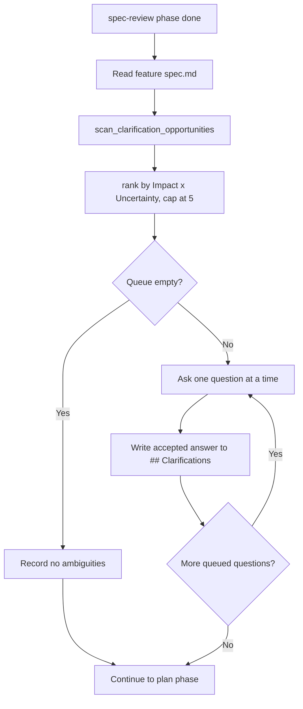
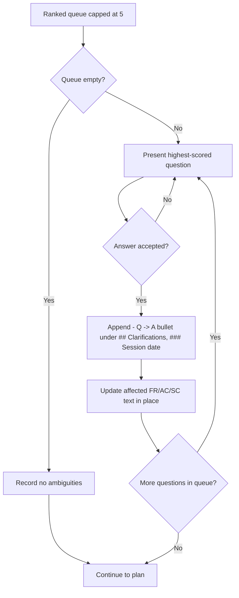
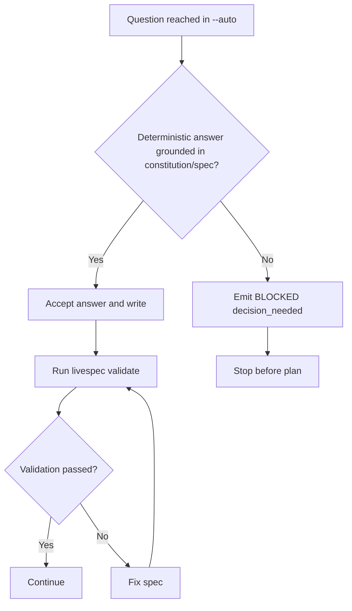

# Feature Spec: Clarify Gate

- **Feature:** Clarify Gate
- **Branch:** `feature/069-clarify-gate`
- **Date:** 2026-06-27
- **Status:** Implemented
- **Input:** Clarify gate — an integrated pipeline phase that runs after specify and before plan, detects spec ambiguity (vague adjectives without measurable criteria, missing decisions), asks up to 5 bounded Impact × Uncertainty-ranked questions one at a time, and writes accepted answers back under a dated `## Clarifications` section.
- **Feature Number:** 069

---

## User Scenarios & Testing

> Prioritize stories as P1 (critical — must ship), P2 (important — should ship), P3 (nice-to-have — can defer).

### Story 1 — Pipeline surfaces ranked clarification questions before planning `P1`

**As a** developer running `/spec-feature`, **I want** the pipeline to detect spec ambiguity after the spec review and ask me the highest-leverage questions before any planning starts, **so that** the plan is built on a disambiguated spec instead of guesses.

**Priority reason:** This is the gate's reason to exist. Without it, ambiguous specs reach the Plan phase and drift downstream. It is an integrated phase, not a new command.

**Independent test:** Run a feature pipeline on a fixture spec that pairs one vague adjective without a numeric criterion with one unresolved placeholder marker; verify the gate runs after spec-review and before plan, and presents at least one question.

#### Acceptance Scenarios (Gherkin — source of truth for tests)

> These Gherkin blocks are the source of truth for test scaffolding. All tests (unit, integration, E2E, visual) are derived from these scenarios, never from Mermaid diagrams.

```gherkin
Feature: Clarify gate runs as an integrated phase between specify and plan
  Scenario: Gate executes after spec-review and before plan
    Given a feature whose pipeline has the spec-review phase marked done
    When the pipeline advances to the next phase
    Then the clarify phase runs before the plan phase
    And no new command surface is exposed for it

  Scenario: Spec with ambiguity produces a non-empty ranked question queue
    Given a spec.md that contains a vague quality adjective without a numeric criterion in the same sentence
    And a spec.md that contains a [NEEDS CLARIFICATION] placeholder
    When the gate scans the spec with scan_clarification_opportunities
    Then the ranked queue contains at least 1 opportunity
    And the queue contains at most 5 questions
```

#### User Flow

> The Mermaid flowchart below visualizes the same flow defined in the Gherkin scenarios above.



---

### Story 2 — Deterministic detection of the three ambiguity categories `P1`

**As a** spec author, **I want** the gate to flag vague quality adjectives used without a measurable criterion, unresolved `[NEEDS CLARIFICATION]` placeholders, and unconfirmed `[ASSUMED]`/`TBD` assumptions, **so that** the same spec always yields the same ranked queue with no model judgement involved.

**Priority reason:** Detection is the input to every other behavior. It must be closed-form and reproducible so the gate is testable and auditable.

**Independent test:** Call `scan_clarification_opportunities` twice on the same fixture spec and assert the two opportunity lists are identical; assert a sentence that pairs an adjective with a numeric token (e.g. "responds in 200 ms") produces no vague-adjective opportunity.

#### Acceptance Scenarios (Gherkin — source of truth for tests)

```gherkin
Feature: Deterministic ambiguity detection across three categories
  Scenario: Vague adjective without a number is flagged
    Given a sentence "the export must be fast" with no numeric token
    When the gate scans the line
    Then it records a non-functional quality opportunity for "fast"

  Scenario: Vague adjective paired with a numeric criterion is not flagged
    Given a sentence "the export completes in 2 s" containing a standalone digit
    When the gate scans the line
    Then it records no vague-adjective opportunity for that sentence

  Scenario: Identifier digits do not count as a numeric criterion
    Given a sentence "the system must be secure using OAuth2"
    When the gate scans the line
    Then the digit glued to "OAuth2" is ignored
    And a non-functional quality opportunity is recorded for "secure"

  Scenario: Requirement-ID digits do not count as a numeric criterion
    Given a sentence "FR-001 and AC-002 and SC-001 require the export to be fast"
    When the gate scans the line
    Then the digits in FR-001, AC-002, and SC-001 are stripped before the numeric check
    And a non-functional quality opportunity is recorded for "fast"

  Scenario: Placeholder and assumption markers are flagged
    Given a line containing "[NEEDS CLARIFICATION]"
    And a line containing "[ASSUMED]" or "TBD"
    When the gate scans the spec
    Then a placeholders opportunity is recorded for the [NEEDS CLARIFICATION] line
    And a constraints/tradeoffs opportunity is recorded for the assumption line

  Scenario: Same spec yields the same ranked queue twice
    Given any spec.md
    When the gate scans and ranks it twice
    Then both ranked queues are identical
```

#### User Flow

> The Mermaid flowchart below visualizes the same flow defined in the Gherkin scenarios above.

```mermaid
flowchart TD
    A[Read spec.md line by line] --> B{Line has [NEEDS CLARIFICATION]?}
    B -- Yes --> C[Add placeholders opportunity]
    A --> D{Line has [ASSUMED] or TBD?}
    D -- Yes --> E[Add constraints/tradeoffs opportunity]
    A --> F[Split line into sentences]
    F --> G{Sentence has a standalone digit, ignoring requirement IDs?}
    G -- Yes --> H[Skip vague check for sentence]
    G -- No --> I{Sentence contains a vague adjective?}
    I -- Yes --> J[Add non-functional quality opportunity]
    I -- No --> K[No opportunity]
```

---

### Story 3 — One bounded question at a time with persisted answers `P2`

**As a** developer answering the gate, **I want** questions asked one at a time in ranked order, capped at 5, with my accepted answers written back into the spec under a dated `## Clarifications` section, **so that** the resolution is bounded and traceable in the spec itself.

**Priority reason:** Bounds and persistence make the gate usable interactively and keep the spec as the single source of truth. Without the cap and the write-back, the gate would either overwhelm the user or lose the decisions.

**Independent test:** Provide a spec that scans to 7 opportunities; verify exactly 5 questions are offered; accept 2 answers and verify a `## Clarifications` section with a `### Session YYYY-MM-DD` subheading and 2 `- Q: … -> A: …` bullets appears, and the affected requirement text is updated in place.

#### Acceptance Scenarios (Gherkin — source of truth for tests)

```gherkin
Feature: Bounded questioning with persisted clarifications
  Scenario: Queue is capped at five questions
    Given a spec that scans to 7 clarification opportunities
    When the gate ranks the opportunities
    Then exactly 5 questions are offered in ranked order

  Scenario: Questions are asked one at a time in ranked order
    Given a non-empty ranked queue
    When the gate runs interactively
    Then it presents the highest-scored question first
    And it presents the next question only after the current answer is accepted

  Scenario: Accepted answers are written under a dated Clarifications section
    Given the user accepts 2 answers in a single run
    When the gate persists the results
    Then spec.md contains a "## Clarifications" heading
    And it contains a "### Session YYYY-MM-DD" subheading for the run date
    And it contains one "- Q: <question> -> A: <answer>" bullet per accepted answer
    And no duplicate session bullet is written
    And the affected FR/AC/SC text is updated in place without renumbering

  Scenario: Empty queue records no ambiguities and continues
    Given a spec that scans to 0 opportunities
    When the gate runs
    Then it records a "no ambiguities" note
    And the pipeline continues to the plan phase
```

#### User Flow

> The Mermaid flowchart below visualizes the same flow defined in the Gherkin scenarios above.



---

### Story 4 — Deterministic auto mode and re-validation `P2`

**As a** maintainer running the pipeline with `--auto`, **I want** the gate to accept only deterministic recommendations grounded in the constitution or existing spec text and to block when a queued question genuinely needs a human decision, and to re-validate the spec after every write, **so that** autonomous runs never fabricate answers and never leave the spec structurally invalid.

**Priority reason:** Auto mode is where silent guessing would be most damaging. Blocking on genuine decisions and re-validating preserves correctness in unattended runs.

**Independent test:** Run the gate in `--auto` on a spec with one question that has no constitution-grounded answer; verify the run emits the canonical `BLOCKED at step 1.6 - decision_needed - clarify question requires human answer` line and does not start the plan phase.

#### Acceptance Scenarios (Gherkin — source of truth for tests)

```gherkin
Feature: Auto-mode safety and post-write re-validation
  Scenario: Auto mode blocks on a question needing a human decision
    Given the pipeline runs with --auto
    And a queued question has no deterministic answer grounded in the constitution or spec
    When the gate reaches that question
    Then it emits "BLOCKED at step 1.6 - decision_needed - clarify question requires human answer"
    And it does not start the plan phase

  Scenario: Spec is re-validated after each write
    Given the gate writes an accepted answer to spec.md
    When the write completes
    Then "livespec validate" is run against the spec.md
    And the gate fixes and re-validates before continuing if validation fails
```

#### User Flow

> The Mermaid flowchart below visualizes the same flow defined in the Gherkin scenarios above.



---

## Acceptance Criteria

> Each AC must be specific, testable, and verifiable. Reference them from FR below.

| ID | Criterion | Priority | Story |
|---|---|---|---|
| AC-001 | The clarify phase runs after the spec-review phase and before the plan phase, and exposes no new command surface | P1 | Story 1 |
| AC-002 | `scan_clarification_opportunities(spec_path)` returns an opportunity for every vague adjective in `VAGUE_ADJECTIVES` used without a standalone numeric token in the same sentence | P1 | Story 2 |
| AC-003 | A digit glued to letters (e.g. `OAuth2`, `S3`) and requirement IDs (`FR-001`) are not counted as numeric criteria during vague-adjective scanning | P1 | Story 2 |
| AC-004 | `scan_clarification_opportunities` returns a placeholders opportunity for each `[NEEDS CLARIFICATION]` line and a constraints/tradeoffs opportunity for each `[ASSUMED]` or `TBD` line | P1 | Story 2 |
| AC-005 | `rank_clarification_opportunities` orders opportunities by descending Impact × Uncertainty with a stable tie-break and returns at most 5 items | P1 | Story 3 |
| AC-006 | Scanning then ranking the same spec twice returns two identical ordered queues (no model judgement involved) | P1 | Story 2 |
| AC-007 | When the ranked queue is non-empty, questions are presented one at a time in ranked order and the total count of presented questions does not exceed 5 | P2 | Story 3 |
| AC-008 | Accepted answers are written under a `## Clarifications` heading, grouped by a `### Session YYYY-MM-DD` subheading, as one `- Q: <question> -> A: <answer>` bullet each, with no duplicate session bullet | P2 | Story 3 |
| AC-009 | The gate updates the affected FR/AC/SC text in place after accepting an answer and preserves existing AC/FR/SC numbering | P2 | Story 3 |
| AC-010 | When the ranked queue is empty, the gate records a "no ambiguities" note and the pipeline continues to the plan phase without prompting | P2 | Story 3 |
| AC-011 | In `--auto` mode the gate accepts only deterministic recommendations grounded in the constitution or existing spec text; for a question needing a human decision it emits `BLOCKED at step 1.6 - decision_needed - clarify question requires human answer` in the `/spec-feature` Phase 1.6 context, and instead leaves an explicit `[ASSUMED]` note in the `/spec-specify` Step 5.9 context | P2 | Story 4 |
| AC-012 | After every write to spec.md the gate runs `livespec validate` against the spec and fixes then re-validates before continuing if validation fails | P2 | Story 4 |

> **Deep-link anchors:** Each AC below has a heading anchor (`#ac-001`, `#ac-002`, ...) enabling direct navigation from `implementation.md` and `@spec` comments.

### AC-001

**Criterion:** The clarify phase runs after the spec-review phase and before the plan phase, and exposes no new command surface
**Priority:** P1 | **Story:** Story 1

### AC-002

**Criterion:** `scan_clarification_opportunities(spec_path)` returns an opportunity for every vague adjective in `VAGUE_ADJECTIVES` used without a standalone numeric token in the same sentence
**Priority:** P1 | **Story:** Story 2

### AC-003

**Criterion:** A digit glued to letters (e.g. `OAuth2`, `S3`) and requirement IDs (`FR-001`) are not counted as numeric criteria during vague-adjective scanning
**Priority:** P1 | **Story:** Story 2

### AC-004

**Criterion:** `scan_clarification_opportunities` returns a placeholders opportunity for each `[NEEDS CLARIFICATION]` line and a constraints/tradeoffs opportunity for each `[ASSUMED]` or `TBD` line
**Priority:** P1 | **Story:** Story 2

### AC-005

**Criterion:** `rank_clarification_opportunities` orders opportunities by descending Impact × Uncertainty with a stable tie-break and returns at most 5 items
**Priority:** P1 | **Story:** Story 3

### AC-006

**Criterion:** Scanning then ranking the same spec twice returns two identical ordered queues (no model judgement involved)
**Priority:** P1 | **Story:** Story 2

### AC-007

**Criterion:** When the ranked queue is non-empty, questions are presented one at a time in ranked order and the total count of presented questions does not exceed 5
**Priority:** P2 | **Story:** Story 3

### AC-008

**Criterion:** Accepted answers are written under a `## Clarifications` heading, grouped by a `### Session YYYY-MM-DD` subheading, as one `- Q: <question> -> A: <answer>` bullet each, with no duplicate session bullet
**Priority:** P2 | **Story:** Story 3

### AC-009

**Criterion:** The gate updates the affected FR/AC/SC text in place after accepting an answer and preserves existing AC/FR/SC numbering
**Priority:** P2 | **Story:** Story 3

### AC-010

**Criterion:** When the ranked queue is empty, the gate records a "no ambiguities" note and the pipeline continues to the plan phase without prompting
**Priority:** P2 | **Story:** Story 3

### AC-011

**Criterion:** In `--auto` mode the gate accepts only deterministic recommendations grounded in the constitution or existing spec text; for a question needing a human decision it emits `BLOCKED at step 1.6 - decision_needed - clarify question requires human answer` in the `/spec-feature` Phase 1.6 context, and instead leaves an explicit `[ASSUMED]` note in the `/spec-specify` Step 5.9 context
**Priority:** P2 | **Story:** Story 4

### AC-012

**Criterion:** After every write to spec.md the gate runs `livespec validate` against the spec and fixes then re-validates before continuing if validation fails
**Priority:** P2 | **Story:** Story 4

---

## Functional Requirements

> Each FR must map to at least one AC. These become the rows in implementation.md.

| ID | Requirement | AC References |
|---|---|---|
| FR-001 | The system must run the clarify step as an integrated pipeline phase positioned after spec-review and before plan, without adding a new command | AC-001 |
| FR-002 | The system must detect vague quality adjectives from the `VAGUE_ADJECTIVES` seed set (`fast`, `scalable`, `secure`, `robust`) when used in a sentence that contains no standalone numeric token | AC-002 |
| FR-003 | The system must exclude digits glued to letters and requirement IDs (`FR-`, `AC-`, `SC-`) from the numeric-criterion check so they do not silence a genuine vague-adjective opportunity | AC-003 |
| FR-004 | The system must detect each `[NEEDS CLARIFICATION]` placeholder line and each `[ASSUMED]` or `TBD` assumption line as a clarification opportunity in its category | AC-004 |
| FR-005 | The system must score each opportunity as Impact × Uncertainty, order opportunities by descending score with a stable tie-break, and cap the returned queue at 5 | AC-005, AC-007 |
| FR-006 | The system must produce identical scan and ranked-queue output for identical spec input on repeated invocations | AC-006 |
| FR-007 | The system must present queued questions one at a time in ranked order and never present more than 5 questions in a run | AC-007 |
| FR-008 | The system must write accepted answers under a `## Clarifications` heading grouped by a `### Session YYYY-MM-DD` subheading, one `- Q: <question> -> A: <answer>` bullet each, without duplicate session bullets | AC-008 |
| FR-009 | The system must update the affected FR/AC/SC text in place after an answer is accepted while preserving existing FR/AC/SC numbering | AC-009 |
| FR-010 | The system must, when the ranked queue is empty, record a "no ambiguities" note and continue to the plan phase without prompting | AC-010 |
| FR-011 | In auto mode the system must accept only deterministic recommendations grounded in the constitution or existing spec text, and emit the canonical `BLOCKED at step 1.6 - decision_needed - clarify question requires human answer` line for any question needing a human decision | AC-011 |
| FR-012 | The system must run `livespec validate` against spec.md after every write and fix then re-validate before continuing on validation failure | AC-012 |

> **Deep-link anchors:** Each FR below has a heading anchor (`#fr-001`, `#fr-002`, ...) enabling direct navigation from `implementation.md` and `@spec` comments.

### FR-001

**Requirement:** The system must run the clarify step as an integrated pipeline phase positioned after spec-review and before plan, without adding a new command
**AC References:** [AC-001](#ac-001)

### FR-002

**Requirement:** The system must detect vague quality adjectives from the `VAGUE_ADJECTIVES` seed set (`fast`, `scalable`, `secure`, `robust`) when used in a sentence that contains no standalone numeric token
**AC References:** [AC-002](#ac-002)

### FR-003

**Requirement:** The system must exclude digits glued to letters and requirement IDs (`FR-`, `AC-`, `SC-`) from the numeric-criterion check so they do not silence a genuine vague-adjective opportunity
**AC References:** [AC-003](#ac-003)

### FR-004

**Requirement:** The system must detect each `[NEEDS CLARIFICATION]` placeholder line and each `[ASSUMED]` or `TBD` assumption line as a clarification opportunity in its category
**AC References:** [AC-004](#ac-004)

### FR-005

**Requirement:** The system must score each opportunity as Impact × Uncertainty, order opportunities by descending score with a stable tie-break, and cap the returned queue at 5
**AC References:** [AC-005](#ac-005), [AC-007](#ac-007)

### FR-006

**Requirement:** The system must produce identical scan and ranked-queue output for identical spec input on repeated invocations
**AC References:** [AC-006](#ac-006)

### FR-007

**Requirement:** The system must present queued questions one at a time in ranked order and never present more than 5 questions in a run
**AC References:** [AC-007](#ac-007)

### FR-008

**Requirement:** The system must write accepted answers under a `## Clarifications` heading grouped by a `### Session YYYY-MM-DD` subheading, one `- Q: <question> -> A: <answer>` bullet each, without duplicate session bullets
**AC References:** [AC-008](#ac-008)

### FR-009

**Requirement:** The system must update the affected FR/AC/SC text in place after an answer is accepted while preserving existing FR/AC/SC numbering
**AC References:** [AC-009](#ac-009)

### FR-010

**Requirement:** The system must, when the ranked queue is empty, record a "no ambiguities" note and continue to the plan phase without prompting
**AC References:** [AC-010](#ac-010)

### FR-011

**Requirement:** In auto mode the system must accept only deterministic recommendations grounded in the constitution or existing spec text; for a question needing a human decision it emits the canonical `BLOCKED at step 1.6 - decision_needed - clarify question requires human answer` line in the `/spec-feature` Phase 1.6 context, and instead leaves an explicit `[ASSUMED]` note in the `/spec-specify` Step 5.9 context
**AC References:** [AC-011](#ac-011)

### FR-012

**Requirement:** The system must run `livespec validate` against spec.md after every write and fix then re-validate before continuing on validation failure
**AC References:** [AC-012](#ac-012)

---

## Key Entities

> List the main data objects involved in this feature.

| Entity | Description | Key Fields |
|---|---|---|
| ClarifyOpportunity | A single ranked clarification candidate grounded in spec evidence (real `@dataclass` in `validator/clarify_gate.py`) | category, question, impact, uncertainty, evidence_path, evidence_line, evidence_text, score (computed property: impact × uncertainty) |
| ClarificationQueue | The ranked, capped (≤ 5) ordered list of opportunities for one gate run — conceptual, implemented as a plain ordered `list[ClarifyOpportunity]`, not a named type | ordered opportunities, limit |
| ClarificationSession | A dated group of accepted Q/A pairs written into spec.md — conceptual, implemented as Markdown headings/bullets, not a named type | session_date, q_a_bullets |

### Scoring Rules

> The Impact × Uncertainty score (FR-005) is closed-form. The four (category × context) pairs the implementation assigns are:

| Category | Context | Impact | Uncertainty | Score |
|---|---|---|---|---|
| non-functional quality | vague adjective on a requirement line (sentence contains `FR-`/`AC-`/`SC-`) | 3 | 3 | 9 |
| non-functional quality | vague adjective on a non-requirement line | 2 | 3 | 6 |
| placeholders | `[NEEDS CLARIFICATION]` line | 3 | 3 | 9 |
| constraints/tradeoffs | `[ASSUMED]` or `TBD` line | 2 | 2 | 4 |

---

## Edge Cases

> Scenarios that aren't in the happy path but must be handled correctly.

- **Empty queue:** When no opportunities are found, the gate records a "no ambiguities" note and continues to plan without prompting (AC-010).
- **More than 5 opportunities:** When scanning yields more than 5 opportunities, ranking returns only the top 5; lower-scored items are not presented (AC-005, AC-007).
- **Tie in score:** When two opportunities share the same Impact × Uncertainty score, the stable tie-break `(-score, category, evidence_path, evidence_line, question)` decides their order so output stays deterministic (AC-006).
- **Adjective inside a quantified sentence:** A vague adjective in a sentence that also contains a standalone numeric token produces no opportunity (AC-002).
- **Identifier digit only:** A sentence whose only digit is glued to letters (e.g. `IPv6`) is treated as having no numeric criterion, so the vague adjective is still flagged (AC-003).
- **Auto mode with an open decision:** A queued question with no constitution- or spec-grounded answer blocks the run in `--auto` instead of being answered (AC-011).
- **Both markers on one line:** A single line containing both `[NEEDS CLARIFICATION]` and an `[ASSUMED]`/`TBD` marker produces two independent opportunities (one per category), because each marker is matched independently (AC-004).
- **Re-run on an already-clarified spec:** Re-running the gate appends to the same dated session without writing duplicate session bullets (AC-008).
- **Validation failure after write:** A write that makes spec.md invalid triggers a fix-and-re-validate loop before the pipeline continues (AC-012).

---

## Success Criteria

> Measurable outcomes that define when this feature is complete and successful.

| ID | Criterion | How to Measure |
|---|---|---|
| SC-001 | All P1 acceptance criteria pass automated tests | CI test suite green for clarify-gate tests |
| SC-002 | The ranked queue contains at most 5 questions for any spec | Unit test asserting `len(rank_clarification_opportunities(...)) <= 5` |
| SC-003 | Detection and ranking are reproducible | Unit test asserting identical output across 2 invocations on the same fixture |
| SC-004 | The gate runs strictly between spec-review and plan with no added command | Pipeline-order test asserting phase sequence and the absence of a new command entry |

---

## Clarifications

> This feature is the Clarify gate itself; the gate runs on this very spec during the pipeline (dogfooding). The scanner flags lines that contain the literal detection vocabulary it is built to recognize — the seed adjectives (`fast`, `scalable`, `secure`, `robust`), the `[NEEDS CLARIFICATION]` placeholder, and the `[ASSUMED]`/`TBD` markers. In this spec those tokens are deliberate references (Gherkin test data, FR/AC definitions, flowchart labels) describing what the gate detects, not unresolved ambiguities. The clarifications below record that resolution; no spec text is rewritten to remove the vocabulary, because doing so would make the spec unable to specify the detector.

### Session 2026-06-27

- Q: Quantify the vague adjectives `fast`/`scalable`/`secure`/`robust` referenced in FR-002 (and its anchor) with a measurable criterion -> A: Not an ambiguity. Those four words are the literal `VAGUE_ADJECTIVES` seed set the gate detects; FR-002 defines that set verbatim. The measurable criterion for the gate is structural, not adjectival: a sentence is ambiguous only when it pairs such an adjective with no standalone numeric token (see AC-002, AC-003). The set has a fixed size of 4 members.
- Q: Resolve the `[NEEDS CLARIFICATION]`-style markers referenced across the Gherkin scenarios, flowcharts, and FR-004/AC-004 -> A: Not unresolved markers. They are quoted detection targets used as test data and definitions for the placeholders category, never live placeholders in this spec. The detector matches the exact literal `[NEEDS CLARIFICATION]`, so the spec must name it to specify the behavior.
- Q: Resolve the `[ASSUMED]`/`TBD` markers referenced in the Gherkin scenarios and FR-004 -> A: Not unconfirmed assumptions. They are quoted detection targets for the constraints/tradeoffs category. No assumption in this spec is left unconfirmed; every requirement maps to a verified behavior in `validator/clarify_gate.py`.
- Q: Phase 1.6 supervisor gate re-scan — `rank_clarification_opportunities(scan_clarification_opportunities(spec))` returned 49 raw opportunities ranked and capped to 5 (all category `non-functional quality`, score 9: quantify `fast` in AC/SC sentence, plus `fast`/`robust`/`scalable`/`secure` in the FR-002 `VAGUE_ADJECTIVES` definition row). Accept the resolution? -> A: Accepted. All five ranked items are the same intentional detection-vocabulary case already resolved above: FR-002 must name the seed adjectives verbatim to define the detector, and the measurable criterion is structural (adjective + no standalone numeric token in the same sentence, AC-002/AC-003), not a per-adjective threshold. No spec text is rewritten; removing the vocabulary would make the spec unable to specify the detector. Gate executed, queue bounded at 5, spec re-validated.

---

*Generated by `/spec-specify` — LiveSpec v1.0*

<!-- finalize:spec-specify:2026-06-27:6ceeb87f -->

<!-- finalize:spec-plan:2026-06-27:d8275811 -->
