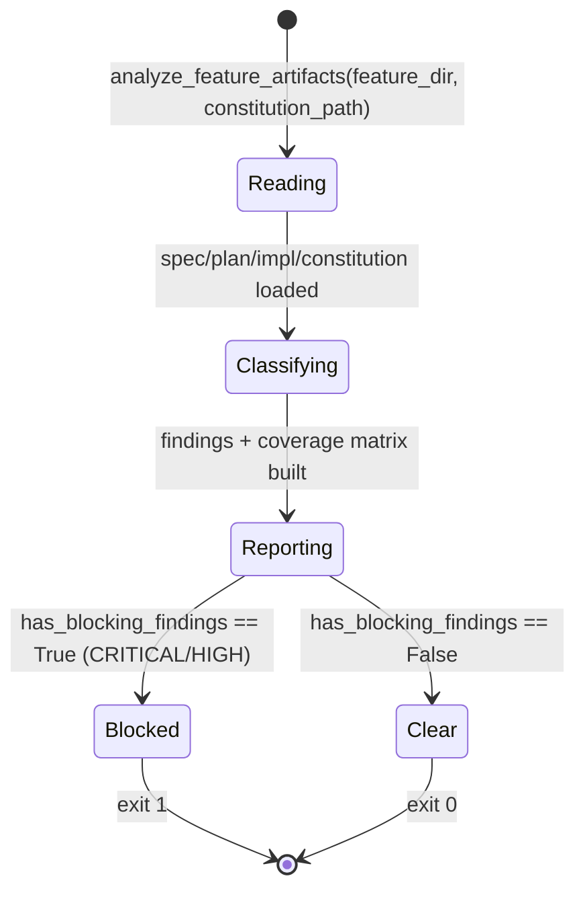

# Technical Plan: Analyze Gate

> **Retroactive plan.** The Analyze gate is already implemented and committed on `main` (commit `c519f40`). This plan maps every spec requirement to the **existing** code; it does **not** propose rewriting or duplicating working code. Each FR/AC/SC below points to the real artifact that already satisfies it and the test that protects it.

---

## Summary

A deterministic, read-only pre-implementation analyzer (`validator/pre_impl_analysis.py`) cross-checks a feature's `spec.md`, `plan.md` and optional `implementation.md` against `constitution.md`. It is exposed through the existing `livespec validate --pre-impl` CLI branch (`validator/cli.py`) and wired into `/spec-feature` as the `analyze` phase (Phase 2.6) via `PHASE_ORDER` in `validator/pipeline.py`. No new command surface is added.

---

## Technical Context

> Auto-filled from `.specs/stacks/_default.md` and `.specs/constitution.md`.

| Aspect | Choice | Reason |
|---|---|---|
| Language | Python ≥3.11 | Only language in the project (`pyproject.toml`) |
| Analyzer deps | stdlib only — `re`, `hashlib`, `json`, `dataclasses`, `enum`, `pathlib` | Constitution §3 (FS-as-truth) + §5 (minimal surface); no third-party need |
| CLI surface | `livespec validate --pre-impl` (`validator/cli.py`) | Reuses the existing validate command; no new subcommand |
| Pipeline wiring | `validator/pipeline.py` `PHASE_ORDER` / `PHASE_MAP` (`analyze`) | Existing pipeline state machine |
| Constitution input | `livespec validate --pre-impl` reads `.specs/constitution.md` | Existing repository artifact |
| Testing | pytest 8.x (`tests/test_pre_impl_analysis.py`, `tests/test_pre_impl_analysis_cli.py`) | From testing strategy |
| Lint / Types | ruff (E,F,I,UP,RUF,B,SIM) + pyright strict | From `_default.md` |
| Project type | Local CLI tool, no UI, no DB, no network | `constitution.md` §6 |

**No infrastructure, no API endpoints, no database** — the analyzer operates entirely in-process on local Markdown files. Therefore: **no Infrastructure Setup section, no sequence diagram, no ER diagram, no `contracts/openapi.yaml`** are required (see Scope Sizing and Diagram Decision below).

---

## Scope Sizing

**Size = M (medium).** 11 FR, 4 real dataclass/enum entities, no new database table, no API route. Output budget for M: flowcharts (already in spec) + 1 state diagram for the analyze finding/exit lifecycle. No sequence diagram (no service interaction) and no ER diagram (no persisted entity — the analyzer writes nothing).

---

## Constitution Check

| Principle | Verdict | Note |
|---|---|---|
| 1. Layered Validation | ✅ PASS | The analyzer is a pure Layer-1-adjacent helper; the `--pre-impl` branch exits before any writing branch (fix/smart). No layer skipped. |
| 2. Provider-Agnostic LLM | ✅ PASS | Detection, severity and scoring are **closed-form, no LLM** (FR-006, FR-007, FR-011). |
| 3. File-System as Source of Truth | ✅ PASS | Reads `spec.md`/`plan.md`/`implementation.md`/`constitution.md` from disk; writes nothing (FR-002, FR-010). |
| 4. Fail Fast, Exit Clearly | ✅ PASS | The CLI exits 1 iff a CRITICAL or HIGH finding exists, else 0 (FR-008). |
| 5. Minimal Surface, Maximum Composability | ✅ PASS | **No new command** — reuses `validate --pre-impl`, composed into `/spec-feature` Phase 2.6 (AC-001, SC-004). |
| 6. No Hosted Infrastructure | ✅ PASS | Entirely local; no server, no telemetry. |
| Testing Standards | ✅ PASS | Pure functions unit-tested in `tests/test_pre_impl_analysis.py`; CLI exit codes in `tests/test_pre_impl_analysis_cli.py`. |
| Code Conventions (Python) | ✅ PASS | `snake_case` functions, `PascalCase` dataclasses/enum, frozen dataclasses, Google-style module docstring, ruff+pyright clean. `pre_impl_analysis.py` is 280 lines (under the 300-line limit). |

No constitution `MUST NOT` clause is violated: the single repository clause is avoided verbatim in both spec and plan, so the analyzer reports zero constitution findings on this feature (FR-004).

---

## Gate Lifecycle (Gherkin + State Diagram)

```gherkin
Feature: Analyze finding lifecycle and exit
  Scenario: Blocking finding stops the pipeline
    Given the analyzer collects findings for a feature
    When at least one finding is CRITICAL or HIGH
    Then has_blocking_findings is True
    And the CLI exits 1 before preflight

  Scenario: Non-blocking findings let the pipeline continue
    Given the analyzer collects only MEDIUM or LOW findings
    When has_blocking_findings is evaluated
    Then it is False
    And the CLI exits 0
```



---

## Diagram Decision

- **Flowcharts:** already in `spec.md` (one per story) — not duplicated here.
- **State diagram:** included above (finding/exit lifecycle).
- **Sequence diagram:** N/A — no service or network interaction.
- **ER diagram:** N/A — no persisted entity; the analyzer writes no file.

---

## Implementation Plan (maps to EXISTING code)

> Every item below already exists on `main`. The implement phase only adds short `@spec` anchor comments; it does **not** rewrite logic.

1. **Analyzer core** — `validator/pre_impl_analysis.py`
   - `AnalyzeSeverity` (StrEnum CRITICAL/HIGH/MEDIUM/LOW) — FR-007, AC-008.
   - `AnalyzeFinding`, `RequirementCoverage`, `PreImplAnalysisReport` frozen dataclasses — FR-002, FR-009.
   - `_finding_id(...)` deterministic `AN-<CATEGORY>-<sha1[:8]>` — FR-006, AC-007.
   - `_constitution_violations(...)` `MUST NOT` extraction → CRITICAL — FR-004, AC-004.
   - `analyze_feature_artifacts(...)` reads artifacts, emits missing-artifact CRITICAL (FR-003, AC-003), coverage HIGH (FR-005, AC-005, AC-006), computes `coverage_percent` (FR-011, AC-012). Never writes (FR-002, AC-002).
   - `has_blocking_findings(...)` True iff any CRITICAL/HIGH — FR-008, AC-009.
   - `render_report_json(...)` / `render_report_markdown(...)` `## Specification Analysis Report` — FR-009, AC-010.
2. **CLI surface** — `validator/cli.py`
   - `--pre-impl` option + early-exit branch: resolve feature dir, run analyzer, render, `raise typer.Exit(1 if has_blocking_findings else 0)`; never falls through to a writing branch — FR-001, FR-008, FR-010, AC-001, AC-009, AC-011.
3. **Pipeline wiring** — `validator/pipeline.py`
   - `analyze` entry in `PHASE_ORDER`/`PHASE_MAP`, positioned after `plan-review` and before `preflight` — FR-001, AC-001, SC-004.

---

## Requirement → Code → Test Mapping

> This table guarantees full pre-implementation coverage: every FR/AC/SC token is referenced by a planned task.

| Requirement | Code | Test |
|---|---|---|
| FR-001, AC-001, AC-011 | `validator/cli.py` `--pre-impl` branch; `validator/pipeline.py` `analyze` phase | `tests/test_pre_impl_analysis_cli.py`, `tests/test_pipeline.py` |
| FR-002, AC-002 | `analyze_feature_artifacts` (no write) | `tests/test_pre_impl_analysis.py` |
| FR-003, AC-003 | missing-artifact CRITICAL branch | `tests/test_pre_impl_analysis.py` |
| FR-004, AC-004 | `_constitution_violations` | `tests/test_pre_impl_analysis.py` |
| FR-005, AC-005, AC-006 | requirement coverage loop | `tests/test_pre_impl_analysis.py` |
| FR-006, AC-007 | `_finding_id` | `tests/test_pre_impl_analysis.py` |
| FR-007, AC-008 | `AnalyzeSeverity` + severity assignment | `tests/test_pre_impl_analysis.py` |
| FR-008, AC-009 | `has_blocking_findings` + CLI exit | `tests/test_pre_impl_analysis_cli.py` |
| FR-009, AC-010 | `render_report_markdown` / `render_report_json` | `tests/test_pre_impl_analysis.py` |
| FR-010, AC-011 | `--pre-impl` read-only early exit | `tests/test_pre_impl_analysis_cli.py` |
| FR-011, AC-012 | `coverage_percent` computation | `tests/test_pre_impl_analysis.py` |
| SC-001 | All P1 ACs above | `tests/test_pre_impl_analysis.py`, `tests/test_pre_impl_analysis_cli.py` |
| SC-002 | Deterministic `_finding_id` reruns | `tests/test_pre_impl_analysis.py` |
| SC-003 | CLI exit 1 iff CRITICAL/HIGH | `tests/test_pre_impl_analysis_cli.py` |
| SC-004 | `analyze` phase position in `PHASE_ORDER` | `tests/test_pipeline.py` |

---

## Testing Strategy

- **Unit (analyzer):** `tests/test_pre_impl_analysis.py` covers missing artifacts (FR-003), constitution violations (FR-004), coverage classification (FR-005), deterministic IDs (FR-006, SC-002), severity domain (FR-007), blocking predicate (FR-008), rendering (FR-009), and `coverage_percent` (FR-011).
- **CLI:** `tests/test_pre_impl_analysis_cli.py` asserts exit 1 on blocking findings, exit 0 otherwise (FR-008, SC-003), and the read-only guarantee (FR-010, AC-011).
- **Pipeline:** `tests/test_pipeline.py` asserts the `analyze` phase position between `plan-review` and `preflight` (FR-001, SC-004).
- **No skips:** the full suite runs with zero `skip`/`xfail`.

---

## Risks & Considerations

- **Regex breadth (FR-005):** `\b(?:FR|AC|SC)-\d+\b` collects every requirement token; a stray ID mentioned only in prose still counts as a requirement. Mitigation: spec authors keep requirement IDs scoped to their own feature (this spec does).
- **Constitution phrase matching (FR-004):** `MUST NOT <phrase>` matching is a substring check; an overly long phrase reduces false positives but could miss paraphrases. Accepted: the gate targets verbatim prohibited approaches, not semantic equivalence.
- **Coverage vs depth:** the gate proves a requirement ID is *referenced*, not *correctly* planned. It is a structural gate, complementary to the LLM plan review (Phase 2.5).

---

*Generated by `/spec-plan` — LiveSpec v1.0*
