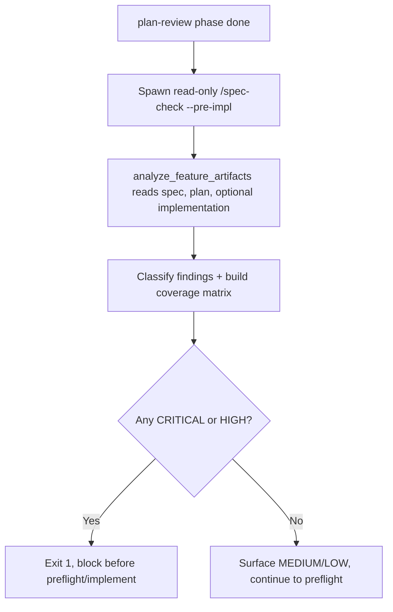
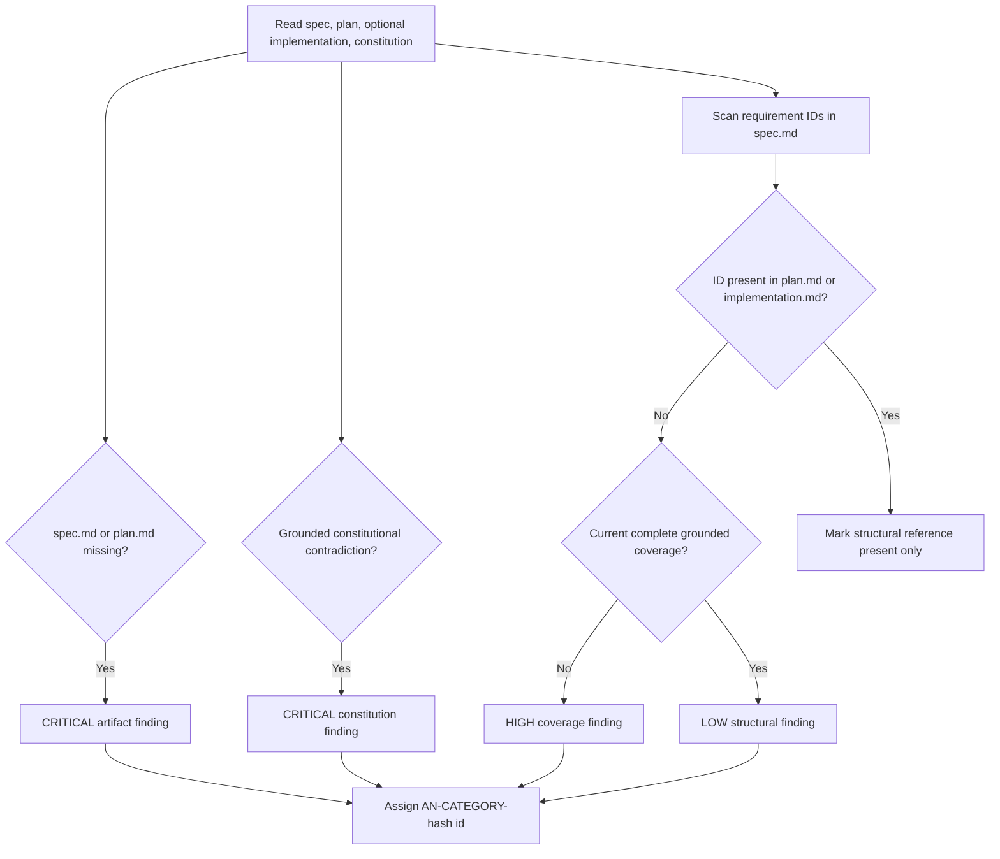
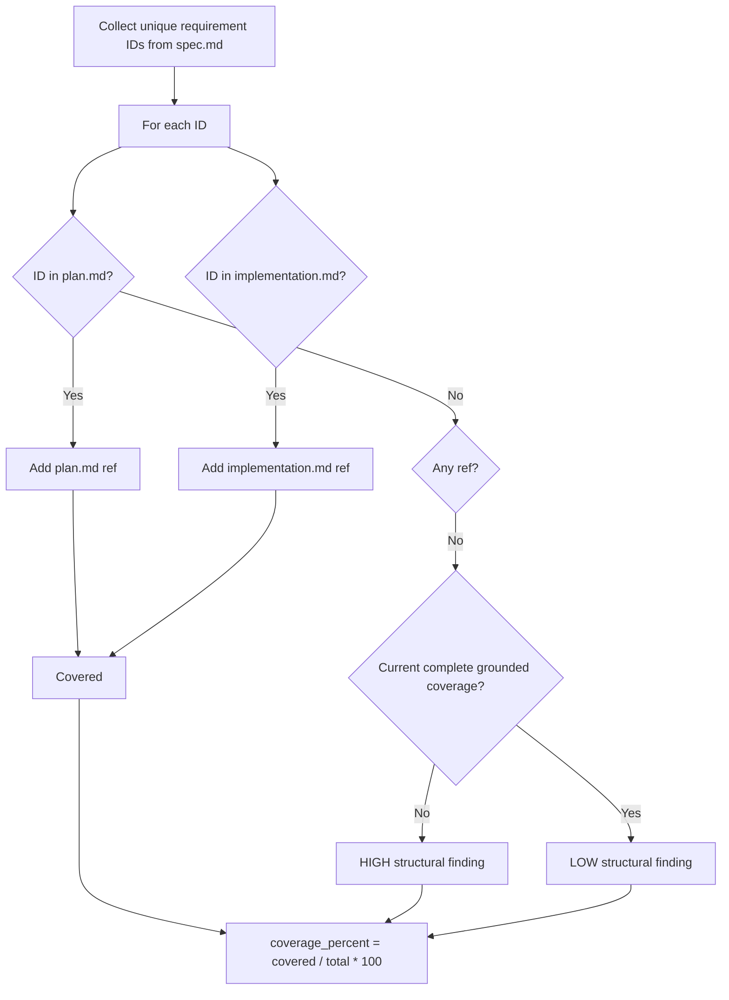
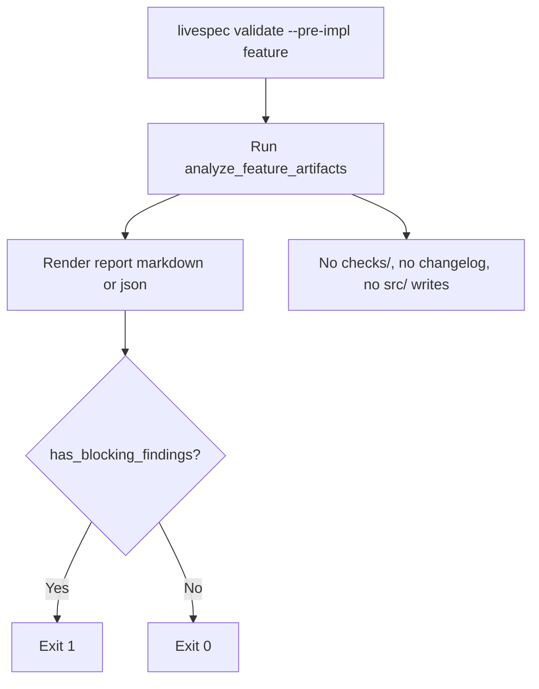

# Feature Spec: Analyze Gate

- **Feature:** Analyze Gate
- **Branch:** `feature/070-analyze-gate`
- **Date:** 2026-06-27
- **Status:** Implemented
- **Input:** Analyze gate — a read-only pre-implementation cross-artifact consistency check, exposed as `spec-check --pre-impl` and as an automatic `spec-feature` phase before implementation, that detects coverage gaps and inconsistencies across spec, plan and implementation with deterministic finding IDs and CRITICAL/HIGH/MEDIUM/LOW severity, where constitution MUST violations and missing spec/plan are CRITICAL and missing structural references are HIGH unless a current complete grounded review covers the qualified requirement, and exits 1 only on CRITICAL or HIGH.
- **Feature Number:** 070

---

## Evidence policy amendment — 2026-09-06

Read [requirement evidence integrity](../078-requirement-evidence-integrity/spec.md) for current Analyze policy. FR-005/FR-011 and AC-005/AC-012 describe structural reference coverage only, never semantic compliance. Current mandatory Analyze additionally requires complete fresh grounded requirement dispositions; missing, contradictory or ambiguous obligations block. A diagnostic structural-only invocation remains available. FR-004/AC-004 require grounded constitutional contradictions; a phrase mentioned under negation is not a violation. Qualified requirement identities distinguish features; historical diagnostic reports retain their original meaning.

When a complete fresh independent semantic review covers every obligation, missing literal ID references remain LOW structural findings and do not block a valid paraphrase. Structural-only diagnostics retain their HIGH reference findings; missing artifacts or unready semantic reviews still block.

## User Scenarios & Testing

> Prioritize stories as P1 (critical — must ship), P2 (important — should ship), P3 (nice-to-have — can defer).

### Story 1 — Pipeline blocks implementation when artifacts disagree `P1`

**As a** developer running `/spec-feature`, **I want** a read-only gate to cross-check `spec.md` and `plan.md` after plan review and before any implementation starts, **so that** coverage gaps and constitution violations are caught before code is written, not after.

**Priority reason:** This is the gate's reason to exist. Without it, a spec whose requirements are unplanned or a plan that violates the constitution reaches the Implement phase and the cost of the gap multiplies. It is an integrated phase, not a new command.

**Independent test:** Run the analyzer on a feature directory whose `plan.md` omits one requirement present in `spec.md` and has no current complete grounded review covering it; verify a HIGH coverage finding is produced and the CLI exits 1 before any implementation step.

#### Acceptance Scenarios (Gherkin — source of truth for tests)

> These Gherkin blocks are the source of truth for test scaffolding. All tests (unit, integration, E2E, visual) are derived from these scenarios, never from Mermaid diagrams.

```gherkin
Feature: Analyze gate runs read-only between plan-review and implementation
  Scenario: Gate executes after plan-review and before preflight/implement
    Given a feature whose pipeline has the plan-review phase marked done
    When the pipeline advances to the next phase
    Then the analyze phase runs before the preflight and implement phases
    And no new command surface is exposed for it

  Scenario: Analyzer never writes a file
    Given a feature directory with spec.md and plan.md
    When analyze_feature_artifacts runs against the directory
    Then it returns a report object
    And it writes no file under the feature directory
```

#### User Flow

> The Mermaid flowchart below visualizes the same flow defined in the Gherkin scenarios above.



---

### Story 2 — Deterministic severity classification with stable finding IDs `P1`

**As a** spec author, **I want** the analyzer to assign CRITICAL/HIGH/MEDIUM/LOW severity by a fixed rule and to give each finding a stable ID, **so that** the same artifacts and current independent review receipt yield the same classified findings; grounded semantic review remains a separate input.

**Priority reason:** Classification and IDs are the input to every gate decision. They must be closed-form and reproducible so the gate is testable and auditable across reruns.

**Independent test:** Run `analyze_feature_artifacts` twice on the same fixture and assert the two finding lists (IDs, severities) are identical; assert a missing `plan.md` produces a CRITICAL and a missing structural reference without current complete grounded coverage produces a HIGH.

#### Acceptance Scenarios (Gherkin — source of truth for tests)

```gherkin
Feature: Deterministic severity classification across artifact checks
  Scenario: Missing required artifact is CRITICAL
    Given a feature directory missing plan.md
    When the analyzer runs
    Then it records a CRITICAL artifact finding for plan.md

  Scenario: Grounded constitutional contradiction is blocking
    Given a constitution prohibition and a reviewed plan that contradicts it
    And the independent review grounds that contradiction in the current sources
    When the analyzer runs
    Then it reports a CRITICAL constitutional contradiction
    And phrase presence alone is not evidence of that contradiction

  Scenario: Missing structural reference without semantic readiness is HIGH
    Given a requirement ID present in spec.md but absent from plan.md and implementation.md
    And analysis is structural-only or lacks a current complete grounded review covering the qualified requirement
    When the analyzer runs
    Then it records a HIGH coverage finding for that requirement

  Scenario: Grounded paraphrase leaves a LOW structural diagnostic
    Given a qualified requirement whose literal ID is absent from plan.md and implementation.md
    And a current complete grounded review covers all obligations including that requirement
    When the analyzer runs
    Then the missing reference produces a LOW coverage finding
    And the structural coverage percentage does not increase

  Scenario: Literal references cannot conceal missing or contradictory evidence
    Given every requirement ID appears in plan.md
    And semantic evidence is missing, stale, incomplete or contradictory
    When mandatory analysis runs
    Then semantic findings block progression despite full structural reference coverage

  Scenario: Finding IDs are deterministic and stable
    Given the same spec.md and plan.md content and the same current review evidence
    When the analyzer runs twice
    Then both runs produce identical finding IDs and severities
```

#### User Flow



---

### Story 3 — Coverage matrix across spec, plan and implementation `P1`

**As a** reviewer, **I want** the report to list every requirement, whether a plan task references it, and the coverage percentage, **so that** I can see literal-reference gaps independently of semantic readiness.

**Priority reason:** The coverage matrix turns the gate from a pass/fail switch into an actionable map of gaps, which is what lets an author fix the plan instead of guessing.

**Independent test:** Build a feature with 4 requirement IDs in `spec.md`, 3 of them referenced in `plan.md`; verify the coverage matrix marks 3 covered and 1 uncovered and reports a coverage percentage of 75.0.

#### Acceptance Scenarios (Gherkin — source of truth for tests)

```gherkin
Feature: Requirement coverage matrix and metrics
  Scenario: Requirement covered by plan is marked covered
    Given a requirement ID referenced in plan.md
    When the analyzer runs
    Then the structural coverage matrix marks its reference present with task_refs including plan.md
    And this alone does not certify semantic readiness

  Scenario: Requirement covered only by implementation is still covered
    Given a requirement ID absent from plan.md but present in implementation.md
    When the analyzer runs
    Then the structural coverage matrix marks its reference present with task_refs including implementation.md
    And this alone does not certify semantic readiness

  Scenario: Coverage percentage reflects covered over total
    Given 4 requirement IDs in spec.md and 3 of them referenced in plan.md
    When the analyzer runs
    Then coverage_percent equals 75.0

  Scenario: No requirements yields full coverage
    Given a spec.md with no FR/AC/SC requirement IDs
    When the analyzer runs
    Then structural coverage_percent equals 100.0
    And this empty structural result cannot replace mandatory semantic evidence
```

#### User Flow



---

### Story 4 — Exit semantics and read-only guarantee `P2`

**As a** maintainer wiring the gate into CI and `/spec-feature`, **I want** the CLI to exit 1 exactly when a CRITICAL or HIGH finding exists and to never mutate the repository, **so that** the gate is a safe, idempotent precondition for implementation.

**Priority reason:** The exit code is the contract every caller depends on, and the read-only guarantee is what lets the gate run repeatedly without side effects. Getting either wrong silently breaks the pipeline.

**Independent test:** Run `livespec validate --pre-impl` on a feature with only MEDIUM/LOW findings and assert exit 0 and no files written; run it on a feature with a HIGH finding and assert exit 1; in both cases assert no `checks/`, changelog, or `src/` write occurred.

#### Acceptance Scenarios (Gherkin — source of truth for tests)

```gherkin
Feature: Exit semantics and read-only behavior
  Scenario: Exit 1 when a blocking finding exists
    Given a feature whose analysis contains a CRITICAL or HIGH finding
    When livespec validate --pre-impl runs
    Then the process exits with code 1

  Scenario: Exit 0 when only MEDIUM or LOW findings exist
    Given a feature whose analysis contains no CRITICAL or HIGH finding
    When livespec validate --pre-impl runs
    Then the process exits with code 0

  Scenario: Pre-impl mode writes nothing
    Given any feature directory
    When livespec validate --pre-impl runs
    Then no checks/ file is created
    And no changelog entry is added
    And no src/ file is modified
    And a missing implementation.md is not treated as a failure
```

#### User Flow



---

## Acceptance Criteria

> Each AC must be specific, testable, and verifiable. Reference them from FR below.

| ID | Criterion | Priority | Story |
|---|---|---|---|
| AC-001 | The analyze phase runs after the plan-review phase and before the preflight and implement phases as `/spec-feature` Phase 2.6, and exposes no new command surface (it reuses `/spec-check --pre-impl` → `livespec validate --pre-impl`) | P1 | Story 1 |
| AC-002 | `analyze_feature_artifacts(feature_dir, constitution_path)` reads `spec.md`, `plan.md`, optional `implementation.md`, and `constitution.md` and returns a `PreImplAnalysisReport` without writing any file | P1 | Story 1 |
| AC-003 | A missing `spec.md` or a missing `plan.md` each produce a CRITICAL `artifact` finding | P1 | Story 2 |
| AC-004 | A grounded contradiction of a constitutional prohibition produces a CRITICAL constitution finding citing the current sources; phrase presence, including a negated mention, is insufficient | P1 | Story 2 |
| AC-005 | A requirement ID present in `spec.md` but absent from plan and implementation produces a HIGH structural `coverage` finding in structural-only or semantically unready analysis; it is LOW only when a current complete grounded review covers all qualified obligations including that requirement | P1 | Story 2 |
| AC-006 | A requirement ID present in plan or implementation is structurally covered with corresponding `task_refs` and produces no missing-reference finding; missing or contradictory semantic evidence remains independently blocking | P1 | Story 3 |
| AC-007 | Each finding has a deterministic ID of the form `AN-<CATEGORY>-<8 hex>` derived from category, severity, locations and summary, stable across reruns on unchanged artifacts and current review evidence | P1 | Story 2 |
| AC-008 | Severity is CRITICAL/HIGH/MEDIUM/LOW. Missing required artifacts are CRITICAL; grounded constitutional contradictions and missing, stale, incomplete or contradictory semantic evidence remain blocking. Missing references are HIGH without current complete grounded coverage and LOW only with it | P1 | Story 2 |
| AC-009 | `has_blocking_findings(report)` returns True iff any finding is CRITICAL or HIGH, and the CLI exits 1 in that case and 0 otherwise | P2 | Story 4 |
| AC-010 | The report exposes a findings table, a coverage matrix, and metrics (total/covered requirements, coverage percent, critical/high counts, implementation present) rendered by both `render_report_markdown` (`## Specification Analysis Report`) and `render_report_json` | P2 | Story 3 |
| AC-011 | `--pre-impl` mode is read-only: it creates no `checks/` file, adds no changelog entry, modifies no `src/` file, and a missing `implementation.md` is not itself a failure | P2 | Story 4 |
| AC-012 | `coverage_percent` is structural referenced requirements divided by total requirements times 100, rounded to 2 decimals, or 100.0 with no requirements. It is not a semantic percentage: grounded paraphrases can leave LOW reference gaps, while missing or contradictory evidence still blocks mandatory readiness | P2 | Story 3 |

> **Deep-link anchors:** Each AC below has a heading anchor (`#ac-001`, `#ac-002`, ...) enabling direct navigation from `implementation.md` and `@spec` comments.

### AC-001

**Criterion:** The analyze phase runs after the plan-review phase and before the preflight and implement phases as `/spec-feature` Phase 2.6, and exposes no new command surface (it reuses `/spec-check --pre-impl` → `livespec validate --pre-impl`)
**Priority:** P1 | **Story:** Story 1

### AC-002

**Criterion:** `analyze_feature_artifacts(feature_dir, constitution_path)` reads `spec.md`, `plan.md`, optional `implementation.md`, and `constitution.md` and returns a `PreImplAnalysisReport` without writing any file
**Priority:** P1 | **Story:** Story 1

### AC-003

**Criterion:** A missing `spec.md` or a missing `plan.md` each produce a CRITICAL `artifact` finding
**Priority:** P1 | **Story:** Story 2

### AC-004

**Criterion:** A grounded contradiction of a constitutional prohibition produces a CRITICAL constitution finding citing the current sources; phrase presence, including a negated mention, is insufficient
**Priority:** P1 | **Story:** Story 2

### AC-005

**Criterion:** A requirement ID present in `spec.md` but absent from plan and implementation produces a HIGH structural `coverage` finding in structural-only or semantically unready analysis; it is LOW only when a current complete grounded review covers all qualified obligations including that requirement
**Priority:** P1 | **Story:** Story 2

### AC-006

**Criterion:** A requirement ID present in plan or implementation is structurally covered with corresponding `task_refs` and produces no missing-reference finding; missing or contradictory semantic evidence remains independently blocking
**Priority:** P1 | **Story:** Story 3

### AC-007

**Criterion:** Each finding has a deterministic ID of the form `AN-<CATEGORY>-<8 hex>` derived from category, severity, locations and summary, stable across reruns on unchanged artifacts and current review evidence
**Priority:** P1 | **Story:** Story 2

### AC-008

**Criterion:** Severity is CRITICAL/HIGH/MEDIUM/LOW. Missing required artifacts are CRITICAL; grounded constitutional contradictions and missing, stale, incomplete or contradictory semantic evidence remain blocking. Missing references are HIGH without current complete grounded coverage and LOW only with it
**Priority:** P1 | **Story:** Story 2

### AC-009

**Criterion:** `has_blocking_findings(report)` returns True iff any finding is CRITICAL or HIGH, and the CLI exits 1 in that case and 0 otherwise
**Priority:** P2 | **Story:** Story 4

### AC-010

**Criterion:** The report exposes a findings table, a coverage matrix, and metrics (total/covered requirements, coverage percent, critical/high counts, implementation present) rendered by both `render_report_markdown` (`## Specification Analysis Report`) and `render_report_json`
**Priority:** P2 | **Story:** Story 3

### AC-011

**Criterion:** `--pre-impl` mode is read-only: it creates no `checks/` file, adds no changelog entry, modifies no `src/` file, and a missing `implementation.md` is not itself a failure
**Priority:** P2 | **Story:** Story 4

### AC-012

**Criterion:** `coverage_percent` is structural referenced requirements divided by total requirements times 100, rounded to 2 decimals, or 100.0 with no requirements. It is not a semantic percentage: grounded paraphrases can leave LOW reference gaps, while missing or contradictory evidence still blocks mandatory readiness
**Priority:** P2 | **Story:** Story 3

---

## Functional Requirements

> Each FR must map to at least one AC. These become the rows in implementation.md.

| ID | Requirement | AC References |
|---|---|---|
| FR-001 | The system must run the analyze step as an integrated `/spec-feature` Phase 2.6 positioned after plan-review and before preflight and implement, reusing `/spec-check --pre-impl` (`livespec validate --pre-impl`) without adding a new command | AC-001, AC-011 |
| FR-002 | The system must provide `analyze_feature_artifacts(feature_dir, constitution_path)` that reads `spec.md`, `plan.md`, optional `implementation.md` and `constitution.md` and returns a `PreImplAnalysisReport` without writing any file | AC-002 |
| FR-003 | The system must emit a CRITICAL `artifact` finding for a missing `spec.md` and for a missing `plan.md` | AC-003 |
| FR-004 | The system must emit a CRITICAL `constitution` finding only for a grounded contradiction of a constitutional prohibition, never from phrase presence alone | AC-004 |
| FR-005 | The system must collect requirement IDs from `spec.md` and record structural coverage iff their tokens appear in plan or implementation. Missing references are HIGH in structural-only or semantically unready analysis, and LOW only when a current complete grounded review covers all qualified obligations including the requirement; semantic contradictions or missing evidence remain blocking | AC-005, AC-006 |
| FR-006 | The system must derive each finding ID as `AN-<CATEGORY>-<first 8 hex of sha1(category\|severity\|locations\|summary)>` so identical artifacts yield identical IDs | AC-007 |
| FR-007 | The system must use CRITICAL/HIGH/MEDIUM/LOW, emit CRITICAL for missing required artifacts and keep constitutional contradictions or missing, stale, incomplete or contradictory semantic evidence blocking. Missing structural references are HIGH unless a current complete grounded review covers all qualified obligations including that requirement, when they are LOW | AC-008 |
| FR-008 | The system must expose `has_blocking_findings(report)` that is True iff any finding is CRITICAL or HIGH, and the `--pre-impl` CLI branch must exit 1 when it is True and 0 otherwise | AC-009 |
| FR-009 | The system must render the report as a `## Specification Analysis Report` markdown document (findings table, coverage matrix, metrics) via `render_report_markdown` and as a structured object via `render_report_json` | AC-010 |
| FR-010 | The `--pre-impl` CLI branch must be read-only: it must create no `checks/` file, add no changelog entry, modify no `src/` file, and must treat a missing `implementation.md` as non-fatal | AC-011 |
| FR-011 | The system must compute structural `coverage_percent` as referenced over total requirements times 100 rounded to 2 decimals, defaulting to 100.0 when there are no requirements; this metric never certifies semantic readiness | AC-012 |

> **Deep-link anchors:** Each FR below has a heading anchor (`#fr-001`, `#fr-002`, ...) enabling direct navigation from `implementation.md` and `@spec` comments.

### FR-001

**Requirement:** The system must run the analyze step as an integrated `/spec-feature` Phase 2.6 positioned after plan-review and before preflight and implement, reusing `/spec-check --pre-impl` (`livespec validate --pre-impl`) without adding a new command
**AC References:** [AC-001](#ac-001), [AC-011](#ac-011)

### FR-002

**Requirement:** The system must provide `analyze_feature_artifacts(feature_dir, constitution_path)` that reads `spec.md`, `plan.md`, optional `implementation.md` and `constitution.md` and returns a `PreImplAnalysisReport` without writing any file
**AC References:** [AC-002](#ac-002)

### FR-003

**Requirement:** The system must emit a CRITICAL `artifact` finding for a missing `spec.md` and for a missing `plan.md`
**AC References:** [AC-003](#ac-003)

### FR-004

**Requirement:** The system must emit a CRITICAL `constitution` finding only for a grounded contradiction of a constitutional prohibition, never from phrase presence alone
**AC References:** [AC-004](#ac-004)

### FR-005

**Requirement:** The system must collect requirement IDs from `spec.md` and record structural coverage iff their tokens appear in plan or implementation. Missing references are HIGH in structural-only or semantically unready analysis, and LOW only when a current complete grounded review covers all qualified obligations including the requirement; semantic contradictions or missing evidence remain blocking
**AC References:** [AC-005](#ac-005), [AC-006](#ac-006)

### FR-006

**Requirement:** The system must derive each finding ID as `AN-<CATEGORY>-<first 8 hex of sha1(category|severity|locations|summary)>` so identical artifacts yield identical IDs
**AC References:** [AC-007](#ac-007)

### FR-007

**Requirement:** The system must use CRITICAL/HIGH/MEDIUM/LOW, emit CRITICAL for missing required artifacts and keep constitutional contradictions or missing, stale, incomplete or contradictory semantic evidence blocking. Missing structural references are HIGH unless a current complete grounded review covers all qualified obligations including that requirement, when they are LOW
**AC References:** [AC-008](#ac-008)

### FR-008

**Requirement:** The system must expose `has_blocking_findings(report)` that is True iff any finding is CRITICAL or HIGH, and the `--pre-impl` CLI branch must exit 1 when it is True and 0 otherwise
**AC References:** [AC-009](#ac-009)

### FR-009

**Requirement:** The system must render the report as a `## Specification Analysis Report` markdown document (findings table, coverage matrix, metrics) via `render_report_markdown` and as a structured object via `render_report_json`
**AC References:** [AC-010](#ac-010)

### FR-010

**Requirement:** The `--pre-impl` CLI branch must be read-only: it must create no `checks/` file, add no changelog entry, modify no `src/` file, and must treat a missing `implementation.md` as non-fatal
**AC References:** [AC-011](#ac-011)

### FR-011

**Requirement:** The system must compute structural `coverage_percent` as referenced over total requirements times 100 rounded to 2 decimals, defaulting to 100.0 when there are no requirements; this metric never certifies semantic readiness
**AC References:** [AC-012](#ac-012)

---

## Key Entities

> List the main data objects involved in this feature.

| Entity | Description | Key Fields |
|---|---|---|
| AnalyzeSeverity | The closed severity domain for findings (real `StrEnum` in `validator/pre_impl_analysis.py`) | CRITICAL, HIGH, MEDIUM, LOW |
| AnalyzeFinding | A single classified finding with a deterministic ID (real `@dataclass(frozen=True)`) | finding_id, category, severity, locations, summary, recommendation |
| RequirementCoverage | One row of the coverage matrix for a requirement ID (real `@dataclass(frozen=True)`) | requirement_id, has_plan_task, task_refs, notes |
| PreImplAnalysisReport | The complete read-only analysis result (real `@dataclass(frozen=True)`) | findings, coverage, coverage_percent, metrics |

### Classification Rules

> The severity assignment (FR-007) is closed-form. The structural and semantic finding categories are:

| Category | Trigger | Severity |
|---|---|---|
| artifact | `spec.md` or `plan.md` missing | CRITICAL |
| constitution | grounded contradiction of a constitutional prohibition, never phrase presence alone | CRITICAL |
| coverage | literal reference absent; structural-only or semantically unready | HIGH |
| coverage | literal reference absent; current complete grounded review covers all qualified obligations including this requirement | LOW |
| semantic | missing, stale, incomplete, ambiguous or contradictory evidence | HIGH |
| structural reference | ID referenced in plan or implementation | structurally covered; semantic findings remain independent |

---

## Edge Cases

> Scenarios that aren't in the happy path but must be handled correctly.

- **Missing implementation.md:** Treated as non-fatal; coverage falls back to plan references only and the report's `implementation_present` metric is 0 (AC-011, FR-005).
- **No requirement IDs in spec:** Structural `coverage_percent` defaults to 100.0 and no missing-reference findings are emitted; this does not establish mandatory semantic readiness (AC-012, FR-011).
- **Duplicate requirement IDs in spec:** Each ID is counted once via ordered de-duplication, so the coverage total reflects unique requirements (FR-005).
- **No grounded contradiction:** An empty prohibition phrase or a negated mention cannot establish a constitutional violation by lexical matching; unresolved semantic evidence still blocks readiness (FR-004).
- **Requirement covered only by implementation.md:** Still counted as covered, with `task_refs` listing `implementation.md` (AC-006).
- **Only MEDIUM/LOW findings:** The CLI exits 0 with diagnostics; mandatory progression still requires its current complete semantic evidence, which prevents missing/contradictory evidence from yielding this nonblocking case (AC-009).
- **Re-run on unchanged artifacts and review evidence:** Produces identical finding IDs and severities; changed governing inputs invalidate review readiness (AC-007).
- **Path is a file vs a directory:** When `--pre-impl` targets a file, the analyzer resolves its parent as the feature directory before reading artifacts (FR-001).

---

## Success Criteria

> Measurable outcomes that define when this feature is complete and successful.

| ID | Criterion | How to Measure |
|---|---|---|
| SC-001 | All P1 acceptance criteria pass automated tests | CI test suite green for `tests/test_pre_impl_analysis.py` and `tests/test_pre_impl_analysis_cli.py` |
| SC-002 | Findings and IDs are reproducible | Unit test asserting identical findings and IDs across 2 invocations on the same fixture |
| SC-003 | Exit code is 1 iff a CRITICAL or HIGH finding exists, else 0 | CLI test asserting `livespec validate --pre-impl` exit codes for blocking and non-blocking fixtures |
| SC-004 | The gate runs strictly between plan-review and preflight with no added command | Pipeline-order test asserting the `analyze` phase position and the absence of a new command entry |

---

## Clarifications

> Historical observation from 2026-06-27, retained as recorded below; it is not current clarification or semantic-readiness evidence. The original digit-anywhere detector description was superseded by the current clarification policy. The Clarify gate (Phase 1.6) executed on this spec during that pipeline. `rank_clarification_opportunities(scan_clarification_opportunities(spec))` returned an empty queue (0 raw opportunities): the spec contains no vague quality adjective used without a standalone numeric token, no `[NEEDS CLARIFICATION]` placeholder, and no unconfirmed `[ASSUMED]`/`TBD` marker. Per the gate's empty-queue behavior, no question was asked and no spec text was rewritten.

### Session 2026-06-27 — Historical record

- Clarify gate: no ambiguities — empty ranked queue (0 opportunities); pipeline continued to the plan phase without prompting.

---

*Generated by `/spec-specify` — LiveSpec v1.0*
